# 科研日刊 · Real2Sim / PTIR-GS 兴趣策展（v5）
**覆盖窗口：2026-09-05（六）– 2026-09-06（日）HKT**（arXiv 周末无独立公告；成稿参考相邻 Fri 9/4 与 Mon 9/7 列表积压投稿）
**读者：Yutian Zhu（rubatotree）** — 兴趣锚点来自博文《结构感知的 Real2Sim 重建》（SC-GS 谱系 → 骨骼动画级可编辑 4D 资产；手机采集 + 普通 PC + 尽量少人工），以及学术页 2026-09 宣布 **PTIR-GS** 录用 TOG。本日权重偏向可编辑动态 GS / 绑骨运动，以及正、逆渲染链路里的效率与质量折中。

> 说明：在 v4 高信号池上保留全字段深度（作者 / 单位 / 发表时间 / 投稿信息 / 摘要 / 配图），去掉分类标签，改成更像研究笔记的叙述。摘要经 arXiv API 复核后中译；链接经 HTTP / abs / 项目页校验。投稿信息只写已核实项。Ke-Sen SIGGRAPH 2026 合集 `Last-Modified: 2026-08-20 01:37:43 GMT`（≈ **2026-08-20 09:37 HKT**），近 48h 无增量。作者名保留英文 / 拼音；国内明确单位用中文，其余单位用原文。发表时间取 arXiv 首次挂出日；若已接收则同时注明 venue。

---

## 今日速览

周末没有新公告，信号都堆在周五到周一的积压里。博文把目标钉在 **SC-GS → 可编辑骨骼级 4D 资产**，学术页又刚宣布 **PTIR-GS** 进 TOG，所以今天按这条线挑稿。

动画侧，**UniMate** 用拓扑感知 DiT 打通「自动绑骨之后怎么动」；变形侧，**GradRig** 给出无网格蒙皮权重梯度管线，直接服务可编辑动态 3DGS。正向渲染这边，**TileGS** 做数值近等价的光栅核加速，**FlashRender** 用少步生成式重拍把「许多相似帧」压到秒级。逆渲染 / 外观侧，**LightBridge** 对整份 3DGS 做前馈可控重光照，**Ref-GeNVS** 与 **AnyGS2Mesh** 分别补反射一致性与 GS→网格出口。具身线保留与资产管线相交的 **WorldSculpt / NavArena**，以及失败回环 **LIBERO-RECOVER**。

**今日必读：**
1. **GradRig** — 蒙皮权重空间梯度 → 无网格 3DGS 可拉伸变形，贴合 SC-GS→可编辑骨骼资产缺口。
2. **UniMate** — 单一模型驱动任意骨架文本运动，衔接「自动绑骨规模化」后的运动瓶颈。
3. **TileGS** + **FlashRender** — 前者加速 3DGS 光栅主路径，后者用生成式少步重拍服务多相似帧 / 批渲染。
4. **LightBridge** — 前馈生成式重光照整份 3DGS，对照 PTIR-GS「逐场景逆渲染优化」的效率–质量折中。

---

## 逆渲染与材质

本窗口最值得先读的是 **LightBridge**：它不做逐场景 bake，而是一次前馈把可控光照写入完整 3DGS，正好可以和路径追踪式逆渲染的耗时结构对照。反射线 **Ref-GeNVS** 用虚相机显式注入镜面关系；几何出口 **AnyGS2Mesh** 把任意分辨率视角的 3DGS 前馈成网格，方便仿真 / 绑定下游。优先读 LightBridge；需要镜面或网格出口时再展开后两篇。

---

### LightBridge

一次前向改写整份 3DGS 的可控重光照，避开逐场景优化 bake。

**Title：** LightBridge: Feed-Forward Generative Relighting for 3D Gaussian Splatting

**作者：** Hezhi Cao, Panhao Cheng, Huangsheng Du, Qibiao Li, Youcheng Cai, Ligang Liu

**单位：** 中国科学技术大学

**发表时间：** arXiv 2026-09-02

**投稿信息：** 未标明（abs Comments 仅「14pages, 8figures」；无 venue）

**arXiv：**
- abs: https://arxiv.org/abs/2609.02543
- PDF: https://arxiv.org/pdf/2609.02543

**摘要（中译）：**
3DGS 能高质量、实时做新视角合成，但所得资产光照被烘焙进去，难以重光照。逆渲染方法为每场景优化简化反射与光照模型，效率与重光照质量受限；近期生成式方法用大扩散模型做真实光照编辑，落到 3DGS 上通常还需额外的逐场景优化阶段把编辑外观 bake 回表示。本文提出 LightBridge：面向完整 3DGS 资产的前馈生成框架，可在单次前向中完成可控重光照。为支撑前馈训练，作者构建大规模多光照重光照数据集，提供同场景源/目标观测对。Latent Bridge Relighting 将重光照建模为潜空间中的源→目标传输，无需迭代扩散采样即可一步提取 2D 视觉 token。Gaussian Propagation Transformer 以点 Transformer + 稀疏图像→点自注意力、再接点→图像交叉注意力，在避免对全部图像与高斯 token 做全注意力的前提下，把线索高效传播到整份 3DGS。实验验证上述设计：重光照质量具竞争力，且可单次前向预测完整已重光照 3DGS，无需场景特定优化。代码与数据拟于录用后公开。

**相关链接：**
- 暂未找到公开主页/代码（摘要称录用后开源）

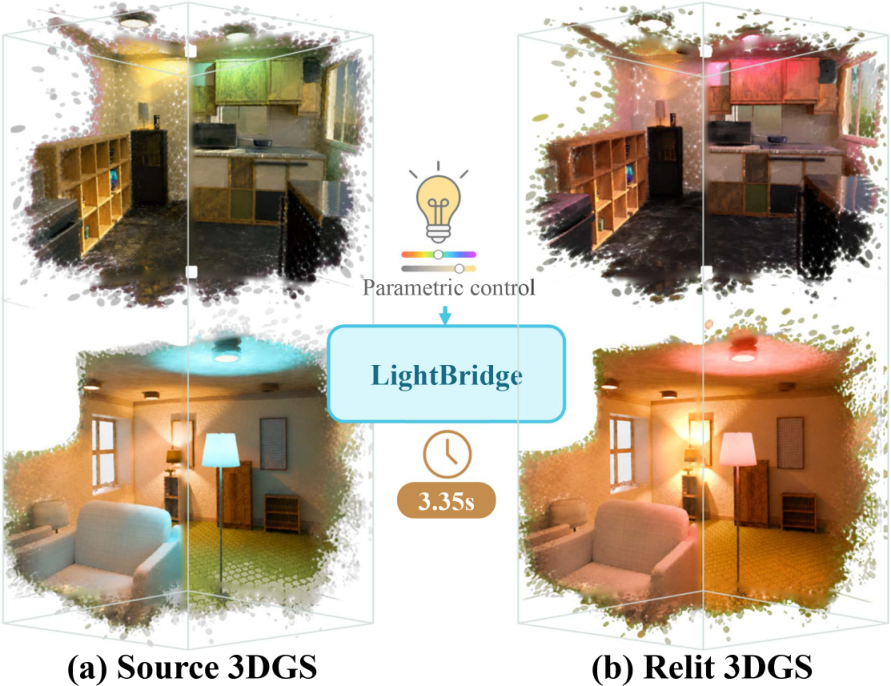

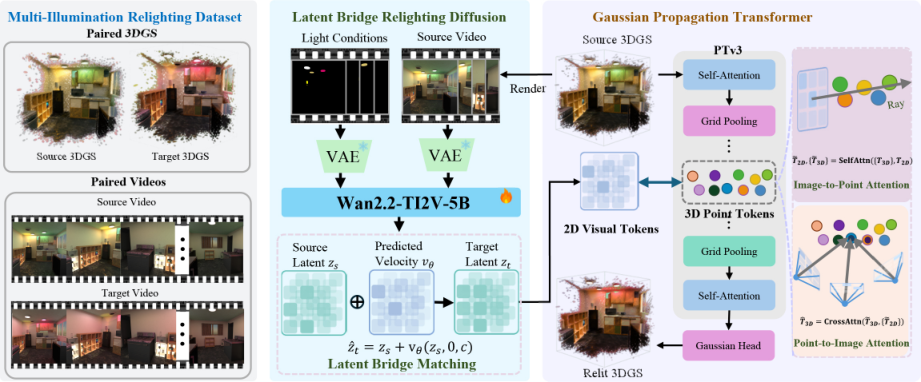

---

### Ref-GeNVS

训练无关、反射感知的生成式新视角合成：把镜面当成双视角，注入虚相机关系。

**Title：** Reflection-aware Generative Novel View Synthesis

**作者：** GeonU Kim, Shin Dong-Yeon, Tae-Hyun Oh

**单位：** KAIST

**发表时间：** ECCV 2026（arXiv 挂出 2026-09-04）

**投稿信息：** 已接收 — abs Comments「ECCV2026」；项目页标题「ECCV 2026」；BibTeX `booktitle={European Conference on Computer Vision}`

**arXiv：**
- abs: https://arxiv.org/abs/2609.05382
- PDF: https://arxiv.org/pdf/2609.05382

**摘要（中译）：**
本文提出 Ref-GeNVS：面向镜面场景的免训练、反射感知生成式新视角合成。现有多视角扩散模型常无法识别镜子，也难利用反射内容辅助生成。关键想法是把镜面图像视为两个互补视角：从输入估计镜面平面并反射相机位姿形成虚视角；再以 Mirror-gated attention 与 Reflection injection 两阶段，在多视角扩散模型中显式利用反射关系，实现反射一致的 NVS。方法继承多视角扩散骨干的强泛化且无需微调。在含镜的合成与真实场景上优于近期生成式 NVS，生成反射一致、上下文连贯的新视角，并揭示仅能通过镜子看到的场景结构。

**相关链接：**
- 项目主页：https://kim-geonu.github.io/Ref-GeNVS/
- 代码：https://github.com/kaist-ami/Ref-GeNVS

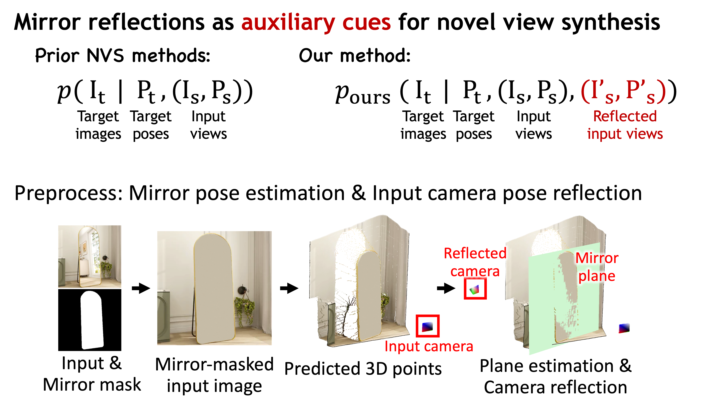

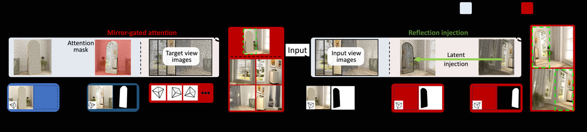

---

### AnyGS2Mesh

前馈从任意分辨率视角的 3DGS 直接抽网格，摆脱迭代优化瓶颈。

**Title：** AnyGS2Mesh: Feed-Forward Mesh Reconstruction from 3D Gaussian Splatting with Arbitrary-Resolution Views

**作者：** Yuxuan Song, Fan Gao, Yibo Zhao, Jiarui Wen, Youcheng Cai, Ligang Liu

**单位：** 中国科学技术大学

**发表时间：** arXiv 2026-09-03

**投稿信息：** 未标明（abs Comments 空；未见 venue 声明）

**arXiv：**
- abs: https://arxiv.org/abs/2609.03304
- PDF: https://arxiv.org/pdf/2609.03304

**摘要（中译）：**
既有从高斯场景表示重建网格的方法多依赖迭代优化，推理慢且难扩展到高分辨率输入。本文提出 AnyGS2Mesh——据作者所知首个可从前馈直接由 3DGS 重建网格、并支持任意输入分辨率的框架。方法采用 Gaussian-Guided Transformer，利用显式三维几何先验高效生成网格，含三要素：(1) 把高斯原语当作结构化 3D token、联合推理高斯与图像特征的空间推理 Transformer；(2) 顺序处理原生分辨率视角并聚合变长视角集的流式分块几何编码器；(3) 以 PatchFusion 风格编解码器融合 RGB 条件预测深度与高斯渲染度量深度的尺度对齐混合深度精炼器。精炼深度经 TSDF 融合与 Marching Cubes 确定性抽网格。实验显示质量达 SOTA，且相对优化基线显著缩短推理时间，接近近实时高质量网格重建。代码拟于录用后公开。

**相关链接：**
- 暂未找到公开主页/代码/视频（摘要称录用后开源）

**配图：** 暂无公开配图

---

## 正向渲染与批处理效率

PTIR-GS 路径追踪 / 多帧监督的主耗时面在这里。**TileGS** 用 tile 局部深度分箱重组光栅遍历，在 |ΔPSNR|<0.001 dB 量级保持数值等价下加速核；**Compact Neural Appearance** 用共享小 MLP 压外观存储与带宽；**FlashRender** 把相机可控视频重拍蒸馏到少步生成，契合「许多相似帧 / 生成式后处理」路线。Ke-Sen 条件接收区另有 Spatio-Temporal Control Variates + ReSTIR，值得盯正式稿。必读 TileGS 与 FlashRender。

---

### TileGS

Tile 局部深度分箱重组光栅遍历，在数值近等价前提下加速 3DGS 光栅核。

**Title：** TileGS: Tile-Local Depth Binning for Gaussian Splatting Rasterization

**作者：** Wei Tan, Matias Turkulainen, Lauri Ilola, Hamed Rezazadegan Tavakoli, Juho Kannala

**单位：** Aalto University（Tan, Turkulainen, Kannala）；Nokia Technologies（Ilola, Tavakoli）

**发表时间：** Pacific Graphics 2026 / Computer Graphics Forum（arXiv 挂出 2026-09-03）

**投稿信息：** 已接收（依据 CRC）— arXiv source `PG2026-TileGS_CRC.tex` 注释「Pacific Graphics 2026 / Computer Graphics Forum — Camera-Ready Copy」，并启用 `\SpecialIssuePaper` / `pg2026.sty`；abs Comments 未写 venue

**arXiv：**
- abs: https://arxiv.org/abs/2609.03613
- PDF: https://arxiv.org/pdf/2609.03613

**摘要（中译）：**
实时 3DGS 渲染质量高，但标准光栅化仍遍历全局排序的 tile 流，造成每 tile 区间过长与沉重的几何属性流量。TileGS 对高斯溅射做 tile 局部重组：把每个长 tile 区间切成更短的深度局部区间，按前到后光栅化，并在粗排序不足以匹配基线合成时做选择性修复。在桌面/笔记本 Ada GPU 的 9 场景基准上，默认 No-GW（不写回几何）变体相对广泛使用的优化开源实现 gsplat，在 RTX 4090 上获得平均 1.44× 光栅核加速，端到端帧加速分别为 1.069×（4090）与 1.094×（RTX 1000 Ada），输出与 gsplat 在数值噪声量级一致（|ΔPSNR|<0.001 dB 等）。Nsight Compute 剖析显示：尽管 SM 吞吐与活跃 warp 占用更低、DRAM 流量更高，总 SASS 线程指令仍下降 1.26×——表明加速主要来自减少有效遍历工作量，而非单纯减字节、改善合并访问或提升占用。

**相关链接：**
- 暂未找到公开主页/代码/视频

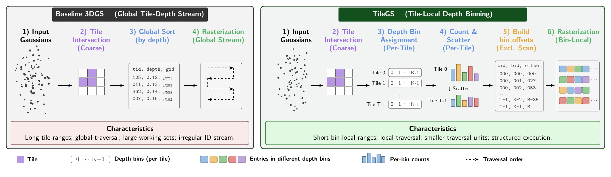

---

### FlashRender

少步生成式重拍：相机可控视频 MeanFlow，把多步生成渲染压到约 1/25 采样成本。

**Title：** FlashRender: Few-Step Generative Rendering via Camera-Controlled Video MeanFlow

**作者：** Byeongjun Park, Byung-Hoon Kim, Hyungjin Chung

**单位：** EverEx（全体）；Yonsei University（Kim）；Korea University（Chung）

**发表时间：** arXiv 2026-09-03

**投稿信息：** 未标明（abs Comments 仅 Project page；项目页 BibTeX 为 arXiv preprint；源码虽用 ICLR 模板并标 Preprint，不足认定录用）

**arXiv：**
- abs: https://arxiv.org/abs/2609.03563
- PDF: https://arxiv.org/pdf/2609.03563

**摘要（中译）：**
本文提出 FlashRender：少步生成式渲染框架，可在数秒内沿目标相机轨迹重拍源视频。作者指出既有多步生成式渲染模型中，采样步相关的相机控制是离散化误差的突出表现；消解该不一致性可显著降低去噪轨迹曲率，从而利于后续步蒸馏。为此引入 Representation Transformation and Alignment（RETA）：将隐源视频表示与冻结视觉几何模型的目标视频特征对齐，在源视频流内直接编码几何变换，实现采样步一致的相机控制。随后在 RETA 诱导的更低曲率去噪轨迹上用 MeanFlow 目标微调，以更好处理离散化误差；最后用 on-policy flow map 蒸馏校正固定少步采样下的自 rollout 误差。实验表明三者互补：视频质量与几何一致性可比多步基线，采样成本约降 25×，且在分布外目标相机轨迹上仍有更强可控性。

**相关链接：**
- 项目主页：https://byeongjun-park.github.io/FlashRender/

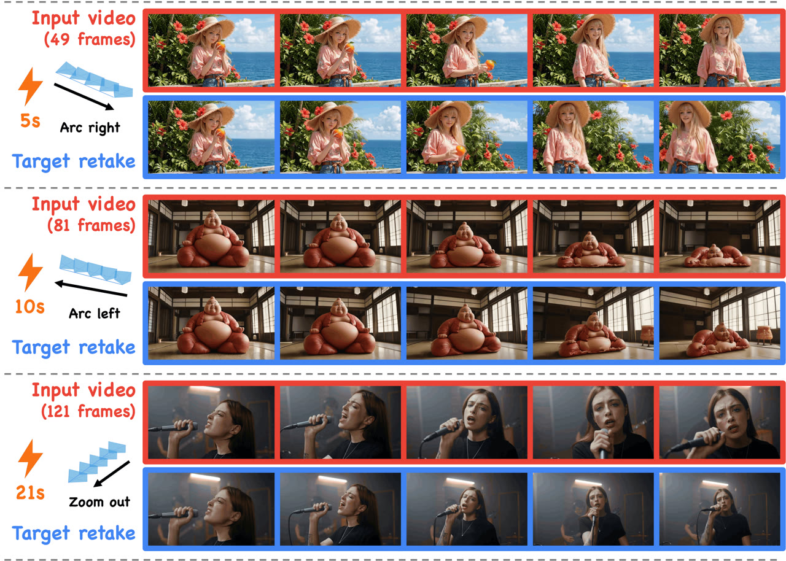

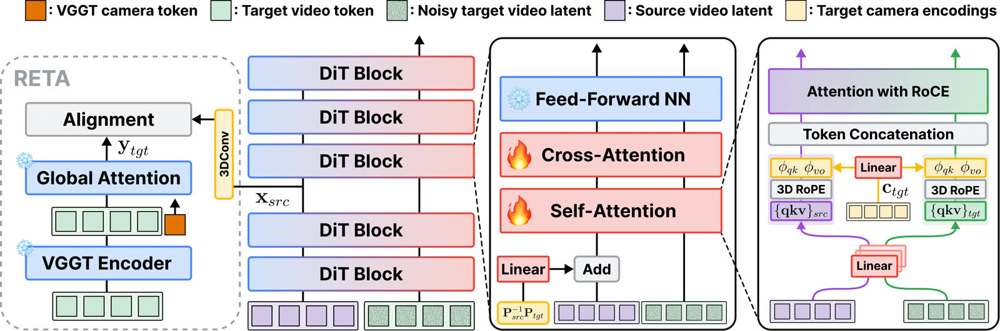

---

### Compact Neural Appearance Models

共享小 MLP 解码紧凑外观码，替代高阶球谐：压存储，也加速优化与渲染。

**Title：** Compact Neural Appearance Models for Efficient Gaussian Splatting

**作者：** Florian Hahlbohm, Jorge Condor, Linus Franke, Martin Eisemann, Marcus Magnor

**单位：** TU Braunschweig（Hahlbohm, Eisemann, Magnor）；Università della Svizzera italiana（Condor）；University of Würzburg（Franke）；University of New Mexico（Magnor 兼）

**发表时间：** arXiv 2026-09-04

**投稿信息：** 未标明（abs / 项目页均为 arXiv 2026 preprint；未见 venue 声明）

**arXiv：**
- abs: https://arxiv.org/abs/2609.05255
- PDF: https://arxiv.org/pdf/2609.05255

**摘要（中译）：**
基于显式图元的辐射场（如 3DGS）通常用低阶球谐（SH）建模视角相关外观。SH 虽求值高效，但其系数往往主导每原语的存储与显存带宽，且带限基函数限制了角度细节。本文对 SH 与近期球面外观模型做了端到端对比，并引入一种隐式替代：用极小的共享 MLP 解码每个原语上的紧凑潜码。所有模型被接入同一优化管线，前向/反向融合进可微 CUDA 光栅器，并提供可在笔记本与移动 GPU 上运行的便携 WebGL 查看器。评估表明，近期球面模型整体质量–效率折中最强；而本文神经表示是所评模型中最紧凑的——相对三阶 SH，每原语外观占用从 192 字节降到 28 字节，优化加速约 1.3×，同时提升重建质量。文中还分析外观参数化如何塑造优化过程，指出不同模型在恢复几何上的差异，以及表达力更强的模型更易「吸收」场景中非静态内容的倾向。

**相关链接：**
- 项目主页：https://fhahlbohm.github.io/efficient-gaussian-appearance/
- 代码：https://github.com/nerficg-project/efficient-gaussian-appearance
- WebGL Viewer：https://fhahlbohm.github.io/efficient-gaussian-appearance/viewer/

**配图：** 暂无公开配图（本刊 figs 未收录）

---

## 可编辑动态资产与绑定

对齐博文「结构感知 Real2Sim」主线。**GradRig** 解决「无网格连通性下如何用蒙皮权重梯度做可拉伸 splat 变形」，是 SC-GS / 可编辑动态 3DGS 的直接零件；**UniMate** 假设自动绑骨已规模化，用拓扑感知 DiT 统一任意骨架运动生成——把瓶颈从「有没有骨」推到「骨如何动」。PointGT / P-CORE 则把点表示上的几何+外观同时可编与大变形表面一致性补齐。必读 GradRig、UniMate。

---

### GradRig

用蒙皮权重的空间梯度，给无网格 3DGS 做可微变形，兼顾拉伸与实时渲染。

**Title：** GradRig: Differentiable Weights for Skinned Gaussian Splat Deformation

**作者：** Nina Vesseron, Élie Michel

**单位：** 未标明（abs Comments 空；HTML 有 ACM 占位 `TODO`，不足认定单位）

**发表时间：** arXiv 2026-09-04

**投稿信息：** 未标明（abs Comments 空；HTML ACM 占位不足认定录用）

**arXiv：**
- abs: https://arxiv.org/abs/2609.05127
- PDF: https://arxiv.org/pdf/2609.05127

**摘要（中译）：**
蒙皮变形通过驱动较粗的运动学结构（rig），把三维形状从静止姿态变到动态姿态，是常用框架。对网格而言，rig 只需位移顶点即可带动相连多边形；但对不提供连通信息的 3D Gaussian Splats，仅做刚体点变换不足以在拉伸时避免破洞。本文利用蒙皮权重的空间梯度，给出一套完整的无网格 Gaussian Splat 变形管线，能更准确地拉伸 splat，同时保持与实时渲染兼容（文中以 WebGL 查看器演示）。作者说明了用户创建 rig 时如何估计这些梯度，并提出可选的自适应重采样方案，以拆分仍产生伪影的 splat。

**相关链接：**
- 暂未找到公开主页/代码/视频（摘要提及 WebGL 演示，但未给出可访问 URL）

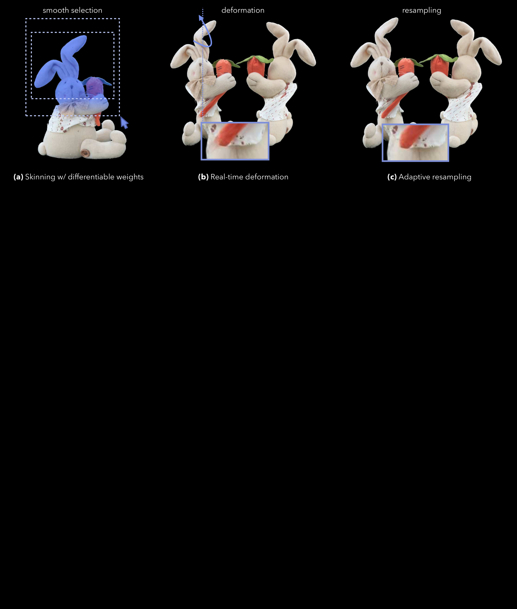

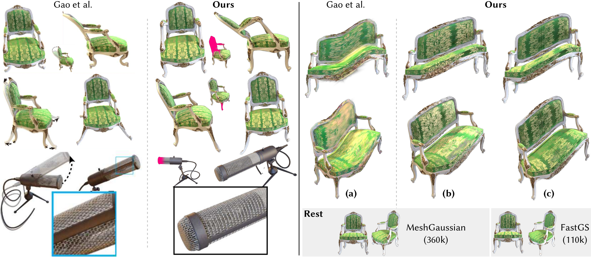

---

### UniMate

拓扑感知 DiT：单一模型为任意骨架从文本生成关节运动（SIGGRAPH Asia 2026）。

**Title：** UniMate: One Unified Model to Animate Diverse Skeletons

**作者：** Linzhan Mou, Jiahui Lei, Zhiyang Dou, Chenyue Cai, Chaoyue Song, Adam Finkelstein, Szymon Rusinkiewicz

**单位：** Princeton University（Mou, Cai, Finkelstein, Rusinkiewicz）；University of California, Berkeley（Lei）；Massachusetts Institute of Technology（Dou）；Nanyang Technological University（Song）

**发表时间：** SIGGRAPH Asia 2026（arXiv 挂出 2026-09-04）

**投稿信息：** 已接收 — abs Comments「SIGGRAPH Asia 2026」；项目页 venue「SIGGRAPH Asia 2026」+ poster

**arXiv：**
- abs: https://arxiv.org/abs/2609.05415
- PDF: https://arxiv.org/pdf/2609.05415

**摘要（中译）：**
自动绑骨已能规模化产出可动画三维资产，但驱动它们的运动生成仍是瓶颈。既有学习型动画器受拓扑约束：依赖类别模板，或需按骨架微调并在推理时提供参考运动。UniMate 是统一基础模型：给定绑骨三维资产与文本提示，即可为任意骨架合成关节运动，无需测试时优化或按骨架重训。其拓扑感知扩散 Transformer 通过三种机制把骨架拓扑写入注意力：(1) 由关节对关系与测地距离得到的图感知注意力偏置；(2) 经图拉普拉斯把 RoPE 推广到任意运动学树的谱旋转位置编码；(3) 从静止姿态骨架注意力池化得到的全局拓扑条件。作者还整理 UniML3D：13,006 段运动，覆盖双足、四足、鸟类、海洋、昆虫、蛇形与铰接刚体等，并统一规范化与文本配对。训练后在质量、泛化与效率上优于 SOTA，并支持零样本跨拓扑迁移、中间帧、扩展与文本引导编辑。

**相关链接：**
- 项目主页：https://linzhanmou.com/unimate/
- 交互演示：https://linzhanmou.com/unimate/interactive.html
- 代码：https://github.com/Friedrich-M/UniMate
- 数据/模型集合（HF）：https://huggingface.co/collections/Linzhan/unimate

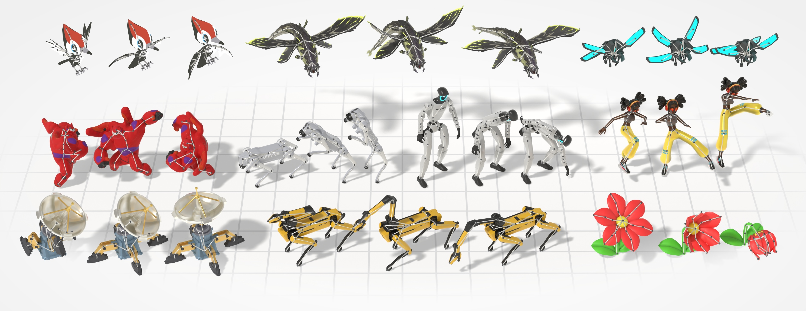

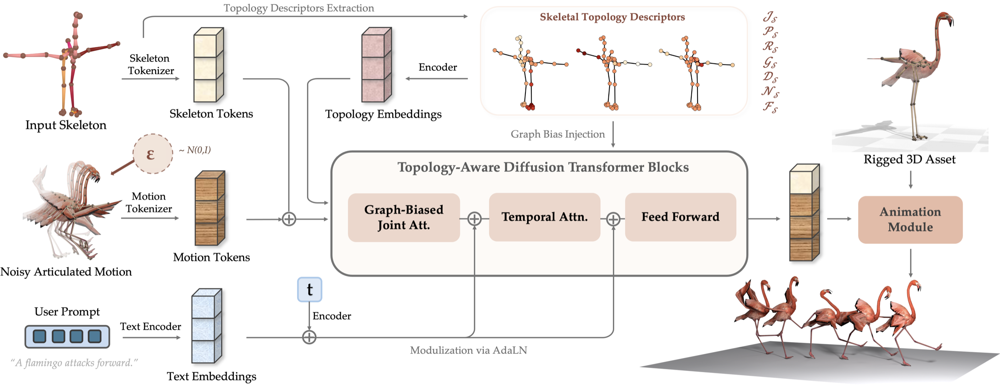

---

### PointGT

点表示上同时编辑几何与外观，面向神经重建后的可编辑性（ECCV 2026）。

**Title：** PointGT: Simultaneous Geometry and Texture Editing for Point-Based Representations

**作者：** Yanshu Zhang, George Shramko, Pratul P. Srinivasan, Ke Li

**单位：** Simon Fraser University（Zhang, Shramko, Li）；Google DeepMind（Srinivasan）

**发表时间：** ECCV 2026（arXiv 挂出 2026-09-03）

**投稿信息：** 已接收 — abs Comments「Accepted to ECCV 2026」；项目页 ECCV 2026

**arXiv：**
- abs: https://arxiv.org/abs/2609.03341
- PDF: https://arxiv.org/pdf/2609.03341

**摘要（中译）：**
本文提出 PointGT，一种可同时编辑物体几何与外观的点基三维表示。现有重建与视角合成技术能得到高质量、逼真的体表示，但难以编辑；尤其近期面向 3DGS 的纹理编辑方法往往与几何编辑/变形不兼容。PointGT 将适于几何变形的点表示与可学习 UV 映射结合，以支持高分辨率纹理编辑，并在保持较高渲染质量的同时实现点基神经表示上的细粒度几何与纹理编辑。

**相关链接：**
- 项目主页：https://zvict.github.io/pointgt/
- 视频：https://www.youtube.com/watch?v=aHKiGW_okAw
- 暂未找到公开代码仓库

**配图：** 暂无公开配图（本刊 figs 未收录）

---

### P-CORE

自监督表面一致性约束，支撑点基表示的自由非刚性形状编辑（ECCV 2026）。

**Title：** P-CORE: Self-Supervised Surface Consistency for Point-Based Neural Editing

**作者：** Yanshu Zhang, Shichong Peng, Mehran Aghabozorgi, Alireza Moazeni, Ke Li

**单位：** Simon Fraser University

**发表时间：** ECCV 2026（arXiv 挂出 2026-09-03）

**投稿信息：** 已接收 — abs Comments「Accepted to ECCV 2026」；项目页 ECCV 2026

**arXiv：**
- abs: https://arxiv.org/abs/2609.03349
- PDF: https://arxiv.org/pdf/2609.03349

**摘要（中译）：**
神经渲染已能高保真多视角重建三维场景，但自由形态的非刚性形状编辑仍困难。点基神经表示因无固定连通性而不把学习到的表面拓扑锁死在初始化上，利于多视角重建；同一性质却使其在大变形下易出现破洞与表面不连续。本文提出自监督方法，使点表示在无需变形几何真值多视角图像的情况下适应大变形：关键是生成随机变形，并约束变形前后预测表面一致——即「先变形点云再预测表面」应等于「先预测表面再施加同一变形」。方法嵌入基于注意力的点表示（相对溅射式高斯核，使用点间可学习插值核），该核可在无需增删点的情况下适应大变形。在 Neural Editor、Objaverse 等合成编辑基准上，零样本编辑优于既有点方法并显著减少伪影；在 DTU 与 Mip-NeRF 360 真实场景上也展示了有效性。

**相关链接：**
- 项目主页：https://zvict.github.io/p-core/
- 视频：https://www.youtube.com/watch?v=F7x1ZtshJYE
- 暂未找到公开代码仓库

**配图：** 暂无公开配图（本刊 figs 未收录）

---

## 具身数据增强与回环

把重建资产接到仿真 / 导航 / VLA 闭环。**WorldSculpt** 把 grounded 视频收成「独立物体 mesh + 共享世界坐标」，接近 RoboSplat 式 CG-for-embodied 的资产形态；**NavArena** 从固定 3DGS 自动导出可通行性与闭环导航评测；**LIBERO-RECOVER** 把叙事从「能否成功」改成「失败后能否恢复」。UE 动作条件视频产线则是数据引擎样本。优先读 WorldSculpt；关心部署可靠性再读 LIBERO-RECOVER。

---

### WorldSculpt

从 grounded 视频生成可组合 3D 世界：独立物体 mesh 放在共享世界坐标里。

**Title：** WorldSculpt: Generating Compositional Worlds from Grounded Videos

**作者：** Muyao Niu, Jixuan He, Ruihan Yu, Lian Fu, Yonghao Yu, Zheng-Hui Huang, Yifan Zhan, Fengbo Lan, Yongtao Ge, Yinqiang Zheng, Kaipeng Zhang, Zhixiang Wang

**单位：** Alaya Lab；The University of Tokyo（项目页标注 △ Alaya Lab ♣ The University of Tokyo）

**发表时间：** arXiv 2026-09-04

**投稿信息：** 未标明（abs Comments 仅 Homepage/Github；BibTeX 为 arXiv misc）

**arXiv：**
- abs: https://arxiv.org/abs/2609.05416
- PDF: https://arxiv.org/pdf/2609.05416

**摘要（中译）：**
本文研究如何为含数百物体的杂乱场景生成可组合三维表示：场景应是放置在共享世界坐标系中的一组独立物体 mesh，以满足游戏、AR/VR、仿真与机器人等下游需求。密集遮挡下每视角仅见局部几何，几何法常把场景建成单一表示并在遮挡区留洞；带生成先验的组合方法又多限于简单场景。作者表明：可通过把强单物体三维生成先验适配到多视角观测，组合式生成含数百物体的复杂场景。具体在 Pixal3D 上扩展多视角条件通路，使物体生成扎根于多幅带位姿观测；尽管微调完全在规范空间单物体上进行，无需场景级训练即可泛化到严重遮挡的大场景。作者还提出 UE-MeshyScene：含数百物体、逐物体标注与真值 mesh 的逼真杂乱场景基准。在单物体、可控多物体与 UE-MeshyScene 上均优于先前方法；并展示将 Marble、HY-World 2.0 等生成式 3DGS 世界转为组合 mesh 场景的更广适用性。

**相关链接：**
- 项目主页：https://alaya-lab.github.io/WorldSculpt/
- 代码：https://github.com/AlayaLab/WorldSculpt
- 模型（HF）：https://huggingface.co/AlayaLab/WorldSculpt
- 数据（HF）：https://huggingface.co/datasets/AlayaLab/Worldsculpt_data

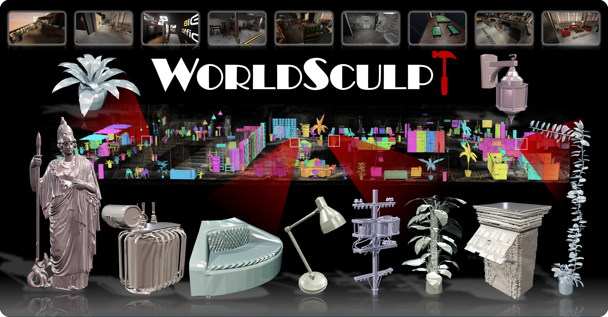

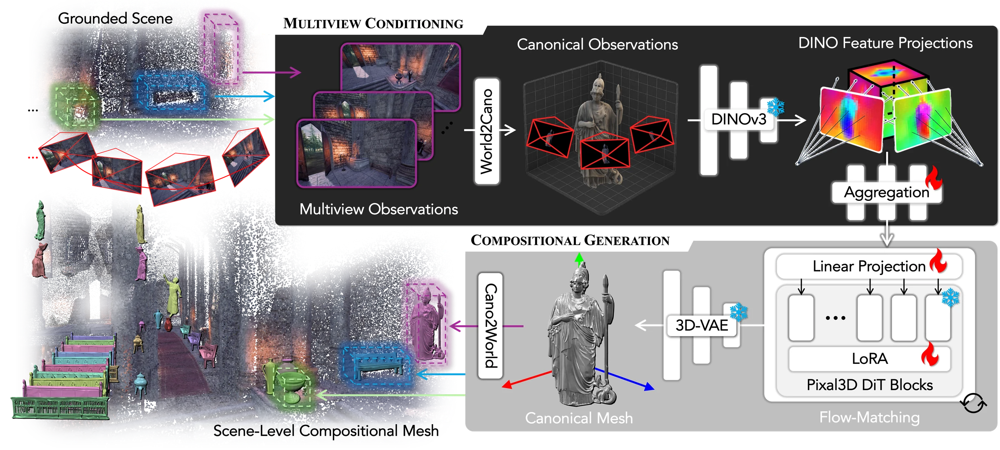

---

### NavArena

从固定 3DGS 自动构建带可通行性与闭环协议的目标导航评测场。

**Title：** NavArena: Automated Construction of Goal-Oriented Navigation Benchmarks from 3D Gaussian Splatting Reconstructions

**作者：** Junhui Wang, Wei Yang, Xinyao Li, Ningjing Fan, Yuehao Yin, Xuecheng Chen, Chao Gao

**单位：** 未标明

**发表时间：** arXiv 2026-09-04

**投稿信息：** 未标明（abs Comments 空）

**arXiv：**
- abs: https://arxiv.org/abs/2609.04602
- PDF: https://arxiv.org/pdf/2609.04602

**摘要（中译）：**
固定 3DGS 重建可提供逼真新视角，但缺乏导航评测所需的可通行约束、有效目标与闭环协议。NavArena 自动把固定 3DGS 转为面向目标视觉导航的基准：冻结 3DGS 做第一人称 RGB-D 渲染；由高斯密度与高度统计导出占用代价图以支持可达性与碰撞查询；再从多视角开放词汇掩膜抬升语义目标候选。上述组件支持自动生成并统一闭环评测目标导航回合。在 2000+ 场景上生成 2220 万条专家轨迹；空间/语义评估检验导航表示，策略 rollout 展示统一评测协议的诊断价值。工具、协议与衍生资产将公开。

**相关链接：**
- 暂未找到公开主页/代码/视频（摘要称将公开发布）

**配图：** 暂无公开配图

---

### LIBERO-RECOVER

在 LIBERO 近满分表象下，系统评测并推动操作模型的失败恢复能力。

**Title：** LIBERO-RECOVER: Beyond Task Success Towards Failure Recovery in Robotic Manipulation Models

**作者：** Lin Liu, Zhicheng Bao, Lu Zhang, Ziying Song, Wu Yang, Shuai Tao, Wulong Liu, Huchuan Lu

**单位：** 未标明（项目页未在本刊核对到完整单位列表）

**发表时间：** arXiv 2026-09-04

**投稿信息：** 未标明（abs Comments 空）

**arXiv：**
- abs: https://arxiv.org/abs/2609.05178
- PDF: https://arxiv.org/pdf/2609.05178

**摘要（中译）：**
VLA / World Action 模型在机器人操作上表现突出，LIBERO 上 SOTA 已近 100% 成功，看似可部署；但理想条件下的成功并不等于真实世界鲁棒性。既有基准多从预定义初态评任务完成，而真实交互难免抓取失败、碰撞、误动物体等——机器人不仅要能成功执行，还要识别并恢复失败以继续任务。该能力基本未被度量。本文提出 LIBERO-Recover：基于 LIBERO，从 SOTA 具身模型收集真实执行失败，构建 1000+ 场景、四档恢复难度（动作重试、动作适应、物体状态恢复、环境恢复），并评空间理解、物体结构推理、交互理解与拓扑推理等核心能力。作为首个大规模具身失败恢复基准，它把问题从「机器人能否成功？」转向「失败后能否恢复？」，推动更稳健、可泛化的具身智能体。

**相关链接：**
- 项目主页：https://liulin815.github.io/LIBERO-Recovery/
- 代码：https://github.com/liulin815/LIBERO-Recovery
- 数据集（ModelScope）：https://www.modelscope.cn/datasets/ataier/LIBERO_Recovery_Expert

**配图：** 暂无公开配图（本刊 figs 未收录）

---

### UE Action-Conditioned Video Pipeline（EchoWM 组件）

基于 Unreal Engine 的动作条件视频预训练数据管线（EchoWM 组件）。

**Title：** Building Pretraining Data for World Models: An Unreal Engine-Based Pipeline for Action-Conditioned Video Generation

**作者：** Haoyu Wang, Songchun Zhang, Haoran Li, Haoyang Huang, Zeyue Xue, Nan Duan

**单位：** 未标明

**发表时间：** arXiv 2026-09-03

**投稿信息：** 未标明（abs Comments「16 pages, 5 figures」；报告性质）

**arXiv：**
- abs: https://arxiv.org/abs/2609.03557
- PDF: https://arxiv.org/pdf/2609.03557

**摘要（中译）：**
动作条件视频模型需要与场景变化时间对齐的控制信号配对的大规模视觉数据；真实视频中往往未知「导致视觉变化的动作」，难以获得此类监督。本文给出基于 Unreal Engine 的大规模合成数据产线，生成动作条件、多视角视频。为兼顾实时物理与高质量离线渲染，管线分两阶段：阶段 I 在 PIE 中跑真实物理，把每帧角色状态、控制输入与相机状态记入中间轨迹表示；阶段 II 在新引擎进程中回放轨迹，用 Movie Render Queue（MRQ）离线渲染。外围还有缓存感知任务划分、节点本地槽位调度、自动场景筛选、美学/亮度过滤、部分输出恢复、异步上传与集群健康监控等分布式系统。产线集群为 25 台服务器、每台 8×RTX 5090；从 2,384 个资产包中保留 429 个关卡与 40 个人形角色，已产出 2,691 小时 1080p 与 6,076 小时 720p 视频。该管线是 EchoWM 所用的 UE 合成数据生产组件。

**相关链接：**
- 暂未找到公开主页/代码/视频（报告性质，指向 EchoWM 组件）

**配图：** 暂无公开配图

---

## Ke-Sen · 圈内 / 其它略读

Ke-Sen **SIGGRAPH 2026** 合集仍停在 **2026-08-20** 更新；分区标题大量为空壳，但条件接收区可见 **Spatio-Temporal Control Variates with ReSTIR** 及 Mobile3DGS³ / SHARP-GS / LoD of Gaussians 等前向加速条目，建议盯正式 preprint 而非周末 arXiv。下方为从主文下沉的弱相关 / 次优先条目，需要时再展开。

### Ke-Sen Huang / SIGGRAPH 合集
- 主页：https://kesen.realtimerendering.com/
- **SIGGRAPH 2026 论文合集**：https://kesen.realtimerendering.com/sig2026.html  
  - HTTP `Last-Modified: Thu, 20 Aug 2026 01:37:43 GMT` ≈ **2026-08-20 09:37 HKT**  
  - 近 48h：无 Last-Modified 变化；建议优先扫 Real-Time Rendering / Efficient Sampling: ReSTIR / Inverse Rendering / 3D Gaussian Splatting 等分区与条件接收列表

### 圈内动态（占位）
本 run 未拉取 X / 媒体增量；后续将按日扫描。近窗无额外圈内事件记入。

### 其它可略读（自 v2/v3 下沉）
| 方向 | 条目 | 备注 |
|------|------|------|
| 外观编辑 | Palette-based Color/Luminance Editing (2609.03897, SA 2026 条件接收) | 调色板重参数化；作者页 Coming soon |
| 优化稳定 | TruncGradGS (2609.03534, PG 2026) | 截断梯度；动态 3DGS 副产物数据集 |
| 训练加速 | Laplacian Frequency Hierarchies (2609.03334, PG 2026) | 训练期减原语，非前向主路径；[项目](https://sorenzhang574.github.io/Laplacian-GS/) |
| SfM 鲁棒 | HiSfM (2609.04718) | 歧义消歧；摘要 GitHub 404 |
| 运动风格 | STyMo (2609.04500, TOG) | 少样本风格迁移；[项目](https://joseluisponton.com/stymo-project-page/) |
| VLA 诊断 | RoboSPA (2609.05324, EMNLP 2026) | 527K 轨迹空间–程序基准；[GitHub](https://github.com/fanzhenxuan/RoboSPA) |
| 接触校正 | TacPAC (2609.05266) | 触觉预测→实时动作校正；[代码](https://github.com/LogosRoboticsGroup/TacPAC) |
| 在线 RL | VLA-Precision (2609.04355) | 精密任务实机在线 RL；[项目](https://vla-precision.github.io/) |
| 稍早变形 | ARAP Deformation of Gaussian Radiance Fields (2608.29538, TVCG) | 辐射场一致的 ARAP 变形；窗口略早，可作 GradRig 对照 |

### 数据完备性
- 09-05 / 09-06（周末）**无** arXiv cs.GR / cs.CV / cs.RO 独立 new list；策展基于 Fri 9/4 + Mon 9/7 积压
- v5 主文 **14** 篇高信号全格式条目；未编造条目、URL、录用或单位
- **命名规则：** 作者名保留英文 / 拼音；仅对明确国内单位使用中文（如中国科学技术大学）；其余单位用原文
- **发表时间：** 一律取 arXiv `<published>` 首次挂出日；已接收则同时写 venue
- **链接获取失败 / 受限：** GradRig / TileGS / LightBridge / AnyGS2Mesh / NavArena / UE-EchoWM 管线未见已验证公开主页或代码；PointGT / P-CORE 有项目页与视频、未见代码仓；HiSfM 摘要 GitHub 404
- **配图：** `/workspace/figs/`；正文相对路径 `figs/...`

---

*策展版 v5 生成：2026-09-07 ≈ 23:55 HKT · 兴趣校准：rubatotree blog Real2Sim + PTIR-GS · 摘要来源 arXiv API · 已去标签、人文化叙述、补发表时间 · 作者/单位命名规则已应用*
