# 科研日刊 · 周末积压升格：变形 / 绑骨 / 可重光照

## 今日速览

周日（9/7）arXiv 无独立公告，主信号继续来自周五前后的积压。昨日日报已把 GradRig / UniMate / LightBridge 等顶格写透，并把 Palette / TruncGrad / Laplacian / ARAP 压在「略读」；**今天把这批升格成全文**，再补上 EvoGS、InverseRig、LightFuse、LinePrim、CC-4DGS 与人形重定向——正好贴住博文仍在改的 SC-GS / 结构感知 Real2Sim 笔记，以及学术页钉着的 **PTIR-GS → TOG**。

**绑定与可编辑动态资产。** [ARAP-GS](#arap-gs) 指出「只几何挪高斯」不等于「辐射场也被正确变形」，用径向特征把光栅结果拉回变形后的辐射场——这是相对 GradRig（权重梯度拉伸）的另一条一致性账本。[EvoGS](#evogs)（PG 2026 journal）把动态变形写成带记忆的演化–校正，而不是逐帧独立 MLP；[CC-4DGS](#cc-4dgs)（TVCG）把变形场与外观存储一起压到几十 MB。[InverseRig](#inverse-rig)（PG 2026）从线稿反求 DCC 绑骨参数，补的是「骨怎么按意图动」；[PaletteGS](#palette-gs)（SA 2026）则把外观编辑做成可 bake 回 vanilla 3DGS 的调色板 + 亮度曲线。

**逆渲染 / 可重光照。** [LightFuse](#lightfuse) 做多状态扫描融合 + 一跳可微光线追踪，把「可挪动物体」和「可重光照」绑在同一套 2DGS 上，直接对照 PTIR 的逐场景路径追踪质量账。[LinePrim](#line-prim)（SA 2026）则反过来：用显式线段原语做毛发/纤维类逆渲染，换标准深度测试管线与物理仿真友好性。

**训练侧效率（不是前向光栅主路径，但会吃掉 Real2Sim 重建预算）。** [LaplacianGS](#laplacian-gs) 用拉普拉斯频率分级减训练期活跃原语；[TruncGradGS](#truncgradgs) 用截断梯度缓解远距梯度消失，并附带动态合成基准。

**具身交接。** [UMR](#umr) 用稠密点云对应做人形动作重定向，避开手写关键点语义——示教跨本体时值得对照。

**今日必读（按为什么读）：**
1. [ARAP-GS](#arap-gs) — 变形一致性：几何编辑后再对齐辐射场，SC-GS 谱系里「拉完就破」的对照解。
2. [EvoGS](#evogs) — 动态变形演化记忆；大/突变运动比逐帧 MLP 更稳。
3. [InverseRig](#inverse-rig) — 线稿→绑骨参数，自动绑骨之后的「意图式驱动」。
4. [LightFuse](#lightfuse) — 可交互布局 + 物理可重光照，对标 PTIR 的效率–质量桌。
5. [PaletteGS](#palette-gs) — 资产外观编辑出口，且可 bake 回标准 3DGS。

站外新兴趣补 [IRGS++](#irgs-pp)（互反射高斯逆渲染），作 PTIR 物理传输对照。

---

## 可编辑动态资产与绑定

昨日主线已是 GradRig + UniMate。今天升格的五篇分别打：**辐射场一致性变形**、**时序演化动态 GS**、**线稿反求绑骨**、**调色板外观编辑**、**动态存储压缩**。优先 [ARAP-GS](#arap-gs) 与 [EvoGS](#evogs)；需要 DCC 工作流再读 [InverseRig](#inverse-rig)。

---

### ARAP-GS · arXiv · 2026-08-30

几何挪完高斯还不够：再优化使光栅结果对齐「变形后的辐射场」，避免大变形撕裂伪影。

**Title：** As-Rigid-As-Possible Deformation of Gaussian Radiance Fields

**作者：** Xinhao Tong, Tianjia Shao, Yanlin Weng, Yin Yang, Kun Zhou

**单位：** 浙江大学 CAD&CG 国家重点实验室；University of Utah（Yin Yang）

**发表时间：** arXiv 2026-08-30

**投稿信息：** 未标明（abs Comments 空；PDF 为 IEEE 期刊类模板，勿写成已录用）

**arXiv：**
- abs: https://arxiv.org/abs/2608.29538
- PDF: https://arxiv.org/pdf/2608.29538

**摘要（中译）：**
3DGS 把辐射场建成稀疏三维高斯，能在高分辨率下实时新视角合成。但直接对高斯做几何编辑往往忽略「最终图像来自辐射场的光栅化」：变形后的高斯与期望的变形辐射场不一致，就会产生伪影。本文提出面向高斯辐射场的交互式尽可能刚性（ARAP）变形：在几何编辑之后，继续优化各高斯，使其光栅结果贴近变形后的辐射场。为此设计径向特征刻画变形前后的径向差异，并在场上密集采样；同时提出自适应各向异性空间低通滤波，抑制非均匀采样带来的混叠并保持场结构。用户可交互完成大规模 ARAP 变形；方法在保持变形前后辐射场一致性的同时，保留 3DGS 的渲染质量与效率。

**方法概要：**
两阶段。(1) 嵌入式变形（embedded deformation）对 3D 高斯做几何编辑，与既有「挪控制点/绑定网格」路线同类。(2) 以径向特征描述变形前后辐射差，密集采样后优化高斯配置，使光栅输出对齐变形辐射场；自适应各向异性低通滤波处理非均匀采样间隔。目标是纠正「只变形核、不校正场」导致的边界与大变形伪影（文中对照 SuGaR / SC-GS / GaMeS 等几何绑定路线）。

**值得关注：**
浙大 Kun Zhou 组。博文有 ARAP 课设笔记，昨日仅表格式略提——**今日升格**。相对 GradRig（蒙皮权重梯度拉伸 splat），这篇强调辐射场一致性，更适合评估「结构感知绑骨之后外观是否还站得住」。交互式大变形工具属性强；是否直接接入示教管线要看控制点布置成本。代码/主页暂未找到。

**相关链接：**
- 暂未找到公开主页/代码/视频

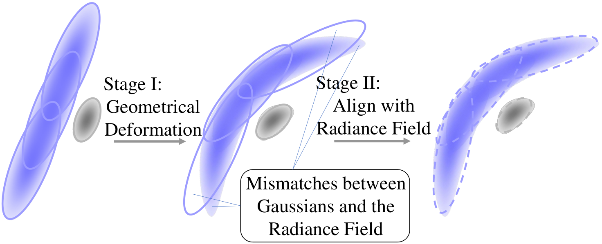

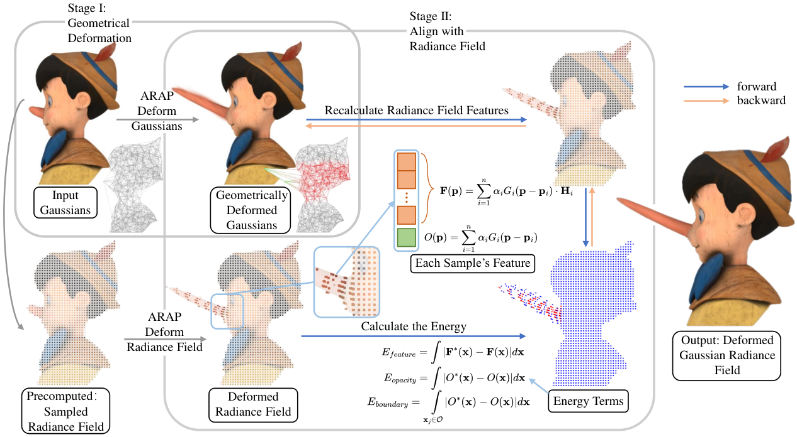

---

### EvoGS · Pacific Graphics 2026 · 2026-09-01

把动态高斯变形建成「历史外推 + 观测校正」的演化过程，而不是每帧独立估变形。

**Title：** EvoGS: Modeling Deformation Evolution for Dynamic Gaussian Splatting

**作者：** Wei Dong, Shahram Shirani, Jun Chen, Han Zhou

**单位：** 单位未在 abs 标明（PDF/HTML 亦未稳定抽出；保留作者英文名）

**发表时间：** Pacific Graphics 2026（journal track；arXiv 挂出 2026-09-01）

**投稿信息：** 已接收 — abs Comments「Accepted by Pacific Graphics 2026 (journal track)」；PDF 页眉 Pacific Graphics 2026 / CGF

**arXiv：**
- abs: https://arxiv.org/abs/2609.00994
- PDF: https://arxiv.org/pdf/2609.00994

**摘要（中译）：**
动态 3DGS 常用时间条件 MLP 估计高斯变形，但多数方法在各时刻独立预测，对大幅或突变运动不够稳健。本文提出 EvoGS：把高斯变形建模为时间演化过程。系统为每个高斯维护持续变形状态，由历史状态外推未来，再用 MLP 观测校正；校正权重由时间残差记忆以及变形速度、轨迹偏离等演化统计自适应决定。此外引入变形感知致密化：沿校正后的变形方向做 clone/split，并对变形历史不稳定的高斯抑制致密化。实验显示动态新视角质量提升，并在基准上具竞争力。

**方法概要：**
核心是 Persistent Deformation State Buffer：历史外推得到预测状态，MLP 给出观测状态，再用残差记忆与速度/角速度偏离等统计做自适应融合得到校正状态。致密化沿校正变形方向，并对高不确定性轨迹抑制分裂——减轻突变运动下的拖影与过密。

**值得关注：**
动态资产 / 示教视频重建的时序稳定性补丁；与 SC-GS 控制点操纵正交（一个偏重建跟踪，一个偏可编辑绑定）。PG journal track，可跟 Grid4D / Speede3DGS 等 backbone 组合阅读。代码/主页暂未找到。

**相关链接：**
- 暂未找到公开主页/代码/视频

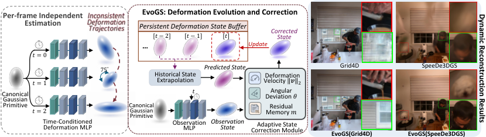

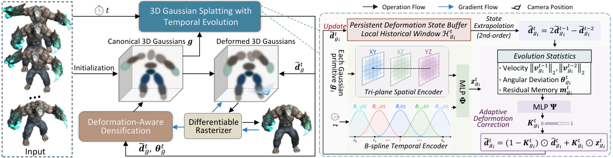

---

### InverseRig · Pacific Graphics 2026 · 2026-09-01

用屏幕空间线稿反求 DCC 高级绑骨参数：画轮廓，让骨架跟上。

**Title：** Inverse Rig Optimization from Line Drawings

**作者：** Zihao Zhu, Yuki Koyama

**单位：** The University of Tokyo

**发表时间：** Pacific Graphics 2026（arXiv 挂出 2026-09-01）

**投稿信息：** 已接收 — abs Comments「Pacific Graphics 2026」；PDF 会议页眉确认

**arXiv：**
- abs: https://arxiv.org/abs/2609.00732
- PDF: https://arxiv.org/pdf/2609.00732

**摘要（中译）：**
风格化角色动画大量依赖手工关键帧调绑骨参数；而风格化观感主要由轮廓线决定，在相机视图里画线往往比拧数值更直接。现有流程被迫在渲染视图与绑骨控件之间反复试错。本文从屏幕空间轮廓笔划恢复绑骨参数，实现「素描式」关键帧。给定重画当前轮廓的笔划，方法优化 DCC 工具中的高级绑骨参数：关键是用预训练 MLP 作为可微绑骨替代模型，把绑骨参数映射到网格顶点，替换黑盒原绑骨；将用户线与网格轮廓对齐，并把屏幕误差经替代模型反传以更新参数。实验覆盖多样角色与实用场景。

**方法概要：**
从 Blender/Maya 等 DCC 读取当前绑骨向量、MVP 与可见轮廓边。分段训练 NeuralRig（脸/身体/服装/头发等）作为可微替代；匹配用户笔划与网格轮廓后，反传屏幕误差更新高级绑骨参数。面向风格化（非物理）关键帧，强调轮廓可读性。

**值得关注：**
自动绑骨（SC-GS→骨骼资产）之后，「意图怎么驱动骨」的缺口补丁；与 UniMate（跨拓扑运动生成）可串成「有骨 → 会动 → 按线改」。输入是网格绑骨而非纯 3DGS——接到高斯资产前仍需网格/绑骨出口（可对照 AnyGS2Mesh）。代码/主页暂未找到。

**相关链接：**
- 暂未找到公开主页/代码/视频

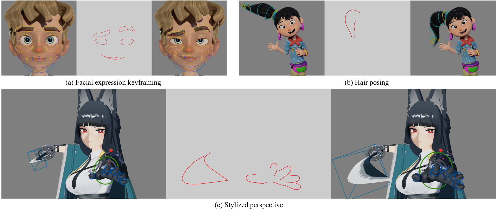

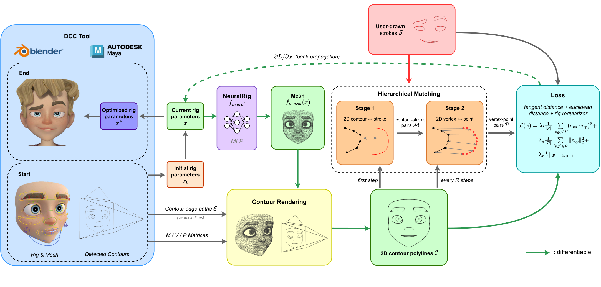

---

### PaletteGS · SIGGRAPH Asia 2026 · 2026-09-03

把预训练 3DGS 的 SH 重参数化成调色板权重，实时做分色上色、亮度曲线与像素约束，并可 bake 回 vanilla 3DGS。

**Title：** Reparametrizing 3D Gaussian Splatting for Real-Time Palette-based Color and Luminance Editing

**作者：** Cheng-Kang Ted Chao, Yotam Gingold

**单位：** George Mason University

**发表时间：** SIGGRAPH Asia 2026 Conference Papers（arXiv 挂出 2026-09-03）

**投稿信息：** 已接收 — PDF ACM Reference「SIGGRAPH Asia 2026 Conference Papers (SA Conference Papers ’26), Kuala Lumpur」及 DOI `10.1145/3829340.3842202`；abs Comments 仅页数（以 PDF 会议信息为准）

**arXiv：**
- abs: https://arxiv.org/abs/2609.03897
- PDF: https://arxiv.org/pdf/2609.03897

**摘要（中译）：**
专业调色需要独立控制色相/饱和度与明度。本文提出面向 3DGS 的实时交互着色框架：支持调色板重上色、按调色板的色感知亮度曲线，以及像素级颜色约束。方法不重训表示，而是把预训练 vanilla 3DGS 的球谐重参数化为视角相关调色板权重，并以图像空间稀疏性损失联合求解权重与调色板色。亮度编辑实现为沿消色轴的逐像素权重平移。该视图空间表述缓解了原语空间方法中 alpha 混合破坏稀疏性、导致窜色的问题。迭代重加权最小二乘与阻尼块坐标下降在数十毫秒级耦合色调曲线与调色板位移；表示可高效 bake 回 vanilla 3DGS，兼容标准查看器。

**方法概要：**
冻结几何，替换颜色 SH 为调色板权重 SH；在视图空间正则稀疏性；三种交互（调色板、tone curve、像素约束）由约束驱动求解器联合满足；编辑结果 bake 回标准 3DGS。

**值得关注：**
资产「外观出口」：Real2Sim 后若只需改材质色/品牌色而不重跑逆渲染，这条比 PTIR 轻。昨日略读今日升格。注意它改的是外观混合而非物理 BRDF——与路径追踪逆渲染互补而非替代。作者页/代码暂未找到（昨日笔记写 Coming soon）。

**相关链接：**
- 暂未找到公开主页/代码/视频

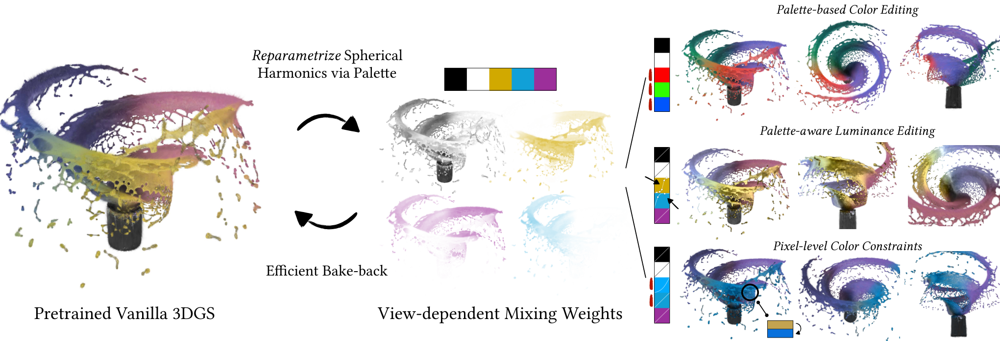

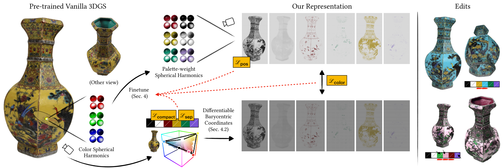

---

### CC-4DGS · IEEE TVCG · 2026-09-02

用计算性变形场 + 规范外观压缩，把动态 4DGS 存到约 20–30 MB 量级。

**Title：** CC-4DGS: Computational Deformation and Point-Cloud Compression for Storage-Efficient Dynamic Gaussian Splatting

**作者：** Kyungdae Park, Chae Eun Rhee

**单位：** Hanyang University

**发表时间：** IEEE Transactions on Visualization and Computer Graphics（arXiv 挂出 2026-09-02）

**投稿信息：** 已发表 — abs Comments「Published in IEEE Transactions on Visualization and Computer Graphics」

**arXiv：**
- abs: https://arxiv.org/abs/2609.02184
- PDF: https://arxiv.org/pdf/2609.02184

**摘要（中译）：**
动态 4DGS 质量高，但常因多分辨率哈希表与高维高斯属性占用数十到数百 MB。CC-4DGS 从变形建模与规范属性存储两端下手：计算性变形场（CDF）用确定性稠密哈希编码 + 紧凑神经解码器替代可学习大哈希表，变形存储可降到约 1–3 MB/场景；规范点云属性压缩（CCA）经条件自编码、选择性量化与残差码本，把高维 SH 等属性再压 3–5×。整体保持实时渲染，总存储约 20–30 MB；在 N3DV 与 Technicolor 等数据上精度可比 Swift4D，存储与运行内存更优。

**方法概要：**
CDF：确定性哈希特征 on-the-fly 生成变形特征；CCA：压缩规范空间外观与辅助属性。二者组合降低 4D 资产落盘与传输成本。

**值得关注：**
示教/多段动态资产若要进数据引擎，存储会先爆——这篇是工程向减压。昨日 X 流已出现条目，今日补全文。开源代码可用。

**相关链接：**
- 代码：https://github.com/KyungdaePark/CC-4DGS

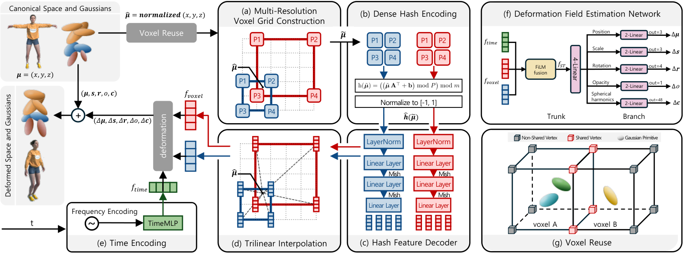

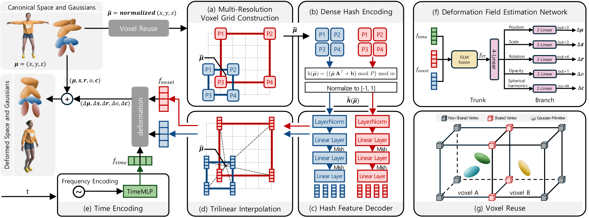

---

## 逆渲染与可重光照

对照 PTIR-GS：一篇把可交互布局与物理重光照接进 2DGS 管线，一篇用显式线段换毛发类结构的标准图形学出口。

---

### LightFuse · arXiv · 2026-08-29

多状态扫描融合出可挪动物体 + 共享材质，一跳光线追踪支持重排后重光照。

**Title：** LightFuse: Relightable Interactive Gaussian Scene Reconstruction via Multi-Scan Fusion and 2D Gaussian Ray Tracing

**作者：** Haonan Zhou, Gaoxiang Linghu, Youlin Jia, Hongyu Cui, Kewei Wei, Kaiyue Zhou, Bruce X. B. Yu, Gaoang Wang

**单位：** 浙江大学 ZJU-UIUC Institute；四川大学；浙江大学计算机学院；Chengdu Minto Tech

**发表时间：** arXiv 2026-08-29

**投稿信息：** 未标明（abs Comments 空）

**arXiv：**
- abs: https://arxiv.org/abs/2608.29269
- PDF: https://arxiv.org/pdf/2608.29269

**摘要（中译）：**
可重光照的交互式场景重建：从物体排布不同的多次扫描建立可编辑三维模型，并在新光照下渲染新布局。既有方法要么把光照烘焙进外观，要么只对固定场景分解材质/光照，编辑布局后阴影与间接光往往不一致。LightFuse 是 2D 高斯框架：先跨状态融合得到共享背景与可动物体，再做面向光线追踪的几何精炼；在精炼几何上以可微一跳光线追踪分阶段分离共享金属–粗糙度材质与状态相关环境光。结果支持物体重排、材质编辑与重光照，交互后由光线追踪重算外观。合成实验相对最强基线平均 +9.74 dB PSNR、+0.121 SSIM。

**方法概要：**
多状态融合 → 2D Gaussian surfel 几何精炼（跨状态监督）→ 分阶段逆渲染（可微一跳 RT）分离共享材质与 per-state 环境光。交互时重算可见性与传输。

**值得关注：**
浙大相关团队。叙事直接服务「可编辑 + 可重光照」仿真资产，和 PTIR 同桌：LightFuse 强调布局交互与一跳 RT，PTIR 强调路径追踪全局光照真实感。手机单次采集（非多状态重排扫描）时前置假设不同，读时注意数据采集协议。

**相关链接：**
- 项目主页：https://zhn202.github.io/LightFuse/

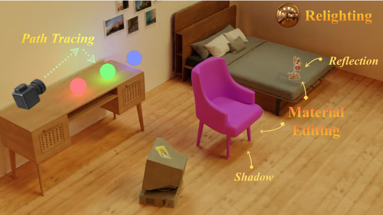

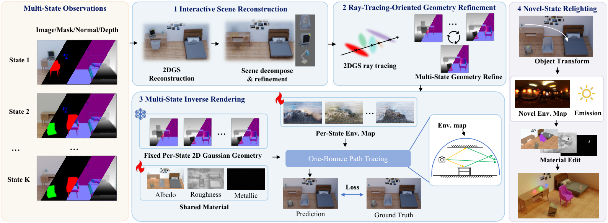

---

### LinePrim · SIGGRAPH Asia 2026 · 2026-09-01

用显式线段原语做毛发/纤维/织物等模糊结构的逆渲染，对接标准深度测试与仿真管线。

**Title：** Inverse Rendering for Modeling with Line Primitives

**作者：** Kenji Tojo, Ariel Shamir, Nobuyuki Umetani, Bernd Bickel

**单位：** 单位未在 abs 完整列出（项目页/PDF 可见作者机构；公开仓以项目页为准，不臆测中译）

**发表时间：** SIGGRAPH Asia 2026（arXiv 挂出 2026-09-01）

**投稿信息：** 已接收 — abs Comments「SIGGRAPH Asia 2026」；项目页标注 SA 2026 / ACM TOG

**arXiv：**
- abs: https://arxiv.org/abs/2609.00625
- PDF: https://arxiv.org/pdf/2609.00625

**摘要（中译）：**
毛发、毛皮、纤维、织物等模糊各向异性结构难以既忠实捕获又实时可视化。辐射场方法常用半透明体素/高斯，却不便接入标准深度测试光栅、反射模型与物理仿真。本文用显式线段重建模糊几何，并在亚像素网格上光栅化抗锯齿以呈现半透明外观。难点在于优化海量线段以匹配图像：作者提出随机可微线段光栅器，对顶点位置、属性与离散连通性提供有效梯度。合成与真实数据上优于基于表面的方法，质量可比体表示，同时保持显式几何，便于跨平台渲染、多种着色与物理仿真。

**方法概要：**
在 DiffSoup 随机不透明可微光栅思路上扩展到线段；Bresenham 式 1px 线 + 屏幕空间滤波；显式优化细边界几何而非靠大三角形+纹理。

**值得关注：**
逆渲染「原语选择」对照：GS 体积原语 vs 线原语。对 PTIR/手机室内，毛发/织物通常是次要但烦人的结构；若下游要仿真碰撞/梳理，显式线更友好。代码与数据已公开。

**相关链接：**
- 项目主页：https://kenji-tojo.github.io/sa26-line-primitives/
- 代码：https://github.com/kenji-tojo/inverse-line-primitives
- 数据集：https://huggingface.co/datasets/kenji-tojo/fuzzy_dataset
- 视频：https://www.youtube.com/watch?v=BTQmIC_yEkU

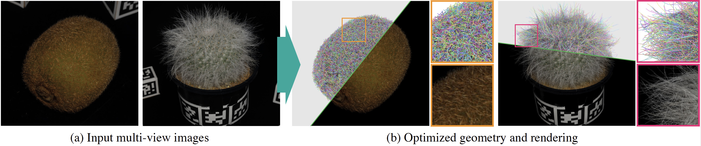

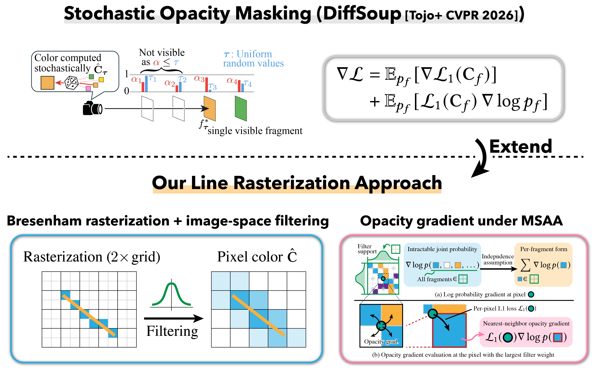

---

## 训练与优化效率

不直接加速 PTIR 前向路径追踪，但会吃掉「重建多少个可编辑资产」的时间预算；与昨日 TileGS（光栅核）正交。

---

### LaplacianGS · Pacific Graphics 2026 · 2026-09-03

拉普拉斯频率分级训练：低频场归档后只优化高频残差，降低训练期活跃高斯数。

**Title：** Laplacian Frequency Hierarchies for Efficient 3D Gaussian Splatting Training

**作者：** Yixiong Yang, Sisheng Zhang, Qingsong Yan, Shaohuai Shi, Qiang Wang

**单位：** 哈尔滨工业大学（深圳）；XGRIDS

**发表时间：** Pacific Graphics 2026（conference track；arXiv 挂出 2026-09-03）

**投稿信息：** 已接收 — abs Comments「Accepted to Pacific Graphics 2026 (conference track)」

**arXiv：**
- abs: https://arxiv.org/abs/2609.03334
- PDF: https://arxiv.org/pdf/2609.03334

**摘要（中译）：**
3DGS 训练瓶颈之一是高斯原语持续增多，优化变慢，高分辨率尤甚。本文提出 Laplacian Frequency Hierarchies：结合拉普拉斯图像分解与由粗到细的分频训练。拟合低频结构后归档对应高斯场，后续场只优化更高频残差而不背负全部原语；推理时在图像域做拉普拉斯式合成。设计即插即用，可与 Taming-3DGS、FastGS 等加速骨干叠加；在 1K/4K 设置下分别报告约 1.73×/1.21× 与 1.74×/1.33× 平均加速，难例与高分辨率收益更大。

**方法概要：**
训练图像 → 分辨率金字塔 + 拉普拉斯残差；顺序优化 \(\mathcal{G}^{L-1},\ldots,\mathcal{G}^{0}\)；推理分别渲染再拉普拉斯重建。

**值得关注：**
昨日略读今日升格。加速的是**训练**，不是推理光栅主路径（对照 TileGS）。大规模场景 / 多资产批重建时值得插到现有 backbone。

**相关链接：**
- 项目主页：https://sorenzhang574.github.io/Laplacian-GS/

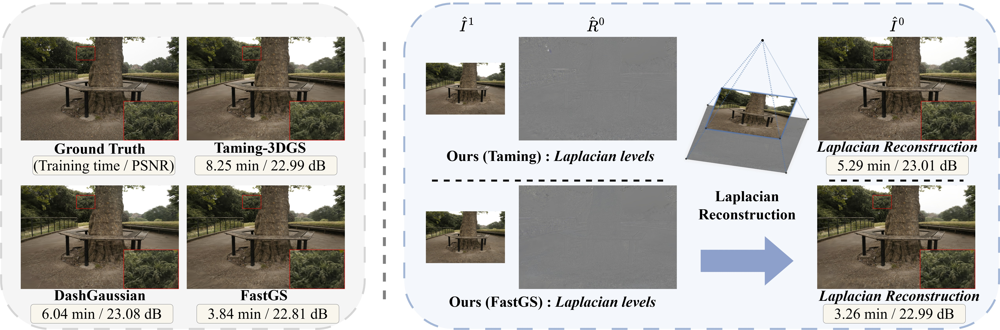

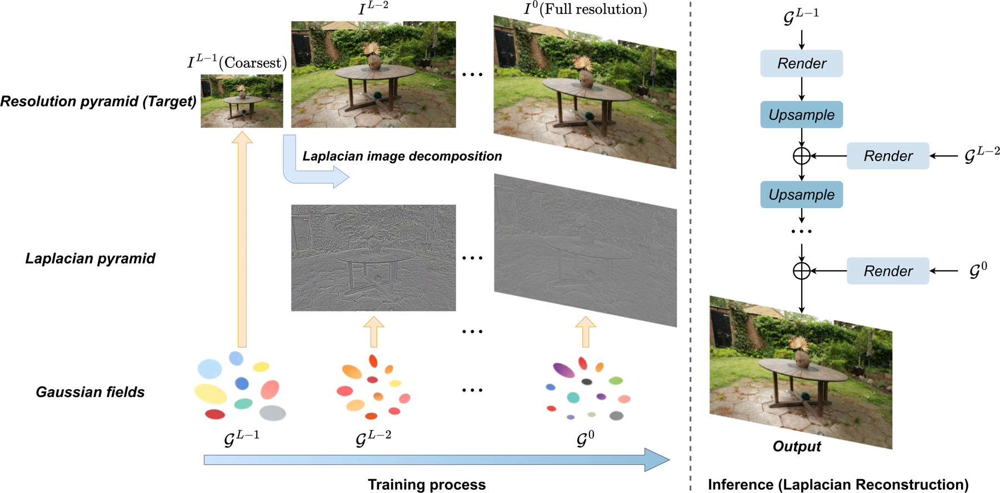

---

### TruncGradGS · Pacific Graphics 2026 · 2026-09-03

用分段截断梯度缓解远距像素对高斯属性的梯度消失，稳定静态/动态 3DGS 优化。

**Title：** TruncGradGS: Improved 3D Gaussian Splatting via Truncated Gradient Updates

**作者：** Théo Morales, Nhat-Quynh Le-Pham, Robin Atkins, Binh-Son Hua

**单位：** Trinity College Dublin；Dolby Laboratories

**发表时间：** Pacific Graphics 2026（arXiv 挂出 2026-09-03）

**投稿信息：** 已接收 — abs Comments「Accepted at Pacific Graphics 2026」

**arXiv：**
- abs: https://arxiv.org/abs/2609.03534
- PDF: https://arxiv.org/pdf/2609.03534

**摘要（中译）：**
3DGS 优化中常见梯度消失：远离某高斯的像素对其属性梯度过弱，重建变差。本文提出分段截断梯度，提升优化稳定性与对初始化的鲁棒性；在随机与 COLMAP 初始化、静态与动态 GS 上均有一致改进。顺带审视动态基准局限，并发布基于合成三维场景的动态 GS 新数据集。

**方法概要：**
分析 tile 光栅局部梯度导致的远距梯度消失 → 分段截断梯度更新；通用于静态/动态；附带合成动态基准以补现有数据缺陷。

**值得关注：**
昨日略读今日升格。对随机初始化 / 动态序列更有感；可与致密化策略、EvoGS 的变形感知致密化对照。代码/主页暂未找到。

**相关链接：**
- 暂未找到公开主页/代码/视频

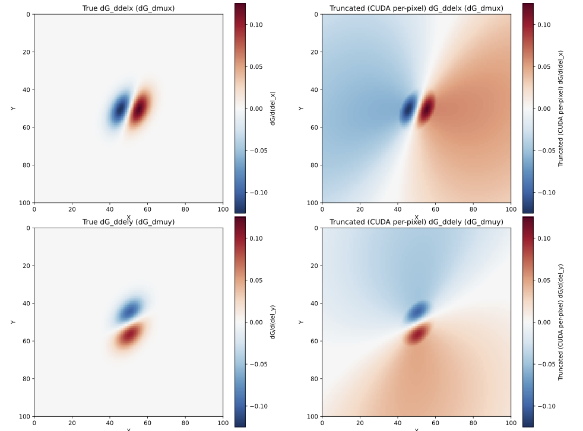

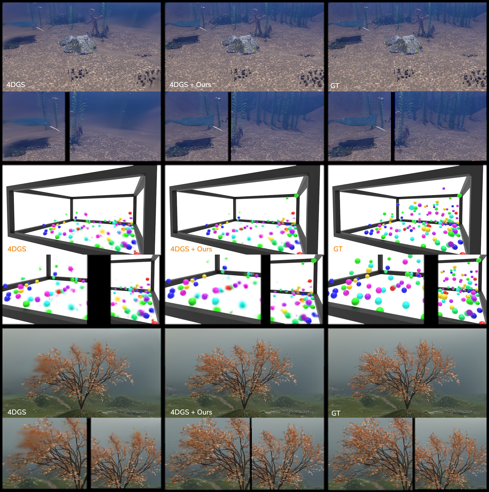

---

## 具身交接

---

### UMR · arXiv · 2026-09-02

用学到的稠密点云对应做统一人形动作重定向，摆脱手写关键点语义。

**Title：** Unified Motion Retargeting for Humanoids with Learned Point Cloud Correspondence

**作者：** Hanyang Cao, Yuetong Fang, Taesoo Kwon, Runyi Yu, Ji Ma, Jing Tan, Yangchen Zhou, Baoze Du, Yi Gu, Yukang Gao, Ruoli Dai, Lei Han, Renjing Xu

**单位：** 部分作者关联 Hanyang University（其余机构未在 abs 完整列出，不臆测）

**发表时间：** arXiv 2026-09-02

**投稿信息：** 未标明

**arXiv：**
- abs: https://arxiv.org/abs/2609.02134
- PDF: https://arxiv.org/pdf/2609.02134

**摘要（中译）：**
人形学习越来越依赖把海量人体动作变成机器人参考轨迹，但形态、自由度、关节限位差异使重定向困难。既有方法多用手工稀疏关键点/身体部位对应，难扩展且对细节姿态与接触指导稀疏。本文提出 Unified Motion Retargeting（UMR）：学习稠密点云对应，无需手工人–机映射；把体外表点云当作人体动作与人形机器人之间的统一接口，从而与源骨骼语义、机器人拓扑解耦。学到的稠密对应为带约束的点云匹配提供几何锚点，支持表面级姿态对齐与接触直接迁移。实验显示可统一异构动作源与本体，并在运动保真与合理性上优于既有方法。

**方法概要：**
在规范 T 姿学习人–机表面点对应并随网格运输；源可以是 SMPL 族、绑定角色、扫描人体等，只要提供规范网格与位姿序列；用对应做约束优化得到机器人广义坐标。

**值得关注：**
示教增强 / 跨本体数据引擎的上游：有人体视频或动捕时，如何变成机器人参考。与 3DGS Real2Sim 是不同层（动作 vs 外观资产），但同属「低成本数据→可仿真训练」闭环。

**相关链接：**
- 暂未找到公开主页/代码/视频

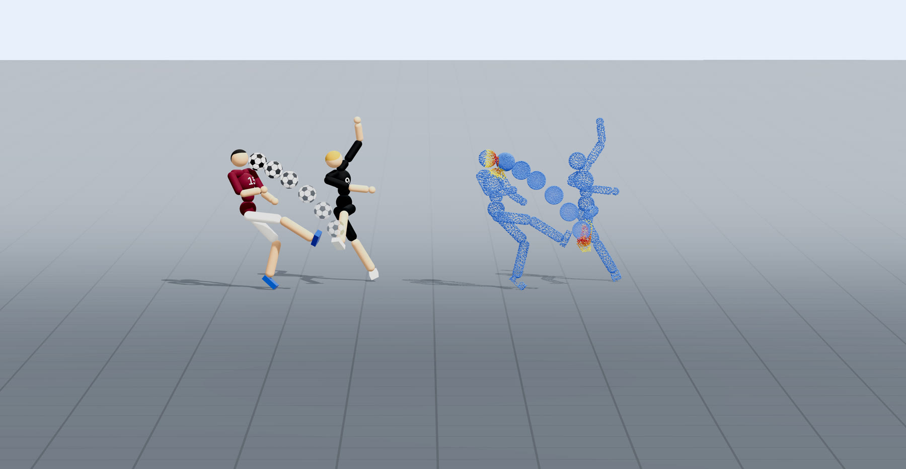

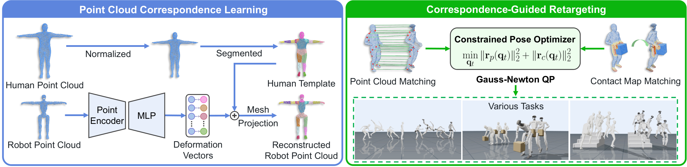

---

## Ke-Sen · 圈内 / 其它略读

Ke-Sen **SIGGRAPH 2026** 合集相对昨日仍无新的「今日更新」信号；与本日主线相邻的条件接收 / 分区条目继续值得盯正式稿：**Spatio-Temporal Control Variates with ReSTIR**（批渲染采样）、**Mobile3DGS³**、**SHARP-GS** / **A LoD of Gaussians**、以及 Inverse Rendering / Walk on Spheres 相关分区。SA 2026 论文专页尚未从主索引稳定放出；本日 SA 接收信息以各文 abs/PDF 为准（PaletteGS、LinePrim）。

- 主页：https://kesen.realtimerendering.com/
- **SIGGRAPH 2026 论文合集**：https://kesen.realtimerendering.com/sig2026.html

---

## 圈内动态

覆盖约 **2026-09-07 HKT**（及周末仍在发酵的具身/世界模型信号）。只收与图形 / 3DGS / 具身相关、带实链的高信号项。

### 中文媒体
- **量子位 · HiDream-O1-Embodied**（2026-09-07）：原生全模态具身世界模型叙事（图像/视频/3D/动作）。https://www.qbitai.com/2026/09/485056.html
- **机器之心 · 同题报道**（2026-09-07）：智象具身世界模型与执行闭环。https://c.m.163.com/news/a/L67RHSK10511AQHO.html
- **机器之心 · Human-Centric AI 综述**（2026-09-06）：人体三维重建 / 运动生成 / 世界模型到具身行动。https://www.163.com/dy/article/L65GM2Q90511AQHO.html
- **量子位 · 世界模型与空间智能讨论**（约 2026-09-05）：涉及照片重建点云与 3DGS、世界模型从生成走向推演。https://www.qbitai.com/2026/09/484683.html

### X
本日未做高成本关键词深挖；动态 GS / 压缩相关条目流可延续昨日 CSVisionPapers 对 CC-4DGS 等的转发线索。

### Ke-Sen
见上；无新的合集增量可报。

---

## 新兴趣相关

博文校准：近窗仍是《结构感知的 Real2Sim 重建》/ SC-GS 笔记微调，**无**全新兴趣标签。下列用站外检索补 **PTIR 物理逆渲染对照**（不限昨日窗口）。

| 条目 | 为何放这里 | 链接 |
|------|------------|------|
| **IRGS++**（Inter-Reflective Gaussian Splatting，arXiv:2607.22780） | 用可微 2D 高斯光线追踪查询可见性与间接辐射，在完整渲染方程下做互反射逆渲染，并补金属/高光初始化与 MIS；作 PTIR-GS / LightFuse 的「物理传输核心」对照。 | https://arxiv.org/abs/2607.22780 |
| **G-Skin**（arXiv:2608.01726） | 生成式先验学 3DGS 蒙皮权重；与 [ARAP-GS](#arap-gs) / GradRig 分工（学权重 vs 场一致性 vs 权重梯度拉伸）。 | https://arxiv.org/abs/2608.01726 |

---

### 数据完备性
- 2026-09-07 为周日，arXiv 无独立 new list；本日报（发布日 9/8）纳入相邻公告日积压中**昨日未全文覆盖**的高信号稿（含从略读升格者）
- 主文 **10** 篇全格式条目；新兴趣表 2 条
- **命名规则：** 作者名保留英文 / 拼音；仅对明确国内单位使用中文
- **发表时间：** 取 arXiv `<published>` 首次挂出日；已接收同时写 venue
- **配图：** 正文相对路径 `2026-09-08/figs/...`

---

## 覆盖说明

**日报日期：** 2026-09-08  
**内容覆盖：** 2026-09-07（及为对齐周末无独立公告所纳入的相邻公告日积压 / 升格稿）HKT。  
**编写：** Cream
