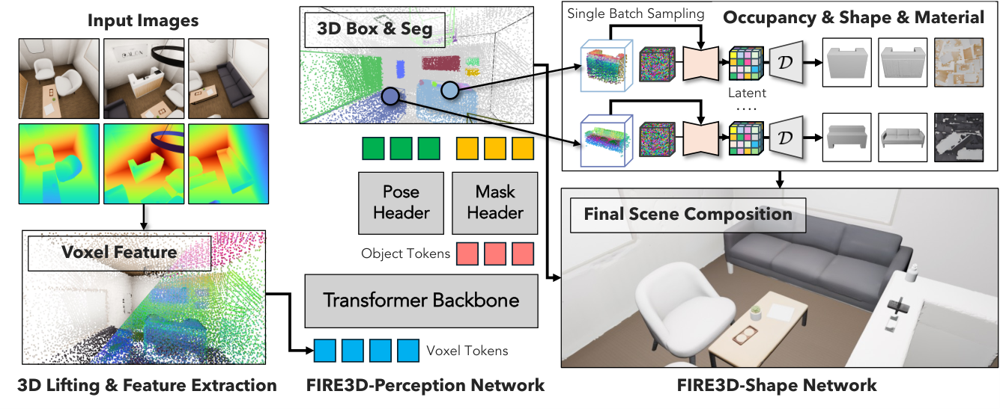
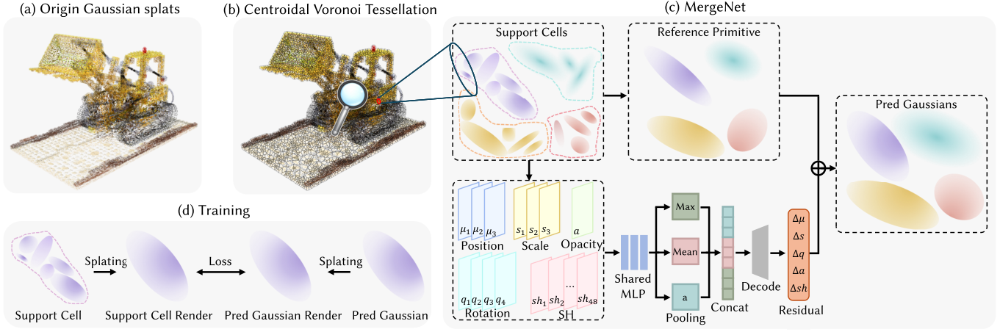

# 2026-09-10 科研日报 · 一分钟重建之后，瓶颈去了哪里

## 今日速览

今天最值得先读 **[FIRE3D](#2026-09-10--fire3d)**：它把对象解析、完整网格生成和场景组装放进批处理管线。但比“一分钟”更有启发的是耗时拆解——网络变快以后，网格处理、UV 和烘焙成了大头。

另外两篇重点分别回答：**已有高斯怎样变少**（[CVT-GS](#2026-09-10--cvt-gs)），以及**多视角怎样一起换光**（[RelightFormer](#2026-09-10--relightformer)）。它们优化的不是同一笔成本，读时不宜把“前馈”“免优化”当成统一的速度保证。

- **资产入口：FIRE3D。** 关注对象数增加时，生成与后处理怎样一起批量化。
- **表示预算：CVT-GS。** 关注“合并一组高斯”与“从中删掉一些高斯”的差别。
- **光照增强：RelightFormer。** 关注相机编码怎样消除视图顺序偏置；输出仍是图像。

后半篇按需选读：[RenderFormer-V2](#2026-09-10--renderformer-v2) 的局部／全局注意力适合对照传输复用；[EdMCGS](#2026-09-10--edmcgs) 给稀疏控制点补上事件驱动的帧间证据。最后单列一篇旧文 **[Pose6DAug](#2026-09-10--pose6daug)**：它已经明确实现“找失败对象 → 定向合成 → 再训练”，值得用来校准示教增强的创新边界。

**圈内速读：** [Muse](#2026-09-10--muse-agent) 将后台执行做成大众产品；[DeepSeek 换模争论](#2026-09-10--deepseek-model-switch) 关注工作流稳定性；[Cosmos](#2026-09-10--nms-cosmos) 引出程序化世界的体验分歧。[OpenTrajectory](#2026-09-10--opentrajectory) 与 [Jetson 支持](#2026-09-10--lerobot-jetson) 则是具身数据与部署的具体进展。

---

## 重点：把资产生成、表示压缩与重光照分开看

### FIRE3D · arXiv · 2026-09-08

**核心不是逐个对象生成得更快，而是让一整个场景的对象能一起处理。**

**方法概要。** RGB 图像／视频先由 Pi³ 估计深度与相机；实例感知网络解析对象和位姿，再以规范化对象点云为条件，生成几何、材质并组装网格场景。HC-VAE 进一步压缩潜表示，使多对象 flow-matching 采样、解码和后处理可批量执行。“免测试时优化”不等于没有生成采样过程，也不等于输入无需几何估计。[方法 §3](https://arxiv.org/html/2609.08848v1#S3)

*图源：论文图 2。右上是并行对象生成，右下才是组装后的场景。*

**关键证据。** 表 7 的每对象统计为 **网络 0.601 秒、后处理 4.181 秒、含纹理总计 4.783 秒**。论文据此报告约 12 个带纹理对象可在一分钟内处理；并行生成设置使用 A100 80GB。该表未单列 Pi³ 预处理，不宜读作从拍摄到部署的总耗时，也不能直接外推到任意显存或对象数量。[耗时分析 §4.3](https://arxiv.org/html/2609.08848v1#S4.SS3)

**值得关注。** 对 Real2Sim 数据引擎，我更看重这张耗时账单：仅缩短模型推理，可能已经碰不到主要瓶颈。可交互网格也不自动意味着关节、摩擦或接触模型已校准；后续应分别验收几何、运动和动力学。

[论文](https://arxiv.org/abs/2609.08848) · [PDF](https://arxiv.org/pdf/2609.08848) · [作者公布的项目入口](https://xiahongchi.github.io/Fire3D/)

展开：论文信息与摘要

**Title：** FIRE3D: Feed-forward Interactive 3D Scene Reconstruction Within A Minute

**作者：** Hongchi Xia, Tianhang Cheng, Wei-Chiu Ma, Shenlong Wang 
**单位：** University of Illinois Urbana-Champaign；Cornell University 
**发表时间：** arXiv 首次提交 2026-09-08。 
**投稿信息：** 预印本；未确认正式录用。 
**相关链接：** 项目入口见上；本期未确认可用的公开代码与权重。

**摘要（压缩中译）：** 从随手拍摄的 RGB 观测恢复可分离、可编辑的对象级场景，输出对象位姿、包围盒、完整网格与纹理；通过紧凑潜表示和批量生成降低重建成本。

### CVT-GS · arXiv · 2026-09-08

**减少高斯不必只做选择题：一组原语可以被重新预测成一个代表原语。**

**方法概要。** 先按不透明度加权的空间距离构造 CVT 分区，再让离线训练的 MergeNet 汇总每个单元的高斯属性，预测相对参考高斯的残差。训练时对齐原单元与合并原语的局部渲染；应用时返回标准 3DGS，无需为新场景微调网络。[方法原文](https://arxiv.org/html/2609.08730v1)

*图源：论文图 1。左下渲染监督用于离线训练；右侧才是部署时的属性预测。*

**关键证据与口径。** 作者在压至原始高斯数约 1/100 时，报告相对比较方法约 **12 倍简化速度、1.3 dB PSNR 优势**；这不是渲染帧率快 12 倍，也不是相对未压缩原模型提高 1.3 dB。实现仍进行 **5 次 Lloyd 迭代**，因此“optimization-free”应读作无需逐场景渲染损失微调，而不是整个流程零迭代。[摘要](https://arxiv.org/abs/2609.08730) · [实验设置](https://arxiv.org/html/2609.08730v1)

**值得关注。** 这是已有 3DGS 的表示压缩，不是语义清理或缺失部件补全。我的判断是：若用于拆分后的资产，先限制合并不能跨部件边界，比直接套用全场景简化更值得验证。

[论文](https://arxiv.org/abs/2609.08730) · [PDF](https://arxiv.org/pdf/2609.08730)

展开：论文信息与摘要

**Title：** CVT-GS: Learning to Simplify 3D Gaussian Splatting with Centroidal Voronoi Tessellation

**作者：** Bingxian Li, Yilong Li, Jingliang Peng, Peng-Shuai Wang, Fei Zhu, Guozheng Li, Chi Harold Liu, Guoping Wang, Bo Pang 
**单位：** 北京理工大学；北京大学 
**发表时间：** arXiv 首次提交 2026-09-08。 
**投稿信息：** 预印本；未确认正式录用。 
**相关链接：** 暂未确认独立项目页、公开代码或视频。

**摘要（压缩中译）：** 将训练好的高斯划分为空间单元，再以共享网络做多对一合并，兼顾简化成本与渲染质量，并保持原有渲染器兼容性。

### RelightFormer · SIGGRAPH Asia 2026 · 2026-09-07

**多视角不是一段视频：换一下输入顺序，不应换掉物体的光照解释。**

**方法概要。** 基于 Wan2.1，将环境图通过光照交叉注意力注入图像 token；以射线编码和依赖相机配置的 PRoPE，替换视频中按帧序号编码的方式。训练随机使用 1–16 个参考视图，输出目标光照下的图像，而非 BRDF 或完整 3DGS。[方法 §3](https://arxiv.org/html/2609.07414v1#S3)

*图源：论文图 2。模型预测 flow-matching 速度场；“feed-forward”不能据此理解为单步采样。*

**实验与可用性。** 论文覆盖单图、多视图及新视角重光照，并另训 RelightFormer-Post 支持新视角监督。官方仓库提供训练、推理及权重入口；LOD 包含 **90,545 个对象、39,008 种光照**，这是两类资源规模，不能相乘当作已渲染配对数。[论文实验](https://arxiv.org/html/2609.07414v1#S5) · [官方仓库](https://github.com/vLAR-group/RelightFormer)

**值得关注。** 相比此前的 LightBridge，这篇应放在“多视图图像增强”一侧，不是已重光照高斯的直接出口。若把结果用于逆渲染监督，需要另验跨视图几何与光照一致性；注意力结构本身不提供物理正确性保证。原始 Laval HDR 还需单独取得授权，不能把渲染数据可下载理解为全部光照资源已打包。[数据说明](https://github.com/vLAR-group/RelightFormer#dataset)

[论文](https://arxiv.org/abs/2609.07414) · [PDF](https://arxiv.org/pdf/2609.07414) · [代码与演示](https://github.com/vLAR-group/RelightFormer)

展开：论文信息与摘要

**Title：** RelightFormer: Feed-forward Generative Transformer for Multiview Object Relighting

**作者：** Hejun Wang, Jinxi Li, Junwei Jiang, Shiwei Mao, Hu Cheng, Shouwang Huang, Bo Yang 
**单位：** 香港理工大学深圳研究院 
**发表时间：** arXiv 首次提交 2026-09-07；会议时间为 2026-12-01 至 12-04。 
**投稿信息：** SIGGRAPH Asia 2026 Conference Papers；正文列出会议与 DOI，官方仓库亦有标注。

**摘要（压缩中译）：** 绕过显式内在属性估计，用多视角图像与环境图直接生成重光照结果；以光照条件注入和无视图顺序偏置的编码增强多视角融合。

---

## 按方向选读：传输复用与帧间运动证据

### RenderFormer-V2 · ECCV 2026 · 2026-09-04

**做批渲染的人，值得看它怎样区分局部几何交互与全局光照信息。**

**方法概要。** 保留“视角无关场景传输 → 视角相关像素输出”两阶段结构；几何 token 沿 Hilbert 曲线排序做窗口注意力，全局寄存器、光源与几何摘要 token 则始终可被访问。V2 还支持体介质、环境图和材质潜编码。[方法 §5–6](https://arxiv.org/html/2609.05738v1)

**实验与边界。** 稀疏注意力消融检验各类全局 token 的作用；训练规模扩至 64k 原语和 2048² 图像，但仍有限定光源数量、逐三角形纹理分辨率及未显式约束时序一致性等边界。它是学习式近似渲染，不是无偏 Monte Carlo 估计器。[实验与局限](https://arxiv.org/html/2609.05738v1#S8)

**值得关注。** 我的对照建议：固定场景、只改变相机时，先考虑复用视角无关阶段；一旦物体或光照改变，就需要重新判断缓存有效性。这是架构启发，不能当作论文已验证的多轨迹批渲染加速结论。

[论文](https://arxiv.org/abs/2609.05738) · [PDF](https://arxiv.org/pdf/2609.05738) · [作者公布的项目入口](https://renderformer.github.io/)

展开：论文信息、摘要与方法图

**Title：** RenderFormer-V2: Neural Rendering with Heterogeneous Scene Primitives

**作者：** Chong Zeng, Yue Dong, Pieter Peers, Lvmin Zhang, Maneesh Agrawala 
**单位：** Stanford University；Microsoft Research；College of William & Mary 
**发表时间：** arXiv 首次提交 2026-09-04。 
**投稿信息：** ECCV 2026，arXiv Comments 明确标注。 
**相关链接：** 项目入口见上；本期未核实 V2 独立代码与权重发布状态。

**摘要（压缩中译）：** 将异构场景原语映射为图像，以稀疏注意力扩大可处理场景规模，支持更多光传输效果，渲染新场景不需逐场景训练。

### EdMCGS · arXiv · 2026-09-08

**事件流不只用来训练：推理时，它也直接决定两张 RGB 帧之间发生了什么。**

**方法概要。** canonical 高斯由稀疏控制点驱动；RGB 锚点给出粗运动，控制点投影邻域内的事件特征驱动 Markov 状态转移，再以局部等距正则约束变形。相比仅把事件当监督信号的路线，帧间运动不是仅靠时间插值。[方法 §3](https://arxiv.org/html/2609.08332v1#S3)

**实验。** 四个合成场景的 5 fps 设置下，平均 PSNR 为 **29.37 dB**，对照 E-D3DGS 为 **26.83 dB**；去掉 Markov 模块降至 **25.44 dB**。这是带事件输入的特定重建评测，不能当作普通手机视频的同等提升。[表 1](https://arxiv.org/html/2609.08332v1)

**值得关注。** 与 SC-GS 对照时，重点是“稀疏控制点从哪里获得额外运动证据”，不是又换了一个变形 MLP。对没有事件相机的数据管线，直接接入条件并不成立。

[论文](https://arxiv.org/abs/2609.08332) · [PDF](https://arxiv.org/pdf/2609.08332) · [代码与数据入口](https://github.com/joseclipse/EdMCGS)

展开：论文信息、摘要与方法图

**Title：** EdMCGS: Event-Driven Markov Chain Gaussian Splatting for Extreme-Low-Frame-Rate Dynamic Scene Reconstruction

**作者：** Yuzhong Wang, Wenmin Wang, Xinxing Yu 
**单位：** 澳门科技大学 
**发表时间：** arXiv 首次提交 2026-09-08。 
**投稿信息：** 未确认录用；全文页头出现 Neurocomputing，但摘要页未列已接收信息，不能仅凭期刊模板认定发表。

**摘要（压缩中译）：** 结合极低帧率 RGB 与事件流，以事件驱动控制点状态演化，恢复未被 RGB 采样到的动态时刻，并支持实时新视角渲染。

---

## 新兴趣相关：失败驱动增强，已有怎样的具体实现

### Pose6DAug · arXiv · 2026-06-18

**这不是昨日新稿，而是一篇值得现在补读的直接近邻：它真的先找策略弱点，再决定替换什么对象。**

**方法概要。** 先用 rollout 找出失败频繁的对象，再从同类对象的成功示教中选源轨迹。保持机器人动作，通过共享世界坐标下的网格和 6D 位姿替换操作对象，生成同步多视角观测后微调策略。输入还需要标定相机、对象位姿、掩码等；并非任意单视频即可完成。[方法与增强协议](https://arxiv.org/html/2606.20118v2)

**关键证据。** 在 RoboCasa 的 GR00T-1.5 实验中，仅用定向增强数据微调后，8 个困难新对象、每个 20 回合的成功数由 **15/160 提升到 34/160**；VACE 为 24/160。恢复 7/8 个对象指每对象至少成功一次，不是七个对象均稳定掌握。[项目结果表 2](https://jhoonjwa.github.io/pose6daug/)

**值得关注。** “根据失败定向造数据”本身不能再当作空白点。仍值得区分的是：只处理对象替换，还是能自动定位视角、光照、布局与接触等不同失败原因，并在有限预算下决定增强方式？这是本刊提出的对照问题，不是本文已完成的通用能力。保留原轨迹也不足以保证任意新几何都有正确接触，需要认真检查适用假设。

[论文](https://arxiv.org/abs/2606.20118) · [PDF](https://arxiv.org/pdf/2606.20118) · [项目与代码入口](https://jhoonjwa.github.io/pose6daug/)

展开：论文信息、摘要与方法图

**Title：** Pose6DAug: Physically Plausible Multi-view Object Swapping for Robot Data Augmentation

**作者：** Jonghoon Lee, Seong Hyeon Park, Byungwoo Jeon, Minha Lee, Jinwoo Shin 
**单位：** KAIST；Korea University；RLWRLD 
**发表时间：** 首次提交 2026-06-18；本期参照 2026-06-19 的 v2。 
**投稿信息：** 预印本；未确认正式录用。 
**收录原因：** 新兴趣专题补读，并非 9 月新发布；此前去重账本未收录。 
**相关链接：** 项目页提供代码链接，本期未核实代码完整性。

**摘要（压缩中译）：** 利用已有成功轨迹为策略难以操作的对象合成反事实示教，在三维中约束对象替换，减少逐视角视频编辑造成的不一致。

---

## 圈内新闻与社区反应

**这一栏看两件事：新能力是否已经可用，以及真正用它的人遇到了什么。** 本次补充覆盖四个领域；9 月 9 日的事件与讨论为主，并纳入截至 9 月 10 日 13:40 HKT 的后续反馈。下述社区意见只代表所引讨论者。

### Agent｜Meta 发布 Muse：后台执行成为产品主角

**发生了什么。** Meta 于 9 月 8 日发布 Muse（美国发布时段对应 HKT 9 月 9 日），首批面向美国用户。官方介绍的重点是独立云端虚拟机、浏览器和跨应用操作：关闭界面后仍可继续工作，发邮件、购买等敏感动作需确认。Confidential VM 则是后续计划，不能与当前版本混为一谈。[官方公告](https://about.fb.com/news/2026/09/introducing-muse-personal-ai-agent/)

**外部反应。** 本次暂未找到足够可靠的独立用户实测原帖。WIRED 的发布报道将重点放在隐私承诺是否值得信任，以及当前 Secure VM 与未来 Confidential VM 的差别；这是媒体观察，不是社区已经验证了产品可靠性。[WIRED，9 月 8 日](https://www.wired.com/story/meta-releases-muse-a-personal-ai-agent-with-privacy-built-into-it)

**本刊判断。** 值得跟踪的产品变化是“持续执行 + 状态与权限管理”。下一步应看跨天任务完成率、失败恢复和审计记录，而不只看一次演示能操作多少应用。

### LLM｜DeepSeek 换模讨论：更强、更便宜，能否直接替换旧模型？

**先划清证据。** 9 月 9 日 UTC 的 HN 帖转述了 V4.1 Flash 预告，并称 Pro 请求将被重路由。但本次读取的官方文档仍列 Flash-0731 与 Pro-0813，更新日志未出现对应公告。因此本条收录的是**已发生的社区争论**，不据转帖确认新模型上线、价格或全面超越的结论。[讨论原帖](https://news.ycombinator.com/item?id=49624603) · [官方当前说明](https://api-docs.deepseek.com/) · [更新日志](https://api-docs.deepseek.com/updates/)

**分歧在哪里。** aftbit 反对未经迁移期就替换已验证的模型；lkois 以教育场景的实际审核流程解释，即使输出具有随机性，模型行为仍需回归验证。darksaints 则提醒，长期同时服务多个版本会增加部署成本。这是稳定性与服务成本的权衡，不能仅用排行榜分数解决。[社区讨论](https://news.ycombinator.com/item?id=49624603)

**本刊判断。** 对长期运行的 Agent，除了单次调用成本，还应观察版本可固定性、工具调用稳定性及重试成本。上述反馈也不是 V4.1 的独立性能评测。

### 图形学与游戏｜《无人深空》Cosmos：世界变丰富，体验也变丰富了吗？

**发生了什么。** Hello Games 公布 Cosmos 7.0，加入空间站管理、轨道建造与固定位置的深空兴趣点；图形侧明确提到地形细节渲染、细分与纹理改进。9 月 9 日 UTC 的社区讨论围绕这次更新展开。[官方更新说明](https://www.nomanssky.com/cosmos-update/)

**社区反应。** HN 用户 helle253 认为它依然像令人惊叹的技术演示，却缺少有分量的玩法；jasonjmcghee 将问题归结为程序化内容“技术上不同，体验上相似”。fnordpiglet 与 Ars_Armegis 则强调，建造、定制和自行设定目标本就是沙盒的乐趣。这里争论的是生成世界应该提供怎样的体验，不能归纳为玩家一致满意或失望。[讨论原帖，含跨日回复](https://news.ycombinator.com/item?id=49628493)

**本刊判断。** 对生成式场景，视觉差异、可交互差异和有意义的选择应分别考察。这条新闻对程序化内容与游戏设计有参考价值，但不是一篇新的渲染算法论文。

### 具身｜OpenTrajectory 的接入讨论：增强特征也可以服务评估

**发生了什么。** 9 月 4 日提出的 LeRobot 集成请求，在 9 月 9 日 UTC 出现新用途讨论（对应 HKT 9 月 10 日凌晨）。OpenTrajectory 为既有机器人视频补充轨迹草图、点跟踪、夹爪跟踪与深度等派生特征，输出沿用 LeRobotDataset。[集成提案 #4572](https://github.com/huggingface/lerobot/issues/4572)

**开发者反馈。** sattyamjjain 提出，逐步轨迹还可用于拟合正常运动范围，帮助评估系统减少依赖手设边界；作者 edmos7 回应，派生结果已作为普通 feature 列存储，下游可通过标准数据接口读取，但字段命名和 schema **尚不是 LeRobot 标准**。[用途建议](https://github.com/huggingface/lerobot/issues/4572#issuecomment-5604899526) · [作者回应](https://github.com/huggingface/lerobot/issues/4572#issuecomment-5605693756)

**本刊判断。** 与示教增强直接相关的启发是保存可复用的中间特征。这里的 augmentation 指补充数据特征，不能直接当作生成新视觉场景或新机器人动作；目前也只是开放的集成提案。

### 具身工具短讯｜LeRobot 合入社区维护的 Jetson 构建入口

**发生了什么。** 9 月 9 日创建的 [PR #4599](https://github.com/huggingface/lerobot/pull/4599) 已合并，加入 Jetson Dockerfile 与安装提示；方案面向 Jetson Orin、JetPack 6.2、CUDA 12.6，从源码构建相关 PyTorch 组件。它由社区贡献者维护，不能误称为 LeRobot 官方 nightly 镜像。

**协作反馈。** 在早先的 Jetson 支持问题中，ravediamond 提供可用镜像并承诺维护，imstevenpmwork 随后邀请其提交 Dockerfile 和文档。这比“有人说能跑”多了一步可追踪的项目接纳，但并不证明所有策略都已在该平台验证。[9 月 9 日讨论](https://github.com/huggingface/lerobot/issues/819#issuecomment-5599849448)

**本刊判断。** 对边缘部署，依赖和视频解码链路的可复现性也是实际进展；本条不报告未经测试的推理速度。

---

## 留给后续阅读的问题

**FIRE3D 的后处理成本还能怎样批量化？Pose6DAug 的对象级失败选择怎样扩展到其他可控扰动？** 前者关注单位资产成本，后者关注单位数据价值。今天的社区补充又给出一个配套问题：增强过程产生的轨迹和中间特征，能否同时成为验收数据质量的依据？

## 覆盖说明

**日报日期：** 2026-09-10。 
**内容覆盖日：** 2026-09-09（HKT）。以该日可见的 arXiv 公告与公开资料为主；标题日期保留各文首次提交日，不把公告日伪写成首发日。RenderFormer-V2 为本次公告中此前未收录的较早提交稿；Pose6DAug 明确作为不限近期的新兴趣补读。 
**新闻补充：** 2026-09-10 13:40 HKT 更新；保留论文覆盖窗口，新增 5 条新闻／社区进展。跨日发布与回复在各条说明；DeepSeek 预告仅作为社区讨论线索，未确认内容不当作已发布事实。社区来源以 HN 和 GitHub 公开讨论为主，未全面覆盖 X、Reddit 与中文社区；Muse 暂无本期可核实的独立用户实测，不以媒体报道替代。 
**数据完备性：** 本期精选 5 篇近期论文与 1 篇旧文补读，不声称穷尽当日全部上新。方法依据公开全文 HTML，实验数字保留对应条件；未确认的录用、代码和权重状态均明确标注。重点配图随文保存，其余图链接回作者公开原图。 
**编写：** Neon
