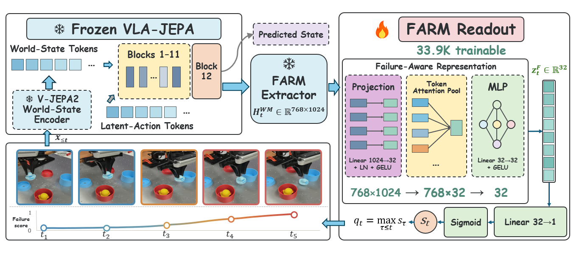
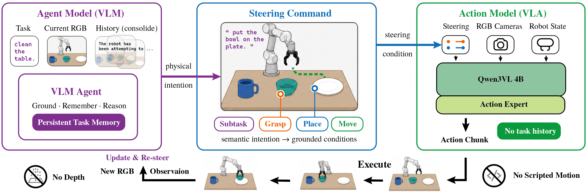
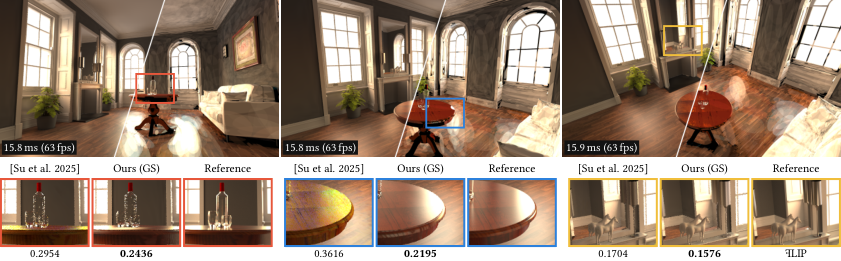
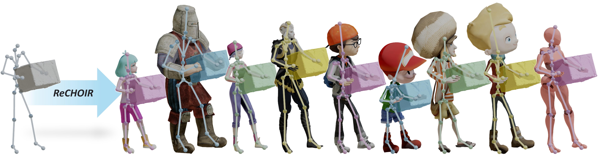

# 2026-09-12 科研日报

## 今日速览：重建之后，怎样判断失败、约束动作与降低成本

通用 Agent 做出三维重建的门槛继续下降，但今天更值得追问的是：**什么信号能证明任务失败，什么接口能把意图可靠地变成动作，什么加速能在完整流程里兑现？** 本期两篇具身重点论文分别补上监测和控制接口，尚未给出完整的自动示教增强—真机收益闭环。

- **必读 [FARM](#2026-09-12--farm)**：冻结世界模型后，只训练小读出头识别失败。最贴近失败反馈主线，但跨域监测仍需适配，真机分类结果不能写成自动恢复收益。
- **必读 [2AM](#2026-09-12--2am)**：Agent 保存记忆，用语言与二维提示驱动单一策略；读它时一定把完成度、宽松成功率和严格成功率分开。
- **图形学重点 [Gaussian Light Transport](#2026-09-12--glt)**：用高维高斯解光传输，不是常规 3DGS 重建。适合思考固定场景、多视角渲染的成本摊销。
- **选读 [ReCHOIR](#2026-09-12--rechoir)**：人和物体一起重定向，为接触一致性提供接口思路；动画结果不是机器人动作标签的物理保证。
- **[圈内新闻](#2026-09-12--community-news)**：新的 Agent Real2Sim 原帖主动披露对齐缺陷；RTK 实测显示压缩输出未必降低成功任务成本；HiPR 引出实际预览脚本与适用范围争论；Anthropic 新报告引发“公共风险与商业利益如何区分”的讨论。

## 失败反馈：先得到可校准的信号，再谈自动修复

### FARM · arXiv · 2026-09-10

**必读。** 增量不是生成新场景，而是证明冻结的预测状态可以复用为失败监测特征；它可能成为增强回路的触发器，但不是原因诊断器。

论文信息、摘要与入口

- **Title：** FARM: Reading Failure Signals from the Internal Predictive States of a Frozen Robotic World Model
- **作者：** Haoran Pei, Mingrui Luo, Senbao Wang, Haoran Lv, Jie Guo, Sheng Zhong, Ruixi Ci。
- **单位：** 中国科学院自动化研究所；哈尔滨工业大学。
- **发表时间：** arXiv 首次提交 2026-09-10，进入 9 月 11 日公告。
- **投稿信息：** 预印本，未标明已接收会议或期刊。
- **入口：** [arXiv](https://arxiv.org/abs/2609.11445) · [PDF](https://arxiv.org/pdf/2609.11445) · [全文 HTML](https://arxiv.org/html/2609.11445v1)。
- **摘要中译（压缩）：** 在冻结的机器人世界模型预测状态上训练轻量监督读出，输出逐步失败分数与只依赖已观测历史的轨迹风险；在仿真和多个真实机器人数据集上检验迁移与小规模适配。
- **相关链接：** [作者代码](https://github.com/HaoranPei-casia/FARM)。

*论文方法图，来源：作者。小的是新训练的读出头，左侧冻结骨干的推理并未消失。*

**方法概要。** 输入历史观测，经冻结 VLA-JEPA 提取预测状态；共享投影、注意力池化和 MLP 构成 **33,985 参数**的读出头。轨迹风险取已见逐步分数的最大值。监督来自轨迹成败标签，而非精确标注每一帧的失败起点。[全文 §III](https://arxiv.org/html/2609.11445v1)

**结果与证据边界。** 十任务对照中，Seen 的 pooled AUROC 为 **83.70**，严格未见任务降至 **65.67**，低于 STAC-Single 的 **68.28**。SO-101 的 70 条真机轨迹上，Core 零样本 AUROC 为 **57.80**，适配后为 **82.88**；该项采用末端对齐的八帧历史，不是证明提前干预减少了失败。**0.2256 ms** 仅是已有冻结特征之后的读出开销。[表 III–IV、§IV-D/E](https://arxiv.org/html/2609.11445v1)

**可复现程度。** 公开仓库提供最小读出、训练与评测代码，但不包含训练权重、私有数据和预提取特征；特征提取与真实控制也不属于完整交付范围。因此，“代码已公开”不等于可以直接复现所有真机结果。[仓库说明](https://github.com/HaoranPei-casia/FARM)

**值得关注。** 与 MiracleAug 的公开增强管线互补的是“何时收集困难案例”，不是场景建模本身。相较昨日 RoboDrop 依据训练梯度筛数据，FARM 更靠近执行端。我的判断是：下一步应固定误报预算，检验风险分数能否定位值得再采样的轨迹，再比较定向增强与随机增强的下游收益；**高失败分数本身不能告诉 Agent 应修改光照、接触还是动作标签**。

## Agent 与策略之间：记住任务，还要能准确表达意图

### 2AM · arXiv · 2026-09-10

**必读。** 它把“记忆有效”拆成可检验的接口问题；最重要的不是摘要中的大幅提升，而是与强复现基线相比究竟改善了什么。

论文信息、摘要与入口

- **Title：** 2AM: Grounding Agent-Side Memory as Guidance for Steerable Action Models in Long-Horizon Manipulation
- **作者：** Yutong Hu, Fengjiao Chen, Xuezhi Cao, Renaud Detry。
- **单位：** KU Leuven；美团；Flanders Make@KU Leuven。
- **发表时间：** arXiv 首次提交 2026-09-10，进入 9 月 11 日公告。
- **投稿信息：** 预印本，未标明录用 venue。
- **入口：** [arXiv](https://arxiv.org/abs/2609.11308) · [PDF](https://arxiv.org/pdf/2609.11308) · [全文 HTML](https://arxiv.org/html/2609.11308v1)。
- **摘要中译（压缩）：** 让高层 Agent 独占任务记忆，将历史转为子任务语言和可选二维抓取、放置、移动提示；低层单一动作模型只接收当前观测与提示，通过有噪声的提示训练提高可操控性。
- **相关链接：** 暂未确认独立项目页或公开代码。

*论文图 1，来源：作者。图像坐标是控制条件，不是可直接执行的三维动作。*

**方法概要与额外先验。** Qwen3-VL-4B 加 flow-matching 动作头执行 16 步动作块，Agent 随新 RGB 更新提示。部署时不提供深度、物体位姿或 oracle 子目标；但**训练标签仍借助阶段、框／掩码、接触和未来末端轨迹投影**。条件丢弃、空间噪声和时间扰动用于适应不完美提示，不能抹去训练侧监督。[全文 §2–3](https://arxiv.org/html/2609.11308v1)

**结果要分三列读。** LIBERO-Mem 十任务平均值均为百分比；宽松成功允许完成后又多做，严格成功则将这种越界视为失败。

| 设置 | 严格成功率 | 宽松成功率 | 有序子目标完成度 |
|---|---:|---:|---:|
| 同骨干 π₀ 复现 | 12.25 | 37.42 | 70.79 |
| 同 Agent／控制器，仅语言提示 | 7.25 | 19.42 | 53.72 |
| 2AM | 11.83 | 63.00 | 76.29 |

相对强复现基线，完成度提高 **5.50 个百分点**，不是摘要对旧公布基线的 61.5 点；严格成功率没有提高。论文仅验证单一仿真基准，尚无真机结果，也未量化不同提示频率的能力—延迟权衡。[表 3、§6](https://arxiv.org/html/2609.11308v1)

**值得关注。** 相比昨日 Show-Harness 的离散动作接口，2AM 的新信息是把记忆、空间提示和执行器固定下来做消融。对同步示教增强，可借鉴“从可编辑轨迹生成中间提示标签”的做法，再独立检验这些标签是否帮助策略；但它没有构建新场景、辨识物理或验证 Sim-to-Real。与 Thinking with Visual Primitives 的联系只是明确空间指代这一思想，不能据此认定两者拥有相同训练机制或控制能力。

## 渲染基础：把固定场景的光传输摊到许多视角

### Gaussian Light Transport · SIGGRAPH Asia 2026 · 2026-09-10

**图形学重点。** 这是渲染方程求解表示的变化，不是“高斯重建又变快了”；先认清它输入的是已知场景。

论文信息、摘要与入口

- **Title：** Gaussian Light Transport
- **作者：** Patrick Attimont, Kartic Subr, Cyril Soler。
- **单位：** Inria / Université Grenoble Alpes；University of Edinburgh。
- **发表时间：** arXiv 首次提交 2026-09-10，进入 9 月 11 日公告。
- **投稿信息：** arXiv 标明 SIGGRAPH Asia 2026 Conference Track；[DOI](https://doi.org/10.1145/3829340.3842373)。
- **入口：** [arXiv](https://arxiv.org/abs/2609.11430) · [PDF](https://arxiv.org/pdf/2609.11430) · [全文 HTML](https://arxiv.org/html/2609.11430v1)。
- **摘要中译（压缩）：** 用涵盖位置、方向、法线和材质的 13 维高斯混合表示光传输解，直接最小化渲染方程残差；通过高维剔除提高优化与查询效率，支持快速、多视角一致的全局光照渲染。
- **相关链接：** [项目与结果](https://patrick-attimont.com/projects/gaussian-light-transport/) · [代码入口](https://github.com/StokastX/gaussian-light-transport)，目前仍写明代码即将发布。

*论文 teaser，来源：作者。这里的 GS 表示光传输函数，不是通常用于重建表面的透明度高斯泼溅。*

**方法概要。** 输入几何、材质和光源，优化位置 3 维、方向 3 维、法线 3 维、反照率 3 维与粗糙度 1 维的高斯函数；以渲染方程残差训练，辅以分裂／剪枝、查询分组及高维剔除。渲染时在光线交点查询，也可结合一跳 Monte Carlo。[全文方法](https://arxiv.org/html/2609.11430v1)

**成本与边界。** RTX 4080 SUPER、六个场景的表 2 中，训练约 **7 分 37 秒至 12 分 8 秒**，1080p、1 spp 渲染约 **13.0–19.9 ms**。紧凑的磁盘模型不等于全部显存：文中另报告 GS 模式渲染 GPU 占用约 **3–4 GB**，GS＋MC 模式更高。这些结果针对场景的既定光传输解，不代表修改几何和光源后无需重新更新。[论文表 2 与实现说明](https://arxiv.org/html/2609.11430v1)

**值得关注。** 相对神经辐射度路线，它保留了残差求解思想，改用显式、可剔除的表示。对具身数据生成，最适合先问“同一场景、同一照明要渲染多少视角，才抵消预计算”；若每条增强都改变物体或光照，则需另外测失效重算成本。它不恢复隐藏几何、不配置碰撞，也没有证明策略收益。把固定场景吞吐直接换算成任意场景增强速度，会漏掉最关键的摊销条件。

## 接触与动作对齐：一个有启发、但不是物理保证的中间层

### ReCHOIR · SIGGRAPH Asia 2026 / ACM TOG · 2026-09-10

**选读。** 它提醒我们：换骨架不能只迁移人体动作，物体轨迹也要随接触关系调整。

论文信息、摘要与入口

- **Title：** ReCHOIR: Contact-guided Human Object Interaction Retargeting to Diverse Characters
- **作者：** Chaelin Kim, Seokhyeon Hong, Kwan Yun, Soojin Choi, Inseo Jang, Junyong Noh。
- **单位：** KAIST Visual Media Lab。
- **发表时间：** arXiv 首次提交 2026-09-10，进入 9 月 11 日公告。
- **投稿信息：** arXiv 标明 SIGGRAPH Asia 2026 Journal Track；[DOI](https://doi.org/10.1145/3842567)。
- **入口：** [arXiv](https://arxiv.org/abs/2609.10982) · [PDF](https://arxiv.org/pdf/2609.10982) · [全文 HTML](https://arxiv.org/html/2609.10982v1)。
- **摘要中译（压缩）：** 将源人体—物体交互迁移到不同骨架，以部件感知动作表示和接触引导残差共同调整目标角色及物体运动，兼顾动作语义与交互关系。
- **相关链接：** [项目与视频](https://cherry-leki.github.io/projects/ReCHOIR/)，代码仍为 Coming soon。

*作者项目 teaser。输入已包含动作、物体和接触信息，不是从一段普通 RGB 视频直接恢复全部运动。*

**方法概要。** 输入源骨架动作、物体几何、接触线索与目标骨架；PAME 提供部件级动作先验，接触残差分支和物体解码器联合对齐输出。物体分支调整位置，但保留源朝向，因此不是任意六自由度交互的完整重求解。[全文](https://arxiv.org/html/2609.10982v1)

**结果与边界。** OMOMO 测试中，ReCHOIR 为 **0.421 ms／帧、接触距离 5.9437 cm**；优化对照 PAME+Optim 为 **199.611 ms／帧、1.1005 cm**。它体现速度与接触精度取舍，而非所有指标都更好；没有机器人策略或真机验证。[表 1](https://arxiv.org/html/2609.10982v1)

**值得关注。** 可借鉴的是把“身体／机械臂轨迹”和“被操作物体轨迹”作为共同输出，而非先改场景、继续沿用旧动作。应用到 MiracleAug 类增强仍需另验可达性、碰撞、力与夹持稳定性；动画的接触距离指标不能直接为动作标签背书。

## 圈内新闻与社区反应

### Agent Real2Sim：新原帖的价值，在于把对齐缺陷一起公开

**发生了什么。** Aravind Kandiah 的原帖发布于 **9 月 10 日 22:05 UTC，即 9 月 11 日 06:05 HKT**。作者称 GPT-6 Astra 用两分钟将真实机器人视频／数据转为三维仿真、过程中无人介入，同时明确承认物体定位和相机对齐不够好，下一步要改外参并替换代理几何。**两分钟与无人介入均属作者自报**；完整输入、额外先验、可编辑导出格式和下游评测未交代。[原帖](https://www.linkedin.com/posts/sk-ara_real2sim-astra-result-for-robotics-2-mins-activity-7503936747936927744-mHTd)

**社区反馈。** 同帖 9 月 11 日，Nitik Jain 追问是否试过下游任务；Jayant Singh 则报告自己搭建 Genesis-world 仿真仓库时遇到版本文档被忽略、后端判断错误、未检查 CUDA 就选 CPU。后者是**另一项任务的个人体验，不是对该重建结果的独立复现**。可见讨论尚未提供训练或真机增益证明。[带作者署名的原始讨论](https://www.linkedin.com/posts/sk-ara_real2sim-astra-result-for-robotics-2-mins-activity-7503936747936927744-mHTd)

**编辑判断。** 与 [MiracleAug 公开管线](https://github.com/rubatotree/miracle-aug-skill)重合的是 Agent 辅助重建；本次新增的是另一位实践者公开披露的质量缺口，而不是新的完整 Real2Sim2Real 验证。最值得复用的验收方式，是分列相机、几何、物体响应、同步动作标签和策略结果，避免用“生成成功”覆盖五种不同问题。相似目标不能证明跟随关系。

### RTK：少读终端输出，不等于成功任务更便宜

**事实。** Quesma 的 Bartosz Kotrys 与 Jacek Migdal 于 **9 月 11 日**发布 1,740 次 Terminal-Bench 2.1 尝试的对照。把失败开销计入每次成功的平均成本后，RTK 下 Fable 约低 **3%**，DeepSeek 约高 **7%**；效果依赖模型、框架及任务。测试所遇的一项 0.45.0 命令重写循环问题，已在测试后的 0.46.0 修复，不能不加版本地沿用为当前缺陷。以上是该团队实测，不是本日报复现。[原始方法与结果](https://quesma.com/blog/does-rtk-make-ai-coding-cheaper/)

**社区反馈。** 9 月 11 日 HN 原帖中，jghn 报告模型困惑后重试并绕过 RTK；oefrha 批评节省量统计忽略原命令已有的输出截断，但认为对白名单内的重复测试输出仍有一定价值。两则是具体使用反馈，不代表普遍无效。[jghn，14:28 UTC](https://news.ycombinator.com/item?id=49659070) · [oefrha，15:00 UTC](https://news.ycombinator.com/item?id=49659631)

**编辑判断。** 应测成功率、重试次数与完整任务成本，而不只测压缩率；Agent 的一次额外返工足以吃掉局部优化。

### HiPR：预览调度走向社区试做，但原型不是集成完成

**事实与跨日增量。** HiPR 是既有 SIGGRAPH 工作，Rafael Padilla 的 **9 月 9 日作者访谈**强调根据编辑及光传输影响安排渲染，并称 Vulkan 参考实现计划发布。**9 月 10 日** Chaos 论坛的 maru 分享自动区域预览脚本；**9 月 11 日** Blender Artists 又出现对该脚本的跟进。此次收录的是落地尝试，不把旧论文改写成昨日新稿。[作者访谈](https://80.lv/articles/how-hipr-makes-path-tracing-feel-more-responsive-by-rendering-what-matters-first) · [脚本作者原帖](https://forums.chaos.com/t/new-algorithm-for-faster-previews/191146)

**社区反应。** Blender Artists 的 marcatore 认为方向有用，但要求验证复杂室内材质改变、间接光照影响全局时的收益；随后明确说明 Chaos 原型并非同一算法。maru 自己也警告脚本是可能崩溃的实验玩具：先更新选中对象区域，再按阈值恢复全帧。尚无可靠的独立性能复现。[9 月 10–11 日原始讨论](https://blenderartists.org/t/hierarchical-progressive-rendering-something-useful-for-cycles/1652497)

**编辑判断。** 对 Agent 编辑—渲染—审查循环，缩短局部反馈可能很有用；但更快看到局部结果，与整批训练图像渲染更快，是两种收益。现在不能写成 HiPR 已进入 Cycles 或 Corona 正式版本。

### Anthropic 威胁报告：风险观察与商业判断需要分别审视

**事实。** Anthropic **9 月 10 日**发布报告，回顾 2025 年 12 月至 2026 年 8 月发现并处置的案例，覆盖网络行动、监控、影响行动、欺诈等七类。厂商认为 Agent 化使部分行动更自主、规模更大；报告同时明确这些是选出的突出案例，**不是典型滥用的代表性样本**。具体归因和能力提升解释仍是厂商调查结论。[官方报告](https://www.anthropic.com/threat-intelligence-report-september-2026)

**9 月 11 日 HKT 的讨论。** tedsanders 在 UTC 9 月 10 日 18:10 的 HN 评论中主张严肃对待潜在生物风险，同时表示自己不认为已有明显的 LLM 风险加速；not2b 在 UTC 9 月 11 日 04:49 批评报告把公共伤害与厂商商业利益混列。这些是风险与分类标准上的意见，不是对案例真实性的独立审计。[风险观点原帖](https://news.ycombinator.com/item?id=49647999) · [分类批评原帖](https://news.ycombinator.com/item?id=49653680)

**编辑判断。** 可以据此重视执行权限和审计，但不能把精选案例直接换算成发生率，或把一次模型参与当成其造成结果的因果证明。严肃看待风险与要求充分证据并不冲突。

## 主线追踪：没有实质更新的项目，不重新包装成新闻

本期核对了 aDSL、Thinking with Visual Primitives、SimFoundry、World Labs Atlas／Real-to-Sim-to-Real 及 Agent＋Blender／仿真社区线索。**未确认这些具名项目在 9 月 11 日有足以单独展开的新发布，不重复旧介绍。** SimFoundry 当前仓库仍将完整数据生成与策略训练列为未发布部分；有场景生成代码不能自动推出训练链路完整开源。[SimFoundry 当前说明](https://github.com/NVlabs/SimFoundry) · [aDSL](https://github.com/sig-pku/aDSL) · [Atlas 官方介绍](https://www.worldlabs.ai/blog/atlas) · [World Labs R2S2R](https://www.worldlabs.ai/blog/real-to-sim-to-real)

## 覆盖说明

- **日报发布日：2026-09-12（HKT）；主要内容覆盖日：2026-09-11。** 四篇论文均首次收录，来自 9 月 11 日 arXiv 公告；标题日期保留 9 月 10 日首次提交日。重点论文核对全文方法、结果表和局限，ReCHOIR 按接触相关性选读；论文数字均为作者报告，非本日报复现。
- 新闻检查覆盖 **LLM、Agent、计算机图形学、具身智能**；跨日条目标明原日期及本次新反馈。未重复近期日报的模型发布和旧评测争论。社区材料以有日期的 LinkedIn、HN、Blender Artists 与 Chaos 原帖为主；英文公开社区覆盖较充分，X 与中文社区材料尚不足以独立核验更多新进展，不代表没有相关动态。
- Thinking with Visual Primitives 的官方同名仓库入口仍未能确认可访问，未把第三方镜像当成新官方发布。此次未发现能可靠验证“新 Agent 重建展示已带来真机策略收益”的独立反馈；重建、仿真控制、失败分类与真机部署证据保持分开。
- 四张配图均为作者公开原图，保留来源与图注，来源表见 [SOURCES](2026-09-12/figs/SOURCES.md)。

**编写：** Neon
