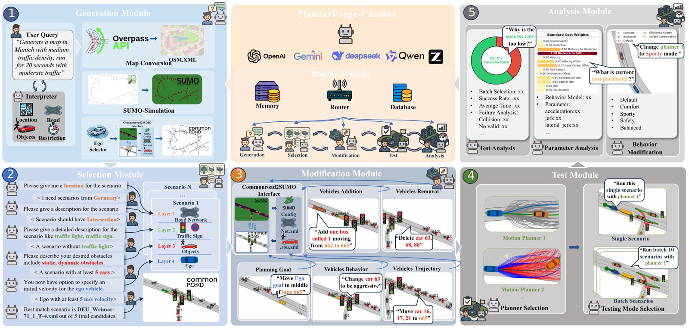

# 2026-09-13 科研日报

## 今日速览：失败反馈怎样真正回到生成与控制

周六没有新的 arXiv 公告，本期不凑“昨日新论文”数量，而从尚未收录的周中积压中选三篇：**PlannerForge** 把场景生成、仿真执行、失败日志和参数调整接成可检查的 Agent 流程；**Ostrich** 回到更底层的硬接触与可微分仿真；**MOONWALK** 则提醒创作 Agent，修改意见必须保留意图、证据和授权链。它们共同指向一个比“自动生成成功”更严格的问题：执行后得到的信号，能否被可靠地解释并变成下一次有效修改？

- **必读 [PlannerForge](#2026-09-13--plannerforge)**：端到端接通自动驾驶场景测试，但当前闭环主要是调规划器代价，不是从失败自动重写场景或策略。
- **图形学／具身基础 [Ostrich](#2026-09-13--ostrich)**：硬接触、大步长、隐式梯度和 GPU 并行同时推进；真实数据验证的是开环轨迹拟合，不是策略真机成功率。
- **选读 [MOONWALK](#2026-09-13--moonwalk)**：把模糊审美意见改造成有依据、可追溯的修改任务；AI 被限制在协调层，最终判断仍由专业人员授权。
- **[圈内新闻](#2026-09-13--community-news)**：Skild／NVIDIA 公开单视频上下文学习的机器人落地链；Cognition 展示 Agent 用模拟器录像“自证”软件；GitHub 让 Copilot 复审后自动关闭已解决评论。三项均缺少足够的 9 月 12 日独立使用反馈，本文明确按厂商材料解读。

## 失败驱动闭环：日志可以指导调参，但不要跳过验证器

### PlannerForge · EMNLP 2026 Main · 2026-09-08

**必读。** 与 MiracleAug 类路线最可复用的不是自动驾驶场景本身，而是“生成—执行—分解失败—调整参数”的接口设计；它也清楚暴露了语义正确、文件可加载、仿真可运行与任务成功之间的层层漏损。

论文信息、摘要与入口

- **Title：** PlannerForge: LLM Agents for Scenario-Based Testing of Motion Planners in Autonomous Driving
- **作者：** Yuan Gao, Sebastian Müller, Mattia Piccinini, Marc Kaufeld, Yuchen Zhang, Finn Rasmus Schäfer, Qunying Song, Johannes Betz。
- **单位：** Technical University of Munich / Munich Institute of Robotics and Machine Intelligence；University College London。
- **发表时间：** arXiv 首次提交 2026-09-08；本期作为周末积压首次收录。
- **投稿信息：** EMNLP 2026 Main Conference 已接收。
- **入口：** [arXiv](https://arxiv.org/abs/2609.08965) · [PDF](https://arxiv.org/pdf/2609.08965) · [全文 HTML](https://arxiv.org/html/2609.08965v1)。
- **摘要中译（压缩）：** 用统一 LLM-Agent 框架覆盖交通场景生成、检索、修改、规划器执行、结果分析、参数增强与跨规划器比较；以十种现成模型和五种提示设置评估各模块及完整链路。
- **相关链接：** [代码与数据](https://github.com/TUM-AVS/PlannerForge)。

*论文图 2，来源：作者。LLM 输出被约束为 JSON、XML 或 YAML，地图查询、SUMO／CommonRoad 转换和规划器执行仍由确定性工具承担。*

**输入、可编辑输出与额外先验。** 用户以自然语言描述地点、道路、车辆、轨迹或规划器风格；Agent 调用 OpenStreetMap／Overpass、SUMO、CommonRoad 数据库和 Frenetix／MP-RBFN。可编辑产物是结构化场景 XML、规划问题及代价权重 YAML，而不是从真实视频恢复的三维资产。Router、Generation、Selection、Modification、Test、Analysis 六个模块共享历史；LLM 负责解释和结构化修改，几何／仿真合法性由工具回读检查。[方法图与模块说明](https://arxiv.org/html/2609.08965v1#S4)

**失败如何回到参数。** 分析模块读取批量成功率、碰撞数、轨迹长度、逐场景日志和当前权重，输出碰撞、超时、运动学不可行等失败分解及调参建议，再交给 tuner 生成新 YAML。论文报告在同一批 **400** 个场景上，默认配置成功率 **50.4%**、碰撞率 **19.0%**；调参后分别为 **70.2%** 和 **8.4%**。这证明执行信号能辅助规划器配置，**不等于 Agent 已学会针对失败生成新训练数据或更新策略权重**。[结果分析与调参](https://arxiv.org/html/2609.08965v1#S4.SS7)

**完整链路的真实漏损。** 200 条种子查询经生成、检索、修改、测试与增强后，商业／开源后端累计保留 **83%／78%**；平均每个场景约 **126／99 秒**、**42.5k／32.6k tokens**。选择阶段的最佳全条件满足率只有 **0.880**，轨迹和车辆增删修改还会在仿真 round-trip 丢失 12–17%。因此“每个模块单测接近满分”不能替代整链成功率。[表 1 与局限](https://arxiv.org/html/2609.08965v1#S5)

**证据边界。** 实验基于 CommonRoad 与 Frenetix；其他交通参与者按记录／SUMO 轨迹开环运动，不会对自车反应。论文明确把闭环 falsification 和 CARLA 扩展留给未来；Analysis 的自然语言诊断也未对照原因真值。没有真实车辆实验或策略训练结果。

**对 MiracleAug 的启发。** 可直接复用的是分层验收：输出先过 schema，再过加载、参与体存在、仿真运行、碰撞与任务成功；每层记录失败原因和成本。缺失的一步同样明确：要把诊断变成**针对性场景／示教增广**，还需证明新样本动作有效、失败覆盖增加，并在固定预算下改善未见条件的策略表现。PlannerForge 展示的是相邻闭环，不是同一问题已经解决。

## 接触基础：大步长和可靠梯度可以同时要吗

### Ostrich · RA-L 投稿 · 2026-09-08

**图形学／具身基础。** 若场景或动作增强要依赖接触优化，梯度是否来自足够准确的接触模型，比渲染画面是否逼真更接近数据有效性的底层条件。

论文信息、摘要与入口

- **Title：** Ostrich: Taking Large Strides Through Stiff Contact in Differentiable Dynamics
- **作者：** Aleš Kučera, Karel Zimmermann。
- **单位：** Czech Technical University in Prague, Department of Cybernetics。
- **发表时间：** arXiv 首次提交 2026-09-08；本期作为周末积压首次收录。
- **投稿信息：** 投稿 IEEE Robotics and Automation Letters，尚未标明接收。
- **入口：** [arXiv](https://arxiv.org/abs/2609.08800) · [PDF](https://arxiv.org/pdf/2609.08800) · [全文 HTML](https://arxiv.org/html/2609.08800v1)。
- **摘要中译（压缩）：** 以非光滑 Newton 法求解硬接触与摩擦，再对收敛残差做隐式微分；复用前向 Schur 算子计算伴随梯度，从而在大时间步上兼顾接触准确性、梯度可靠性与 GPU 吞吐。
- **相关链接：** [代码](https://github.com/aleskucera/ostrich)。

**方法。** Ostrich 使用 backward Euler、非线性互补接触与 Coulomb 摩擦；前向求解完成后，用隐函数定理对收敛残差求导，而不是把每次内层迭代全部录进自动微分 tape。单时间步的反向内存为 \(O(1)\)，总轨迹仍需保存 \(O(T)\) 状态；论文也明确可用 checkpointing 进一步权衡。接触几何在每个时间步内部固定，因此“任意网格”不等于连续碰撞拓扑变化也被光滑求导。[方法与限制](https://arxiv.org/html/2609.08800v1#S3)

**真实输入与验证。** 作者用 **14** 次 106 kg 三轮机器人跨越 14.4 cm 木托盘的记录，四次用于参数辨识，十次留出评测；轮速命令以 100 Hz 记录并开环回放。Ostrich 在 **0.1 s** 时间步维持误差底部，MuJoCo／MJX 对应边界约 **2 ms**，显式 penalty 基线约 **0.5 ms**。这是轨迹重放的一致性检查，不是让优化策略在真实机器人上完成新任务。[实验设置](https://arxiv.org/html/2609.08800v1#S4.SS1)

**作者报告的算力结果。** 单张 RTX 3090 24 GB 上，Ostrich 可微分 **8,192** 个并行世界；warm iteration 相对 MJX 快 **211×**、相对 Newton Semi-Implicit 快 **4.7×**，峰值优化吞吐为 checkpointed MJX 的 **29×**。这些倍率依赖该轮式机器人、硬接触场景和实现；代码公开使复核成为可能，但本日报未独立跑基准。

**值得关注。** 与 Real2Sim2Real 的重合位于物理验证／轨迹修正层，而非视觉重建：它不从视频生成资产、不自动估计物理参数，也不产生同步图像—动作数据。若把它接到增强链，最有辨识力的实验是比较“只做视觉变换”“用软接触修轨迹”“用硬接触修轨迹”的标签有效率和真实 rollout，而不是只报告优化速度。

## 创作 Agent：把“看起来不对”变成有依据的修改任务

### MOONWALK · arXiv · 2026-09-09

**选读。** 它不生成三维场景，却给 Agent 审查循环补了一个容易被忽略的治理接口：视觉 Critic 的意见必须能追溯到明确意图和证据，且由有责任的人授权后才能执行。

论文信息、摘要与入口

- **Title：** MOONWALK: Mediating Operations with Intent-Evidence-Action Alignment Across Junior-Supervisor Review Workflows in Animation/VFX Pre-Production
- **作者：** Shih-Yu Lai, Wen-Fan Wang, Sai Ling, Shaune Jan, Bing-Yu Chen, Xiang Anthony Chen。
- **单位：** National Taiwan University；MoonShine Animation Studio；Cornell Tech；UCLA HCI Research。
- **发表时间：** arXiv 首次提交 2026-09-09；本期作为周末积压首次收录。
- **投稿信息：** 预印本，未标明已接收 venue。
- **入口：** [arXiv](https://arxiv.org/abs/2609.10385) · [PDF](https://arxiv.org/pdf/2609.10385) · [全文 HTML](https://arxiv.org/html/2609.10385v1)。
- **摘要中译（压缩）：** 维护共享意图记录，把审查判断绑定到可检查的参考图／规范／历史决定，再把经主管授权的结论转成带目标、优先级和完成条件的修改任务；AI 负责整理与补问，不替代审美权威。
- **相关链接：** [代码](https://github.com/Akinesia112/Moonwalk/tree/english-version)。

**系统与人力。** MOONWALK 保存项目意图、参考区域、规范条款、版本比较、junior 解读和 supervisor 决定。AI 可提示证据缺失、对照已声明条件、整理 checklist；不得自行加入新的审美标准，最终优先级仍需主管授权。这不是“无人介入”的 Agent 生产线，而是有意把专业责任留在人类环节。[系统边界](https://arxiv.org/html/2609.10385v1#S4)

**实验。** 形成性访谈含 12 位从业者；总结性研究为 19 位专业动画／VFX 人员的被试内比较，MOONWALK 与使用相同 AI 的 Chat-Only 界面对照。作者报告 74% 的参与者认为其 checklist 更可执行，63% 认为减少澄清，79% 认为更易发现盲点和形成证据链接；控制感是主要例外。样本小、评价以一次工作室研究和主观量表为主，尚无长期产能、返工率或最终画质的客观证据。[研究设计与结果](https://arxiv.org/html/2609.10385v1#S5)

**可复用与缺口。** 对 aDSL／Agent＋Blender 式双 Critic，最值得借鉴的是让每个修改都记录“当前目标—支持证据—可检查完成条件”，并允许 Critic 在依据不足时 abstain。MOONWALK 没有物理仿真、动作标签或策略评测，不能把创作流程中的意见可追溯性直接换算成机器人数据正确率。

## 圈内新闻与社区反应

### Skild S1／NVIDIA：单视频是任务提示，不是自动 Real2Sim 重建

**事实与厂商主张。** NVIDIA 在 **9 月 10 日**补充披露 Skild S1 的开发链：模型接收操作员拍摄的一段任务视频，在不更新权重、不做任务特定后训练的条件下，把意图、物体和步骤映射为当前机器人的动作；训练来源包括仿真、人类视频、遥操作和获准使用的部署数据，Isaac Sim／Lab、Cosmos、Newton 与 TensorRT 覆盖数据、训练、验证和部署。厂商称陌生多步任务逐步成功率约 **66%**，对照系统为 9%；一个种植任务从录像到真机执行用 11 分钟，并把一段视频的效用估算为约 380 条 hands-on 示例。**基准构造、对照身份、任务总成功率和失败分布未在新闻稿中完整给出，这些数字只能写成 Skild／NVIDIA 自报。**[NVIDIA 原文](https://blogs.nvidia.com/blog/skild-ai-s1-physical-ai/) · [Skild S1 原始发布，8 月 18 日](https://www.skild.ai/blogs/s1)

**与 MiracleAug 的关系。** 重合的是用视频扩大机器人任务适配；不同的是 S1 把视频当上下文提示，依赖已训练的大模型直接输出动作，公开材料没有展示可编辑场景、同步渲染—action episode 或失败驱动的数据再生成。因此不能把它写成 MiracleAug 同型管线，也不能从“无需任务后训练”推断整个模型开发不需要大规模数据与仿真。

**社区反应。** 截至 **9 月 12 日**，未找到可核验、包含具体输入与复现实验的独立使用报告；新闻稿页面本身显示 0 条评论。社交转发和厂商合作方表态不足以证明能力或形成共识。

### Cognition／Devin：Agent 开始交付“运行证据”，但案例不是基准

**事实与厂商主张。** OpenAI 于 **9 月 11 日**发布 Cognition 客户案例：Devin 使用 GPT-6 Astra 在 iPhone 模拟器中测试游戏，返回运行录像、通过项和未覆盖项；另一个工作流从客户 bug 截图出发，修复后返回结果截图。Cognition 的目标是让工程师少做人工代码审查，但原文没有给成功率、任务集合、成本、对照模型或漏测率。[OpenAI／Cognition 原文](https://openai.com/index/cognition-devin-testing-with-astra/)

**编辑判断。** “执行—记录—声明未覆盖范围”比只提交补丁更接近可审计 Agent，也与场景／策略 Agent 应提交 rollout 和失败边界的方向一致。但模拟器录像只证明特定可见行为，不能自动证明代码无回归；它更像产品能力案例，不是独立评测。

**社区反应。** 未确认 9 月 12 日有带可复现任务的原始用户反馈；因此不引用泛泛赞扬，也不把厂商客户引语当社区共识。

### GitHub Copilot Code Review：自动关闭评论，关键仍是复审判断是否可靠

**事实与厂商主张。** GitHub 于 **9 月 11 日**宣布：Copilot 复审时会自动解决其判断已被后续提交处理的评论；应用 autofix 时生成针对改动的 commit message；reviewer 可调用更多 shell 工具，Lite 档采用 agent ensemble。GitHub 报告内部实验中，高／中／低严重度意见被处理的比例分别增加 **47%／31%／11%**，同时成本下降 8%。这是厂商实验，未公开完整样本与误关闭率。[GitHub Changelog](https://github.blog/changelog/2026-09-11-auto-resolution-and-analysis-updates-in-copilot-code-review/)

**社区反应与判断。** 9 月 12 日未找到针对本次更新、能核对具体 PR 的独立原始反馈。自动关闭 thread 只是工作流状态变化；若模型把未修复问题误判为已解决，界面反而会隐藏待办。与具身 Agent 的对应启示是：Critic 可以减少重复提醒，但“resolved”最好绑定可运行测试或明确证据，而不是只靠同一模型复审。

## 主线追踪：周末没有更新，就不制造更新

本期再次核对 aDSL、Thinking with Visual Primitives、SimFoundry、World Labs Atlas／Real-to-Sim-to-Real 及 Agent＋Blender／Isaac Sim 线索。**未确认这些具名项目在 9 月 12 日发布新的代码、产品能力或真机证据，因此不重复既有介绍。** SimFoundry 的完整数据生成／训练链仍未见此前承诺之外的新公开交付；Atlas 的公开页面也未补充可编辑资产结构、动作标签或独立策略结果。[SimFoundry](https://github.com/NVlabs/SimFoundry) · [aDSL](https://github.com/sig-pku/aDSL) · [Atlas](https://www.worldlabs.ai/blog/atlas) · [World Labs R2S2R](https://www.worldlabs.ai/blog/real-to-sim-to-real)

## 覆盖说明

- **日报发布日：2026-09-13（HKT）；主要内容覆盖日：2026-09-12。** arXiv 周六没有新公告；三篇论文都是尚未收录的 9 月 8–9 日积压，已逐篇标明首次提交日，不冒充 9 月 12 日新稿。
- 新闻检查覆盖 **LLM、Agent、计算机图形学、具身智能**，并回看具名 Real2Sim2Real 项目。周六未发现值得单独收录的图形学产品发布；Skild、Cognition 与 GitHub 是 9 月 10–11 日事件，其本期价值是补充输入、执行证据与验证边界，而非伪造跨日“新发布”。
- 社区侧检索了公开原帖和讨论入口；未找到足够可靠、带具体使用条件的 9 月 12 日独立反馈，已在每项明确写出。没有从少数转发推断共识，也没有将厂商引语当独立验证。
- 配图为 PlannerForge 作者公开原图，保留来源与图注；来源表见 [SOURCES](2026-09-13/figs/SOURCES.md)。

**编写：** Neon
