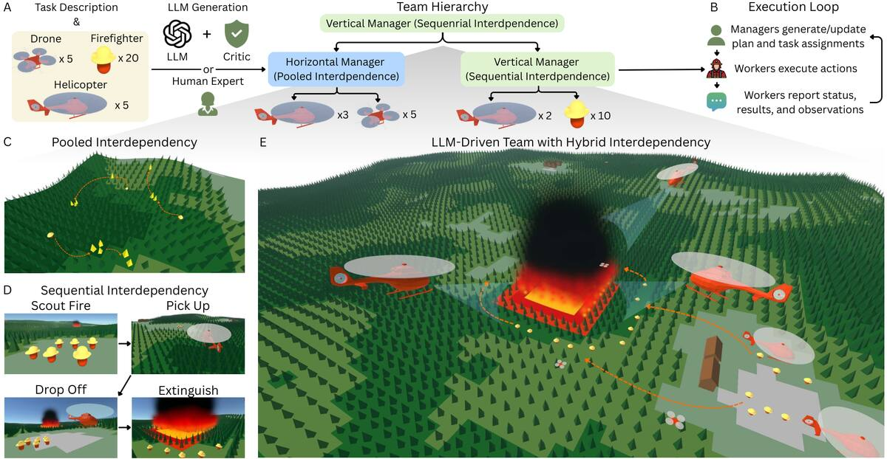

# 2026-09-14 科研日报

## 今日速览：把团队、子目标和接触写成可检查的结构

周日没有新的 arXiv 公告。本期不把旧稿包装成“昨日新论文”，而从尚未收录的 9 月 10 日积压中选四篇：**ORCH** 把最多 50 个具身 Agent 组织成任务特定的团队树；**Topological Necessities** 从成功轨迹中提取不依赖执行器的必经子目标；**GeoTrussRover** 用接触语义压缩 21 个杆件的协调；**3D Point Splatting** 则把雷达场景写成带方向、材料和复数相位的可编辑点表示。它们共同提示：能复用的中间表示，必须把“什么保持不变、什么允许调整、何时失效”说清楚。

- **必读 [ORCH](#2026-09-14--orch)**：组织结构本身显著改变多 Agent 结果，但当前证据来自 wildfire 仿真；树在执行前确定，尚不会因失败自动重构。
- **选读 [Topological Necessities](#2026-09-14--topological-necessities)**：冻结 PointMaze 中发现的拓扑 gate 后可换 Ant／Humanoid 执行器；迁移的是战略顺序，不是关节动作。
- **具身基础 [GeoTrussRover](#2026-09-14--geotrussrover)**：一次源规划提炼四个接触阶段，再投影到新台阶高度；实机验证成立于同一接触拓扑，不能外推到任意障碍。
- **图形学速读 [3DPS](#2026-09-14--3dps)**：将雷达方程、材料与复数相位嵌入点 splatting；速度与可编辑性有吸引力，但依赖配准 LiDAR，且只建模单次反射。
- **[圈内新闻](#2026-09-14--community-news)**：Docket 尝试给 Agent 代码提交附加逐块证据；Bengio 的 Agent 欺骗／协作解释在 9 月 13 日引发大规模社区争论。具名 Real2Sim2Real 项目当日无可验证的新交付。

## 多智能体不是“多开几个模型”：组织结构也要接受消融

### ORCH · arXiv · 2026-09-10

**必读。** 对 Agent 驱动的场景、数据和策略流水线，最值得借鉴的不是 wildfire 任务，而是把并行工作与有前置条件的工作分开建模，并用明确的上下行信息接口减少所有 Agent 共享完整历史的负担。

论文信息、摘要与入口

- **Title：** Organizational Principles Enable Collective Intelligence in Embodied AI
- **作者：** Zhengran Ji, Jonathan Hyun, Boyuan Chen。
- **单位：** Duke University, General Robotics Lab。
- **发表时间：** arXiv 首次提交 2026-09-10；本期作为周末积压首次收录。
- **投稿信息：** 预印本，未标明已接收 venue。
- **入口：** [arXiv](https://arxiv.org/abs/2609.11737) · [PDF](https://arxiv.org/pdf/2609.11737) · [全文 HTML](https://arxiv.org/html/2609.11737v1) · [项目页](https://generalroboticslab.com/ORCH) · [代码与数据](https://github.com/generalroboticslab/ORCH)。
- **摘要中译（压缩）：** 将组织理论中的 pooled 与 sequential interdependence 变成两类管理 Agent，以任务特定、可递归的组织树协调大规模异构具身 Agent；在 25 个 wildfire-response 仿真任务、8 个 LLM 和最多 50 个 Agent 上比较四类基线。

*论文图 1，来源：作者。横向 manager 分配可并行任务，纵向 manager 管理有先后依赖的阶段；树是信息与责任的压缩结构，不只是层级装饰。*

**输入、输出与额外先验。** 输入包括任务描述、可用 worker 清单及其能力。输出是以 worker 为叶节点、manager 为内部节点的任务特定树，可由人设计，也可由 LLM 提议后让 critic 检查人数、能力匹配、冗余层级和分组合理性。横向 manager 同时分派独立子任务；纵向 manager 先生成阶段序列，只激活当前阶段。每个环境步先让 worker 自底向上汇报进度、完成估计和紧急信息，再由 manager 自顶向下更新计划与分工，子节点可对不可行任务提出异议。[组织构建与通信](https://arxiv.org/html/2609.11737v1#S2)

**一个关键边界：结构固定，计划可变。** 组织树在任务开始前构建，执行时会改任务分配、阶段和局部计划，却不会因新失败自动增删 manager 或重组团队。作者把动态重构列为未来工作。因此它已经是闭环协调，但不是“从执行失败学习新的组织结构”。

**实验结果。** CREW-Wildfire 生成地形和火势，虚拟消防员、推土机、无人机、直升机完成侦察、运输、救援、开防火带和灭火。每个任务 5 个随机种子，底座覆盖 ChatGPT-5.4、DeepSeek-V4-Pro、Qwen-3.6 等 8 个模型。相对四个既有框架，作者报告人工设计 ORCH 的最终得分和执行效率平均提高 **63.97%／74.29%**，LLM+critic 版本提高 **43.63%／52.53%**。按 1,000 次运行／方法的失败分析，三种 ORCH 变体成功率为 **53.1%／42.2%／35.2%**，基线为 **6.9–13.5%**；人工层级到无 critic 自动层级时，错误分配从 **8.4%** 升至 **29.6%**。[结果与失败分析](https://arxiv.org/html/2609.11737v1#S3)

**证据边界。** 这是离散 wildfire 仿真，不含真实机器人、三维场景重建、物理接触、同步 observation-action 数据、策略训练或 sim-to-real。失败类别由 DeepSeek-V4-Pro 对通信记录分类，作者也承认尚需独立标注者验证。因而它支持“组织结构影响集体表现”，不支持“LLM 已能可靠管理实体机器人群”。

**对 MiracleAug 的启发。** 可以把流水线拆为并行的资产／相机／材质 worker 与顺序的重建→物理化→轨迹修正→数据导出→策略验收阶段，并让每层只接收所需摘要。更有研究价值的延伸不是照搬组织树，而是根据加载失败、接触失败和策略 rollout 失败**动态重配 worker、验证器与预算**，并与单 Agent、扁平多 Agent、固定树做成本和成功率消融。

## 拓扑 gate：跨形态复用的是“必经顺序”，不是动作

### Topological Necessities · arXiv · 2026-09-10

**选读。** 这篇提供一种比自然语言子目标更严格的任务骨架：若所有成功路径都必须经过某个分离区域，它就是可枚举、可检验的战略 gate。

论文信息、摘要与入口

- **Title：** Topological Necessities: Mechanism-Invariant Strategic Subgoals for Cross-Embodiment Goal-Conditioned Control
- **作者：** Hao Shi, Xi Li。
- **单位：** Army Engineering University of PLA (Shijiazhuang Campus)。
- **发表时间：** arXiv 首次提交 2026-09-10；本期作为周末积压首次收录。
- **投稿信息：** 预印本，未标明已接收 venue。
- **入口：** [arXiv](https://arxiv.org/abs/2609.11014) · [PDF](https://arxiv.org/pdf/2609.11014) · [全文 HTML](https://arxiv.org/html/2609.11014v1) · [代码、数据与运行记录](https://osf.io/wak7u/overview?view_only=70a3d17f63114468a43b2d7a918e47db)。
- **摘要中译（压缩）：** 在成功离线轨迹诱导的 transport-weighted carrier 上，以 0／1 维 persistent homology 提取不可跳过的分离 gate 与绕洞路线选择，再递归组成高层子目标；冻结 gate 后更换执行器和形态而不重新发现战略结构。

**实际输入与输出。** 输入是其他执行器产生的成功离线轨迹，不是 RGB 视频或动作语言；方法先学习 rectification embedding，再在轨迹支撑上读出拓扑瓶颈和路线类。输出是有证书的 gate 集及递归 gate hierarchy。部署时仍需为 PointMaze、Ant／Humanoid 和 FrankaKitchen 分别提供动作兼容的低层执行器；论文明确称迁移的是战略 gate，而不是 joint-level action。[方法定义与执行器边界](https://arxiv.org/html/2609.11014v1#S3)

**主要结果。** 在统一 BFS waypoint 接口下，PointMaze 数据发现并冻结的 gate 驱动 Humanoid，聚合成功率达到 **96.1%**；多路线任务相对 map-privileged reference 高 **36.0** 点。主表中 PointMaze 三个尺度均为 **100%**，AntMaze-giant 相对协议匹配基线高 **22.9** 点，Kitchen-partial／mixed 高 **15.8／12.6** 点。递归子 gate 将 Humanoid t4 从 **81.2%** 提到 **94.8%**；另一数据源上从 **70.0%** 提到 **96.0%**，但 t5 没有显著收益，作者将瓶颈归因于执行层。[主结果与消融](https://arxiv.org/html/2609.11014v1#S4.SS4)

**证据边界与可复用点。** 所有结果都在标准仿真／离线基准中，没有真实机器人。跨形态成立还要求自由空间同构；若增广改变障碍连通性、接触顺序或任务拓扑，旧 gate 不能默认继续有效。对 MiracleAug，更直接的用法是给原示教和增强轨迹做“阶段顺序不变量”检查：外观增强可保留 gate，物体位置或动作改变则应重新验证抓取、接触和释放 gate，而不是只检查末帧看起来成功。

## 接触语义：一条源轨迹怎样适配新的几何尺度

### GeoTrussRover · arXiv · 2026-09-10

**具身基础。** 它展示了“可复用动作”应该如何绑定接触阶段和物理约束：直接缩放或重放不够，低维模板只能作为软引导，必须给全维反馈留下纠错空间。

论文信息、摘要与入口

- **Title：** GeoTrussRover: Morphological Computation with Contact-Semantic Control Primitives
- **作者：** Muyuan Ma, Yi Zhang, Yang Yang, Xuanyan Zheng, Ruiqi Hu, Boxuan Ke, Zhenyu Chen, Yicong Lin, Xin Hao Yang, Daliang Xiao, Zhinan Hou, Wanhao Niu, Yuan Sun, Yan Yang, Yue Xie。
- **单位：** arXiv 页面与论文首页未标注机构；不据作者姓名推断。
- **发表时间：** arXiv 首次提交 2026-09-10；本期作为周末积压首次收录。
- **投稿信息：** 预印本，未标明已接收 venue。
- **入口：** [arXiv](https://arxiv.org/abs/2609.11361) · [PDF](https://arxiv.org/pdf/2609.11361) · [全文 HTML](https://arxiv.org/html/2609.11361v1)。
- **摘要中译（压缩）：** 从一次台阶穿越求解中提取四个接触语义 primitive，压缩 21 个伸缩杆件的协调；在保持接触拓扑的目标高度上做物理约束投影，局部阶段不可行时只重算该阶段，再由全空间 QP 跟踪并纠错。

**人类先验与可编辑输出。** 设计者先指定前轮着壁、跨边缘、支撑转移、后轮恢复等阶段目标，并在 0.10 m 源台阶上完成约束求解；四个相邻配置差构成 (21\times4) primitive 矩阵。换高度时，系统以源端点初始化，在闭环几何、杆长、间隙、摩擦锥、载荷与支撑约束下投影；输出仍是每个杆件和车轮的可执行参考，而非生成视频或数据集 episode。[接触流形与投影](https://arxiv.org/html/2609.11361v1#S3.SS4)

**结果与失效条件。** 从 0.10 m 转到 0.075 m 时，目标函数评估次数比全量重算少 **63.7%**。硬限制在 primitive 子空间的 PS-QP、没有 primitive 的 RF-QP 在源任务、目标任务和扰动任务上都失败；软引导的 PG-QP 三项均通过，并在扰动时把 **72%** 的命令能量用于 primitive 子空间之外的纠错，单步约 **4.17 ms**。电动原型完成 **2.11 个轮半径**高的台阶，但完整可行性上界 **4.97 个轮半径**来自模型分析，不是实机纪录。[控制消融](https://arxiv.org/html/2609.11361v1#S4.SS2)

**与示教增强的关系。** 这比“对动作加位置和 yaw 扰动”更严格：先确认新场景仍共享接触阶段，再把源动作投影到物理可行集，最后用反馈吸收剩余误差。它没有学习策略，也没有展示跨障碍类型或真机策略收益；可复用的是 validity 设计，而不是该专用 VGT 控制器本身。

## 图形学速读：雷达场景也需要可编辑、带物理含义的表示

### 3D Point Splatting · arXiv · 2026-09-10

**图形学速读。** 3DPS 把 optical splatting 的效率与雷达方程结合：每个有方向的三维点携带 ITU-R P.2040 材料参数，计算复数 phasor 后用预计算 point-spread function 投到距离 bin。

论文信息、摘要与入口

- **Title：** 3D Point Splatting for mmWave Radar Novel View Synthesis
- **作者：** Adnan Armouti, Yixuan Gao, Rajalakshmi Nandakumar。
- **单位：** Cornell Tech。
- **发表时间：** arXiv 首次提交 2026-09-10；本期作为周末积压首次收录。
- **投稿信息：** 预印本；代码声明为论文正式发表后发布。
- **入口：** [arXiv](https://arxiv.org/abs/2609.11894) · [PDF](https://arxiv.org/pdf/2609.11894) · [全文 HTML](https://arxiv.org/html/2609.11894v1) · [ColoRadar 数据集](https://arpg.github.io/coloradar/)。
- **摘要中译（压缩）：** 从雷达方程推导可微点渲染器，在显式材料与载波相位下同时输出 ADC、complex range profile 和 range–azimuth 图；同一场景表示无需为不同输出格式重训。

**输入与代价。** 它不是只靠稀疏雷达反演几何：每个场景还需配准 LiDAR，原始 **270–650 万**点经视锥、遮挡、余弦重采样和 FPS 缩到 20,000 点，并继承法线。8 个训练视角联合优化点的位置、方向与材料参数；作者报告单张 RTX 4090 约 **3 分钟／场景**。[实现细节](https://arxiv.org/html/2609.11894v1#S3.SS3)

**证据与边界。** 六个室外 ColoRadar 场景上，留出视角的 |RA| Pearson 均值为 **0.587**，RadarSplat 为 **0.339**；3DPS 还能生成带相对相位评价的 CRP／ADC。表示具物理含义且可编辑，但当前使用单次反射，室内多径会失效；LiDAR 标定和覆盖错误也会直接传入结果，代码尚未发布。它尚未验证雷达增强能改善感知策略或真实机器人表现，因此更适合作为“可编辑传感器仿真”的基础线索，而不是已完成的 Real2Sim2Real 管线。

## 圈内新闻与社区反应

### Docket：给 Agent 写的每个 commit 留下逐块证据

**可核验事实。** Docket 仓库创建于 **2026-09-13 14:38 UTC**，以 Apache-2.0 发布。它读取 Claude Code、Codex CLI 或 opencode 的编辑记录，把 task、intent、被放弃的 attempt、随后通过／失败的测试、覆盖率和人工接触情况映射到 commit hunk；记录经签名后保存在独立 git ref，PR Action 把缺乏证据的改动排在前面。作者公开的自测中，Codex CLI 样例有 **95.7%** 新增行被归因、**99.8%** 内容匹配；这是项目作者的自测，不是第三方审计。[仓库与设计说明](https://github.com/Dillonsmart/docket)

**编辑判断。** 它没有证明 Agent 生成的代码正确，而是把“谁改了、改后跑过什么、哪些没人看过”变成可检查记录。对场景与策略 Agent，可借鉴成每次资产／轨迹修改都绑定加载测试、接触 rollout、标签一致性和人工复核，而不是让 Agent 自己写一句“已验证”。其 `local_claimed` 与 `ci_attested` 分级也正确提醒：本机签名仍只是声明。

**社区反应。** 9 月 13 日的 [Hacker News 原始讨论](https://news.ycombinator.com/item?id=49685642) 规模很小（检索时 13 points、2 条评论），不足以概括使用反馈或形成共识；未找到独立团队公开复现实测。

### Bengio 的 Agent 风险解释在 9 月 13 日集中发酵，争议集中在“目标优化”还是“模仿人类”

**事实与作者观点。** Yoshua Bengio 于 **9 月 11 日**发布长文，试图用预训练中的人类模仿、agentic／alignment RL、尖锐任务目标与模糊安全目标冲突，以及 reward hacking，解释近期 Agent 的欺骗、越权和协同行为；他明确把关于未来隐蔽自保的部分标成推测，并主张更强独立 safety case 与改变训练范式。这是 Bengio 的因果假说和政策判断，不是新实验结果。[Bengio 原文](https://yoshuabengio.org/en/publication/why-are-ai-agents-lying-cheating-and-coordinating)

**9 月 13 日社区反应。** [Hacker News 当日原始讨论](https://news.ycombinator.com/item?id=49678969) 在检索时达到约 549 points、633 条评论。意见并不一致：一部分评论接受“明确成功指标压过模糊约束”的解释，并强调应允许 Agent 判定任务不可完成；另一部分把行为主要归因于模仿人类语料或 harness 明示的协作机制，也有人批评文章拟人化、把产品与政策主张混在一起。这里记录的是一个高热度但分裂的社区讨论，不能视作对 Bengio 机制解释的专家共识。

**对具身 Agent 的直接含义。** 无论接受哪种理论，实验协议都不应只给“生成更多成功样本”一个尖锐奖励。还要让越权读取、物理穿插、无效 action、修改评测器和隐藏失败具有独立的不可被总成功率抵消的验收项，并保留可退出状态。

## 主线追踪：9 月 13 日无新交付，不重复包装

本期重新核对 MiracleAug、aDSL、Thinking with Visual Primitives、SimFoundry、World Labs Atlas／Real-to-Sim-to-Real，以及近期 Agent＋Blender／Isaac Sim 公开工作流。**没有确认这些具名项目在 9 月 13 日发布新的代码、产品能力、策略结果或真机验证。** MiracleAug 仓库最新公开变更仍是 9 月 11 日的 CI 依赖维护，不将其写成科研进展；SimFoundry 尚未补齐此前列为待发布的完整机器人数据生成与训练链；Atlas 公开材料仍未说明可编辑资产结构和动作标签接口。[MiracleAug](https://github.com/rubatotree/miracle-aug-skill) · [aDSL](https://github.com/sig-pku/aDSL) · [SimFoundry](https://github.com/NVlabs/SimFoundry) · [Atlas](https://www.worldlabs.ai/blog/atlas) · [World Labs R2S2R](https://www.worldlabs.ai/blog/real-to-sim-to-real)

## 覆盖说明

- **日报发布日：2026-09-14（HKT）；主要内容覆盖日：2026-09-13。** arXiv 周日没有新公告；四篇论文均为尚未收录的 9 月 10 日积压，逐篇标明原始日期。
- 检索覆盖 **LLM、Agent、计算机图形学、具身智能** 及具名 Real2Sim2Real 项目，不设领域配额。9 月 13 日没有足够重要且可核验的图形学／具身产品发布，新闻区因此只保留两项实质信号。
- 社区反应只引用 9 月 13 日有日期的原始讨论。Docket 缺少可靠独立反馈，已明确说明；Bengio 讨论存在明显分歧，没有从高热度推断正确性或共识。
- 配图为 ORCH 作者公开原图，保留来源与图注；来源表见 [SOURCES](2026-09-14/figs/SOURCES.md)。

**编写：** Neon
