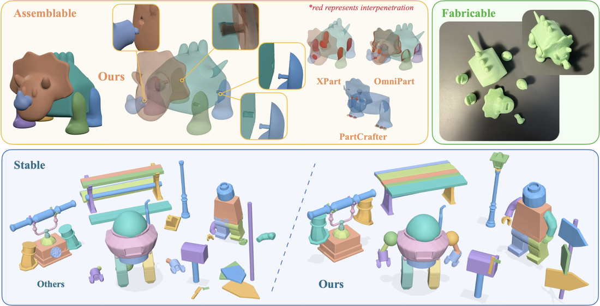
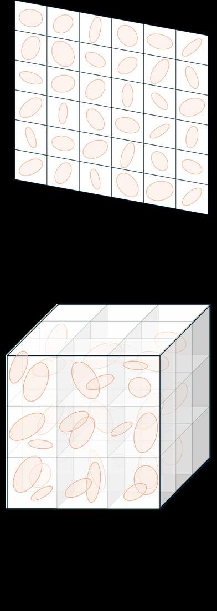
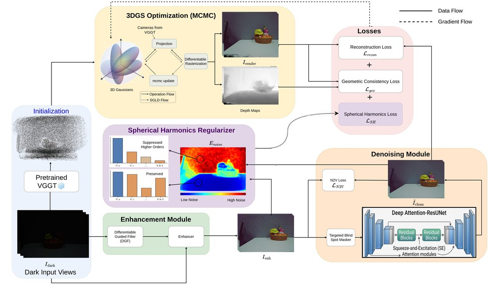
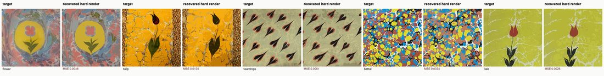
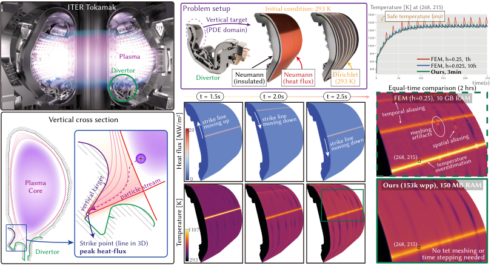

# 2026-09-15 科研日报

## 今日速览：零件要能站得住，前馈要知道把高斯花在哪

周一 arXiv 公告窗口里，cs.GR / 相关关键词下没有比 9 月 11 日更新的独立挂牌；本期不把旧稿伪装成“昨日新论文”，而从尚未收录的 **9 月 11 日积压**（及一篇 9 月 8 日首发、9 月 10 日更新的逆图形学稿）里挑五篇：**SNAP3D** 把单图部件生成推到“可装配、抗重力、可 3D 打印”；**VS-Splat** 用可学习体素选择，让前馈 3DGS 把预算砸在物体上；**NOVA-GS** 在低光下用 VGGT 初值 + 联合增强／去噪／一致性优化，并获 CVPR 2026 3D4S Workshop Best Paper；**TBR** 把沉积—输运耦合笔画做成可回放程序，做逆图形学；**Grid-Free MC** 把时间依赖扩散 PDE 写成无网格 Walk-on-Spheres 族求解器。它们共同提醒：可编辑资产与可批渲染表示，都要把“哪里允许近似、哪里必须物理／几何自洽”写进表示本身。

- **必读 [SNAP3D](#2026-09-15--snap3d)**：部件级 Real2Sim 最常踩的坑是“看起来分开、合起来穿模／倒地”；这篇用接触图 + 参数化连接件 + 仿真反馈把装配稳定性做成一等公民指标。
- **必读 [VS-Splat](#2026-09-15--vs-splat)**：前馈 3DGS 若均匀铺原语，多数预算浪费在空域；体素选择 + 细阶段局部细化，对 sparse-view 物体重建与后续 densify 插件都更友好。
- **选读 [NOVA-GS](#2026-09-15--nova-gs)**：手机／室内采集常遇低光；它用 VGGT 绕开脆弱 SfM，并把增强与几何绑在同一优化里——对“采集不适光照”的逆渲染前置很有对照价值。
- **图形学深读 [TBR](#2026-09-15--tbr)**：逆问题的目标不是一张图，而是可回放的有序笔画程序；输运耦合让“后笔画改写先前标记”成为硬约束。
- **方法兴趣 [Grid-Free MC](#2026-09-15--grid-free-mc)**：时间依赖扩散的无网格蒙特卡洛，与稳态 WoS 同源；对关心 Monte Carlo PDE／路径重用的读者是直接相关积压。
- **速览 [神经化 3DGS 分类](#2026-09-15--neural-gs)**：五轴 taxonomy + 受控实验主张“选择性神经化”，反对把一切共享函数都叫“又变回 NeRF”。
- **[圈内新闻](#2026-09-15--community-news)**：NOVA-GS 的 Workshop Best Paper 是可核验信号；具名 Real2Sim 对标仓当日无新 tip。

## 部件生成：视觉完整 ≠ 物理可装配

### SNAP3D · arXiv · 2026-09-11

**必读。** 对“拆分—绑定—可编辑资产”路线，这篇把评价从几何 fidelity 扩展到重力下站立率与真实打印装配，正好打在手工绑骨不可接受之后的自动化验收缺口。

论文信息、摘要与入口

- **Title：** SNAP3D: Physically Grounded 3D Parts for Assembly from a Single Image
- **作者：** Yu-Rou Tuan, Hao-Tang Tsui, Nicolás Ugrinovic, Kris Kitani, Xiaoxuan Ma。
- **单位：** Carnegie Mellon University。
- **发表时间：** arXiv 首次提交 2026-09-11；本期作为 9 月 11 日积压首次收录。
- **投稿信息：** 预印本，未标明已接收 venue。
- **入口：** [arXiv](https://arxiv.org/abs/2609.13146) · [PDF](https://arxiv.org/pdf/2609.13146) · [全文 HTML](https://arxiv.org/html/2609.13146v1) · [项目页](https://lucytuan.github.io/SNAP3D/) · [代码](https://github.com/LucyTuan/SNAP3D) · [视频](https://youtu.be/22yRDaWabwA)。
- **摘要中译（压缩）：** 面向编辑、关节、仿真与制造的部件感知 3D 生成，常给出视觉完整却无法形成有效物理装配的部件（穿模、缺连接、重力下倒塌）。本文提出物理引导框架：消解部件间穿透、恢复邻接接触图、在接触面插入参数化连接件，并以物理仿真反馈 refinement 连接件位姿与尺寸；同时引入补足几何指标的物理评测协议，并做 3D 打印与手工装配验证。

*论文 Figure 1，来源：作者。对比“仅语义部件”在重力下倒塌，与本文连接件装配／打印结果。*

**方法概要。** 输入单张图像。先用 Hunyuan3D 重建整体 mesh，再用 X-Part 得到语义部件；随后在共同坐标系里做穿透消解（把共享体积分给一侧并做正则化布尔差，同时限制单部件体积损失），建立接触图，并在接触面放置参数化连接件。连接件尺寸／朝向经仿真反馈迭代，使装配在重力下更稳。评测在 HY3D-Bench 风格的 100 组纹理 mesh＋渲染图上进行，部件数 2–18，覆盖家具、载具、角色等。

**值得关注。** 作者报告穿模部件对降至约 **0.5%**，约 **95%** 装配在仿真中保持站立，几何指标仍接近最强基线。这不等于已经解决机器人示教资产的自动蒙皮，但把“装配稳定性”写成可重复指标，对 MiracleAug／Astra 类管线里复杂几何物体增多后的验收很有启发：外观增强通过了，不等于接触拓扑与承重关系还成立。证据边界：上游依赖现成 image-to-3D 与部件分割；物理评测是仿真＋打印样例，不是大规模真机操作数据。

## 前馈 3DGS：先选体素，再堆细节

### VS-Splat · arXiv · 2026-09-11

**必读（效率向）。** 前馈重建若在整幅体素网格上均匀预测高斯，空域浪费会直接拖慢推理；这篇用可学习体素选择把细阶段预算集中到物体，并可作为 densify 插件的更强 backbone。

论文信息、摘要与入口

- **Title：** VS-Splat: Voxel-Selective feed-forward Gaussian Splatting for end-to-end 3D object reconstruction from sparse-views
- **作者：** Yunsu Jeong, Hyuk Heo, Youngsang Kwak, Jaehwa Kwak, Il Yong Chun。
- **单位：** Sungkyunkwan University (SKKU)；AiM Future（部分作者）。
- **发表时间：** arXiv 首次提交 2026-09-11；本期作为积压首次收录。
- **投稿信息：** Comments 写明面向 *Transactions on Multimedia* 体量（主文 10 页）；**未写已接收**，按预印本／在投处理，禁止当作已中。
- **入口：** [arXiv](https://arxiv.org/abs/2609.12343) · [PDF](https://arxiv.org/pdf/2609.12343) · [全文 HTML](https://arxiv.org/html/2609.12343v1)。项目页／代码：检索时未在 abs/HTML 发现稳定公开仓，记为未标明。
- **摘要中译（压缩）：** 现有前馈高斯溅射常在 3D 空间均匀预测原语，大量落在非物体区域，妨碍细部表达。本文提出 VS-Splat：在无 3D 结构监督下，仅用 2D 渲染监督学习体素选择，只在可能属于物体的体素内预测大量原语；稀疏视角实验优于多类 SOTA，并可作 densification 方法的 backbone，另有提高对不准相机姿态鲁棒性的可选扩展。

*论文 Figure 1，来源：作者。左侧均匀铺原语；右侧先选物体体素再细化。*

**方法概要。** 粗阶段从稀疏多视图提特征并聚合成特征体，在全体素上预测粗高斯；体素选择阶段用可学习模块挑出“骨骼”体素；细阶段在所选体素附近生成更多细粒度高斯，并用选择性特征 refinement 融合全局与局部几何。训练同时监督粗／细渲染。作者在 GObjaverse、GSO、CO3D 的 N=4 稀疏设定下对比 LaRa、GS-LRM、GeoLRM、LVSM 等，报告更高保真与最多约 **1.3×** 相对 LaRa 的推理加速；作为 GenDen backbone 时亦优于 LaRa+GenDen。

**值得关注。** 对“千条示教 × 十万帧”的批渲染瓶颈，前馈重建本身不是 path tracer，但**把高斯预算花在物体上**的思想可迁移到：示教资产重建、object-centric 缓存、以及任何“空域高斯过多拖慢后续编辑／导出”的环节。证据边界：主实验是物体级稀疏视角，不是室内机器人场景；代码入口本期未核验到公开仓。

## 低光采集：增强与几何不要拆成两段剧本

### NOVA-GS · arXiv / CVPR 2026 Workshop · 2026-09-11

**选读。** 手机采集几何＋不适光照是逆渲染真实感卡点的前置；这篇把 VGGT 初值、曝光校正、自监督去噪与跨视图一致的 3DGS 优化绑在一起，并有 Workshop Best Paper 的公开标注。

论文信息、摘要与入口

- **Title：** NOVA-GS: Noise-Aware View-Consistent Gaussian Splatting for Low-Light Novel View Synthesis
- **作者：** Shaurya Pavan A, Vemunuri Divya Madhuri, Yash Pradeep Gawande, Kaushik Mitra。
- **单位：** Indian Institute of Technology Madras（印度理工学院马德拉斯分校）。
- **发表时间：** arXiv 首次提交 2026-09-11。
- **投稿信息：** Comments：**Accepted to the 3D4S Workshop at CVPR 2026; selected for the Best Paper Award**（按作者 Comments 记录；Workshop 接收 ≠ 主会 Oral）。
- **入口：** [arXiv](https://arxiv.org/abs/2609.12682) · [PDF](https://arxiv.org/pdf/2609.12682) · [全文 HTML](https://arxiv.org/html/2609.12682v1) · [项目页](https://shaurya2524.github.io/nova-gs/)。
- **摘要中译（压缩）：** 真实低光下噪声、低信噪比与光度一致性崩溃会破坏几何与新视角合成。许多方法依赖正常光照参考做 SfM，或做逐视图增强却引入跨视图不一致。NOVA-GS 用 VGGT 前馈估计从退化输入直接得到位姿与几何，免 SfM；再联合结构感知增强、带 blind-spot masking 的自监督去噪、以及强调跨视图几何一致的高斯优化，并加入噪声引导的球谐正则。无需成对监督或正常光照参考。

*论文 pipeline 图，来源：作者。增强／去噪／3DGS 一致性优化在统一框架内耦合。*

**方法概要。** 输入低光多视图。VGGT 提供初始点云与相机；可微引导滤波得到低频亮度图做曝光校正，再把校正比映射回原图以避免直接拉高噪声；自监督去噪提供伪监督；3DGS-MCMC 骨干上加光度一致、置信度、光照一致与噪声引导 SH 正则。作者在 MVTV／LLRS／LOM／LLNeRF 等低光集上对比 Aleth-NeRF、LLNeRF、Luminance-GS 等，强调在 COLMAP 易失败场景仍可初始化。

**值得关注。** 对 PTIR 类管线，“先增强再重建”与“在重建里联合处理”是两条常打架的路；NOVA-GS 明确站后者，并借用 VGGT 这一与兴趣清单对照系相符的几何先验。证据边界：低光 NVS／几何保真，不是材质分解或路径追踪逆渲染；Best Paper 属 Workshop 评选，阅读时分开看方法与奖项。

## 逆图形学：目标是可回放程序，不是一张静帧

### TBR · arXiv · 2026-09-08（v2 更新 2026-09-10）

**图形学深读。** 数字云石等介质里，后笔画会输运／改写先前沉积；把这种耦合建成可微程序，再从目标图像反解笔画序列，是“逆渲染 → 可编辑程序”的清晰样本。

论文信息、摘要与入口

- **Title：** TBR: Transport-Based Rendering with Deposition Strokes for Inverse Graphics
- **作者：** Tianqi Liu, Yushan Han, Hang Liu。
- **单位：** Independent Researcher（北京）；Huaxin Design Institute（杭州）；中国传媒大学（Communication University of China，北京）。
- **发表时间：** arXiv 首次提交 2026-09-08，**v2 更新 2026-09-10**；本期作为尚未收录积压首次收录（非 9 月 14 日新公告）。
- **投稿信息：** 预印本，未标明已接收 venue。
- **入口：** [arXiv](https://arxiv.org/abs/2609.08722) · [PDF](https://arxiv.org/pdf/2609.08722) · [全文 HTML](https://arxiv.org/html/2609.08722v2)。代码／项目页：本期未在 abs 标明。
- **摘要中译（压缩）：** 提出输运耦合笔画：每笔沉积自身面积的颜料，并以保面积方式推动所有更早标记，使后笔变形先笔。在此设计下求解逆问题：给定目标图像，优化有序笔画程序使其回放逼近目标，以数字云石为动机介质。笔画为连接圆滴与绘制沉积的 capsule；其输运可精确表达。

*论文 Figure 0／恢复示意，来源：作者。*

**方法概要。** 前向是 deposition＋transport 的有序程序；逆问题在参数化 capsule 笔画上优化，覆盖用退火温度软化以便反传，数据项可用像素 MSE 或深度特征距离。实验以千级笔画程序拟合参考图，并与 inert-mark 等内部消融对比；重复母题与大轮廓更易保留，细密 all-over 图案更难。

**值得关注。** 它提醒逆问题的输出可以是**程序／编辑历史**，而不只是 BRDF 贴图。对“可编辑动态资产”读者：若增强管线最终要给人／Agent 再编辑，保留可回放操作序列可能比只存最终 mesh／高斯更有价值。证据边界：动机介质是 2D 云石风格绘制，不是 3D 场景材质分解；勿直接外推到路径追踪 GI 逆渲染。

## Monte Carlo PDE：把时间依赖扩散也做成无网格行走

### Grid-Free MC · arXiv · 2026-09-11

**方法兴趣。** 与稳态 Walk-on-Spheres 同族，把时间依赖扩散 IBVP 做成 tabulation-free 的退出时间／热核采样，并接到 Zombie 求解器；对 Monte Carlo PDE／路径重用读者是对口积压。

论文信息、摘要与入口

- **Title：** Grid-Free Monte Carlo for Time-Dependent Diffusion
- **作者：** Zihong Zhou, Rohan Sawhney, Eugene d’Eon, Wojciech Jarosz。
- **单位：** Dartmouth College；NVIDIA。
- **发表时间：** arXiv 首次提交 2026-09-11；本期作为积压首次收录。
- **投稿信息：** 预印本，未标明已接收 venue。
- **入口：** [arXiv](https://arxiv.org/abs/2609.12306) · [PDF](https://arxiv.org/pdf/2609.12306) · [全文 HTML](https://arxiv.org/html/2609.12306v1) · [相关资源页](https://rohan-sawhney.github.io/mcgp-resources/)。
- **摘要中译（压缩）：** 许多科学应用需要扩散系统随时间演化，而不只是稳态。本文发展面向时间依赖扩散的无网格蒙特卡洛：在浮动随机游走基础上构造时间依赖 WoS／相关估计器，并给出无需查表的退出时间与时间条件热核采样；实现扩展自 Zombie，并在复杂几何（含聚变装置部件热传导示例）上与 FEM 等对照。

*论文 teaser，来源：作者。复杂几何瞬态问题与 FEM 时间／精度对照。*

**方法概要。** 从纯 Dirichlet、一般初值的时间依赖 WoS 起步，再处理更完整的初边值问题；关键工程点是高效、无表的退出时间与热核采样，以及何时连接初值项以换方差。实现基于 Zombie（Sawhney & Miller, 2023）的 CPU 多线程扩展；长时步相对稳态 WoS 有适度开销，短时因提前耗尽时间甚至更快。

**值得关注。** 这不是 3DGS 论文，但与组内 Monte Carlo PDE／WoS 路径重用传统同谱；若把“批渲染缓存／探针”类比成可复用的随机行走信息，这篇提供的是**时间维**上的可组合估计器设计。证据边界：扩散 PDE，不是光传输渲染方程；应用示例含工程热分析。

## 3DGS 是否“又变回 NeRF”：先分清神经化了什么

### Neuralized 3DGS Taxonomy · arXiv · 2026-09-11

**速览。** 一篇把“神经化”拆成属性解码／空间共享／视图条件／拓扑生成／摊销推理五轴的综述＋受控实验；结论偏向选择性共享，而不是越神经越好。

论文信息、摘要与入口

- **Title：** Is Gaussian Splatting Becoming Neural Again? A Taxonomy and Controlled Study of Learned Parameterization
- **作者：** YuanHang Wang, Xin Cao, Yi Zhang。
- **单位：** University of Technology Sydney。
- **发表时间：** arXiv 首次提交 2026-09-11。
- **投稿信息：** 预印本，未标明已接收 venue。
- **入口：** [arXiv](https://arxiv.org/abs/2609.12395) · [PDF](https://arxiv.org/pdf/2609.12395) · [全文 HTML](https://arxiv.org/html/2609.12395v1)。
- **摘要中译（压缩）：** 3DGS 以显式原语＋高效光栅化见长，但近期系统越来越多用神经网络生成或共享高斯参数。本文沿五轴刻画该趋势，分析 19 个代表方法，并在统一 mip-NeRF 360 设定下隔离三种神经参数化：共享外观与不透明度提升重建，而把几何结构也交给解码并无额外收益——支持选择性神经化。

**方法概要与判断。** 文献对比之外，作者在同一 rasterizer／初始化／densify／损失下构造 E0–E3：仅视图条件外观、再加空间共享特征与神经不透明度、再解码协方差与局部结构。受控结果显示 E2 相对基线约 **+0.55 dB** 量级收益，E3 反而略降——“最神经”不是最优。对读者：讨论 AnySplat／F-RNG／变形场／外观 MLP 时，先问共享的是哪类属性，再谈算力与可编辑性，避免二元标签。

## 圈内新闻与社区反应

### NOVA-GS 获 CVPR 2026 3D4S Workshop Best Paper（作者 Comments 可核验）

**事实。** arXiv:2609.12682 Comments 写明该文被 **CVPR 2026 3D4S Workshop** 接收，并 **selected for the Best Paper Award**。这是论文页面上的作者声明，可作为录用／评奖信号；完整 Workshop 程序册若日后公开，应以官方日程为准复核。

**社区反应。** 覆盖窗口内未检索到独立第三方长评或大规模论坛复现帖；暂记为“奖项信号已公开、使用反馈仍薄”。

**为何值得关注。** 低光＋前馈几何初值（VGGT）进入 Workshop 最佳论文，说明“不适光照下的稳健重建”仍是图形／视觉交叉的高关注切口，与手机采集 Real2Sim 前置条件同向。

### 覆盖日具名 Real2Sim 对标：无新 tip，不重复包装

按公开兴趣笔记约定，写稿时核对 [`hku-sail/Real2Sim_GPT6_ASTRA`](https://github.com/hku-sail/Real2Sim_GPT6_ASTRA)：当前 tip 仍为 **`a1624d6`**（2026-09-10 *Generalize ASTRA video reconstruction workflow*），相对录入基线**无新实质 commit**，故本期不展开能力对照，也不把无更新写成进展。MiracleAug 等具名项目在覆盖日亦未核验到必须重提的新交付。

### 图形学／具身产品与社区热帖

对 LLM、Agent、计算机图形学、具身智能四条线做了检索；**2026-09-14 当日**未发现足够重要且可独立核验的新产品发布或高信号社区原始讨论，值得写入正文。早于覆盖窗口的媒体稿（如 9 月初量子位具身 Demo 报道）不回溯充作昨日新闻。若后续出现带日期的独立复现或官方程序册，再按“为何重提”规则补记。

## 覆盖说明

- **日报发布日：2026-09-15（HKT）；主要内容覆盖日：2026-09-14。** 检索时 arXiv 相关类别最新挂牌停在 **2026-09-11**；本期论文均为尚未收录的 9 月 11 日积压，另含 TBR（首发 9 月 8 日、v2 于 9 月 10 日更新），逐篇标明原始日期，不表述为 9 月 14 日新公告。
- 策展加权：部件物理装配（SNAP3D）、前馈高斯预算（VS-Splat）、低光采集稳健性（NOVA-GS）、逆问题程序表示（TBR）、Monte Carlo PDE（Grid-Free MC），并以 taxonomy 文作表示选择对照。
- 圈内新闻检查了 LLM／Agent／图形学／具身及具名 Real2Sim 对标；覆盖日高信号条目有限，已如实写明。
- 配图取自各篇 arXiv HTML 公开插图，来源表见 [SOURCES](2026-09-15/figs/SOURCES.md)。

**编写：** Cream

**故障说明：** 本日由 Cream 于 06:34–06:50 HKT 故障转移接管发布。先前顺位未在窗口内成功出稿：Cocoa（05:30–06:00）曾 claim 但租约于 06:00 过期且无 `digests/2026-09-15.md`／无当日 `last_success`；Neon（06:00–06:30）窗口内无有效 claim、无发布。依据 `meta/failover.json` 当日 `claim`／`failover` 事件与仓库缺稿状态。
