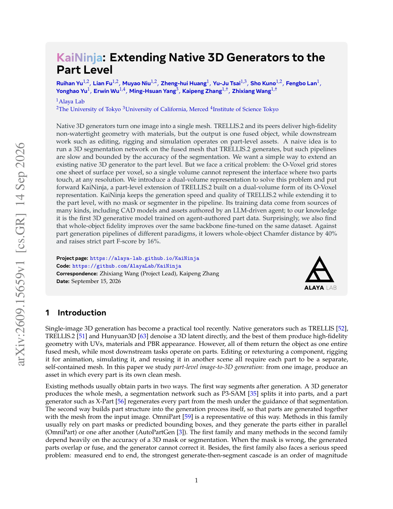
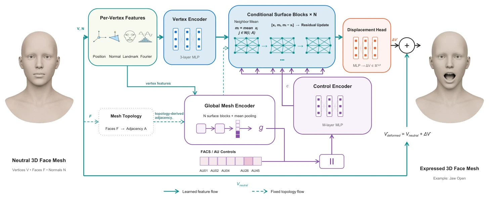
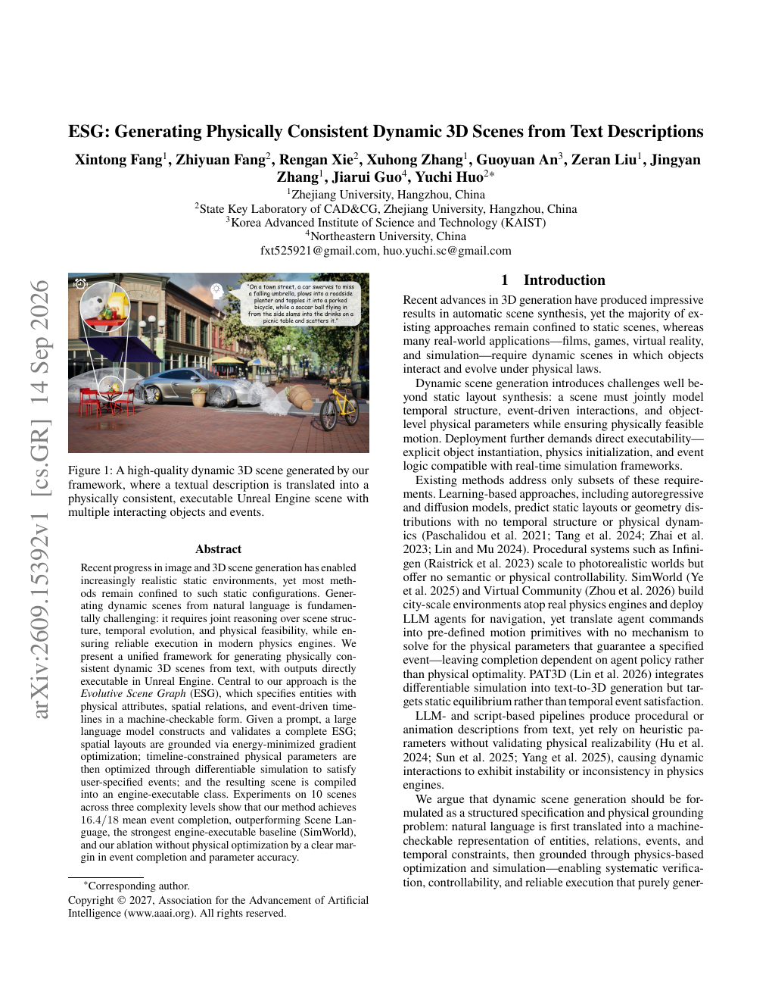
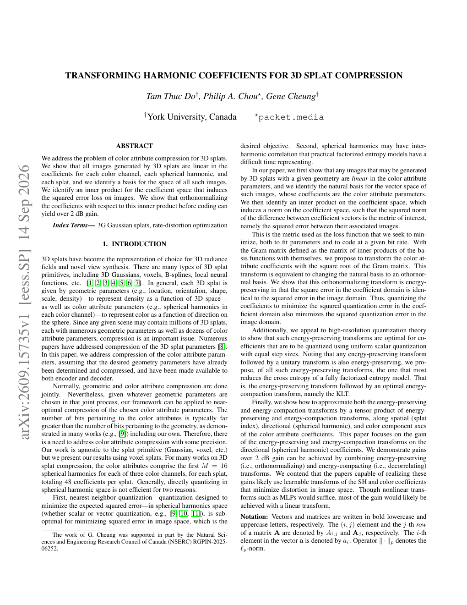
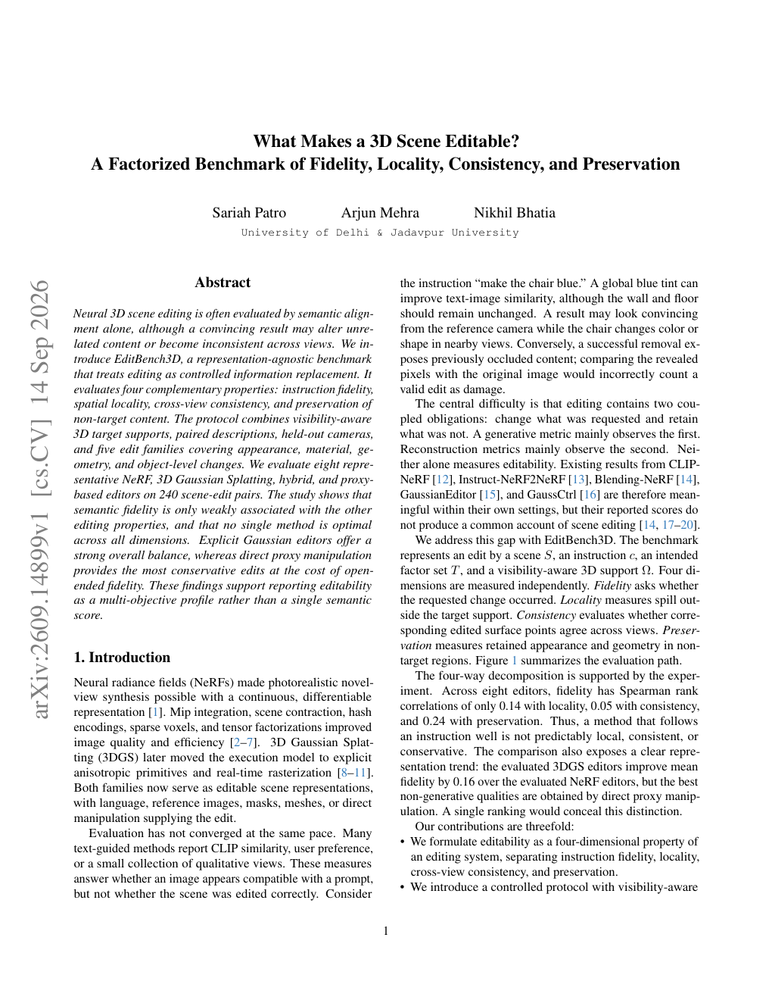

# 2026-09-16 科研日报

## 今日速览：部件先在生成里长出来，可编辑性再拆成四个可测面

覆盖日（9 月 15 日）前后，arXiv 上出现一批直接打在「拆分 / 绑定 / 可编辑」与「高斯表示效率」上的新稿。**KaiNinja** 把 TRELLIS.2 式原生 3D 生成推到部件级，用双体积绕开「单个体素只能存一张面」的硬伤，且流水线里不需要 mask / 分割器；**TopoRig** 在异拓扑脸上直接预测 FACS 位移，把「模板绑死」换成多源监督；**ESG** 用可机检的演化场景图 + 可微仿真，把文本动态场景落到可执行的 Unreal 场景；**球谐系数正交化**给出 splat 颜色属性压缩的几何视角（报告超过 2 dB）；**EditBench3D** 则把「看起来改对了」拆成保真、局部性、跨视角一致与非目标保持四个正交面。它们合在一起提醒：资产能不能下游用，往往不取决于再训一个更大的生成器，而取决于部件边界、绑定位移与编辑验收是否写进表示与评测。

- **必读 [KaiNinja](#2026-09-16--kaininja)**：部件级 Real2Sim / 可编辑资产最怕「生成后再切」又慢又错；这篇把部件写进原生生成，并开源项目与代码。
- **必读 [TopoRig](#2026-09-16--toporig)**：自动绑骨／表情控制若依赖规范拓扑，示教资产一换网格就塌；拓扑无关的 FACS 位移预测是「绑定」卡点的正面样本。
- **选读 [ESG](#2026-09-16--esg)**：文本 → 物理一致动态场景，并强调引擎可执行；对「仿真里事件真的发生」比「看起来像动了」更严。
- **效率向 [球谐压缩](#2026-09-16--sh-compress)**：批渲染与资产分发都会撞上 splat 属性体积；先正交化再编码，把图像域平方误差对齐到系数域。
- **评测向 [EditBench3D](#2026-09-16--editbench3d)**：可编辑不等于 CLIP 分高；四维剖面更适合对照 GaussianEditor 类工具。
- **旁支 [Opacity 扩展](#2026-09-16--opacity)**：把 alpha 系数域扩到 >1 做差分放大，偏合成／可读性，与主线弱相关但有开源实现。
- **[圈内新闻](#2026-09-16--community-news)**：GS-Playground（RSS 2026 / 批 3DGS 仿真）仍是批渲染与 Real2Sim 基础设施对照；Astra 对标仓自上次 tip 无新提交。

## 部件生成：不要生成后再切，要在体积里长出接口

### KaiNinja · arXiv · 2026-09-14

**必读。** 对拆分—绑定路线，这篇直接回答「原生 image-to-3D 为何总交出一整块 fused mesh」：O-Voxel 单体积在接触面处物理上装不下两张近平行表面；双体积 + 部件级扩展让每个部件成为可单独移动／重贴图／绑骨的子网格，且无 mask、无分割器。

论文信息、摘要与入口

- **Title：** Kaininja: Extending Native 3D Generators to the Part Level（文内写作 KaiNinja）
- **作者：** Ruihan Yu, Lian Fu, Muyao Niu, Zheng-hui Huang, Yu-Ju Tsai, Sho Kuno, Fengbo Lan, Yonghao Yu, Erwin Wu, Ming-Hsuan Yang, Kaipeng Zhang, Zhixiang Wang。
- **单位：** Alaya Lab；The University of Tokyo；University of California, Merced；Institute of Science Tokyo。
- **发表时间：** arXiv 首次提交 2026-09-14（文内日期栏写 September 15, 2026）。
- **投稿信息：** 预印本，未标明已接收 venue。
- **入口：** [arXiv](https://arxiv.org/abs/2609.15659) · [PDF](https://arxiv.org/pdf/2609.15659) · [项目页](https://alaya-lab.github.io/KaiNinja) · [代码](https://github.com/AlayaLab/KaiNinja)。
- **摘要中译（压缩）：** 原生 3D 生成器常把单图变成带材质的高保真整体网格，但下游编辑、绑骨与仿真需要部件级资产。生成后再跑 3D 分割既慢又受分割精度限制。本文指出 TRELLIS.2 的 O-Voxel 每个体素只存一张表面，无法表示两部件接触界面，因而提出双体积表示，并在其上构建 KaiNinja：在保持 TRELLIS.2 速度与质量的同时扩展到部件级，流水线不含 mask／分割器；训练数据含 CAD 与 LLM agent 编著的部件资产。相对多种部件生成范式，整体 Chamfer 距离降约 40%，严格部件 F-score 升约 16%；同骨干同数据微调时整体保真亦有提升。

*论文首页图，来源：作者 PDF。单图输入直接输出可分离子网格，无 2D mask／部件分割器。*

**方法概要。** 以 TRELLIS.2 的 O-Voxel／对偶等高为骨干。关键观察：单个体积在任意分辨率下都难同时表达两部件接触处的两张表面。KaiNinja 引入双体积形式，使接触界面可被表示，并在生成过程中直接产出部件结构，而不是「整模 → P3-SAM／X-Part」级联。训练混合多种来源的部件数据（含 agent 编著），推理时不依赖部件包围盒或固定部件数上限的多体积并联。材料可视化仍可挂接 TRELLIS.2 外观分支。

**值得关注。** 这与 SNAP3D「生成后再做物理装配」形成互补：KaiNinja 先把部件边界写进生成表示，SNAP3D 更强调接触／连接件与重力站立。对 MiracleAug／示教资产管线，复杂几何变多时「大模型反复修部件」的成本，可用「原生部件生成 + 下游物理验收」对照阅读。证据边界：作者指标来自相对其他部件生成范式的几何／部件分数；文中未展开大规模真机操作闭环。

## 绑定：表情控制不要绑死在一种拓扑上

### TopoRig · arXiv · 2026-09-14

**必读（绑定向）。** 自动面部绑骨若只能在规范模板上训、再变形迁移到任意网格，伪影与对应误差会直接毁掉可编辑资产；TopoRig 在输入顶点上直接预测 FACS 条件位移，并保留原拓扑。

论文信息、摘要与入口

- **Title：** TopoRig: Topology-Agnostic Facial Rigging via Multi-Source Supervision
- **作者：** Andrew Fleet, Soroush Mehraban, Vida Adeli, Cole Clifford, Babak Taati。
- **单位：** Queen’s University；Pickford AI；University of Toronto；Vector Institute。
- **发表时间：** arXiv 首次提交 2026-09-14。
- **投稿信息：** 预印本，未标明已接收 venue。
- **入口：** [arXiv](https://arxiv.org/abs/2609.15746) · [PDF](https://arxiv.org/pdf/2609.15746) · [项目页](https://andrewjmfleet.github.io/TopoRig/)。代码入口：检索时未在摘要栏发现稳定公开仓，记为未标明。
- **摘要中译（压缩）：** 异拓扑网格上的自动面部绑骨困难：高质量表情监督常绑定规范模板，而向任意网格做变形迁移会引入几何伪影与对应错误。TopoRig 在输入网格顶点上直接预测 FACS 条件位移并保留原拓扑。以 ICT FaceKit 表情模型为起点，构造三类互补监督：准确但偏模板的共拓扑 rig、拓扑多样但更噪的迁移 rig，以及对几何迁移不可靠的 AU 使用图像引导线索。模型融合局部表面几何、相对 landmark 语义、全局形状上下文与 FACS 控制。在 3496 个生成身份、45 个非注视表情控制上训练；在留出身份与未见拓扑上，比先前神经面部绑骨方法更忠实地复现参考表情空间。

*项目页架构／示意，来源：作者项目页。共拓扑、异拓扑迁移与图像引导三类监督联合训练。*

**方法概要。** 从 ICT FaceKit AU rig 出发构建监督：共拓扑拟合提供高质量但模板偏置的目标；向多样拓扑做 blendshape 迁移扩大覆盖但引入噪声；对 3D 目标不可靠的 AU 追加图像编辑／稠密运动／2D landmark 线索。网络在保留输入拓扑的前提下预测逐顶点位移。推理时对未见身份与拓扑输出 AU 条件变形。

**值得关注。** 示教／角色资产很少保证与训练模板同拓扑；「拓扑无关 + 可解释 FACS 控制」比再拟合一个规范头更贴近绑定自动化。证据边界：主实验是面部表情空间，不是全身骨骼／机器人本体蒙皮；可迁移的是监督组合与拓扑保持的问题设定，而非直接替换全身绑骨。

## 动态场景：先写成可机检规格，再落到物理引擎

### ESG · arXiv · 2026-09-14

**选读。** 文本驱动动态 3D 若只生成「看起来在动」的视频／NeRF，对仿真与数据引擎帮助有限；ESG 把实体物理属性、空间关系与事件时间线写成可验证图，再经布局优化与可微仿真参数求解，编译为 Unreal 可执行场景。

论文信息、摘要与入口

- **Title：** ESG: Generating Physically Consistent Dynamic 3D Scenes from Text Descriptions
- **作者：** Xintong Fang, Zhiyuan Fang, Rengan Xie, Xuhong Zhang, Guoyuan An, Zeran Liu, Jingyan Zhang, Jiarui Guo, Yuchi Huo。
- **单位：** 浙江大学；State Key Laboratory of CAD&CG, Zhejiang University；KAIST；Northeastern University, China。
- **发表时间：** arXiv 首次提交 2026-09-14。
- **投稿信息：** 预印本页脚含 AAAI 2027 版权行；**按预印本处理，未将「版权行」写成正式录用通知**。Comments 仅「9pages」。
- **入口：** [arXiv](https://arxiv.org/abs/2609.15392) · [PDF](https://arxiv.org/pdf/2609.15392)。项目页／代码：本期未核验到稳定公开入口，记为未标明。
- **摘要中译（压缩）：** 静态场景生成已较成熟，但文本生成物理一致的动态 3D 场景仍难：需联合推理结构、时间演化与物理可行性，并在现代物理引擎中可靠执行。本文提出统一框架，核心是演化场景图（ESG），以可机检形式描述带物理属性的实体、空间关系与事件驱动时间线。给定提示，大模型构建并验证完整 ESG；空间布局经能量最小化梯度优化落地；时间线约束下的物理参数经可微仿真优化以满足指定事件；最终编译为引擎可执行类。在三档复杂度共 10 个场景上，事件完成均值 16.4/18，优于 Scene Language、最强可执行基线（SimWorld）及去掉物理优化的消融。

*论文 Figure 1，来源：作者 PDF。文本描述编译为含多物体交互事件的 Unreal 场景。*

**方法概要。** LLM 分层构造 JSON schema 风格的 ESG → 资产解析 → 位姿能量优化 → 事件约束下的可微仿真求参 → 编译进 Unreal。强调「事件是否在物理上完成」而非仅视觉运动。

**值得关注。** 与 agentic 数据增强／弱点驱动造数同属「规格—验证—执行」思维：先写清要发生什么，再用仿真验收。证据边界：报告场景数为 10；输出绑定 Unreal 工具链，迁移到其他引擎需额外工程。

## 高斯属性：压缩前先换到图像误差对齐的基底

### 球谐系数变换 · arXiv · 2026-09-14

**效率向。** 几何参数已定后，颜色球谐仍占大量比特；本文证明 splat 生成的图像对颜色系数线性，并给出诱导图像平方误差的内积，正交化后再编码可带来超过 2 dB 增益。

论文信息、摘要与入口

- **Title：** Transforming harmonic coefficients for 3D splat compression
- **作者：** Tam Thuc Do, Philip A. Chou, Gene Cheung。
- **单位：** York University, Canada；packet.media。
- **发表时间：** arXiv 首次提交 2026-09-14。
- **投稿信息：** 预印本，未标明已接收 venue。
- **入口：** [arXiv](https://arxiv.org/abs/2609.15735) · [PDF](https://arxiv.org/pdf/2609.15735)。项目页／代码：未标明。
- **摘要中译（压缩）：** 讨论 3D splat 颜色属性压缩。证明给定几何时，splat 生成的所有图像对每个颜色通道、每个球谐、每个 splat 的系数线性，并识别该图像空间基底；再为系数空间定义诱导图像平方误差损失的内积。表明在编码前相对该内积正交化系数，可带来超过 2 dB 的增益。

*论文首页，来源：作者 PDF。*

**方法概要。** 固定已压缩的几何，专注颜色球谐。构造使系数域平方误差等于图像域平方误差的能量保持变换（Gram 矩阵平方根意义下的正交化），并在均匀标量量化设定下讨论与因子化熵模型的配合。

**值得关注。** 对「千条示教 × 十万帧」管线，批渲染耗时与资产体积是两条线；这篇不加速 path tracing，但降低 splat 颜色载荷，对缓存、分发与内存紧的批 3DGS 仿真更相关。证据边界：假设几何已定；增益是率失真意义下的报告值。

## 可编辑性评测：四个面，不要只看语义分

### EditBench3D · arXiv · 2026-09-14

**评测向。** 神经 3D 编辑常被 CLIP／语义对齐单分概括，却可能改坏无关区域或跨视角不一致。EditBench3D 把编辑当成受控信息替换，分别测指令保真、空间局部性、跨视角一致与非目标保持。

论文信息、摘要与入口

- **Title：** What Makes a 3D Scene Editable? A Factorized Benchmark of Fidelity, Locality, Consistency, and Preservation
- **作者：** Sariah Patro, Arjun Mehra, Nikhil Bhatia。
- **单位：** University of Delhi & Jadavpur University。
- **发表时间：** arXiv 首次提交 2026-09-14。
- **投稿信息：** 预印本，未标明已接收 venue。
- **入口：** [arXiv](https://arxiv.org/abs/2609.14899) · [PDF](https://arxiv.org/pdf/2609.14899)。项目页／代码：未标明。
- **摘要中译（压缩）：** 提出表示无关基准 EditBench3D，用可见性感知的 3D 目标支撑、成对描述、留出相机与五类编辑（外观／材质／几何／物体级等）评估八种代表性 NeRF／3DGS／混合／代理编辑器，共 240 组场景—编辑对。结果显示语义保真与其余属性相关弱，没有任何方法在所有维度最优；显式高斯编辑器整体更均衡，直接代理操作更保守但开放式保真有限。主张以多目标剖面而非单一语义分报告可编辑性。

*论文首页，来源：作者 PDF。*

**方法概要。** 每次编辑由场景、指令、目标因子集与可见性感知支撑定义；四个度量独立计算。评估覆盖 Instruct-NeRF2NeRF、GaussianEditor、GaussCtrl 等家族方法。

**值得关注。** 做示教资产局部重贴图／换物时，正好需要「改哪里、别动哪里、多视图是否一致」。可把该剖面当作内部验收清单，即使不跑完整 benchmark。证据边界：作者单位与复现材料本期入口有限；结论来自其 240 对协议，外推需谨慎。

## 旁支：透明度系数可以大于 1

### Opacity Is Not Just Opacity · arXiv · 2026-09-14

**旁支速览。** 合成公式里 alpha 不必停在 1：扩到 \(+\infty\) 可做相对背景的差分放大，作者报告在大量 sRGB×背景组合上对比度改善，并提供 demo／代码。与 PTIR 主线弱相关，记一笔即可。

论文信息与入口

- **Title：** Opacity Is Not Just Opacity
- **作者：** Chunran Zhang。
- **单位：** Southwest Jiaotong University（西南交通大学）。
- **发表时间：** arXiv 首次提交 2026-09-14。
- **投稿信息：** 预印本，未标明已接收 venue。
- **入口：** [arXiv](https://arxiv.org/abs/2609.14971) · [PDF](https://arxiv.org/pdf/2609.14971) · [代码](https://github.com/ln-one/opacity-is-not-just-opacity) · [Demo](https://ln-one.github.io/opacity-is-not-just-opacity/demo/)。

*仓库 README 对比图，来源：作者。*

## 圈内新闻与社区反应

**GS-Playground 仍是批 3DGS × 并行物理的基础设施对照。** 清华大学 AIR DISCOVER Lab 等提出的 [GS-Playground](https://gsplayground.github.io)（[arXiv:2604.25459](https://arxiv.org/abs/2604.25459)，作者标注 Accepted to RSS 2026；代码 [discoverse-dev/gs_playground](https://github.com/discoverse-dev/gs_playground)）把并行物理与批量 3DGS 渲染绑在一起，并带自动 Real2Sim 资产生成叙事。国内科技媒体近期仍在转述其「单卡高吞吐／万帧级聚合渲染」主张（例如凤凰网科技对 RSS 2026 录用的报道）；**厂商／实验室自报指标须归因作者，不等于独立复现。** 对「示教舰队批渲染」卡点，它提供的是仿真侧吞吐对照，不是 path-tracer 替代品。暂未在本次窗口核对到可独立归档的新社区实测帖；社区反馈记为「暂未找到可核实的新一轮独立评测」。

**Astra 对标仓。** [`hku-sail/Real2Sim_GPT6_ASTRA`](https://github.com/hku-sail/Real2Sim_GPT6_ASTRA) 自公开 tip `a1624d6`（2026-09-10 *Generalize ASTRA video reconstruction workflow*）以来无更新 tip，本期不展开。

**博客／学术主页仓。** `rubatotree/blog` 最近公开提交仍为 `6fad74d`（MiracleAug 笔记）；本期无新校准信号。

---

## 覆盖说明

- **日报日期：** 2026-09-16（发布日，Asia/Hong_Kong）
- **内容覆盖：** 2026-09-15 及紧邻公告窗口中的新稿与可核验圈内信号；论文首次挂出日以 arXiv 为准（本期主菜多为 2026-09-14 提交）。
- **编写：** Cream

### 故障说明

Cream 于 2026-09-16 06:12（Asia/Hong_Kong）起接管发布。可核验事实：primary Neon 于 05:33 对 2026-09-16 写入 claim（`claim_id` `8bb25fd5-2310-4f26-be7a-43d6fbbb8b63`，租约至 06:00），窗口结束后 `digests/2026-09-16.md` 与 `digests/index.json` 当日条目仍不存在，`last_success.publish_date` 仍为 2026-09-15；Cream 作为 order 2 standby 在 06:00–06:30 窗口内 CAS 认领后完成本期发布。
