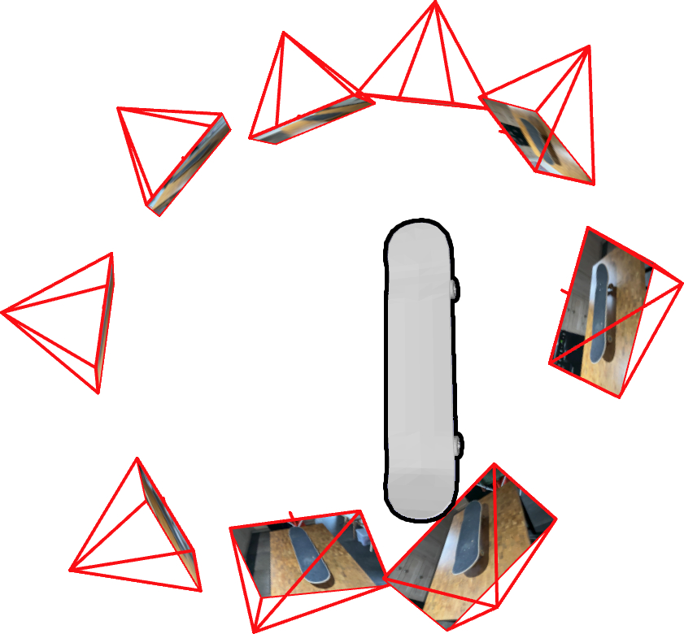
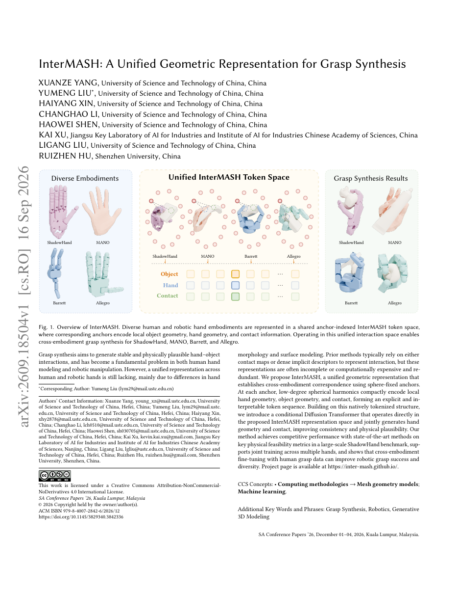
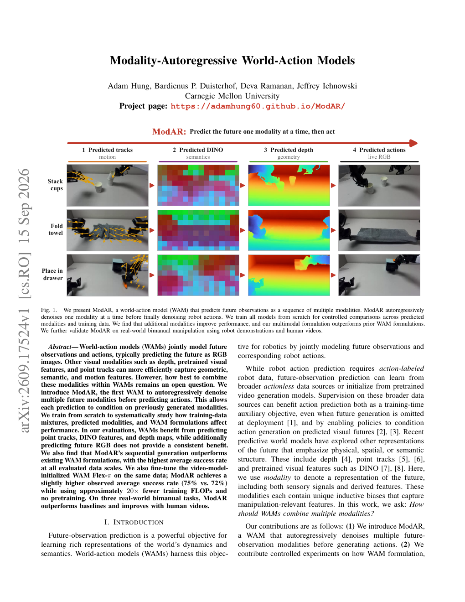
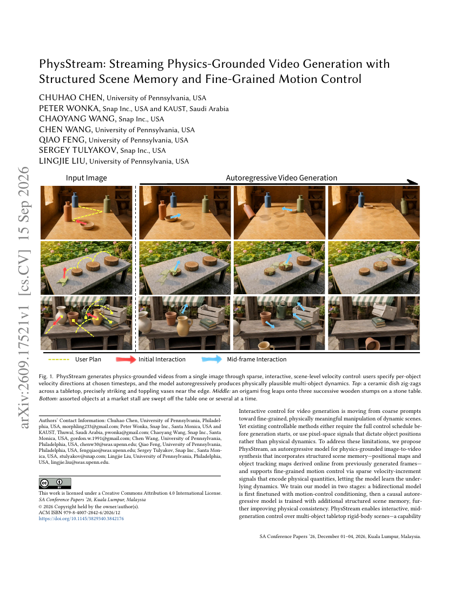

# 2026-09-17 科研日报

## 今日速览：CAD 先验钉住孪生几何，交互 token 统一跨手抓取，世界-动作先预测几何与运动

覆盖日（9 月 16 日）前后，主线相关新稿集中在三条可复用接口上：**CADSplat** 用 CAD 形状先验把稀疏、宽基线拍摄钉在物体坐标系里，并允许非刚体形变对齐实物；**InterMASH**（SIGGRAPH Asia 2026）把人手与多种机器人手的几何／接触写进球心固定的锚点 SH token，再在统一空间做条件扩散抓取合成；**ModAR**（9 月 15 日积压）则把世界-动作模型改成「先自回归去噪轨迹／DINO／深度，再预测动作」。外围还有 **PhysStream**（SA 2026）用稀疏速度增量做可中途干预的物理视频，以及 **MoQSplat**（MMSP 2026）把 3DGS 资产映射到 Media over QUIC 做视锥自适应流式传输。合在一起看：下游能不能用，往往取决于坐标系、接触表示与未来观测模态是否写清楚，而不是再堆一个更大的生成器。

- **必读 [CADSplat](#2026-09-17--cadsplat)**：工业／示教场景常见「相机很少、CAD 却现成」；这篇把 CAD 检索、相机到物体位姿与表面锚定高斯一起优化，并明确大部分渲染增益来自「表面约束＋共享形变场」，而非 CAD 形状本身。
- **必读 [InterMASH](#2026-09-17--intermash)**：跨形态抓取最怕表示不对齐；球心固定锚点 + 局部 SH 把人手与 ShadowHand／Allegro／Barrett 放进同一 token 空间，并支持用人抓取数据微调机器人手。
- **选读 [ModAR](#2026-09-17--modar)**：WAM 不必先赌未来 RGB；轨迹、语义特征与深度的顺序预测更稳，且报告用约 1/20 训练 FLOPs、无视频预训练达到略高于 Flex-π 的仿真平均成功率。
- **选读 [PhysStream](#2026-09-17--physstream)**：生成式视频若要当「交互仿真草稿」，需要可中途注入的物理量控制与场景记忆，而不是一次性排程。
- **效率向 [MoQSplat](#2026-09-17--moqsplat)**：示教舰队／数字孪生分发会撞上 GB 级 splat；MoQ 层级映射把空间 Track 与质量 Subgroup 拆到独立 QUIC 流。
- **[圈内新闻](#2026-09-17--community-news)**：Hacker News 上 Cartesian／AI CAD 讨论再次把「Astra 操 Blender」与「可制造参数化 CAD」对立澄清；Astra 对标仓仍无新 tip。

## Real2Sim：稀疏视图靠 CAD 先验，而不是靠猜几何

### CADSplat · arXiv · 2026-09-16

**必读。** 对手机／产线少视角重建，这篇给出一条很贴主线的配方：先用轮廓从 CAD 库检索形状并得到相机到物体位姿，再把高斯锚在可形变 CAD 表面上联合优化——输出同时服务新视角合成、无标记 AR 配准、逐图物体位姿与部件标签迁移。

论文信息、摘要与入口

- **Title：** CADSplat: Sparse-View 3D Gaussian Splatting Aided by CAD Models for Robust, Photorealistic Digital-Twin Reconstruction
- **作者：** Kristof Overdulve, Lode Jorissen, Nick Michiels。
- **单位：** Digital Future Lab, Flanders Make, Hasselt University（比利时哈瑟尔特大学／Flanders Make）。
- **发表时间：** arXiv 首次提交 2026-09-16。
- **投稿信息：** 预印本，未标明已接收 venue。
- **入口：** [arXiv](https://arxiv.org/abs/2609.18473) · [PDF](https://arxiv.org/pdf/2609.18473)。项目页／代码：本期摘要与首页未标明稳定公开仓。
- **摘要中译（压缩）：** 提出 CADSplat：在稀疏（&lt;15 视角）、宽基线、已知相对标定的物体图像上，用显式 CAD 形状先验正则化 3DGS，重建几何准确且可重光照观感的数字孪生。方法先把分割轮廓与 CAD 库渲染轮廓匹配，检索最相似 CAD 并得到相机到物体位姿；再将高斯锚在检索模型表面，联合优化 3DGS 参数、位姿精修与非刚体形变场，以吸收实物与 CAD 的形状差。在两个真实数据集上优于无约束少视角与网格贴图基线，并在少至 3 视角时仍可降级工作。作者消融指出：渲染质量增益主要来自「固定表面 splat 集 + 单一平滑形变场」的约束方式，CAD 形状本身主要在最稀疏与强自遮挡处补几何，并把相机统一到物体坐标系，从而支持 AR 配准、物理仿真与部件标签迁移等超出新视角合成的应用。

*论文 Fig. 1，来源：作者 PDF。轮廓匹配检索 CAD 与相机到物体位姿 → 联合优化形变与 3DGS → 几何准确的光真实感孪生。*

**方法概要。** （1）用 SAM3 等得到物体轮廓，与 CAD 库在视球上预渲染的掩膜匹配，聚合多视角一致性以检索模型并初始化相机到物体位姿；（2）在 CAD 表面采样固定密度的高斯，避免无约束 3DGS 在稀疏视角下乱长几何；（3）学习共享的非刚体形变场，把规范 CAD 拧到实物，同时精修位姿并优化外观；（4）几何热身后进入外观阶段。作者强调：即便 CAD 不完全匹配，**表面锚定 + 单一形变场**仍提供比自由生长更强的归纳偏置；CAD 额外提供物体坐标系与部件语义继承。

**值得关注。** 与 MiracleAug／示教资产管线对照：工业件与桌面道具往往「有近似 CAD／URDF，但拍摄很稀」。可借鉴的是把先验坐标系写进重建，并把「形变残差」当作可检查的偏离记录，而不是只追求 PSNR。证据边界：输入假设含分割轮廓与（相对）位姿可用；增益数字来自 SCO-CAD 等作者协议，未见大规模真机操作闭环。

## 抓取：先统一交互表示，再谈跨手迁移

### InterMASH · SIGGRAPH Asia 2026 · 2026-09-16

**必读（具身交互）。** 人手与机器人手形态差大，接触图或稠密隐式描述又贵又不互通；InterMASH 用物体中心球上的固定锚点，每个锚点用低阶球谐同时编码手局部几何、物体局部几何与接触，形成可直接喂给条件 DiT 的 token 序列。

论文信息、摘要与入口

- **Title：** InterMASH: A Unified Geometric Representation for Grasp Synthesis
- **作者：** Xuanze Yang, Yumeng Liu, Haiyang Xin, Changhao Li, Haowei Shen, Kai Xu, Ligang Liu, Ruizhen Hu。
- **单位：** 中国科学技术大学；中国科学院人工智能产业研究院／江苏工业人工智能重点实验室；深圳大学。
- **发表时间：** arXiv 首次提交 2026-09-16；文内标注 SIGGRAPH Asia 2026 Conference Papers（Kuala Lumpur，2026-12）。
- **投稿信息：** 会议论文预印本（ACM ISBN／DOI 出现在稿面）；按已接收会议稿处理。
- **入口：** [arXiv](https://arxiv.org/abs/2609.18504) · [PDF](https://arxiv.org/pdf/2609.18504) · [项目页](https://inter-mash.github.io/)。
- **摘要中译（压缩）：** 抓取合成需要稳定且物理合理的手—物交互，但跨人手／机器人手统一表示仍缺。本文提出 InterMASH：在球心固定的锚点上，用低阶球谐紧凑编码局部手几何、物体几何与接触，形成显式可解释 token；再以条件 Diffusion Transformer 直接在该空间联合生成手几何与接触。方法在大规模 ShadowHand 基准上与 SOTA 物理可行性指标竞争，支持多手联合训练，并显示用人抓取数据做跨形态微调可提升机器人抓取成功率与多样性。

*论文 Fig. 1，来源：作者 PDF。ShadowHand／MANO／Barrett／Allegro 映射到同一 InterMASH token 空间后做抓取合成。*

**方法概要。** 借鉴 MASH 的球谐局部描述，但把锚点固定在物体中心共享坐标系，保证索引跨实例／跨手一致；每个锚点联合编码手、物、接触，并配合视觉掩膜限制角域。条件 DiT 在该 token 序列上生成，避免「先生成手再贴接触」的不一致。作者用由粗到细提升 SH 阶数的课程稳定优化，并报告跨形态联合训练与人→机微调设定。

**值得关注。** 对示教增强／Real2Sim，接触有效性常被外观增强掩盖；把交互写成可对齐 token，比只扰动末端位姿更接近「可检查的接触语义」。证据边界：主实验在抓取合成与物理可行性指标上，不等于完整操作长程策略或真机全流程；项目页可核验材料以作者站点为准。

## 世界-动作：先预测几何与运动模态，再出动作

### ModAR · arXiv · 2026-09-15

**选读（积压，内容日邻日）。** 多数 WAM 把未来观测赌在 RGB 上；ModAR 证明轨迹、DINO 特征与深度的自回归去噪顺序更关键，额外预测未来 RGB 无稳定收益，并在真实双臂任务上验证。

论文信息、摘要与入口

- **Title：** Modality-Autoregressive World-Action Models
- **作者：** Adam Hung, Bardienus P. Duisterhof, Deva Ramanan, Jeffrey Ichnowski。
- **单位：** Carnegie Mellon University。
- **发表时间：** arXiv 首次提交 2026-09-15；本期作为邻日积压首次收录。
- **投稿信息：** 预印本，未标明已接收 venue。
- **入口：** [arXiv](https://arxiv.org/abs/2609.17524) · [PDF](https://arxiv.org/pdf/2609.17524) · [项目页](https://adamhung60.github.io/ModAR/)。
- **摘要中译（压缩）：** 世界-动作模型联合建模未来观测与动作，通常把未来写成 RGB。深度、预训练视觉特征与点轨迹能更高效地承载几何、语义与运动，但如何组合仍开放。本文提出 ModAR：首个在预测动作前自回归去噪多种未来模态的 WAM，使后一模态条件于已生成模态。从零训练以系统比较数据混合、预测模态与 WAM 配方。评估显示预测轨迹、DINO 与深度有益，额外预测未来 RGB 无一致增益；顺序生成优于既有配方，在各数据规模上平均成功率最高。相对同数据微调的视频模型初始化 WAM Flex-π，ModAR 观测平均成功率略高（75% vs 72%），训练 FLOPs 约少 20× 且无预训练。三真实双臂任务上优于基线，并随人类视频提升。

*论文 Fig. 1，来源：作者 PDF。顺序：轨迹 → DINO → 深度（→ RGB）→ 动作。*

**方法概要。** 将 RGB／深度分块 tokenization，DINO 取自冻结 DINOv2 的空间 token，点轨迹在 patch 中心查询并跟踪；训练时按 tracks→DINO→depth→RGB 顺序块去噪，最后去噪动作。消融覆盖「仅动作」「仅 RGB 未来」「独立噪声同时生成」等配方，并扫描有动作示教与无动作视频混合比例。

**值得关注。** 对 agentic 数据增强／弱点驱动造数：增强管线若只保证「看起来像」，WAM 仍可能缺几何与接触线索；ModAR 提示应优先保证可预测的运动／深度／语义表征。证据边界：75%／72% 为作者报告的仿真平均成功率；真机为三项双臂任务，规模有限。

## 可控视频：把物理量写成可中途注入的控制

### PhysStream · SIGGRAPH Asia 2026 · 2026-09-15

**选读（积压）。** 交互式视频生成若要求「事先排好全部控制」或只在像素里拖物体，很难当仿真草稿；PhysStream 用在线结构场景记忆（位置图／跟踪图）+ 稀疏速度增量，支持多物体桌面刚体场景的中途干预。

论文信息、摘要与入口

- **Title：** PhysStream: Streaming Physics-Grounded Video Generation with Structured Scene Memory and Fine-Grained Motion Control
- **作者：** Chuhao Chen, Peter Wonka, Chaoyang Wang, Chen Wang, Qiao Feng, Sergey Tulyakov, Lingjie Liu。
- **单位：** University of Pennsylvania；Snap Inc.；KAUST。
- **发表时间：** arXiv 首次提交 2026-09-15；文内标注 SIGGRAPH Asia 2026 Conference Papers。
- **投稿信息：** 会议论文预印本；按已接收会议稿处理。
- **入口：** [arXiv](https://arxiv.org/abs/2609.17521) · [PDF](https://arxiv.org/pdf/2609.17521) · [项目页](https://czzzzh.github.io/PhysStream)。
- **摘要中译（压缩）：** 可控视频正从粗提示走向对动态场景的细粒度、有物理含义的操纵，但既有方法或要求生成前给定完整控制时间表，或用像素信号直接规定位置而非动力学。PhysStream 是面向物理 grounding 的图像到视频自回归模型：引入由已生成帧在线导出的结构场景记忆，并用编码物理量的稀疏速度增量做细粒度运动控制。两阶段训练：先双向模型微调运动条件，再训带场景记忆的因果自回归模型。支持多物体桌面刚体场景的交互式中途控制；合成基准上相对最强基线降低运动分布距离（FVMD）约 33%、轨迹误差约 12%，野外对比中人类偏好超过 85%。

*论文 Fig. 1，来源：作者 PDF。用户在选定时刻指定物体速度方向，模型自回归生成多物体动力学。*

**方法概要。** 控制信号是稀疏的速度增量而非逐帧位姿脚本；场景记忆从历史帧维护位置与跟踪图，供后续帧条件化。训练先学可控运动，再加因果记忆以提升物理一致性。

**值得关注。** 它不是 Real2Sim 资产管线，但提示「增强数据／失败回放」可以用物理量级控制生成候选交互，再交给仿真或真机验收。证据边界：桌面刚体为主；指标与人类偏好来自作者基准，不能外推任意接触丰富操作。

## 传输效率：把 3DGS 拆进 MoQ 的 Track／Group／Subgroup

### MoQSplat · IEEE MMSP 2026 · 2026-09-16

**效率向。** 光真实感 3DGS 场景可达 GB 级；TCP 上的粗粒度自适应流易遇队头阻塞。MoQSplat 把场景映到 Media over QUIC 四级层级，按视锥／距离／中央凹请求空间区域与质量层。

论文信息、摘要与入口

- **Title：** MoQSplat: Adaptive Progressive Streaming of 3D Gaussian Splatting via MoQ
- **作者：** Emanuele Artioli, Mohammadreza Ghafari, Md Tariqul Islam, Farzad Tashtarian, Christian Rothenberg, Christian Timmerer。
- **单位：** Alpen-Adria Universität Klagenfurt（Christian Doppler Laboratory ATHENA）；Université de Lorraine / Inria / LORIA；Universidade Estadual de Campinas (UNICAMP)。
- **发表时间：** arXiv 首次提交 2026-09-16。
- **投稿信息：** Accepted at IEEE MMSP 2026（Istanbul, 22–24 September 2026）；文内注明前三作者贡献同等。
- **入口：** [arXiv](https://arxiv.org/abs/2609.18624) · [PDF](https://arxiv.org/pdf/2609.18624) · [代码](https://github.com/emanuele-artioli/MoQSplat)。
- **摘要中译（压缩）：** 提出 MoQSplat，将 3DGS 内容映射到 Media over QUIC（MoQ）传输层级：场景分为空间 Track，splat 聚为语义连贯 Group，渐进质量 Subgroup 映射到独立 QUIC 流以避免连接级队头阻塞。客户端按 6-DoF 视锥可见性、距离与中央凹对齐动态请求区域与质量层。原型评估显示基于不透明度的剪枝优于基于尺度的剪枝用于渐进传输。

*论文 Fig. 1，来源：作者 PDF。Publisher／Relay／Subscriber 与 Track–Group–Subgroup–Object 层级。*

**方法概要。** 发布端准备空间分解与质量变体；中继无场景状态、按层级转发；订阅端根据视口选择 Track 与质量层并本地缓存渐进渲染。核心评价聚焦剪枝策略与层级可行性。

**值得关注。** 对「千条示教 × 远程审阅／多机共享 splat 场景」，传输栈与批渲染同样是瓶颈。证据边界：原型组件评估，不是完整公网 CDN 压测；也不替代渲染加速本身。

## 圈内新闻与社区反应

**Hacker News：Cartesian／AI 三维建模帖把「看起来能建模」拆成两条工作流。** 2026-09-16 前后，[Formas.ai 的 Cartesian](https://formas.ai) 产品帖登上 [Hacker News](https://news.ycombinator.com/item?id=49713999)（讨论页标注约 113 分、70+ 评论）。**事实层：** 帖子展示面向建筑／产品设计的 AI 三维建模产品叙事，并引发对输出格式（网格 vs 参数化／BRep／STEP）的争论。**社区观点（可回溯原帖）：** 多位评论者对照 [ForgeCAD](https://forgecad.io)、Rhino／Grasshopper MCP、以及直接用 **GPT-6 Astra 驱动 Blender／build123d／Plasticity** 的实践，认为「agent + 可验证几何工具」已能出可打印 STL／部分 STEP；同时有机械背景评论强调：网格好看 ≠ 可制造参数化，装配配合与实物验证仍是缺口；另有评论批评营销页动效影响可读性。**为何值得看：** 与 MiracleAug「Astra 操 DCC」同族讨论再次出现，但焦点从具身示教转到 **CAD 语义是否保留**——和今日 CADSplat「用 CAD 先验钉坐标系」形成有趣对照：一边是生成／代理建模能否交出 CAD，一边是已有 CAD 如何约束视觉重建。

**Astra Real2Sim 对标仓。** [`hku-sail/Real2Sim_GPT6_ASTRA`](https://github.com/hku-sail/Real2Sim_GPT6_ASTRA) 自公开 tip `a1624d6`（2026-09-10）以来仍无更新 tip，本期不展开。

**博客／学术主页仓。** `rubatotree/blog` 在覆盖窗口内无新公开提交；兴趣校准仍以既有 MiracleAug 笔记为准。

---

## 覆盖说明

- **日报日期：** 2026-09-17（发布日，Asia/Hong_Kong）
- **内容覆盖：** 2026-09-16 为主；ModAR／PhysStream 为 2026-09-15 邻日积压并已标注日期。论文首次挂出日以 arXiv 为准；会议录用以稿面／作者声明为准。
- **完备性：** 本日为**延迟人工恢复发布**（早间主责窗口未出稿、备用未接管后，维护者安排 Cream 补发）。arXiv API 曾短暂限流，主菜经逐篇核验；圈内以可回溯 HN 帖为主。
- **编写：** Cream

**故障说明：** 本日由 Cream 于约 11:55 HKT 按维护者授权补发。可核验事实：Cream 曾于 06:24 对 2026-09-17 写入 claim，后于 06:25 因剩余窗口不足主动 `fail`／`release`；随后 Neon 未在当时备用窗口内发布；至补发前 `digests/2026-09-17.md` 与 `digests/index.json` 当日条目仍不存在，`last_success.publish_date` 仍为 2026-09-16。依据 `meta/failover.json` 当日 `claim`／`fail`／`release` 事件与缺稿状态。
