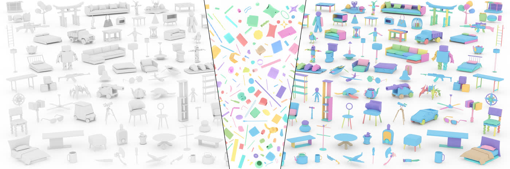
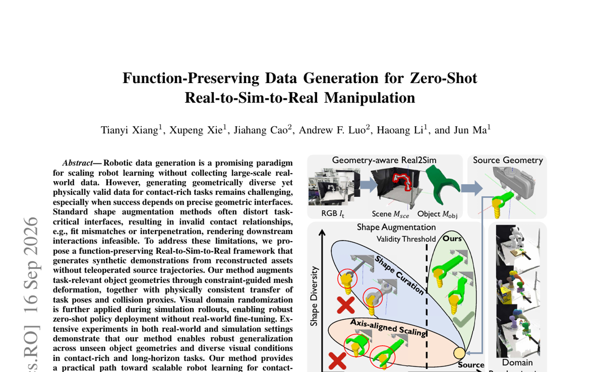
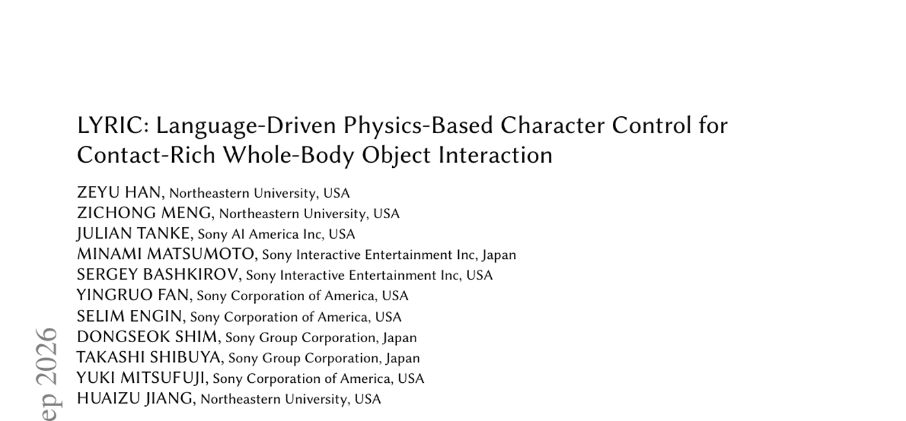

# 2026-09-18 科研日报

## 今日速览：零件库检索式装配、PBR 高斯脱光照、示教增强先保住接触面

覆盖日（9 月 17 日）的主线信号很集中：**PART**（SIGGRAPH Asia 2026）把「给定零件库 + 目标形状 → 检索零件并回归 6-DoF 位姿」写成集合预测，直接打在可编辑／可装配资产入口；**GS-PI** 把 PBR 材质生成从与光照的联合优化里拆出来，改成几何条件的点云扩散，服务可重光照数字孪生；邻日积压 **FPSA** 则明确反对乱变形状增强——接触面／配合公差必须在 Real-to-Sim-to-Real 造数时被约束保住。动画侧 **LYRIC** 用语言 + 稀疏物体终态目标做接触丰富的全身物交互，planner／action 解耦后在 OMOMO 留出集上报告更高任务成功率。合在一起看：MiracleAug 一类管线接下来最该盯的，不是又一个「看起来更真」的生成器，而是 **零件是否可检索拼装、材质是否可进 PBR、增强是否仍保留可接触几何**。

- **必读 [PART](#2026-09-18--part)**：示教／孪生资产很少是「整模一次生成」；从零件库检索并装配，比生成后再切更接近可编辑 Real2Sim。
- **必读 [GS-PI](#2026-09-18--gspi)**：烘焙辐射的 3DGS 很难进可重光照仿真；把材质扩散与场景光照优化解耦，是 PTIR 卡点③的正面样本。
- **必读 [FPSA](#2026-09-18--fpsa)**（9 月 16 日积压）：几何多样性若毁掉配合面，增强数据会在接触任务上集体失效；约束引导变形 + 位姿／碰撞代理一致迁移，对准 agentic 示教增强的验收标准。
- **选读 [LYRIC](#2026-09-18--lyric)**：语言驱动、接触丰富的全身物交互；「任务级规划冻结 + 动作生成器策略后训练」对长程接触控制有方法迁移价值。
- **[圈内新闻](#2026-09-18--community-news)**：Figure 发布 Helix 2.5 零样本跨 30 户家庭全身任务结果；VLM agent 框架 GPT-Policy 讨论「部署时上下文学习」；Astra 对标仓 tip 仍无更新。

## 可装配资产：先检索零件，再回归位姿

### PART · SIGGRAPH Asia 2026 · 2026-09-17

**必读。** 相对「预给定零件集合再装配」的经典设定，PART 面向更实际的检索式装配：目标形状 + 零件库 → 自动选件并预测 6-DoF 位姿。对拆分—绑定—可编辑资产路线，这把「零件边界」和「装配约束」写回生成／重建之后的下一跳。

论文信息、摘要与入口

- **Title：** PART: Learning 3D Part Assembly and Retrieval with Transformers
- **作者：** Ruchao Bao, Wenzheng Wu, Chucheng Xiang, Zhongyuan Liu, Yuan Liu, Jinxin Dong, Ligang Liu, Ziqi Wang。
- **单位：** 中国科学技术大学；香港科技大学（作者页机构字段）。
- **发表时间：** arXiv 首次提交 2026-09-17。
- **投稿信息：** 文内／评论标注 Accepted to SIGGRAPH Asia 2026 Conference Papers；按已接收会议稿处理。
- **入口：** [arXiv](https://arxiv.org/abs/2609.19872) · [PDF](https://arxiv.org/pdf/2609.19872) · [项目页](https://iambrc.github.io/PART-project-page/)。
- **摘要中译（压缩）：** 三维装配是现代制造与数字内容生产的基础。本文提出 PART：统一的 transformer 框架，在给定目标形状与零件库时自动选择合适零件并预测其 6-DoF 位姿以重建目标。既有工作多在预定义零件集合上装配，更实用的检索式设定仍较少被系统研究。任务面临组合爆炸搜索空间、可变长度输出与连续位姿估计三类难点。作者将检索与装配表述为集合预测，设计可输出可变长度结果的 transformer，并利用零件位姿估计与目标分割的对偶性做联合训练与分割增强优化。另整理 8 万+ 形状规模数据集；实验显示方法可泛化到场景布局、图像目标与真实扫描。

*项目页 teaser，来源：作者项目页。目标形状／图像条件下从零件库检索并装配。*

**方法概要。** 将「选哪些零件、各放在哪」写成集合预测：transformer 在零件库与目标条件上做检索，并回归 6-DoF 位姿，允许不同目标输出不同数量的零件。训练上利用位姿估计与目标分割的对偶信号，并引入分割增强的优化模块，缓解仅靠几何匹配的歧义。数据侧构建大规模形状－零件资源以支撑检索式评测；作者报告可迁移到场景级布局、以图像为条件的目标，以及对真实扫描的装配尝试。

**值得关注。** 与 SNAP3D／KaiNinja「部件要能分开」互补：PART 更强调 **库内检索 + 位姿装配**，适合「已有 CAD／标准件库、要拼出可仿真物体」的工业／示教设定。对 MiracleAug：复杂几何变多时，大模型反复雕部件成本高，检索式装配可能是另一条降本路径。证据边界：主结果是装配／检索几何指标与作者泛化演示；不等于已验证接触动力学或真机操作闭环。写稿时 PDF 资源曾短暂 404，正文以 abs／HTML／项目页为准。

## 可重光照资产：把 PBR 材质从联合逆渲染里拆出来

### GS-PI · arXiv · 2026-09-17

**必读（逆渲染／可重光照）。** 3DGS 默认烘焙辐射，难进 PBR 管线；现有逆渲染又常把材质与光照绑在同一优化里互相抢梯度。GS-PI 把 PBR 属性生成改成 **几何条件下的三维点云扩散**，再用可微光栅做短程蒸馏，明确服务可重光照高斯资产。

论文信息、摘要与入口

- **Title：** GS-PI: An Optimization-Decoupled Appearance Decomposition Approach for Generating PBR Gaussian Assets
- **作者：** Jieting Xu, Rengan Xie, Zijian Huang, Zehui Jin, Rui Wang, Yuchi Huo。
- **单位：** 浙江大学 CAD&CG 国家重点实验室（HTML 机构字段）。
- **发表时间：** arXiv 首次提交 2026-09-17。
- **投稿信息：** 预印本，未标明已接收 venue。
- **入口：** [arXiv](https://arxiv.org/abs/2609.19907) · [PDF](https://arxiv.org/pdf/2609.19907)。项目页／代码：本期摘要栏未标明稳定公开仓。
- **摘要中译（压缩）：** 高斯溅射擅长新视角合成，但编码烘焙辐射，使光照与几何缠死，难以无缝接入物理渲染管线。现有逆渲染常靠联合优化解耦材质，却易因目标互相竞争出现严重歧义与残留光照伪影。本文提出 GS-PI：将 PBR 材质生成表述为几何条件的三维点云扩散过程；直接在 3D 域操作以天然保证多视图一致，规避 2D 扩散的像素对应难题。引入多尺度跨视图条件机制，融合全局语义先验、源视角锚定的光度线索，以及绝对空间的学习视角方向条件，压缩复杂多视图证据，减轻投影错位，并抑制高光被烘焙进固有色。流程从预训练高斯提取点云、用条件扩散预测 PBR 属性，再经可微光栅蒸馏回高斯，得到可重光照的 PBR-GS 资产。作者报告相对近期逆渲染基线更优，并以「学习扩散 + 短程目标驱动蒸馏」替代逐场景的光照／BRDF 联合优化，且不需要代理网格。

**方法概要。** （1）从已训练高斯场景提取点云作为几何支架；（2）在点云上跑几何条件扩散，预测 PBR 属性而非再与环境光联合死磕；（3）多尺度跨视图条件把语义、光度与视角方向信号压进条件向量，专门对付高光污染固有色；（4）用可微 splatting 做短程蒸馏，把扩散结果对齐到可渲染高斯。关键叙事是 **优化解耦**：先学材质生成先验，再轻量适配，而不是每场景从头博弈。

**值得关注。** 对 PTIR-GS／手机采集孪生：可重光照出口一直是卡点；「烘焙 GS → PBR 属性」若稳定，批渲染与仿真光照编辑会好做得多。证据边界：作者对比为逆渲染／重光照基准上的报告结果；写稿时 PDF 与 HTML 配图资源返回 404，故本期未嵌 teaser，请以 abs 原文为准复核数字与图示。不把「无需代理网格」外推成已解决任意透明／强反射产线件。

## Real2Sim 造数：几何增强必须保住任务接触面

### FPSA · arXiv · 2026-09-16

**必读（积压，对准主线）。** 9 月 16 日挂出、昨日报未收。接触丰富操作的数据增强若用朴素缩放／库替换，常破坏配合面与插入间隙，导致「看起来多样、物理上不可交互」。FPSA 用约束引导网格变形做功能保持的形状增强，并一致迁移任务位姿与碰撞代理，宣称可无真机微调零样本部署。

论文信息、摘要与入口

- **Title：** Function-Preserving Data Generation for Zero-Shot Real-to-Sim-to-Real Manipulation
- **作者：** Tianyi Xiang, Xupeng Xie, Jiahang Cao, Andrew F. Luo, Haoang Li, Jun Ma。
- **单位：** 香港科技大学（广州）机器人与自主系统学域；香港大学数据科学研究院。
- **发表时间：** arXiv 首次提交 2026-09-16；本期作为邻日积压首次收录。
- **投稿信息：** 预印本，未标明已接收 venue。
- **入口：** [arXiv](https://arxiv.org/abs/2609.18293) · [PDF](https://arxiv.org/pdf/2609.18293) · [项目页](https://fpsa-r2s2r.github.io/)。
- **摘要中译（压缩）：** 机器人数据生成有望在少采真机数据的前提下放大学习，但为接触丰富任务生成「几何多样且物理有效」的数据仍难，尤其当成功依赖精确几何接口时。标准形状增强常扭曲任务关键接口，造成配合失配或穿透，使下游交互不可行。本文提出功能保持的 Real-to-Sim-to-Real 框架：从重建资产出发、无需遥操作源轨迹即可生成合成示教；用约束引导网格变形增强任务相关几何，并物理一致地迁移任务位姿与碰撞代理；仿真回放时再施加视觉域随机化，从而支持无真机微调的零样本策略部署。真实与仿真实验表明，方法能在未见物体几何与多样视觉条件下，对接触丰富与长程任务保持稳健泛化。

*论文 Fig. 1，来源：作者 PDF。几何感知重建 → 约束形状增强（相对朴素缩放／库替换）→ 域随机化造数 → 零样本回真机。*

**方法概要。** 先做工作空间与物体的几何感知重建；再对任务相关区域做约束引导变形，显式保护配合／插入等功能界面，并把任务位姿与碰撞代理一并变换；在仿真中滚动生成示教，叠加视觉与标定域随机化；策略在合成数据上训练后直接上真机。作者对照轴对齐缩放、形状库策展等基线，强调「功能对应」不等于「界面几何仍可接触」。

**值得关注。** 这与 MiracleAug 公开卡点高度同构：增强类型可以很多，但 **接触／轨迹是否仍有效** 才是验收。可借鉴的是把「界面保持」写成可检查约束，而不是只看 RGB 域随机是否好看。证据边界：作者报告真实与仿真设定下的泛化；具体成功率以原文表格为准。不把「无需源遥操作轨迹」理解成已覆盖任意长程多物体家务。

## 接触丰富控制：语言只给任务，接触交给闭环动作生成

### LYRIC · arXiv · 2026-09-17

**选读（具身／动画交叉）。** 用自然语言 + 稀疏物体终态目标驱动物理角色做抓取、搬运、放置；关键是用几何条件交互奖励从含噪动捕得到可靠专家，再把控制器拆成任务级规划器与闭环动作生成器。

论文信息、摘要与入口

- **Title：** LYRIC: Language-Driven Physics-Based Character Control for Contact-Rich Whole-Body Object Interaction
- **作者：** Zeyu Han, Zichong Meng, Julian Tanke, Minami Matsumoto, Sergey Bashkirov, Yingruo Fan, Selim Engin, Dongseok Shim, Takashi Shibuya, Yuki Mitsufuji, Huaizu Jiang。
- **单位：** Northeastern University；Sony AI America；Sony Interactive Entertainment；Sony Corporation of America；Sony Group Corporation（稿面署名）。
- **发表时间：** arXiv 首次提交 2026-09-17。
- **投稿信息：** 预印本，未标明已接收 venue。
- **入口：** [arXiv](https://arxiv.org/abs/2609.19688) · [PDF](https://arxiv.org/pdf/2609.19688) · [项目页](https://neu-vi.github.io/LYRIC/)。
- **摘要中译（压缩）：** 提出 LYRIC：面向语言驱动、基于物理的接触丰富交互控制的生成式流匹配控制器，使仿真角色仅凭自由文本指令与稀疏物体终态目标即可完成全身物交互。为从不完美动捕得到可靠专家轨迹，用几何条件交互奖励训练单一跟踪策略，并在手－物接触附近放松参考跟踪。为在不规定全身运动学参考的前提下引导交互进度，将控制器分解为预测短时域物体与人形根轨迹的任务级规划器，以及闭环求解全身运动与接触的动作生成器。行为克隆后冻结规划器，并以规划器预测为稳定监督对动作生成器做策略后训练。受控 OMOMO 评估中，跟踪器成功率 64.3%（InterMimic 复现 53.2%），统一策略在全数据上 76.5%；留出集上 LYRIC 任务成功率 90.3%，对照最强匹配运动学规划基线 74.2%，语义对齐与运动质量亦更好。无需重训即可支持测试时物体路点引导；定性结果展示稳健自然的接触丰富交互及对新物体形状的零样本迁移。

*论文 Fig. 1，来源：作者 PDF。文本提示与稀疏终态物体目标条件下，角色接近、抓取、搬运并放置多样物体。*

**方法概要。** 跟踪阶段用几何条件奖励与接触附近的放松跟踪，从含噪动捕得到可物理执行的专家；控制阶段用流匹配生成，规划器只预测物体与根的短时域轨迹，动作生成器在闭环里补全身与接触；克隆后冻结规划器、后训练动作头。评测在 OMOMO 协议上报告跟踪／统一策略／留出集数字，并展示路点引导与新形状迁移。

**值得关注。** 对「语言／VLM 规划 + 低层接触控制」分层，LYRIC 提供可对照的动画域样本：高层只承诺物体进度，接触不靠一张完整运动学参考硬套。证据边界：主结果在仿真角色与 OMOMO；不是机器人真机 VLA。作者成功率数字来自稿面报告，迁移到机器人本体需另验。

## 圈内新闻与社区反应

**Figure 发布 Helix 2.5：宣称零样本跨 30 户家庭的全身任务泛化。** 2026-09-17，[Figure 官方新闻稿](https://www.figure.ai/news/helix-2-5-zero-shot-30-home-generalization)介绍 Helix 2.5。**事实层（官方自述）：** 在 Index 人类行为数据上预训练后，适配整理客厅、叠毛巾、铺床三类全身行为，并在 30 个未见过的真实家庭、未见物体上做零样本评估（评价环境无额外数据采集／微调）；文中写 Index 预训练相对从头训练，将零样本成功率从 9% 提到 56%，并称可观测到随 Index 数据倍增的迁移缩放。**社区／独立反馈：** 本稿截稿前未找到可与官方数字对等的第三方复现报告；讨论仍以厂商视频与新闻稿为主。**为何值得看：** 具身泛化叙事从「单场景示教」被推到「跨家庭零样本」——与日报主线「增强数据是否保住接触／功能」同问，但证据层级是公司演示，不等于可复现学术基准。

**GPT-Policy：用 VLM agent 做部署时上下文机器人学习。** arXiv:[2609.19138](https://arxiv.org/abs/2609.19138)（2026-09-16 挂出，中文科技媒体 9 月 17 日前后转述）提出 GPT-Policy：上下文编译器 + VLM 提议动作 + 约束控制器执行并回传结果，探索无梯度更新的 in-context 适应。**事实层：** 真机试验称人类视频示教（甚至无机器人动作标签）可提升完成率，对齐的动作参考在接触敏感任务上再增益。**社区反应：** 截稿前未见大规模独立复现；宜区分「商业 VLM 代理能力」与「可部署策略栈」。**对照：** 与 MiracleAug「弱点驱动造数」不同路径——一个在部署时读上下文，一个在训练前造数据。

**Astra Real2Sim 对标仓。** [`hku-sail/Real2Sim_GPT6_ASTRA`](https://github.com/hku-sail/Real2Sim_GPT6_ASTRA) 自公开 tip `a1624d6`（2026-09-10）以来仍无更新 tip，本期不展开。

---

## 覆盖说明

- **日报日期：** 2026-09-18（发布日，Asia/Hong_Kong）
- **内容覆盖：** 2026-09-17 为主；FPSA 为 2026-09-16 邻日积压并已标注。论文首次挂出日以 arXiv 为准；PART 会议录用以稿面／评论声明为准。
- **完备性：** 本日为**延迟恢复发布**（早间主责窗口晚唤醒后放权、备用未接管；维护者明确要求 Cream 补发）。GS-PI 等条目写稿时 PDF／配图资源曾 404，已在对应节注明；圈内以官方稿与可回溯 arXiv 为主。
- **编写：** Cream

**故障说明：** 本日由 Cream 于约 09:05 HKT 按维护者授权补发。可核验事实：Cream 曾于 05:48 HKT 对 2026-09-18 写入 claim，后因距当时窗口末端（06:00）剩余时间不足而 `fail`／`release`；随后 Neon 未在备用窗口内发布；至补发前 `digests/2026-09-18.md` 与 `digests/index.json` 当日条目仍不存在，`last_success.publish_date` 仍为 2026-09-17。依据 `meta/failover.json` 当日 `claim`／`fail`／`release` 事件与缺稿状态。
