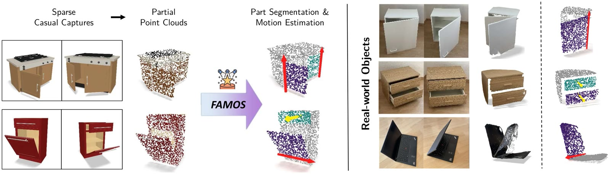
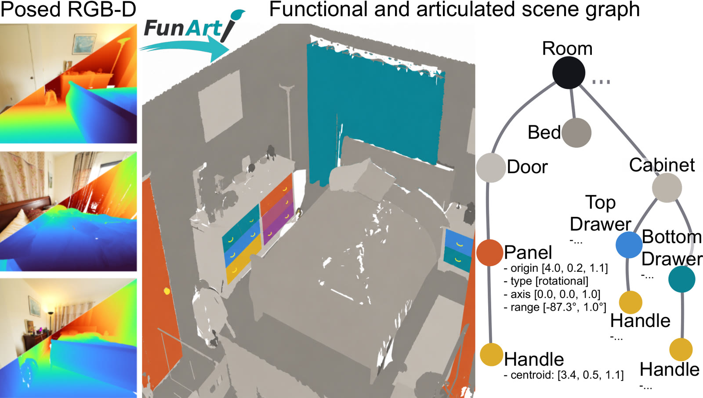
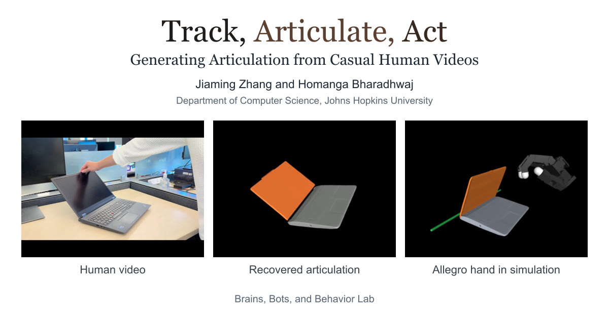
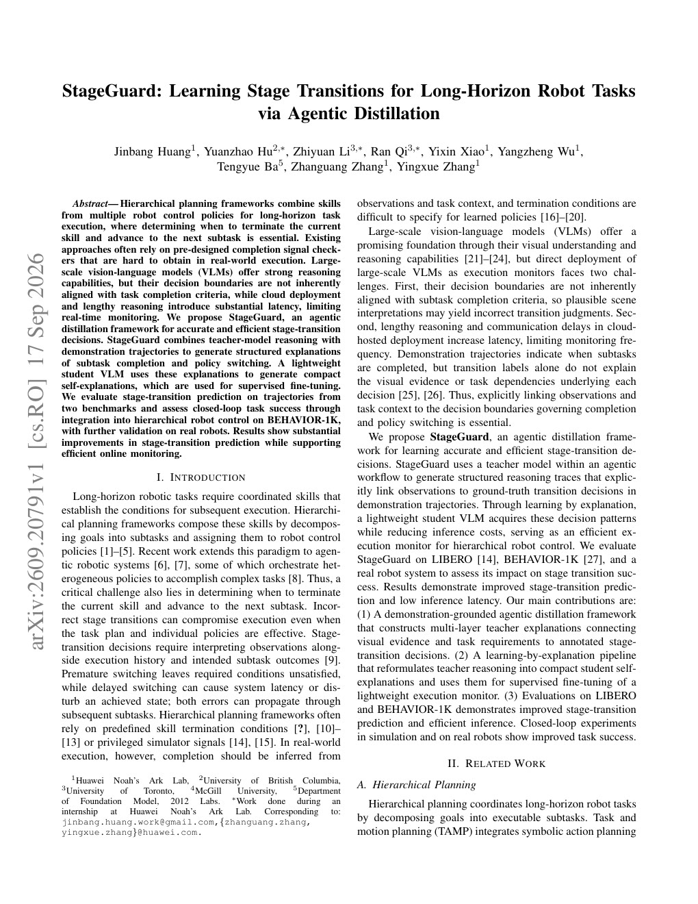
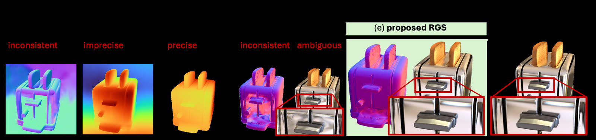

# 2026-09-19 科研日报

## 今日速览：稀疏观测估关节，生成潜空间解功能结构，人手视频成可仿真铰链

覆盖日（9 月 18 日）的信号很清楚：**可编辑动态资产**不再只靠「看一眼猜类别先验」。**FAMOS** 用稀疏、无序的部分点云做前馈关节建模；**FunArt** 从 TRELLIS.2 一类生成式 3D 潜空间里同时解出可动部件与功能交互元件；邻日积压 **Track Articulate Act** 则把随便拍的人手视频变成 MuJoCo 可回放的铰链资产。控制侧 **StageGuard** 用 agentic 蒸馏把「何时切阶段」从大 VLM 压成可在线监控的轻量学生；图形侧 **RGS**（ICRA 2026）专治反射区几何塌陷。合在一起看：MiracleAug / Real2Sim2Real 下一步最该对齐的，是 **关节与功能界面能否在交互前就估准、能否从弱传感视频落地仿真，以及长程任务的阶段守卫能否不靠手写 checker**。

- **必读 [FAMOS](#2026-09-19--famos)**：多观测联合推理可动部件与关节参数；单视角也能跑，但强调「把观测集用满」——对准拆分—绑定自动化。
- **必读 [FunArt](#2026-09-19--funart)**：静态单配置 RGB-D 扫描就能建 articulation-aware 功能场景图；生成潜空间被当成结构先验，而不是只当好看 mesh。
- **必读 [Track Articulate Act](#2026-09-19--taa)**（9 月 16 日积压）：无深度／多视角／手标关节，从人手视频重建可仿真铰链并回放接触——与 agentic Real2Sim 入口同构。
- **选读 [StageGuard](#2026-09-19--stageguard)**：长程分层控制里「何时切换 skill」用教师推理 + 示教轨迹蒸馏；失败驱动闭环需要可检查的阶段信号。
- **选读 [RGS](#2026-09-19--rgs)**（ICRA 2026）：反射物体上的几何连续性与 densification；可重光照／材质孪生前先别让表面塌掉。
- **[圈内新闻](#2026-09-19--community-news)**：Anthropic 重做 Claude Code Projects；量子位转述具身「能力量产」与云基建收敛；Astra 对标仓仍无 tip 更新。

## 可编辑铰链：稀疏观测也要估得动

### FAMOS · arXiv · 2026-09-17

**必读。** 相对「单帧吃类别形状先验」的前馈关节估计，FAMOS 明确吃 **稀疏、无序、可变数量** 的部分点云，用 Multi-state Articulation Transformer 在观测间聚合运动证据，并加 observed articulation span 目标，逼模型把整组观测用完。

论文信息、摘要与入口

- **Title：** FAMOS: Feed-Forward 3D Articulation Modeling from Sparse Observations
- **作者：** Kevin Qu, Tao Sun, Massimiliano Viola, Liyuan Zhu, Zhizhuo Zhou, Sayan Deb Sarkar, Konrad Schindler, Iro Armeni。
- **单位：** 摘要栏未标明稳定机构字段；作者署名与项目页见入口。
- **发表时间：** arXiv 首次提交 2026-09-17。
- **投稿信息：** 预印本，未标明已接收 venue。
- **入口：** [arXiv](https://arxiv.org/abs/2609.20817) · [PDF](https://arxiv.org/pdf/2609.20817) · [项目页](https://kevinqu7.github.io/famos)。
- **摘要中译（压缩）：** 从稀疏单目视角建模铰接物体很难，因为每次观测只暴露部分几何与运动证据。多数前馈方法从单次观测推断关节，因而重度依赖类别级形状先验。本文提出 FAMOS：从前馈模型出发，在稀疏、无序的部分点云集合上预测可动部件分割与关节参数；可联合推理多次观测，并天然支持可变输入数量（含单视角）。为跨观测聚合关节线索，引入交替做状态内注意力与全局注意力的 Multi-state Articulation Transformer；另提出 observed articulation span 目标，监督各部件在输入观测中实际展现的运动范围，鼓励用满观测集。为突破既有数据规模与多样性，引入训练期程序化数据生成器合成自标注资产。在 PartNet-Mobility、ACD 与 ArtiCraft-10K 上相对前馈与优化基线均报告一致提升。

*项目页 teaser，来源：作者项目页。稀疏／部分点云 → 可动部件与关节参数。*

**方法概要。** 输入是一组未排序的部分点云（可 1 帧也可多帧状态）；编码器后用状态内注意力整理单次观测、用全局注意力跨状态对齐同一部件的运动证据，输出部件分割与关节参数。训练上除常规监督外，用观测跨度损失显式奖励「多观测带来的运动范围」；数据侧用程序化生成器在训练时合成自标注铰接资产，缓解公开集规模不足。评测覆盖 PartNet-Mobility、ACD、ArtiCraft-10K，对照前馈与优化两类基线。

**值得关注。** 对拆分—绑定与可编辑 Real2Sim：示教视频／稀疏扫描往往给不出完整 mesh，却能给多状态点云；FAMOS 把「多状态证据」写成可训练目标，而不是事后优化。对 MiracleAug：复杂铰链物体若仍靠大模型反复雕部件，成本高——前馈关节估计可作为 agent 调用的几何技能。证据边界：主结果是公开铰接基准上的分割／关节指标；不等于已验证接触动力学或真机操作闭环。

## 功能结构：生成潜空间里同时长出可动件与交互件

### FunArt · arXiv · 2026-09-17

**必读。** 既有铰接场景表示多从「观察到交互」反推运动学；静态扫描路线又常把关节与功能交互元件拆开。FunArt 在 **单次静态配置** 的 posed RGB-D 上建 articulation-aware 功能 3D 场景图，并把几何灌进 TRELLIS.2 的 O-Voxel／冻结稀疏压缩 VAE，当结构先验用。

论文信息、摘要与入口

- **Title：** FunArt: Decoding Functional Structure and Articulation from Generative 3D Latents
- **作者：** Dennis Rotondi, Abdelrhman Werby, Kai O. Arras。
- **单位：** 摘要栏未标明稳定机构字段。
- **发表时间：** arXiv 首次提交 2026-09-17。
- **投稿信息：** 预印本，未标明已接收 venue。
- **入口：** [arXiv](https://arxiv.org/abs/2609.20673) · [PDF](https://arxiv.org/pdf/2609.20673) · [全文 HTML](https://arxiv.org/html/2609.20673v1)。项目页／代码：本期摘要栏未标明稳定公开仓。
- **摘要中译（压缩）：** 机器人要在人类环境中有效操作，须识别铰接物体、分割可动与可交互部件并估计运动学模型。既有铰接场景表示多从观察到的交互恢复运动学；作用于静态扫描的方法又常把关节与功能交互元件解耦。本文提出 FunArt：从单次静态配置下采集的 posed RGB-D 构建 articulation-aware 功能三维场景图。方法重建物体实例，将其融合几何直接转入 TRELLIS.2 的 O-Voxel 表示，并利用其冻结的稀疏压缩 VAE 作为结构先验；轻量 query-based 解码器结合紧凑物体级潜变量与稠密表面对齐特征，联合分割可动部件与功能交互元件，并估计运动类型、轴、原点与范围。在 Articulate3D 上，FunArt 在可动部件分割、关节估计与功能元件分割上均报告 SOTA（含有／无 GT 物体输入）；端到端设定下相对最强基线，可动部件 AP₅₀ +1.5、原点—轴联合约束 AP₅₀ +2.8、功能元件 AP₅₀ +6.7。结果表明生成式 3D 潜变量编码了可行动的结构线索，可在物理交互前初始化机器人感知与规划。

*论文 Fig. 1，来源：arXiv HTML。静态 RGB-D → 功能场景图（可动部件 + 交互元件 + 关节）。*

**方法概要。** 实例重建后把融合几何映射到 TRELLIS.2 O-Voxel，冻结 VAE 提供生成式结构先验；解码器以 query 方式同时输出可动部件、功能交互元件，以及运动类型／轴／原点／范围。评测在 Articulate3D，强调「交互前」即可初始化规划，而不必先推一把抽屉再估关节。

**值得关注。** 与 FAMOS 互补：FAMOS 吃多状态点云运动证据，FunArt 吃静态扫描 + 生成先验里的功能界面（把手、按钮等）。对 agentic 资产管线：可把「生成式 3D 骨干当结构先验」写成可替换模块，而不是只当 mesh 美化器。证据边界：作者数字来自 Articulate3D 报告；端到端真机闭环与物理接触正确性未在摘要中等同宣称。

## Real2Sim：人手视频 → 可仿真铰链资产

### Track Articulate Act · arXiv · 2026-09-16

**必读（积压，对准主线）。** 9 月 16 日挂出、昨日报未收。门、抽屉、柜、笔记本等铰接物不能用单个刚体位姿概括；本文给一条 **纯单目人手视频** 的 Real-to-Sim：无 RGB-D、无多视角、无先验扫描、无手标关节、无机器人示教，重建仿真就绪铰链资产并对齐手—物轨迹，再在 MuJoCo 里接触回放。

论文信息、摘要与入口

- **Title：** Track, Articulate, Act: Generating Articulation from Casual Human Videos
- **作者：** Jiaming Zhang, Homanga Bharadhwaj。
- **单位：** 摘要栏未标明稳定机构字段；项目页见入口。
- **发表时间：** arXiv 首次提交 2026-09-16；本期作为邻日积压首次收录。
- **投稿信息：** 预印本（Comments: Preprint. Under Review）；未标明已接收 venue。
- **入口：** [arXiv](https://arxiv.org/abs/2609.19119) · [PDF](https://arxiv.org/pdf/2609.19119) · [项目页](https://track-articulate-act.github.io/)。
- **摘要中译（压缩）：** 人类视频含丰富的操作因果证据：手如何带动物体并改变任务相关物体状态。本文聚焦门、抽屉、柜、笔记本、烤箱等日常铰接物——它们不能用单姿态表示，运动依赖部件与关节。提出 Real-to-Sim 框架：从随意单目 RGB 视频重建仿真就绪铰接物体与手—物交互，无需 RGB-D／多视角／先验扫描／手标关节／机器人示教。关键洞见是稠密 3D 点轨迹提供与本体无关的关节线索：固定连杆上的点近似静止，运动连杆上的点遵循连贯的转动／平移。方法分割连杆、估计关节及其状态轨迹、重建铰接资产，并对齐恢复的三维手运动与物体。核心是模块化配方：复用单图三维重建、网格分割与三维场景流等预训练模型，经显式几何推理连接其预测以推断关节。用重建铰接物与人手轨迹在 MuJoCo 中通过接触回放交互，展示如何把随意人类视频变成可供下游具身交互的铰接模型。

*项目页 social preview，来源：作者项目页。Track → Articulate → Act 流水线示意。*

**方法概要。** 用稠密 3D 点轨迹区分固定／运动连杆，估计旋转或棱柱关节与状态轨迹；模块化拼接预训练的单图重建、分割与场景流，再用几何推理把预测连成一致铰链；最后把手轨迹与物体对齐，在 MuJoCo 做接触回放。叙事 prioritizes「casual video in, sim-ready articulation out」。

**值得关注。** 与 MiracleAug 公开入口高度同构：弱传感示教／人类视频 → 可编辑仿真资产 → 下游交互。可借鉴的是把 **点轨迹不变量**（静点／共轴运动）写成可检查的关节假设，而不是端到端黑箱。证据边界：作者强调可视化回放与框架可行性；摘要未给出与真机策略训练对等的成功率表。勿把「MuJoCo 接触回放」外推成已验证零样本真机迁移。

## 长程控制：阶段切换也可以蒸馏

### StageGuard · arXiv · 2026-09-17

**选读（agentic／分层控制）。** 分层规划要靠「当前 skill 何时结束、何时进下一子任务」；手写 completion checker 难迁移，云端大 VLM 又慢又未必对齐任务完成边界。StageGuard 用 **agentic 蒸馏**：教师推理 + 示教轨迹 → 结构化解释 → 轻量学生自解释 + SFT，服务在线阶段监控。

论文信息、摘要与入口

- **Title：** StageGuard: Learning Stage Transitions for Long-Horizon Robot Tasks via Agentic Distillation
- **作者：** Jinbang Huang, Yuanzhao Hu, Zhiyuan Li, Ran Qi, Yixin Xiao, Yangzheng Wu, Tengyue Ba, Zhanguang Zhang, Yingxue Zhang。
- **单位：** 摘要栏未标明稳定机构字段。
- **发表时间：** arXiv 首次提交 2026-09-17。
- **投稿信息：** 预印本（Comments: 8 pages, 2 figures）；未标明已接收 venue。
- **入口：** [arXiv](https://arxiv.org/abs/2609.20791) · [PDF](https://arxiv.org/pdf/2609.20791)。项目页／代码：本期摘要栏未标明稳定公开仓。
- **摘要中译（压缩）：** 分层规划框架组合多种机器人控制策略的 skill 以执行长程任务，其中判断何时终止当前 skill、进入下一子任务至关重要。既有方法常依赖难以在真实执行中获取的预设计完成信号检查器。大规模 VLM 推理强，但其决策边界未必对齐任务完成准则，且云端部署与冗长推理带来显著延迟，限制实时监控。本文提出 StageGuard：面向准确且高效阶段切换决策的 agentic 蒸馏框架。StageGuard 结合教师模型推理与示教轨迹，生成关于子任务完成与策略切换的结构化解释；轻量学生 VLM 用这些解释生成紧凑自解释，再做监督微调。作者在两个基准的轨迹上评估阶段切换预测，并接入 BEHAVIOR-1K 的分层机器人控制做闭环任务成功评估，另有真机验证。结果显示阶段切换预测显著提升，同时支持高效在线监控。

*论文首页图，来源：作者 PDF 首页渲染。教师解释 → 学生自解释 → 在线阶段守卫。*

**方法概要。** 教师 VLM 对示教／ rollout 轨迹写「为何完成／为何切换」的结构化解释；学生生成短自解释并 SFT，部署时做低延迟阶段监控，嵌入分层控制器。评测含离线阶段预测与 BEHAVIOR-1K 闭环，并报告真机验证。

**值得关注。** 对失败驱动数据闭环：阶段守卫给出的是可记录的切换错误，可回流成「缺哪段示教／哪类增强」。与 MiracleAug「弱点驱动造数」同问——先有可检查信号，再谈自动补数。证据边界：具体成功率与延迟数字以原文表格为准；真机规模未在摘要中展开，勿写成大规模现场部署结论。

## 反射几何：先别让表面塌掉

### RGS · ICRA 2026 · 2026-09-16

**选读（积压 · 逆渲染／材质前置）。** 9 月 16 日挂出。作者观察到标准 3DGS 在反射区易表面塌陷，几何与高光都差。RGS 用基于物理的 deferred 渲染框架，借 3D foundation model 几何先验做跨视角形状一致性正则，并加 reflection-aware densification 捕捉视角相关镜面变化；稿面标注 Published in ICRA 2026。

论文信息、摘要与入口

- **Title：** RGS: Reflection-aware Gaussian Splatting via Learning Geometry Continuity for Reflective Objects
- **作者：** Xiaobiao Du, Yida Wang, Cheng Bi, Kun Zhan, Xin Yu。
- **单位：** 摘要栏未标明稳定机构字段；项目页见入口。
- **发表时间：** arXiv 首次提交 2026-09-16；本期作为邻日积压首次收录。
- **投稿信息：** Comments 标注 Published in ICRA 2026；按已接收会议稿处理（以稿面声明为准）。
- **入口：** [arXiv](https://arxiv.org/abs/2609.19421) · [PDF](https://arxiv.org/pdf/2609.19421) · [项目页](https://xiaobiaodu.github.io/reflectivegs/)。
- **摘要中译（压缩）：** 高斯溅射以显式表示显著提升新视角合成质量，但作者观察到既有 3DGS 方法在反射区域常出现表面塌陷，导致几何差、镜面质量低。本文提出基于物理的 deferred 渲染框架 Reflection-aware Gaussian Splatting（RGS），以更准确建模镜面区域并提升新视角合成。具体地，强大的三维基础模型可提供强几何先验以促进正确几何建模；据此提出跨视角形状一致性正则，用大模型先验与跨视角约束规整反射区几何表面，从而在反射区得到更平滑表面并减少几何空洞。为进一步改善反射区渲染，提出 reflection-aware densification 策略以捕捉跨视角镜面变化。实验表明方法能一致渲染高质量反射物体，并达到报告的 SOTA。

*项目页 teaser，来源：作者项目页。反射区几何与镜面渲染对比示意。*

**方法概要。** deferred 物理着色 + 基础模型几何先验的跨视角一致性正则，稳住反射区表面；densification 专门跟踪镜面变化，避免高斯在错误位置「堆亮度」。目标是新视角质量与几何完整性，而非完整材质—光照联合逆渲染。

**值得关注。** 对可重光照／PBR 孪生：反射区几何若先塌，后续材质分解会把错误几何烘焙进去；RGS 是「逆渲染前置」的几何修复样本。证据边界：主主张是反射物体新视角与几何；不等于已解决任意透明／互反射产线件，也不替代 GS-PI 一类 PBR 属性生成。

## 圈内新闻与社区反应

**Anthropic 重做 Claude Code Projects：从「文件夹」变成「可协调的对话」。** 2026-09-17，[Anthropic 官方博文](https://claude.com/blog/projects-redesigned)（`datePublished: Sep 17, 2026`）介绍 Claude Code 上的 Projects beta：项目内由协调者把目标拆到并行 **threads**（每个 thread 是独立云端 Claude Code 会话，自有分支与仓库副本），共享记忆、文件与产物，可开 PR、跑测试；初期面向部分 Pro／Max 且使用云会话、尚无既有 web／desktop Projects 的用户，并称一周内扩大、本地工具支持即将到来。**社区／独立反馈：** [The Verge 报道](https://www.theverge.com/ai-artificial-intelligence/997134/anthropic-claude-code-projects)转述同一产品叙事；截稿前未见可对等的大规模第三方压力测试报告。**为何值得看：** Agent 编程的「多会话手搓合并」被产品化成项目级协调——与科研侧 agentic 管线（多 worker + 验证器）同构，但是否降低合并冲突与用量爆炸仍待独立复现。

**量子位：具身技术路线未定，基础设施却先收敛。** 2026-09-18，[量子位长文](https://www.qbitai.com/2026/09/492238.html)转述 9 月 16 日「2026 智能经济论坛」上百度智能云侧观点：本体量产之后关键是「能力量产」（模型迭代效率、数据持续生产、跨本体部署）；文中引用百舸 workflow、东莞具身训练场与多家具身公司合作案例，并引用 IDC／Omdia 份额排名作为厂商侧论据。**社区／独立反馈：** 本稿以媒体报道与厂商论坛发言为主，未见可核验的第三方基准对照。**为何值得看：** 把讨论从「再发一个 VLA」拉到「数据—训练—仿真—真机回流」的公共工程层——与日报主线「增强数据是否可验收、失败如何回流」同问，但证据层级是产业叙事而非学术复现。

**Ke-Sen／SIGGRAPH 2026 索引页仍挂公开统计。** [Ke-Sen SIGGRAPH 索引](https://www.realtimerendering.com/kesen/)继续维护 SIGGRAPH 2026 条目（页面展示 Journal／Conference 接收规模等统计）；截稿时未见与本日论文直接对应的新「必读清单」变更信号，故不展开单篇。

**Astra Real2Sim 对标仓。** [`hku-sail/Real2Sim_GPT6_ASTRA`](https://github.com/hku-sail/Real2Sim_GPT6_ASTRA) 自公开 tip `a1624d6`（2026-09-10）以来仍无新 tip；`rubatotree/blog`／`academic` 自昨日报以来亦无新 commit。本期不展开。

---

## 覆盖说明

- **日报日期：** 2026-09-19（发布日，Asia/Hong_Kong）
- **内容覆盖：** 2026-09-18 为主；Track Articulate Act 与 RGS 为 2026-09-16 邻日积压并已标注。论文首次挂出日以 arXiv 为准；RGS 会议录用以稿面 Comments 声明为准。
- **完备性：** 正常主责准时发布。arXiv cs.GR／关键词漏斗 + 网页检索；圈内含 Anthropic 官方博文、量子位报道与 Ke-Sen 索引扫视；未依赖 X 关键词检索。部分作者单位摘要栏未给出稳定字段，已如实注明。blog／academic／Astra 对标仓无新 commit。
- **编写：** Cream
