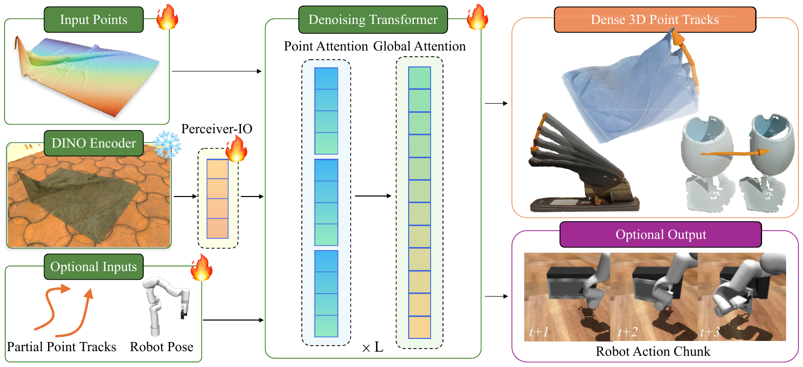
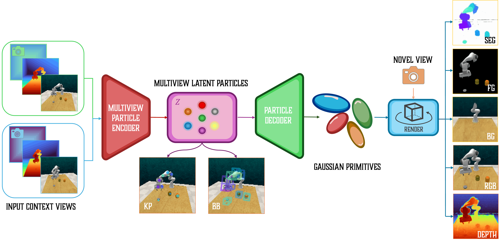
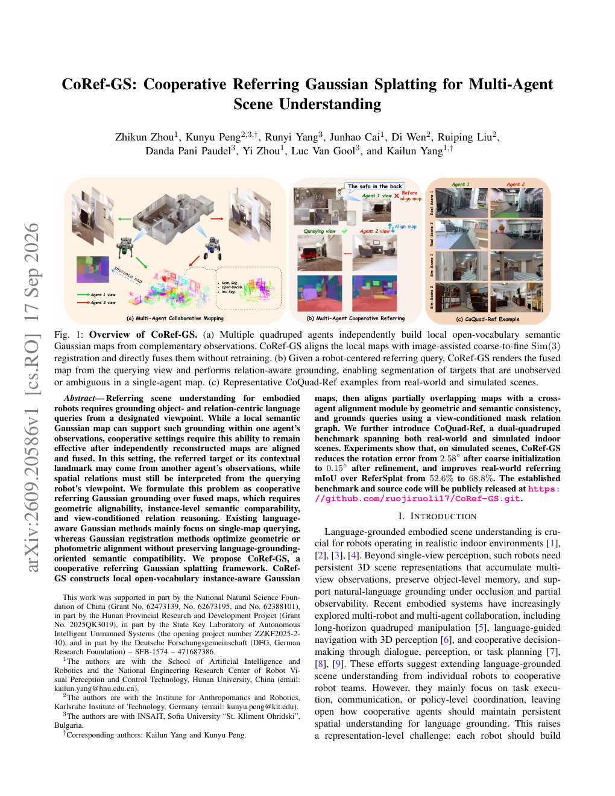
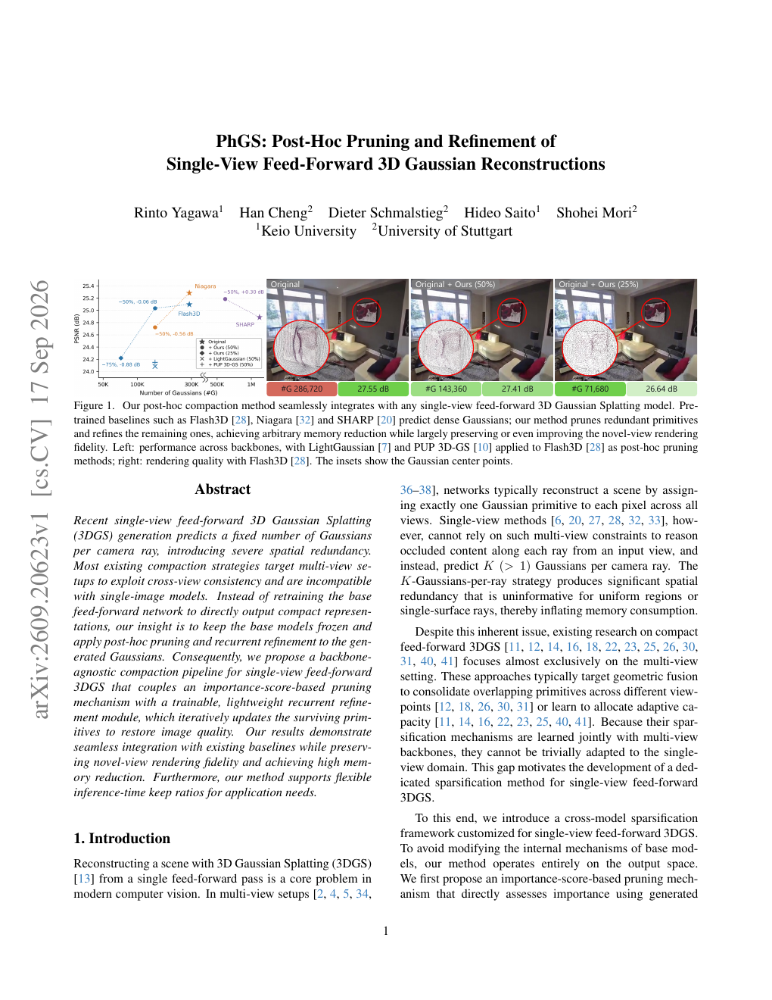
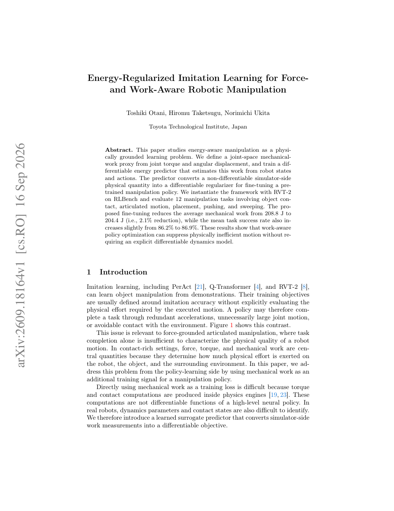

# 2026-09-20 科研日报

## 今日速览：无动作标签也能学 3D 动力学，粒子潜空间拆可编辑物体，合作地图仍能指代

周末无独立 arXiv 公告日，本期以 **9 月 16–17 日邻日积压**为主（均未进 `seen-papers`）。主线信号是：**世界模型预训练可以不靠机器人动作标签**（[PointZero](#2026-09-20--pointzero) 用 3D 点轨迹补全），**物体中心表示可以直接长成可编辑 3DGS**（[ParticleSplat](#2026-09-20--particlesplat)），多机协同下语言指代要在对齐后的高斯地图上成立（[CoRef-GS](#2026-09-20--corefgs)）。效率侧 [PhGS](#2026-09-20--phgs) 给前馈单图 3DGS 做事后剪枝；控制侧 [Energy-IL](#2026-09-20--energyil)（ECCV 2026 Workshop）把机械功做成可微正则。对 MiracleAug / Real2Sim2Real：下一步更该问的是 **示教增强是否可迁移到「无动作标签的动力学先验」与「可编辑物体粒子」**，而不只是再雕一个好看 mesh。

- **必读 [PointZero](#2026-09-20--pointzero)**（9 月 16 日积压）：单帧 RGB-D + 稀疏部分轨迹 → 预测全场未来 3D 点轨迹；2.9M 合成帧预训练，再后训练到动作条件动力学与模仿学习。
- **必读 [ParticleSplat](#2026-09-20--particlesplat)**（9 月 16 日积压）：自监督物体中心潜粒子 → 对齐 3DGS；无监督学 mask，并支持改粒子做可控场景编辑，下游操作任务受益。
- **选读 [CoRef-GS](#2026-09-20--corefgs)**（9 月 17 日积压）：多机局部开放词汇高斯地图对齐后仍做视点条件指代；附 CoQuad-Ref 双四足基准。
- **选读 [PhGS](#2026-09-20--phgs)**（9 月 17 日积压）：冻结前馈骨干，事后重要性剪枝 + 循环精修，压单图 3DGS 冗余。
- **选读 [Energy-IL](#2026-09-20--energyil)**（9 月 16 日积压 · ECCV 2026 Workshop）：用可微功预测器微调 RVT-2，略降机械功且不伤成功率。
- **[圈内新闻](#2026-09-20--community-news)**：Anthropic 披露 Claude 深度参与下一代模型研发；量子位续写具身「能力量产」基建叙事；Astra 对标仓与 blog／academic 仍无新 tip。

## 世界模型：先补全 3D 轨迹，再接机器人

### PointZero · arXiv · 2026-09-16

**必读（积压，对准主线）。** 多数动作条件 3D 动力学模型吃机器人动作标签，因而把网页视频挡在训练池外。PointZero 把预训练目标改成 **3D 点轨迹补全**：给定单帧 RGB-D 与稀疏部分 3D tracks，预测所有观测点的未来轨迹——不需要动作标签也能攒动力学先验。

论文信息、摘要与入口

- **Title：** PointZero: 3D Point Track Completion for Learning Transferable 3D Dynamics
- **作者：** Bardienus P. Duisterhof, Kaifeng Zhang, Adam Hung, Bowen Wen, Stan Birchfield, Yunzhu Li, Deva Ramanan, Jeffrey Ichnowski。
- **单位：** 摘要栏未标明稳定机构字段；项目页见入口。
- **发表时间：** arXiv 首次提交 2026-09-16；本期作为周末邻日积压首次收录。
- **投稿信息：** 预印本，未标明已接收 venue。
- **入口：** [arXiv](https://arxiv.org/abs/2609.19142) · [PDF](https://arxiv.org/pdf/2609.19142) · [项目页](https://pointzero-wm.github.io/) · [全文 HTML](https://arxiv.org/html/2609.19142v1)。
- **摘要中译（压缩）：** 世界模型让感知系统预测交互下场景如何演化；要学到丰富先验，通常需要大规模多样数据。既有方法多依赖机器人动作标签学动作条件三维动力学，从而把网络视频排除在训练池外。本文研究以三维点轨迹补全作为预训练目标，在无机器人数据条件下学习可迁移的三维动力学：给定单帧 RGB-D 与稀疏部分三维轨迹，预测所有观测点的未来三维轨迹。作者贡献覆盖可变形／铰接／刚体物体的 290 万帧合成数据集并训练 PointZero；灵活表达的 Transformer 在同数据上优于既有方法。下游两项后训练：（1）动作条件三维动力学预测；（2）模仿学习。以末端执行器位姿条件微调时，在近期 PGND 三维动力学基准上优于基线；微调预测机器人动作与三维轨迹时，在 6/7 项仿真与真机操作任务上优于或持平基线。另从零训练以隔离架构与预训练／数据贡献。数据集、权重与完整训练配方公开。

*项目页架构图，来源：作者项目页。点 token／部分轨迹／视觉 token → DiT 预测未来轨迹。*

**方法概要。** 编码器把点、部分轨迹与视觉特征打成 token，用 Diffusion／Flow matching 风格 Transformer 做轨迹补全；合成数据覆盖可变形、铰接与刚体。后训练两条：接末端状态做动作条件动力学；或同时预测动作与轨迹做模仿学习。评测含合成补全、零样本真实部分轨迹、PGND 与多项操作任务。

**值得关注。** 对 MiracleAug：示教视频往往有视觉与稀疏轨迹，却未必有干净动作标签；「轨迹补全先验 → 再条件化动作」比一上来端到端吃动作更贴近弱传感入口。与昨日报 Track Articulate Act 的点轨迹不变量同族，但 PointZero 把目标写成可规模预训练的世界模型。证据边界：下游成功是后训练后的动力学／IL 指标；不等于已验证大规模真机闭环或自动失败造数。

## 可编辑资产：潜粒子直接溅成物体级 3DGS

### ParticleSplat · arXiv · 2026-09-16

**必读（积压）。** Deep Latent Particles 一类物体中心表示多是 2D，难直接服务操作所需的三维几何。ParticleSplat 利用「潜粒子 ↔ 3D 高斯」结构相似，用新视角合成目标学出 **共享 3D 物体中心潜空间**，再把粒子变成对齐的 3DGS 拼回整场。

论文信息、摘要与入口

- **Title：** ParticleSplat: Self-supervised Object-centric Latent Particle Splatting
- **作者：** Lyuxing He, Daniel Guo, Elizabeth Terveen, Deepak Pathak, David Held, Tal Daniel。
- **单位：** 摘要栏未标明稳定机构字段；项目页见入口。
- **发表时间：** arXiv 首次提交 2026-09-16；本期作为周末邻日积压首次收录。
- **投稿信息：** 预印本，未标明已接收 venue。
- **入口：** [arXiv](https://arxiv.org/abs/2609.19463) · [PDF](https://arxiv.org/pdf/2609.19463) · [项目页](https://lyuxinghe.github.io/ParticleSplat-website/) · [全文 HTML](https://arxiv.org/html/2609.19463v1)。
- **摘要中译（压缩）：** ParticleSplat 是自监督物体中心学习方法：通过前馈三维高斯溅射把场景分解为一组表示语义实体的潜「粒子」。既有 Deep Latent Particles（DLP）把图像表示为带位置／尺度／外观属性的粒子集合，但其固有二维性妨碍显式三维空间与几何推理——而这正是机器人操作等下游任务所需要的。利用潜粒子与三维高斯基元的结构相似性，引入以新视角合成为目标训练的三维潜粒子空间：模型联合编码多视角与相机位姿到共享三维物体中心潜空间，再把粒子变换为粒子对齐的三维高斯并合成整场。在仿真与真实数据上，该方法无监督即学得物体 mask，并支持在潜空间改粒子以做可控三维场景编辑；所学三维表示进一步提升下游机器人操作表现。

*项目页架构图，来源：作者项目页。多视角 → 潜粒子 → 对齐 3DGS → 可编辑重建。*

**方法概要。** 多视角编码进共享 3D 潜粒子；前景粒子经「规范补丁高斯 → 像平面高斯 → 世界系 3DGS」三级变换，背景粒子另路落到世界系；可微渲染 + 重建／KL／粒子正则。演示无监督 mask 与移动粒子做编辑，并接到操作下游。

**值得关注。** 对拆分—绑定与示教增强：可把「物体级可编辑单元」写成 agent 可调用的表示，而不是事后手工切 mesh。与 MiracleAug「可编辑 Blender 资产」对照时，ParticleSplat 更偏视觉可编辑 3DGS，物理接触／URDF 仍要另接。证据边界：编辑与操作增益以作者设定为准；勿把潜空间平移外推成已验证接触动力学正确。

## 多机语义地图：对齐之后还要会「从我这边指」

### CoRef-GS · arXiv · 2026-09-17

**选读（积压 · 具身感知）。** 单机语义高斯地图能做开放词汇指代；多机融合后，目标或地标可能来自另一台机的观测，关系却仍要从查询机视点理解。CoRef-GS 把问题写成 **融合地图上的合作指代高斯 grounding**。

论文信息、摘要与入口

- **Title：** CoRef-GS: Cooperative Referring Gaussian Splatting for Multi-Agent Scene Understanding
- **作者：** Zhikun Zhou, Kunyu Peng, Runyi Yang, Junhao Cai, Di Wen, Ruiping Liu, Danda Pani Paudel, Yi Zhou, Luc Van Gool, Kailun Yang。
- **单位：** 湖南大学人工智能与机器人学院／机器人视觉感知与控制技术国家工程研究中心；Karlsruhe Institute of Technology 等（据 HTML 作者栏）。
- **发表时间：** arXiv 首次提交 2026-09-17；本期作为周末邻日积压首次收录。
- **投稿信息：** 预印本，未标明已接收 venue；Comments 称基准与代码将公开。
- **入口：** [arXiv](https://arxiv.org/abs/2609.20586) · [PDF](https://arxiv.org/pdf/2609.20586) · [代码仓（预告）](https://github.com/ruojiruoli17/CoRef-GS.git) · [全文 HTML](https://arxiv.org/html/2609.20586v1)。
- **摘要中译（压缩）：** 具身机器人的指代场景理解需要从指定视点 grounding 物体与关系中心的语言查询。局部语义高斯地图可支撑单机观测内的 grounding，但合作设定要求在独立重建地图对齐融合后仍有效：被指目标或其上下文地标可能来自另一台机的观测，空间关系却仍须从查询机器人视点解释。本文将问题形式化为融合地图上的合作指代高斯 grounding，需几何可对齐、实例级语义可比较与视点条件关系推理。既有语言感知高斯方法多聚焦单图查询，而高斯配准多优化几何／光度对齐、未必保留面向语言 grounding 的语义可比性。提出 CoRef-GS：构建局部开放词汇实例感知高斯地图，用跨机对齐模块按几何与语义一致性对齐部分重叠地图，并以视点条件 mask 关系图 grounding 查询。另引入覆盖真实与仿真室内场景的双四足基准 CoQuad-Ref。仿真上旋转误差由粗初始化 2.58° 细化到 0.15°；真实指代 mIoU 相对 ReferSplat 由 52.6% 提到 68.8%。

*论文首页渲染，来源：作者 PDF 首页。局部地图 → 跨机对齐 → 视点条件指代。*

**方法概要。** 各机构建实例感知开放词汇高斯地图；Cross-Agent Alignment 同时抠几何与语义一致性；查询侧用视点条件 mask 关系图做关系推理。CoQuad-Ref 提供双四足真实／仿真室内评测。

**值得关注。** 对多机／多相机 Real2Sim：MiracleAug 类管线若扩到多视角采集，对齐不只是点云 ICP——语义实例要可对上，指代才站得住。证据边界：数字来自作者报告的 CoQuad-Ref／对照 ReferSplat；代码「将公开」以仓实际 release 为准。

## 前馈 3DGS：冻住骨干，事后剪枝再修回来

### PhGS · arXiv · 2026-09-17

**选读（积压 · 表示效率）。** 单图前馈 3DGS 常按射线固定数量吐高斯，空间冗余大；多视角压缩套路又用不了。PhGS 的洞察是：**不重训骨干**，对生成结果做事后重要性剪枝，再用轻量循环模块把质量修回来，并支持推理期灵活 keep ratio。

论文信息、摘要与入口

- **Title：** PhGS: Post-Hoc Pruning and Refinement of Single-View Feed-Forward 3D Gaussian Reconstructions
- **作者：** Rinto Yagawa, Han Cheng, Dieter Schmalstieg, Hideo Saito, Shohei Mori。
- **单位：** 摘要栏未标明稳定机构字段。
- **发表时间：** arXiv 首次提交 2026-09-17；本期作为周末邻日积压首次收录。
- **投稿信息：** 预印本，未标明已接收 venue。
- **入口：** [arXiv](https://arxiv.org/abs/2609.20623) · [PDF](https://arxiv.org/pdf/2609.20623) · [全文 HTML](https://arxiv.org/html/2609.20623v1)。项目页／代码：本期摘要栏未标明稳定公开仓。
- **摘要中译（压缩）：** 近期单图前馈三维高斯溅射按每条相机射线预测固定数量高斯，引入严重空间冗余。多数压缩策略面向多视角、依赖跨视角一致性，与单图模型不兼容。本文不重训基座前馈网络去直接输出紧凑表示，而是冻结基座，对已生成高斯做事后剪枝与循环精修。提出与骨干无关的单图前馈 3DGS 压缩流水线：重要性分数剪枝 + 可训练轻量循环精修模块，迭代更新存活基元以恢复图像质量。结果表明可无缝接入既有基线，在保持新视角保真的同时显著降内存，并支持按应用需求调节推理期保留比例。

*论文首页 teaser 渲染，来源：作者 PDF 首页。剪枝前后质量／内存对照示意。*

**方法概要。** 重要性分数决定删哪些高斯；循环精修模块在冻结骨干上迭代更新存活参数；训练目标恢复渲染质量。强调与多种单图前馈骨干即插即用，以及未见 keep ratio 的鲁棒性。

**值得关注。** 对批渲染／示教舰队：前馈重建若先「过密再剪」，比一上来重训紧凑头更省工程；与 MiracleAug 卡点「正向／批渲染开销」同问——表示体积先降，再谈吞吐。证据边界：主主张是单图前馈设定下的内存—质量折中；不等于已解决大规模动态场景流式批渲染。

## 操作策略：把「费不费劲」写进微调

### Energy-IL · ECCV 2026 Workshop · 2026-09-16

**选读（积压 · 力／功感知）。** 稿面标注 ECCV 2026 Workshop on Force-Grounded, Cross-View Articulated Manipulation。用关节力矩 × 角位移定义机械功代理，训可微能量预测器，把仿真器侧不可微物理量变成预训练操作策略的微调正则。

论文信息、摘要与入口

- **Title：** Energy-Regularized Imitation Learning for Force- and Work-Aware Robotic Manipulation
- **作者：** Toshiki Otani, Hiromu Taketsugu, Norimichi Ukita。
- **单位：** Toyota Technological Institute, Japan（据 HTML 作者栏）。
- **发表时间：** arXiv 首次提交 2026-09-16；本期作为周末邻日积压首次收录。
- **投稿信息：** Comments 标注 ECCV 2026 Workshop on Force-Grounded, Cross-View Articulated Manipulation；按研讨会稿处理（以稿面声明为准，非主会口头等同）。
- **入口：** [arXiv](https://arxiv.org/abs/2609.18164) · [PDF](https://arxiv.org/pdf/2609.18164) · [全文 HTML](https://arxiv.org/html/2609.18164v1)。
- **摘要中译（压缩）：** 本文将能量感知操作作为有物理根基的学习问题：由关节力矩与角位移定义关节空间机械功代理，并训练可微能量预测器，从机器人状态与动作估计该功。预测器把仿真器侧不可微物理量变成可微正则，用于微调预训练操作策略。框架以 RVT-2 在 RLBench 上实例化，评估含接触、铰接运动、放置、推与扫的 12 项任务。所提微调把平均机械功从 208.8 J 降到 204.4 J（约 2.1%），平均任务成功率由 86.2% 略升至 86.9%。表明功感知策略优化可在无需显式可微动力学模型的条件下抑制物理低效运动。

*论文首页 teaser 渲染，来源：作者 PDF 首页。功预测器 → 策略微调示意。*

**方法概要。** 离线从仿真 rollout 采集功标签训能量头；微调时用预测功作正则，过滤非典型样本，在 RVT-2 特征上落地。消融含能量权重与内部特征用法。

**值得关注。** 对示教增强验收：除「任务成功」外，可用功／力代理做第二指标——增强轨迹若又成功又更省功，更像物理上合理。证据边界：2.1% 功降与成功率微升是 RLBench／RVT-2 报告；勿外推成真机大增益或通用力控。

## 圈内新闻与社区反应

**Anthropic：Claude 已深度参与下一代模型研发。** 2026-09-18，[Los Angeles Times](https://www.latimes.com/business/story/2026-09-18/anthropics-claude-starts-building-its-own-successor-as-ai-safety-debate-intensifies) 报道 Anthropic 披露 Claude「主导」约 26% 的模型研发任务——在高阶 prompt 下可端到端完成大部分工作，但仍在人类监督下。**社区／独立反馈：** 报道同时置于 AI 安全放缓争论语境；截稿前未见可对等的第三方复现实验。**为何值得看：** Agent 从「写代码助手」扩到「参与训练自身继任者」——与科研侧 agentic 管线同构的是监督边界，而不是口号式自治。

**量子位：具身「能力量产」与云基建叙事（跨日，无新独立证据则短写）。** 2026-09-18，[量子位长文](https://www.qbitai.com/2026/09/492238.html)继续转述 9 月 16 日智能经济论坛上百度智能云侧观点：本体量产之后关键是数据持续生产与跨本体部署；文中引用百舸与多家具身公司合作案例。昨日报已展开，**本期仅作日期锚定**，无新可核验基准则不重复长写。**社区／独立反馈：** 仍以厂商论坛与媒体转述为主。

**Ke-Sen／SIGGRAPH 索引。** [Ke-Sen SIGGRAPH 索引](https://kesen.realtimerendering.com/) 仍维护公开条目；截稿未见与本日积压论文直接对应的新「必读清单」变更，故不展开单篇。

**兴趣校准与对标仓。** `rubatotree/blog` 最近实质博文仍为 2026-09-10 MiracleAug；`rubatotree/academic` 自昨日报以来无新 commit。[`hku-sail/Real2Sim_GPT6_ASTRA`](https://github.com/hku-sail/Real2Sim_GPT6_ASTRA) tip 仍为 `a1624d6`（2026-09-10），无实质更新，本期不展开。

---

## 覆盖说明

- **日报日期：** 2026-09-20（发布日，Asia/Hong_Kong）
- **内容覆盖：** 2026-09-19（周六）为主窗口；因周末无独立 arXiv 公告，收录 2026-09-16–17 邻日积压五篇并已逐篇标注。论文首次挂出日以 arXiv 为准；Energy-IL 研讨会归属以稿面 Comments 为准。
- **完备性：** 正常主责准时发布。arXiv cs.GR／关键词漏斗 + 网页检索；圈内含 LA Times／量子位与 Ke-Sen 扫视；未依赖 X 关键词检索。部分作者单位摘要栏未给出稳定字段，已如实注明。blog／academic／Astra 对标仓无新 commit。
- **编写：** Cream
