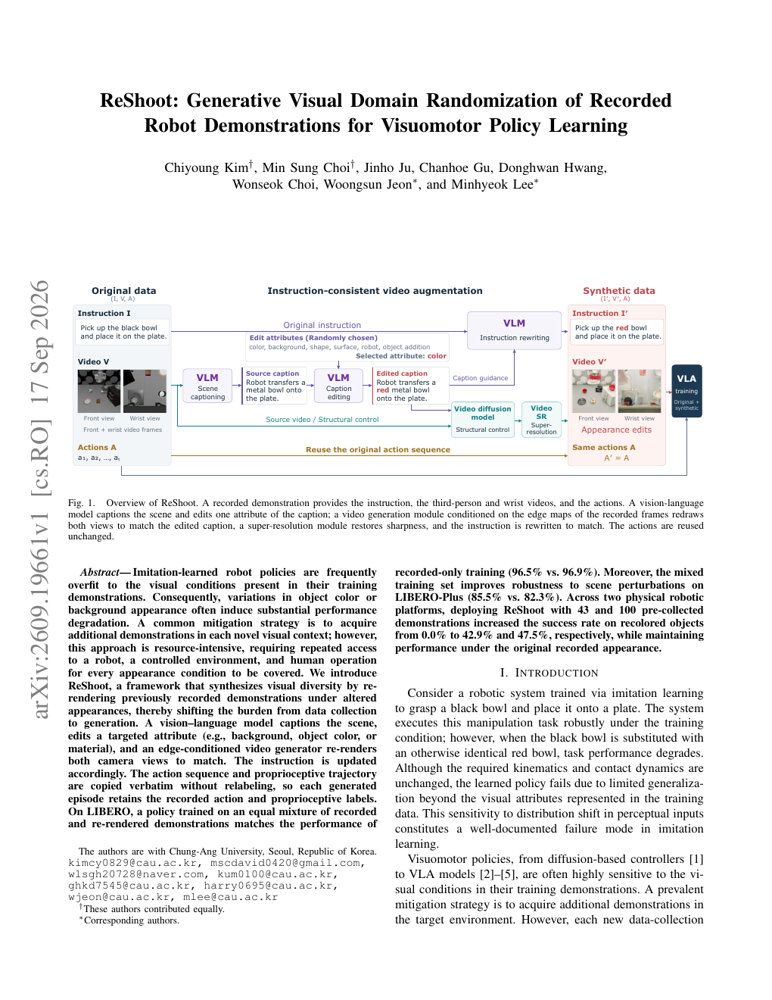
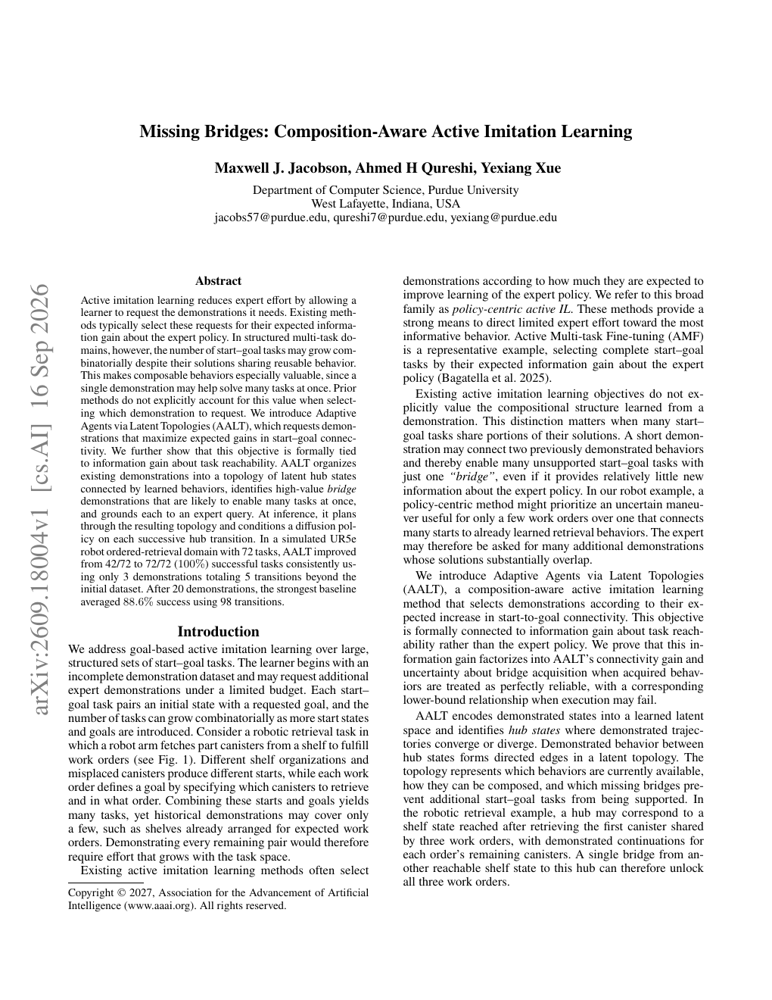
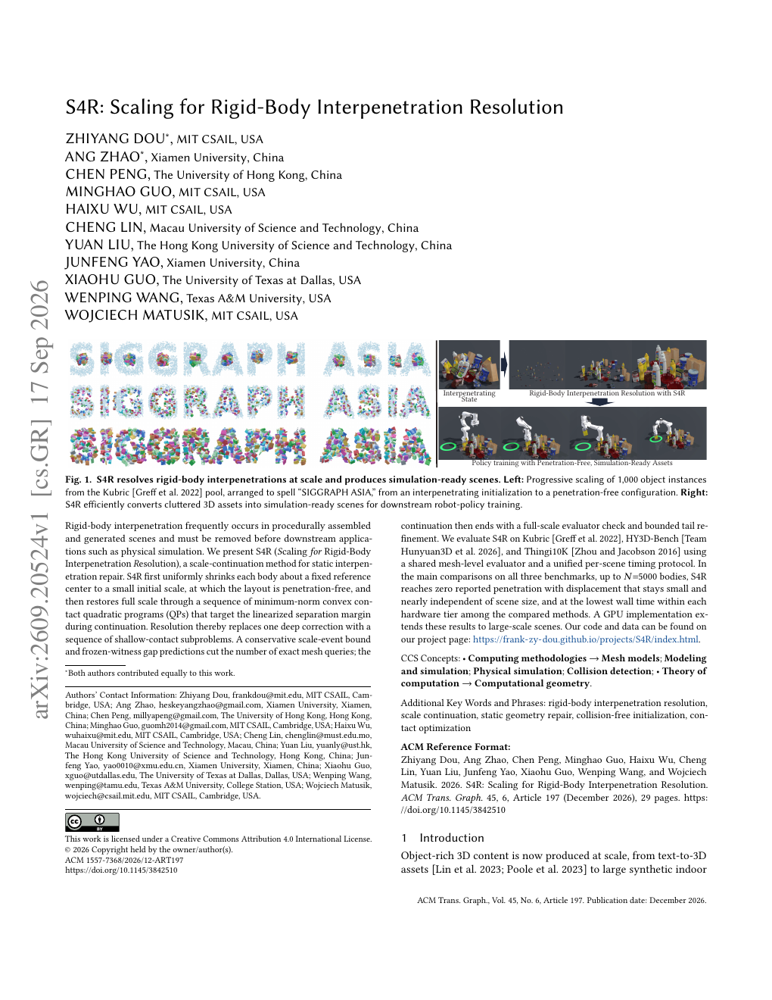
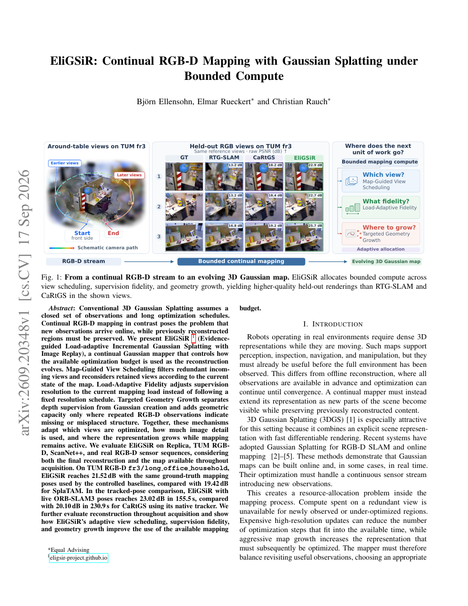
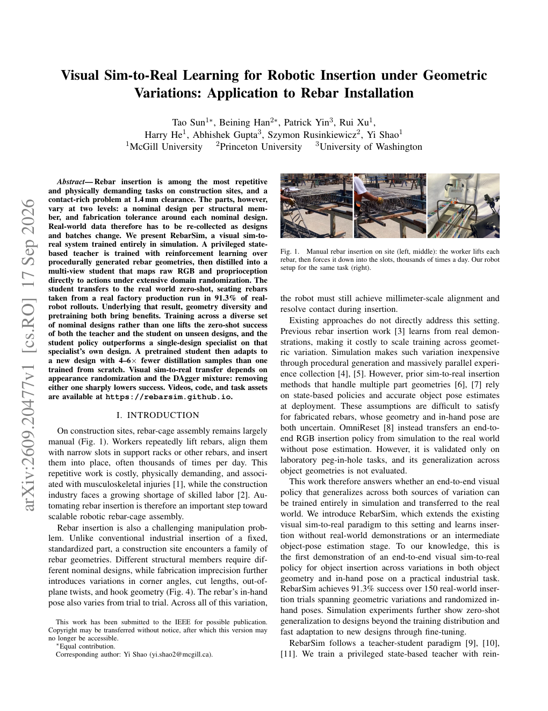

# 2026-09-21 科研日报

## 今日速览：示教视频可「重拍」外观，主动要桥接演示，穿模修好再仿真

内容日为周日，**无独立 arXiv 公告**；本期继续消化 **9 月 16–17 日邻日积压**（均未进 `seen-papers`）。主线信号对准 MiracleAug / Real2Sim2Real：**示教增强不必再进真机房**（[ReShoot](#2026-09-21--reshoot) 用结构条件视频生成重渲染已录演示），**该向专家要哪条演示**可以按「连通多少 start–goal」来选（[Missing Bridges](#2026-09-21--missingbridges)），生成／拼装场景要先变成 **无穿模、可仿真**（[S4R](#2026-09-21--s4r)，SIGGRAPH Asia 2026）。重建侧 [EliGSiR](#2026-09-21--eligsir) 在算力封顶下做持续 RGB-D 高斯建图；操作侧 [RebarSim](#2026-09-21--rebarsim) 用纯视觉 sim-to-real 扛几何族变异的插入。合在一起看：下一步更该问的是 **外观多样化能否不碰动作标签、失败／缺口能否驱动「要哪条桥」、资产入库前是否先过穿模修复**。

- **必读 [ReShoot](#2026-09-21--reshoot)**（9 月 17 日积压）：VLM 改属性 + 边缘条件视频生成，双视角重渲染；动作与本体感觉原样复用，不重标。
- **必读 [Missing Bridges](#2026-09-21--missingbridges)**（9 月 16 日积压）：主动模仿按 start–goal 连通增益要演示；UR5e 有序取物 72 任务上，3 条桥接演示即可从 42/72 拉到 72/72。
- **必读 [S4R](#2026-09-21--s4r)**（9 月 17 日积压 · SIGGRAPH Asia 2026 / TOG）：尺度延拓把刚体穿模修成可仿真布局，服务下游策略训练资产。
- **选读 [EliGSiR](#2026-09-21--eligsir)**（9 月 17 日积压）：地图引导选视角、负载自适应保真、定向长几何——持续高斯建图的算力预算分配。
- **选读 [RebarSim](#2026-09-21--rebarsim)**（9 月 17 日积压）：特权教师 RL → 多视角学生，零样本真机钢筋插入约 91.3%。
- **[圈内新闻](#2026-09-21--community-news)**：Anthropic R&D 自动化指数后续解读；具身「智能体编程」第三条路讨论；Astra 对标仓仍无新 tip。

## 示教增强：外观重拍，动作原封不动

### ReShoot · arXiv · 2026-09-17

**必读（积压，对准主线）。** 模仿策略常过拟合训练演示里的外观；换物体颜色或背景就塌。常见补救是每个新外观再采一轮演示——贵在真机与人力。ReShoot 把负担从「采集」挪到「生成」：对已录演示做结构条件重渲染，**动作序列与本体感觉轨迹原样拷贝**，不重估标签。

论文信息、摘要与入口

- **Title：** ReShoot: Generative Visual Domain Randomization of Recorded Robot Demonstrations for Visuomotor Policy Learning
- **作者：** Chiyoung Kim, Min Sung Choi, Jinho Ju, Chanhoe Gu, Donghwan Hwang, Wonseok Choi, Woongsun Jeon, Minhyeok Lee。
- **单位：** 摘要栏未标明稳定机构字段；稿面 †／∗ 标注见 PDF。
- **发表时间：** arXiv 首次提交 2026-09-17；本期作为周日邻日积压首次收录。
- **投稿信息：** 预印本，未标明已接收 venue。
- **入口：** [arXiv](https://arxiv.org/abs/2609.19661) · [PDF](https://arxiv.org/pdf/2609.19661) · [全文 HTML](https://arxiv.org/html/2609.19661v1)。
- **摘要中译（压缩）：** 模仿学习策略常过拟合训练演示的视觉条件；物体颜色或背景一变，性能往往大幅下降。常见做法是在每个新视觉情境下再采演示，但成本高——每次都要真机、受控场景与人工操作。本文提出 ReShoot：通过在改外观条件下重渲染已录演示来合成视觉多样性，把负担从采集转到生成。视觉—语言模型给场景打 caption、编辑目标属性（背景、物体颜色或材质等），边缘条件视频生成器按结构重绘相机视角，并同步改写指令。动作序列与本体感觉轨迹原样复用、无需重标，故每条生成 episode 保留录制标签。在 LIBERO 上，等量混合真实与重渲染演示训练的策略，可匹配「在多种真实外观下重采」的性能，而无需额外真机时间。

*论文首页 teaser 渲染，来源：作者 PDF 首页。VLM 改属性 → 视频扩散重绘双视角 → 复用原动作。*

**方法概要。** 管线吃 (指令, 多视角视频, 动作)。VLM 做场景描述与属性编辑；结构／边缘条件视频模型按源运动重绘第三人称与腕部视角，使新外观在双视角一致；指令随属性改写。动作与本体感觉时间对齐拷贝，避免「先生成视频再反推动作」的标签噪声。评测以 LIBERO 为主，对照真实重采与多种增强基线。

**值得关注。** 对 MiracleAug：示教增强若卡在「换外观就要再进实验室」，ReShoot 给出第三条路——**保留录制动作，只重拍像素**。与博文卡点「无示教轨迹生成时物理校验很久」对照：本方法刻意不新造轨迹，因此不解决接触／动力学多样性，但极大降低外观域随机化成本。证据边界：主结果是 LIBERO 视觉泛化；不等于已验证接触丰富真机任务或与失败驱动造数闭环打通。

## 主动模仿：要能「桥」起最多任务的那条演示

### Missing Bridges · arXiv · 2026-09-16

**必读（积压 · 失败／缺口驱动造数）。** 主动模仿通常按「对专家策略的信息增益」要演示。多任务结构化域里，start–goal 组合爆炸，但解共享可复用行为——一条短「桥」可能一次性打通许多任务。Missing Bridges 把目标改成 **期望的 start–goal 连通增益**，并证明它与任务可达性信息增益形式相关。

论文信息、摘要与入口

- **Title：** Missing Bridges: Composition-Aware Active Imitation Learning
- **作者：** Maxwell J. Jacobson, Ahmed H Qureshi, Yexiang Xue。
- **单位：** Purdue University, Department of Computer Science。
- **发表时间：** arXiv 首次提交 2026-09-16；本期作为周日邻日积压首次收录。
- **投稿信息：** 预印本；稿面版权行见 AAAI 相关声明，是否录用以正式通知为准，本期按预印本处理。
- **入口：** [arXiv](https://arxiv.org/abs/2609.18004) · [PDF](https://arxiv.org/pdf/2609.18004) · [全文 HTML](https://arxiv.org/html/2609.18004v1)。
- **摘要中译（压缩）：** 主动模仿学习通过让学习者请求所需演示来降低专家成本。既有方法多按对专家策略的期望信息增益选请求。在结构化多任务域中，start–goal 任务数可组合爆炸，但其解共享可复用行为，使可组合行为尤其值钱——单条演示可助解多任务。先前方法选演示时未显式计入该价值。本文提出 Adaptive Agents via Latent Topologies (AALT)：请求能最大化期望 start–goal 连通增益的演示，并证明该目标与任务可达性信息增益形式相关。AALT 把已有演示组织为潜在枢纽状态拓扑、由学到的行为连边，识别高价值桥接演示并落到专家查询。推理时经拓扑规划，并将扩散策略条件在相继枢纽转移上。在含 72 任务的仿真 UR5e 有序取物域，AALT 仅用额外 3 条演示（共 5 段转移）即从 42/72 稳定提到 72/72（100%）；20 条演示预算下，最强基线平均 88.6% 成功却用了 98 段转移。

*论文首页 teaser 渲染，来源：作者 PDF 首页。潜在枢纽拓扑 → 桥接演示 → 任务连通。*

**方法概要。** 演示状态编到潜空间，识别汇聚／分叉的 hub；hub 间已演示行为成有向边。主动阶段估「哪条缺失桥」能最大提升 start–goal 可达；要到演示后更新拓扑。执行侧在 hub 转移上条件化扩散策略并串联。评测为 UR5e 有序取物组合任务，对照策略中心主动 IL。

**值得关注。** 对「弱点驱动造数／DAgger 类回环」：MiracleAug 路线若从「人指定增强类型」走向「系统判断最值得补什么」，Missing Bridges 提供可对照的公开目标——**连通缺口**比「策略熵最高的那步」更贴组合任务。证据边界：72 任务仿真域与作者报告数字；勿外推成真机多任务库的自动要数系统。

## 仿真就绪：先把穿模按尺度延拓修干净

### S4R · SIGGRAPH Asia 2026 / TOG · 2026-09-17

**必读（积压 · 资产入库）。** 程序化拼装与生成式场景常有刚体穿模，不修就不能进物理仿真。S4R 用尺度延拓：先绕参考中心整体缩小到无穿模，再经一系列最小范数凸接触 QP 逐步恢复全尺寸，把一次「深纠正」拆成多个浅接触子问题。

论文信息、摘要与入口

- **Title：** S4R: Scaling for Rigid-Body Interpenetration Resolution
- **作者：** Zhiyang Dou, Ang Zhao, Chen Peng, Minghao Guo, Haixu Wu, Cheng Lin, Yuan Liu, Junfeng Yao, Xiaohu Guo, Wenping Wang, Wojciech Matusik。
- **单位：** MIT CSAIL；厦门大学；香港大学；澳门科技大学；香港科技大学；UT Dallas；Texas A&M 等（据 PDF 作者栏）。
- **发表时间：** arXiv 首次提交 2026-09-17；ACM TOG 45(6) Article（SIGGRAPH Asia 2026）稿面信息见 PDF。
- **投稿信息：** 稿面标明 ACM Trans. Graph. / SIGGRAPH Asia 2026；DOI 字段见 PDF（以正式 ACM 记录为准）。
- **入口：** [arXiv](https://arxiv.org/abs/2609.20524) · [PDF](https://arxiv.org/pdf/2609.20524) · [项目页](https://frank-zy-dou.github.io/projects/S4R/index.html)。
- **摘要中译（压缩）：** 程序化装配与生成场景中刚体穿模常见，下游物理仿真前必须消除。本文提出 S4R（Scaling for Rigid-Body Interpenetration Resolution）：尺度延拓式静态穿模修复。先将各刚体绕固定参考中心均匀缩至初始小尺度（此时布局无穿模），再通过一系列最小范数凸接触二次规划，在延拓过程中瞄准线性化分离裕度，逐步恢复全尺寸——从而用一串浅接触子问题替代一次深纠正。保守尺度事件界与冻结见证间隙预测减少精确网格查询；延拓结束做全尺度评估检查与有界尾修。在 Kubric、HY3D-Bench、Thingi10K 上用统一网格级评估与计时协议比较；主对比中物体数至 N=5000 时，S4R 达到零报告穿模，位移小且几乎与场景规模无关，并在各硬件档位中墙钟时间最低。另提供 GPU 实现以扩展大规模场景。代码与数据见项目页。

*论文首页 teaser 渲染，来源：作者 PDF 首页。穿模布局 → 无穿模可仿真资产 → 策略训练。*

**方法概要。** 缩小至无接触 → 尺度延拓中反复解接触 QP → 全尺度评估与尾修；用尺度事件界与见证预测砍查询次数。基准覆盖合成拼装与生成资产；强调位移幅度与墙钟时间，并展示下游机器人策略训练用资产。

**值得关注。** 对 agentic Real2Sim：LLM／生成管线吐出的 mesh 场景入库前，穿模修复是可调用的几何技能——S4R 把「能仿真」写成可扩展预处理，而不是人工挪物体。与 MiracleAug「可编辑 Blender 资产」对照：本方法管刚体静态布局，不管外观或铰接。证据边界：主指标是网格级穿模与位移／时间；不等于接触丰富操作的动力学已对齐真机。

## 持续建图：算力封顶时下一单位算力花在哪

### EliGSiR · arXiv · 2026-09-17

**选读（积压 · 表示／建图效率）。** 经典 3DGS 假设观测闭集与长优化；持续 RGB-D 建图则要一边吃新观测、一边保住旧区域，且算力有界。EliGSiR 把问题写成 **优化预算如何随地图演化分配**：地图引导的视角调度、负载自适应保真、以及按需长几何。

论文信息、摘要与入口

- **Title：** EliGSiR: Continual RGB-D Mapping with Gaussian Splatting under Bounded Compute
- **作者：** Björn Ellensohn, Elmar Rueckert, Christian Rauch。
- **单位：** 摘要栏未标明稳定机构字段；作者署名见 PDF。
- **发表时间：** arXiv 首次提交 2026-09-17；本期作为周日邻日积压首次收录。
- **投稿信息：** 预印本，未标明已接收 venue。
- **入口：** [arXiv](https://arxiv.org/abs/2609.20348) · [PDF](https://arxiv.org/pdf/2609.20348) · [全文 HTML](https://arxiv.org/html/2609.20348v1)。
- **摘要中译（压缩）：** 常规三维高斯溅射假设观测闭集与较长优化日程。持续 RGB-D 建图则要求新观测在线到达，同时保留已重建区域。本文提出 EliGSiR（Evidence-guided Load-adaptive Incremental Gaussian Splatting with Image Replay）：随重建演化控制可用优化预算的用法。Map-Guided View Scheduling 过滤冗余入视角，并按当前地图状态重审保留视角；Load-Adaptive Fidelity 按当前建图负载调节监督分辨率，而非固定分辨率日程；Targeted Geometry Growth 将深度监督与高斯创建解耦，仅在重复 RGB-D 证据表明几何缺失处增加容量。图像回放用于巩固旧区域。在持续建图设定下相对近期高斯 SLAM／建图基线，报告在有界计算下更好的新视角质量与旧区域保持。

*论文首页 teaser 渲染，来源：作者 PDF 首页。选哪帧、保真多少、何处长几何。*

**方法概要。** 三块调度：哪些视角值得优化、当前负载下用多高分辨率监督、何处根据重复证据长新高斯；配合图像回放抗遗忘。评测含 TUM 等持续路径设定，对照 RTG-SLAM、CaRtGS 等。

**值得关注。** 对手机采集 → 可仿真资产：现场扫描很少能「一次拍齐再开长优化」；有界预算下的增量高斯建图更贴近 Real2Sim 入口。证据边界：主结果是建图／新视角指标；不宣称已接到可交互物理或策略训练。

## 接触插入：几何族变异下的视觉 sim-to-real

### RebarSim · arXiv · 2026-09-17

**选读（积压 · sim-to-real）。** 钢筋插入既是工地高频重活，也是约 1.4 mm 间隙的接触富任务；零件还有两层变异——构件级名义设计 + 加工公差。真机数据因而随设计／批次失效。RebarSim 全程在仿真训练：特权状态教师 RL，再蒸馏成多视角 RGB+本体感觉学生，零样本上真机。

论文信息、摘要与入口

- **Title：** Visual Sim-to-Real Learning for Robotic Insertion under Geometric Variations: Application to Rebar Installation
- **作者：** Tao Sun, Beining Han, Patrick Yin, Rui Xu, Harry He, Abhishek Gupta, Szymon Rusinkiewicz, Yi Shao。
- **单位：** McGill University；Princeton University；University of Washington（据 PDF）。
- **发表时间：** arXiv 首次提交 2026-09-17；本期作为周日邻日积压首次收录。
- **投稿信息：** 预印本；稿面含 IEEE 投稿声明，是否录用以正式通知为准。
- **入口：** [arXiv](https://arxiv.org/abs/2609.20477) · [PDF](https://arxiv.org/pdf/2609.20477) · [项目页](https://rebarsim.github.io)。
- **摘要中译（压缩）：** 钢筋插入是工地最重复、最耗体力的任务之一，也是约 1.4 mm 间隙的接触富问题。零件在两层变化：各结构构件的名义设计，以及名义设计周围的加工公差。真机数据因此必须随设计与批次重采。本文提出 RebarSim：完全在仿真中训练的视觉 sim-to-real 系统。先在程序化生成的钢筋几何上用强化学习训练特权状态教师，再蒸馏为多视角学生，在广泛域随机化下直接从原始 RGB 与本体感觉映射到动作。学生零样本迁移到真机，在真实工厂生产批次钢筋上达到约 91.3% 的真机 rollout 成功率。几何多样性与预训练均带来收益：跨多种名义设计训练相对单设计，能提升教师与学生对未见设计的零样本成功；预训练学生适配新设计所需蒸馏样本约为从头训练的 1/4–1/6。视觉 sim-to-real 依赖外观随机化与 DAgger 混合：去掉任一项成功率显著下降。视频、代码与任务资产见项目页。

*论文首页 teaser 渲染，来源：作者 PDF 首页。工地钢筋插入 → 机器人设置。*

**方法概要。** 程序化几何生成教师经验 → 多视角学生蒸馏（DAgger）→ 外观／传感器域随机化 → 零样本真机。消融强调多名义设计训练、预训练迁移样本效率，以及随机化与 DAgger 的必要性。

**值得关注。** 对 Real2Sim2Real：接触富插入若不能为每个几何重采真机示教，就需要「仿真里覆盖几何族 + 视觉策略零样本」。与 MiracleAug「示教增强」互补——一边扩演示分布，一边问策略能否在仿真几何族上先站稳。证据边界：91.3% 为作者报告的真机钢筋插入设定；勿外推成通用装配或已公开可复现的第三方评测。

## 圈内新闻与社区反应

**Anthropic R&D 自动化指数：数字之后怎么读（跨日续写）。** 2026-09-17，Anthropic 在 [Institute 博文](https://www.anthropic.com/institute/measuring-pace-of-ai-development) 发布原型 **R&D Automation Index**：截至 2026-08，Claude「主导」约 26% 的 AI R&D 工作（「主导」= 高阶 prompt 下端到端完成大部分、人类监督），≥「协作」占比超过 90%，**测得子集中无完全自治**。Reuters／Bloomberg 等于 9 月 17–18 日报导；昨日报已引 LA Times。**社区／独立反馈：** 公开解读强调该指数是**任务自动化分级的加权聚合**，不等于「研发加速 26%」或「模型在无人设计自己」；第三方复核分类与任务篮子仍待后续更新。**为何值得看：** 与科研 agentic 管线同构的是**可审计的监督边界**，而不是口号式自治。

**具身「智能体编程」第三条路（社区讨论，9 月 19 日前后）。** X 等社区转发并讨论 Ken Goldberg、Animesh Garg 等关于 **agentic robotics / “vibe engineering”** 的表述：用多智能体「计划—执行—验证—修复」循环离线写／测／修机器人程序，而非只堆演示数据或纯手工编码；HARBOR 一类工具被当作仿真工作流自动化例子提及。**社区／独立反馈：** 多为演讲／访谈转述与开发者讨论，截稿前未核到单一可对等的正式论文主结果；物理实测瓶颈仍被普遍强调。**为何值得看：** 与 MiracleAug「agent 调 Blender／仿真器」同族——差别在公开材料把重点写成 **程序合成与权限／测试约束**，而不只是示教增强。

**Ke-Sen／SIGGRAPH 索引。** [Ke-Sen SIGGRAPH 索引](https://kesen.realtimerendering.com/) 仍维护公开条目；截稿未见需单独展开的新「必读清单」变更。

**兴趣校准与对标仓。** `rubatotree/blog` 最近实质博文仍为 2026-09-10 MiracleAug；`rubatotree/academic` 自昨日报以来无新 commit。[`hku-sail/Real2Sim_GPT6_ASTRA`](https://github.com/hku-sail/Real2Sim_GPT6_ASTRA) tip 仍为 `a1624d6`（2026-09-10），无实质更新，本期不展开。

---

## 覆盖说明

- **日报日期：** 2026-09-21（发布日，Asia/Hong_Kong）
- **内容覆盖：** 2026-09-20（周日）为主窗口；因周末无独立 arXiv 公告，收录 2026-09-16–17 邻日积压五篇并已逐篇标注。论文首次挂出日以 arXiv 为准；S4R 的 SIGGRAPH Asia 2026／TOG 归属以稿面为准。
- **完备性：** 故障转移接管发布（见文末故障说明）。arXiv cs.GR／cs.RO／关键词漏斗 + 网页检索；圈内含 Anthropic 官方说明／Reuters 线与社区讨论扫视；未把未核实泄露评测当事实。部分作者单位摘要栏未给出稳定字段，已如实注明。blog／academic／Astra 对标仓无新 commit。
- **编写：** Cream

**故障说明：** 本日由 Cream 于约 06:20 HKT 故障转移接管发布。先前顺位 Neon（primary 窗口 05:30–06:20）未产出当日 digest／index／`last_success`。依据：`digests/2026-09-21.md` 缺失、`claim` 为空后由 Cream CAS 认领（`claim_id` `7e80e473-7f2c-46d3-aee4-1908d229fcd5`），见 `meta/failover.json` 当日 `failover`／`claim` 事件。
