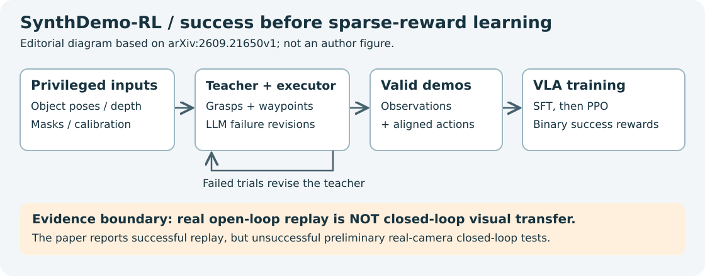
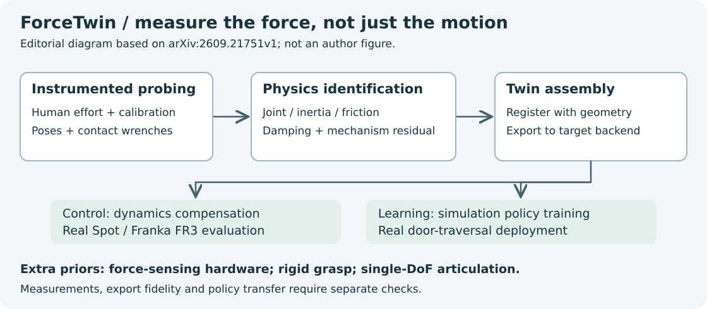

# 2026-09-22 科研日报

## 今日速览

今天最值得连着读的是两篇：**[SynthDemo-RL](#2026-09-22--synthdemo-rl)** 把失败反馈送回示教生成器，让稀疏奖励终于有成功样本可学；**[ForceTwin](#2026-09-22--forcetwin)** 则提醒我们，场景能编辑之后，门到底有多难推，仍需要实例级物理证据。两者分别推进数据与动力学，不应拼接成一个已经验证的完整 Real2Sim2Real 系统。

时间少的话，读上述两篇及其证据边界即可；做部署再看 **[Chunk Sim2Real](#2026-09-22--chunk-sim2real)**：专家轨迹回放全部成功，训练出的视觉策略却只有 6/20，清楚展示“动作可执行”与“策略可迁移”的距离。图形学保留 **[Latent Rendering](#2026-09-22--latent-rendering)**，其加速发生在潜空间，解码回 RGB 后并不更快。

[圈内新闻](#2026-09-22--community-news)精选三件事：Jev 的个人偏好评测更新、Googlebook 把 Gemini 接入系统交互，以及人形机器人销量统计中的“研究设备”与“生产劳动力”之别。

## 从成功示教到可验证的物理闭环

### SynthDemo-RL · arXiv · 2026-09-18

**必读：先让任务出现成功轨迹，再谈 RL；真机开环回放不能充当视觉闭环迁移的证据。**

- **Title：** SynthDemo-RL: Breaking the Zero-Reward Barrier in VLA Adaptation with LLM-Guided Synthetic Demonstrations
- **作者：** Hiroaki Kingetsu, Hiroaki Kurihara, Kaoru Yokoo, Kenji Fukumizu, Manohar Kaul
- **单位：** Fujitsu Limited；The Institute of Statistical Mathematics
- **投稿信息／发表时间：** 作者标注 Under review，未确认录用；arXiv v1 首次提交 2026-09-18，列入 9 月 21 日公告。
- **入口：** [arXiv](https://arxiv.org/abs/2609.21650) · [PDF](https://arxiv.org/pdf/2609.21650) · [全文](https://arxiv.org/html/2609.21650v1)。未核实到可用的独立代码／项目主页。

**摘要中译（凝练）：** 自动教师利用仿真特权状态生成成功示教，先监督微调 VLA，再以二值任务奖励做 PPO；除平均成功率，还衡量有至少一次成功的任务占比。LIBERO-PRO 中原先零成功的 27 项任务，直接 PPO 救回 10 项，而合成示教加 RL 救回全部 27 项。[来源](https://arxiv.org/abs/2609.21650)

*编辑依据论文方法与真机实验绘制；不是作者原图。[作者 Fig. 1](https://arxiv.org/html/2609.21650v1/fig1.png)。*

**方法概要与代价：** 教师不只看 RGB，还获得物体真值位姿、深度、分割与相机标定；抓取模块及脚本执行器提供动作骨架，LLM 根据失败记录修改路点和接触参数。成功轨迹导出为同步示教，再训练 π₀.₅。每任务合成 50 条；SFT 使用 8 张 MI300X、30k 步。直接 PPO 对比只等化了 **RL 阶段**算力，未等化生成与 SFT 总成本。[全文](https://arxiv.org/html/2609.21650v1)

**证据边界：** 仿真增益来自作者实验；真机为孪生内产生动作后开环执行，四种条件各 20 次均成功，但初步真机视觉闭环未成功。现成仿真资产、成功判定及特权信息均是额外先验，不是从任意视频自主造完整世界。[真机与局限](https://arxiv.org/html/2609.21650v1)

**值得关注：** 相对 [MiracleAug 公开流程](https://github.com/rubatotree/miracle-aug-skill)，可借鉴的是把“失败任务能否获得有效正例”作为数据生成目标，并把失败记忆留给下一轮教师；重合在同步示教、训练与执行检查，差别在于这里从已有仿真任务和特权状态出发。下一步该验证的是遮掉特权信息后、真实相机闭环下的收益，而不是继续累计漂亮的回放次数。

### ForceTwin · arXiv · 2026-09-18

**必读：用实际测得的交互力补足“看起来一样、推起来不同”的实例动力学。**

- **Title：** ForceTwin: Physics-informed Digital Twins for Robotic Manipulation from Instrumented Human Interaction
- **作者：** Tim Engelbracht, René Zurbrügg, Mayank Mittal, Marco Hutter, Marc Pollefeys, Hermann Blum, Zuria Bauer
- **单位：** ETH Zurich；NVIDIA；Microsoft；University of Bonn
- **投稿信息／发表时间：** 未标明录用；arXiv v1 首次提交 2026-09-18，列入 9 月 21 日公告。
- **入口：** [arXiv](https://arxiv.org/abs/2609.21751) · [PDF](https://arxiv.org/pdf/2609.21751) · [全文](https://arxiv.org/html/2609.21751v1) · [作者项目页](https://timengelbracht.github.io/forcetwin-website/)。项目页可用性未确认，未核实代码开放状态。

**摘要中译（凝练）：** 人使用测力夹爪探索关节物体，从同步位姿和接触力辨识关节、惯性、摩擦与非线性机构效应，再组装数字孪生。模型用于两种真机的控制补偿，也用于仿真训练后的真机过门。[来源](https://arxiv.org/abs/2609.21751)

*编辑依据论文绘制；不是作者原图。[作者 Fig. 1](https://arxiv.org/html/2609.21751v1/figures/ForceTwin_PipelineFigure.png)。*

**方法概要：** 先拟合单自由度转动／移动关节，再辨识非负惯性、库仑摩擦和阻尼，另学状态相关残差；物理模型与几何分离，注册后导出资产。需要人手探测、测力硬件与校准，并假设刚性无滑移抓取。仿真后端若不能执行残差网络，导出近似还会增加误差。[全文](https://arxiv.org/html/2609.21751v1)

**证据与成本：** 九组物体—机器人配对的平均**目标完成比例**为 87.3%，VLM 先验与仅运动学分别为 59.7%、56.9%；这不是二值任务成功率。另有策略训练后真机过门实验，均属作者自报。未核实统一的采集分钟数／端到端算力预算。[实验](https://arxiv.org/html/2609.21751v1)

**值得关注：** 比 [9 月 19 日](#2026-09-19)关注的关节恢复更进一步：把“怎样运动”扩展为“运动需要多少力”。对 agent 搭建可编辑场景，适合做一个测量驱动的物理校准模块；却不能据此声称一般 VLM 已能凭外观读出隐藏载荷。还要分别检查参数可辨识性、后端导出误差和策略迁移，三者不是同一项验收。

### Chunk Sim2Real · IROS 2026 Workshop · 2026-09-18

**部署选读：让仿真专家和真实策略共用控制栈，才知道差距出在动作执行还是观测泛化。**

- **Title：** A Sim-to-Real Integration Pipeline for Training and Deployment of Chunk-Based VLA Manipulation Policies
- **作者：** Mathilde Kappel, Clémence Grislain, Mohamed Chetouani, Olivier Sigaud, Louis Annabi, Faïz Ben Amar, Stéphane Doncieux, Mahdi Khoramshahi
- **单位：** ISIR，CNRS／Sorbonne University
- **投稿信息／发表时间：** 作者标注接收于 IROS 2026 Workshop on Sim2Real and Classical Control: From Rigorous Theory to Data-Driven Robotics，**不是 IROS 主会录用**；arXiv v1 首次提交 2026-09-18，列入 9 月 21 日公告。
- **入口：** [arXiv](https://arxiv.org/abs/2609.21817) · [PDF](https://arxiv.org/pdf/2609.21817) · [全文](https://arxiv.org/html/2609.21817v1) · [作者所链代码](https://gitlab.isir.upmc.fr/kappel/sim2real_public_chunk_control/)。作者称同步发布 Hugging Face 数据，具体数据入口本期未独立核验。

**摘要中译（凝练）：** 在仿真中生成专家轨迹，开环回放到真实 FR3，采集配对图像和本体状态用于 VLA 训练；随后沿用同一部署栈做闭环评估，也以配对轨迹量化仿真—真机差异。[来源](https://arxiv.org/abs/2609.21817)

**方法概要／证据：** PyBullet 孪生加 ROS 2 控制栈，把相对末端动作块累积为目标位姿并规划关节路径。四类推块任务共采集 200 条真实回放；平均路径偏差 0.93 cm，平均 Fréchet 距离 3.30 cm。专家回放全部成功，训练出的 ORCHID 真实闭环仅 **6/20**。需要真实硬件执行、重置和记录，不是零真机成本的纯合成训练。[全文与实验](https://arxiv.org/html/2609.21817v1)

**值得关注：** 可复用的首先是“同一动作语义、同一控制接口”的配对评测。对 MiracleAug 类流水线，值得把合成动作可执行率与策略闭环成功率分开报；路径误差还混有控制器跟踪误差，不能全部归因于物理孪生。相较 SynthDemo-RL，这篇把真机观测纳入训练，但仍没有消除低数据量下的感知与泛化问题。

## 图形学基础：渲染器能否直接服务潜空间

### Latent Rendering · Pacific Graphics 2026 / CGF · 2026-09-17

**图形学选读：把可控光传输接到 VAE 表征上；潜空间加速不等于 RGB 示教渲染加速。**

- **Title：** Physically Based Rendering in the Latent Space
- **作者：** Vuk Radovanovic, Vishesh Gupta, Adrien Gruson, Binh-Son Hua
- **单位：** Trinity College Dublin；École de technologie supérieure（ÉTS）
- **投稿信息／发表时间：** arXiv Comments 标注 Pacific Graphics 2026 Journal Track／Computer Graphics Forum，并列 [期刊 DOI](https://doi.org/10.1111/cgf.70633)；arXiv v1 首次提交 2026-09-17，列入 9 月 21 日公告。
- **入口：** [arXiv](https://arxiv.org/abs/2609.21054) · [PDF](https://arxiv.org/pdf/2609.21054) · [全文](https://arxiv.org/html/2609.21054v1) · [代码仓](https://github.com/trinity-graphics/latent-rendering)。核查时 README 仍写代码即将发布，不能称为已可复现的开源实现。

**摘要中译（凝练）：** 修改渲染方程，使光传输直接输出生成模型 VAE 的潜特征。用单张渲染图拟合场景参数及细化网络，并测试改变相机、几何与光照后的泛化。[来源](https://arxiv.org/abs/2609.21054)

**方法概要与边界：** 输入包含已知三维场景，并非由一张照片完整恢复场景。修改后的表达允许带符号的特征辐射量，再用逐场景细化器修补；它不是物理世界存在“负光子”的主张。Lamp 单帧实验在潜空间等误差目标下报告 42–84 倍加速，但加入 VAE 解码、比较 RGB 后反而慢 6–35 倍。不能外推为批量数据生产吞吐。[全文性能分析](https://arxiv.org/html/2609.21054v1)

**值得关注：** 相对昨天的 ReShoot，这里改变的是物理渲染与生成模型之间的表示接口。若下游直接消费潜特征，这条路线值得保留；若目标仍是同步 RGB—动作示教，就应把解码、逐场景拟合、图像偏差一起计费。论文没有给出机器人策略验证，暂不把它写成 Real2Sim2Real 组件已经验收。

## 圈内新闻与社区反应

### Jev：快速判分有用，但模型间一致不等于理解用户

**事实与日期：** TypeSafe 于 **9 月 15 日**[介绍 Jev](https://typesafe.ai/blog/introducing-system-one-models-and-jev)，面向类型受限的分类／评分，而非自由文本生成。速度与校准优势是厂商主张；本次重提的新增证据是社区项目 Tidy 在 **9 月 21 日 15:35 HKT**[公开评测教训与使用清单](https://github.com/abhibansal60/tidy/commit/752c9503fb34857fd7b2be9ffa39552adab332d5)，不是把旧发布包装成新模型。

**实际反馈：** 开发者 abhibansal60 在上述日期的 [GitHub 原文](https://github.com/abhibansal60/tidy/blob/752c9503fb34857fd7b2be9ffa39552adab332d5/docs/guide/jev-playbook.md)报告：110 个频道的判分很快，但对其 66 个个人保留／删除标签，各模型 AUC 仅 0.43–0.52；并承认 CLI 对比带额外开销、自身标签有噪声。这个小样本是个人任务实测，不是通用分类结论。另有 [Fabio Akita 9 月 16 日原文](https://akitaonrails.com/en/2026/09/16/why-things-like-typesafe-ai-dont-interest-me/)认可结构化分类的用途，但反对把格式合法等同于判断无错。这些是少量独立意见，不代表共识。

**编辑判断：** 适合先测 agent 高频路由的延迟与错误代价；不要因输出始终符合 schema，就把它升级成无需人工确认的决策者。

### Googlebook：把 Gemini 从聊天入口推向桌面交互

**事实与日期：** Google 在 **9 月 21 日**[官方公告](https://blog.google/products-and-platforms/devices/googlebook/googlebook-built-in-intelligence/)中介绍 Magic Pointer、Rambler 语音整理和自然语言创建小组件；[硬件公告](https://blog.google/products-and-platforms/devices/googlebook/first-look-googlebook/)确认五款机型开放预订，美国零售从 10 月 4 日开始。这里是产品与交互能力发布，不是通用 agent 成功率评测。

**实际反馈：** Chrome Unboxed 的 Robby Payne 于 **9 月 21 日**[发布本人现场上手](https://chromeunboxed.com/we-went-hands-on-with-all-5-new-googlebook-laptops-here-is-our-first-look-video/)，说明是在纽约预览活动中体验约数小时，肯定机身、键盘与触控板；这是媒体人的一手短时体验，不是用户长期使用共识。暂未找到可核实的独立长程 agent 任务成功率或失败恢复测试。

**编辑判断：** 值得观察的是模型怎样取得屏幕上下文、怎样请求权限和交还控制权；演示顺畅与日常任务可靠性需要分开评价。

### 人形机器人约 7,000 台销量：先看用途，再谈替代劳动

**事实与日期：** **9 月 21 日**，[Reuters 对 IFR 的直接采访与数据报道](https://www.reuters.com/technology/humanoid-robot-sales-tally-hit-7000-globally-last-year-2026-09-21/)称，2025 年工业／专业服务用途的人形机器人全球销量约 7,000 台；其中不少用于研究及 AI 数据采集，而非持续生产。完整相关年度统计尚待发布，这不是本稿直接审计厂商出货。

**社区反应：** 暂未找到针对这批新统计的可核实独立使用者原帖；转述新闻不能算现场部署反馈。

**编辑判断：** “有人采购采集数据的设备”与“机器人已能经济地替代劳动”属于不同证据。跟踪具身产业时，应同时看用途、干预频率及持续运行表现，别把销量直接翻译成策略成熟度。

## 覆盖说明

- **日报日期：** 2026-09-22；**内容覆盖日：** 2026-09-21（Asia/Hong_Kong）。四篇论文均来自 9 月 21 日公告中的首次收录，首次提交日期另列，避免把公告日当提交日。Jev 明确区分 9 月 15 日发布与 9 月 21 日社区项目更新。
- **阅读层级：** SynthDemo-RL、ForceTwin 为主读；Chunk Sim2Real 补动作与闭环评测；Latent Rendering 保留图形学基础。方法与关键边界核对至论文 HTML 全文，未独立运行训练或真机实验。所有性能数字均为作者／发布者自报，除明确标注的社区实测外，未确认第三方复现。
- **范围与缺口：** 已检查 LLM、Agent、图形学与具身智能新闻及近期日报去重；图形学工具线索未核实到值得作为当日新进展单列的材料，不据此断言没有新闻。aDSL、Thinking with Visual Primitives、SimFoundry、World Labs Atlas 及 agent 驱动场景工作流仍作主线发现入口，无实质新增者不重复铺陈。部分项目页、官方站点和原帖的全文／绝对时间访问不完整，相关未核验项已就地注明；新闻事实限于可读公告与直接报道，中文社区反馈覆盖仍不足。
- **配图：** 两张本地流程图为编辑概括，均标注来源与证据边界；两张作者原图使用论文公开链接。原图及项目链接可能随站点更新失效，论文稳定入口保留。

**编写：** Neon
