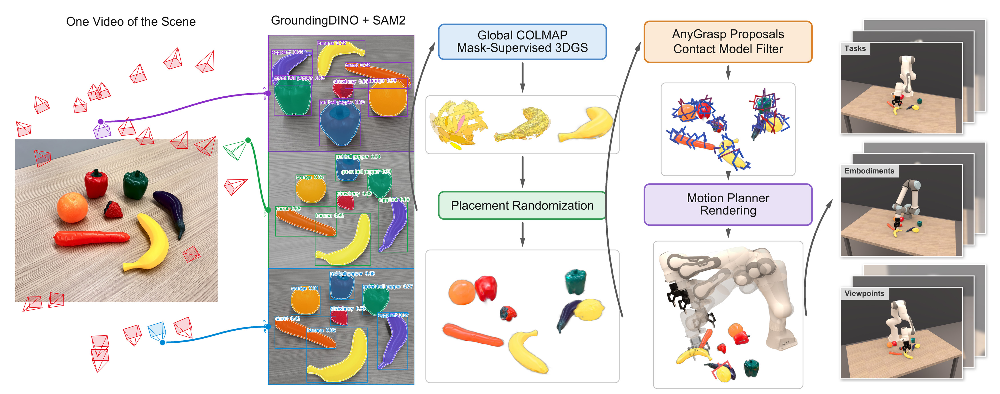
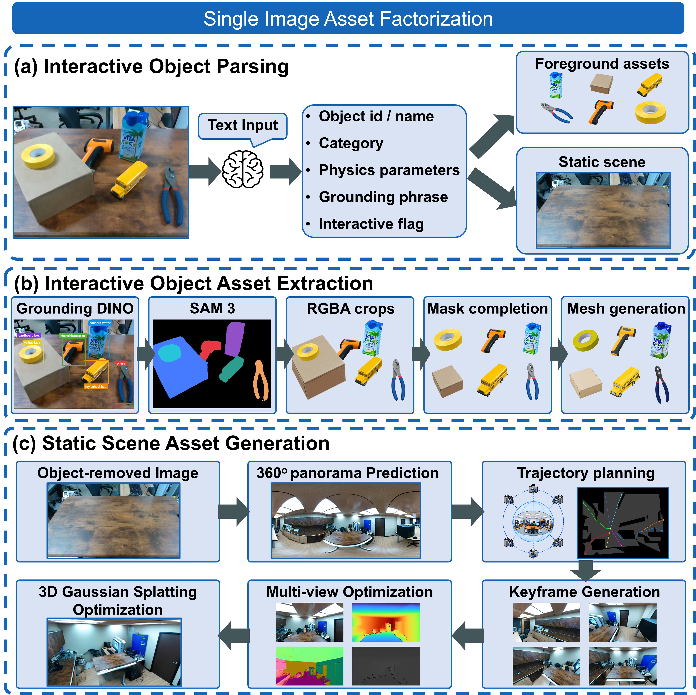
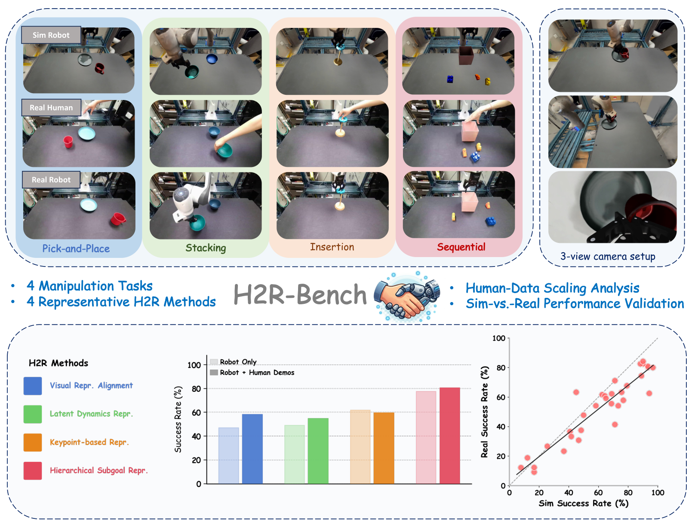

# 2026-09-23 科研日报

## 今日速览

今天优先连着读两篇「从真实场景直接造策略数据」的工作：**[GaussianFactory](#2026-09-23--gaussianfactory)** 只用一次视频扫描，就把桌面重建成可编辑的三维高斯溅射（3DGS）副本，再在副本上规划抓取与轨迹、渲染同步示教；**[DEXTERA](#2026-09-23--dextera)** 则从单张 RGB 图拆出静态高斯背景与可交互刚体/铰接资产，再在仿真里造任务、训策略并迁回真机。两者都对准「扫描/拍照 → 可编辑孪生 → 示教增强 → 策略」这条主线，但输入条件和物理介入点不同。

做评测与方法选型时，再看 **[H2RBench](#2026-09-23--h2rbench)**（CoRL 2026）：它把真人视频输入和重建仿真场景绑成统一协议，用来比较不同「人视频 → 机器人策略」迁移算法，并报告仿真排序与真机排序的相关性。

[圈内新闻](#2026-09-23--community-news)精选三件事：Blender 5.3 alpha 原生接入 3DGS（与近期兴趣强相关）、同日发布的 GPT-6 Sol/Luna 与 Claude Opus 5.5，以及影响多款编程 Agent 的 Plugin4Shell 供应链漏洞披露。

## 从扫描到示教：少物理仿真、多可编辑渲染

### GaussianFactory · arXiv · 2026-09-17

**必读：一次视频扫描 → 可编辑 3DGS 场景 → 运动学规划 + 接触闭包模型 → 渲染同步示教；扩散策略仅用合成数据即可零样本上真机。**

- **Title：** Demonstration Synthesis from a Single Scan via Gaussian Splatting for Visuomotor Policy Learning
- **作者：** Beichen Wang, Yuen-Hei Yeung, V. R. Sridhar Devarakonda, Xuesu Xiao
- **单位：** George Mason University；New York University
- **投稿信息／发表时间：** 未标明录用；arXiv v1 首次提交 2026-09-17（相邻公告日积压；本期首次收录）。
- **入口：** [arXiv](https://arxiv.org/abs/2609.21112) · [PDF](https://arxiv.org/pdf/2609.21112) · [全文](https://arxiv.org/html/2609.21112v1)。未核实到独立项目页／代码仓。

**摘要中译（凝练）：** 视觉运动策略（根据相机图像等观测预测机器人动作）需要大量与目标场景外观一致的示教。GaussianFactory 以一次 RGB 视频扫描为唯一人工输入，重建可编辑的 3DGS 场景副本，在几何上规划抓取与轨迹并渲染示教；生成环路中**不**运行完整物理引擎，只在夹爪闭合等接触决定结果的窗口，调用一次预训练的学习型接触模型。在可复现的仿真替身与真实 UR10e 工作台上，仅用合成示教训练的扩散策略分别达到 95.1% 与 84.2% 成功率（作者自报）。[来源](https://arxiv.org/abs/2609.21112)

*作者原图（Fig. 2）。[HTML 入口](https://arxiv.org/html/2609.21112v1)。*

**问题与输入：** 新场景若每次都真人遥操作采集示教，成本高；纯仿真又要人搭资产，外观也容易对不上。本文输入是**不含机器人**的桌面视频扫描；输出是带同步观测—动作的示教轨迹。场景用高斯原语 \(g=(\boldsymbol{\mu},\mathbf{s},\mathbf{R},\alpha,\mathbf{c})\) 表示（位置、尺度、旋转、不透明度、颜色），并拆成背景簇、若干物体簇与由关节配置 \(\mathbf{q}\) 驱动的机器人簇。

**方法怎样运行：**

1. **重建与拆分。** 用运动恢复结构（SfM）估相机位姿，再做 3DGS 重建。从桌面附近、法向朝上的高斯拟合支撑平面 \(\Pi\)，避免物体悬空或穿模。再用 Grounding DINO 检框、SAM 2 跨帧分割，把高斯标成各物体簇；对各簇单独再优化，去掉与背景粘连的伪影，以便换布局。
2. **任务与抓取。** 从场景里已有物体组合实例化抓取—放置等模板。把物体高斯均值点云交给 AnyGrasp 等现成网络，得到夹爪位姿候选；用采样式规划器在背景／物体点云上做碰撞检测，生成接近、抓取、搬运、放置等关节轨迹。机器人由 URDF 组装进场景，扫描时并不需要真机入镜。
3. **接触只补「闭合窗口」。** 夹爪闭合时物体在手中会倾斜、沉降，纯刚体附着解释不了。接触模型吃物体几何与透明度（不用颜色），经 PointNet 式编码器接三个头：扩散头预测闭合过程中物体位移轨迹，分类头判断提起是否稳，回归头预测指尖闭合间距。多任务损失用不确定度加权联合训练。模型**离线预训练一次**，合成时只在接触窗口调用；自由空间运动仍走确定性运动学。
4. **渲染成示教并训策略。** 按时间推进物体刚体变换与机器人关节，光栅化多视角观测（含腕部），导出观测—动作对。下游用标准扩散策略（diffusion policy：用扩散模型迭代去噪生成一段动作）在合成数据上训练，再零样本部署到真机视觉闭环。

**为什么这样设计：** 完整物理仿真既贵又难和外观对齐；完全不做接触又会得到「看起来抓住、实际会掉」的假示教。把接触局部化，等于用最小物理介入换可执行闭环，同时保留 3DGS 的可编辑渲染。

**实验与边界：** 任务含抓取抬起、抓取放置、双物体抓取放置等；作者报告仿真约 95.1%、真机 UR10e + Robotiq 2F-85 约 84.2%，总试验逾三千次——均为作者自报，未做第三方复现。真机为零样本部署，但依赖扫描质量、分割与接触模型覆盖；复杂变形、多指灵巧或强动力学任务不在本文主证据范围内。

**值得关注：** 相对 [MiracleAug 公开流程](https://github.com/rubatotree/miracle-aug-skill)，重合在「单次采集 → 可编辑场景 → 同步示教」；差别是这里强调生成环路无物理引擎、接触模型一次性预训练，以及策略可直接零样本上真机。对 agentic DCC 路线，可借鉴「布局可重采样 + 腕部／第三人称一致渲染」；仍须分开验收几何可交互性与接触模型外推。勿把作者成功率读成任意厨房场景已解决。

### DEXTERA · arXiv · 2026-09-17

**必读：单张 RGB + 标定捕获 → 高斯背景与可交互网格／URDF → Isaac Lab 造任务与轨迹 → 仿真／真机共训提升灵巧操作迁移。**

- **Title：** DEXTERA: From a Single Image to Deployable Dexterous Manipulation via Real-to-Sim-to-Real
- **作者：** Jin Wu, Lianjie Yuan, Zeyan Sun, Yuanyuan Lei, Disi A, Bicheng Han, Fangzhou Xia
- **单位：** The University of Texas at Austin；University of Florida；BrainCo.
- **投稿信息／发表时间：** 未标明录用；arXiv v1 首次提交 2026-09-17（相邻公告日积压；本期首次收录）。
- **入口：** [arXiv](https://arxiv.org/abs/2609.21045) · [PDF](https://arxiv.org/pdf/2609.21045) · [全文](https://arxiv.org/html/2609.21045v1)。未核实到独立代码仓。

**摘要中译（凝练）：** 灵巧操作真机数据贵，手工数字孪生也贵。DEXTERA 把单张 RGB 场景图自动拆成静态高斯背景与可交互刚体／铰接资产（含视觉语言模型给出的物理默认参数），经度量对齐后导入仿真，用 VR 遥操作与物体中心轨迹合成扩数据，再在统一多模态接口上做模仿学习或强化学习。作者在 13 组任务—本体、2 个灵巧平台、6 类策略上评估；仅仿真训练可做零样本真机，仿真—真机共训把平均真机成功率从 29.2% 提到 61.9%（作者自报）。[来源](https://arxiv.org/abs/2609.21045)

*作者原图（workflow 片段）。[HTML 入口](https://arxiv.org/html/2609.21045v1)。*

**问题与输入：** 只靠外观生成的场景往往缺碰撞几何与物理参数；只靠手工搭仿真又对不上真实桌面。系统输入是场景图 \(I_0\)、机器人模型，以及含内参、同步机器人位姿与深度的**标定捕获**——资产外观主要来自单图，度量尺度与机器人对齐依赖后者。

**方法怎样运行：**

1. **单图资产拆分。** 用视觉语言模型（文中为 Qwen3-VL）解析名称、类别、是否可交互与物理默认值。可交互物体经 Grounding DINO 定位、SAM 3 分割；遮挡严重时用图像补全，再经图像到三维模型生成带纹理网格。刚体保留单网格；铰接物体再前馈估计连杆分割、关节类型与运动限位，导出 URDF。背景侧先抠掉可交互物与机器人，补全后扩成多视角，再优化背景 3DGS，并导出点云／网格供碰撞。
2. **度量对齐。** 用光度与稀疏几何约束恢复场景尺度与相机位姿；结合机器人几何 refinement 标定；把各物体缩放到真实尺度并对齐规范轴，使资产与真机坐标系一致。
3. **仿真任务与数据。** 对齐后的资产进入 Isaac Lab：背景提供高斯外观与静态碰撞，预测的质量、摩擦等赋给动力学物体。任务由抬起、放置等原语定义重置分布、奖励与成功条件。人用 Meta Quest 3 做 VR 遥操作采集种子示教，再按物体坐标系做轨迹合成，在随机位姿／目标上扩数据。
4. **策略与部署。** 统一多模态观测接口同时支持模仿学习与强化学习；仿真训练可零样本上真机，加入真机数据共训显著提高成功率。

**为什么需要标定捕获：** 单图生成可以「看起来像」，但夹爪与物体的相对尺度错一点，接触就会全错。标定捕获把「像」钉到「能量化的机器人坐标系」上——这是和纯文生场景路线的关键差别。

**实验与边界：** 13 任务—本体配对、2 灵巧平台、6 策略架构；共训相对纯仿真的真机平均成功率提升（29.2%→61.9%）为作者自报。重建质量优于若干生成式基线、跨域轨迹回放一致性等亦属自报。流水线依赖多种专用模型串联，失败会沿链条放大；铰接推断与物理默认值来自 VLM／前馈，不等于实测辨识。

**值得关注：** 与 GaussianFactory 对照：DEXTERA 更重**灵巧手、完整物理仿真与共训**，GaussianFactory 更重**无物理环路的高速示教合成**。对 MiracleAug／Astra+Blender 叙事，可借鉴「交互物网格／URDF + 背景高斯」的混合表示，以及「种子遥操作 + 物体中心重定位」扩数据；不要把单图流水线理解成已取消所有标定。

## 人视频迁移：先把评测协议对齐

### H2RBench · CoRL 2026 · 2026-09-21

**评测必读：用真人视频 + 重建仿真场景，对齐比较不同人到机器人（H2R）迁移方法，并验证仿真排序能否预测真机排序。**

- **Title：** H2RBench: A Real-to-Sim Benchmark for Evaluating Human-to-Robot Transfer
- **作者：** Chuyang Xiao, Haotian Zhan, Sriram Krishna, Peilin Meng, Muhammad Zubair Irshad, Sergey Zakharov, David Held
- **单位：** Robotics Institute, Carnegie Mellon University；University of Michigan；Toyota Research Institute
- **投稿信息／发表时间：** 作者标注 10th Conference on Robot Learning（**CoRL 2026**，Austin）；arXiv v1 首次提交 2026-09-21，列入 9 月 22 日公告。
- **入口：** [arXiv](https://arxiv.org/abs/2609.24778) · [PDF](https://arxiv.org/pdf/2609.24778) · [全文](https://arxiv.org/html/2609.24778v1) · [项目页](https://h2rbench.github.io)。

**摘要中译（凝练）：** 从人视频学机器人操作很有吸引力，但各方法常用不同任务集、布局与机器人监督预算，难以横向比较。H2RBench 提供统一 Real2Sim 协议：输入侧直接使用**真实人视频**，场景侧用真实物体／场景重建仿真；覆盖抓取马克杯、叠碗、插入甜甜圈、抓取玩具等四类交互需求不同的任务，并系统改变人示教数量以观察扩展规律。作者报告仿真与真机表现总体 Pearson \(r=0.89\)、Spearman \(\rho=0.85\)、平均最大排序违背（MMRV）0.06（作者自报）。[来源](https://arxiv.org/abs/2609.24778)

*作者原图（teaser）。[项目页](https://h2rbench.github.io) · [HTML](https://arxiv.org/html/2609.24778v1)。*

**问题与原理：** 若在仿真里「演」人的手，视觉与接触都和真人视频差一截，而多数 H2R 前端本来就是为人影像训练的。H2RBench 因此固定：**方法吃真人视频**；机器人侧在重建仿真里评估，再抽样子集上真机核对相对排序。场景重建思路与 PolaRiS 等 Real2Sim 评测同族，但评测对象换成「人视频监督」的方法。

**方法怎样组织评测：**

1. **统一任务与数据预算。** 四类任务覆盖不同精度与接触需求；每人／机器人示教按任务采集。比较时改变人示教条数，观察各方法是否随数据增加而提升。
2. **覆盖不同桥接策略的代表方法。** 例如 Point Policy 用共享三维关键点表示人与机器人行为；AMPLIFY 先从视频学潜空间动力学再映射到机器人动作；GHOST 把高层子目标与低层控制器拆开——各自用不同方式填「人体—机臂」形态差。
3. **Sim 是否可信。** 对方法—任务组合计算仿真成功率与真机成功率的相关与排序一致性；高相关说明仿真可作相对筛选，不等于绝对成功率可直接外推。

**主要发现（作者总结）：** 人示教更稳定地改善高层交互行为；接触丰富的末端精细控制仍难；不同方法吃人数据的效率差很大。这些是基准上的经验规律，不是对某一商业系统的验收。

**值得关注：** 若你在做「人演示／失败回放 → 机器人策略」，应先问：比较的是同一任务集、同一人数据预算、同一机器人监督吗？H2RBench 把这个问题写成可复用协议。相对 GaussianFactory／DEXTERA，它不直接给你新的扫场造数引擎，但能约束「换了一种 H2R 算法是否真的更好」。项目页与代码以作者发布为准，部署前再核版本。

## 圈内新闻与社区反应

### Blender 5.3 alpha：3DGS 成为原生点云类型

**事实与日期：** Blender 开发者文档在 **5.3 Rendering** 说明中写入原生三维高斯溅射导入与渲染（[官方 release notes](https://developer.blender.org/docs/release_notes/5.3/rendering/)，PR#163102）。PointCloud 增加 `3D Gaussian Splats` 类型；支持 PLY（自动识别 splat）与 SPZ（至 v4）；Workbench／EEVEE／Cycles 默认可渲，默认发光着色。Geometry Nodes 增加 `Set Point Cloud Type`、`Import SPZ`。**尚无导出**；官方列出性能、sRGB／线性偏差、Apply Transform 未正确处理尺度／旋转／球谐等限制。行业媒体 [digitalproduction 于 2026-09-22](https://digitalproduction.com/2026/09/22/blender-5-3-brings-gaussian-splats-home/) 与 [RadianceFields 报道](https://radiancefields.com/blender-5.3-will-bring-native-3d-gaussian-splat-import-and-rendering) 对上述能力做了转述；完整版计划约 2026-11-10，当前仍为 alpha。

**社区反应：** 暂未在本期核到可独立复现的大规模性能基准帖；媒体与开发者文档以功能清单与已知限制为主，不能当成生产路径已验收。

**编辑判断：** 对 Astra／MiracleAug 类「Agent 操 Blender」管线，原生 splat 可减少插件层；「能导入渲染」≠「可绑骨／可导出仿真资产」。后续应盯导出、颜色空间与变换管线是否补齐。

### 同日模型发布：Claude Opus 5.5 与 GPT-6 Sol／Luna

**事实与日期：** Anthropic 于 **2026-09-22** [介绍 Claude Opus 5.5](https://www.anthropic.com/claude-opus-5-5)，称其在多数工作负载上接近 Claude Fable 5.1 水平且运行成本约低 40%（厂商主张）。同日 OpenAI [发布 GPT-6 Sol 与 Luna](https://techcrunch.com/2026/09/22/openai-launches-gpt-6-sol-and-luna/)，强调相对 5.6 代 API 价格约减半、事实性与编码错误率下降（厂商主张）；TechCrunch／The Verge 等跟进报道上线渠道（ChatGPT Work／Codex 等）。

**社区反应：** 公开报道以产品发布与价位对比为主；本期未核到针对上述新权重的可复核独立长程 agent 任务成功率对照。厂商排行榜数字需当作自报。

**编辑判断：** 对科研读报与 agent 写代码，更关键的是定价／限流与工具调用稳定性，而不是单日参数名更迭。把「更强模型」直接翻译成 Real2Sim 管线已打通，证据不足。

### Plugin4Shell：编程 Agent 插件供应链上的零点击风险

**事实与日期：** AIR Security 于 **2026-09-21** 前后披露 Plugin4Shell：可绕过插件 SHA 钉扎的零点击远程代码执行问题，影响 Claude Code、OpenAI Codex、GitHub Copilot、Gemini CLI 等（[SecurityOnline 报道](https://securityonline.info/plugin4shell-coding-agents-rce/)）。报道称 Claude Code 2.1.179、Codex 0.146.0 已修补；Copilot 当时未修；Gemini CLI 已弃用且不计划修补。无公开 CVE 编号时以厂商公告为准。

**社区反应：** 属安全披露与厂商补丁节奏讨论；不是功能评测帖。未确认野外大规模利用。

**编辑判断：** 任何「Agent 自动装插件／技能」工作流应把供应链钉扎与更新策略当成一等公民；图形学／具身实验机尤其不要默认信任市场插件。

## 覆盖说明

- **日报日期：** 2026-09-23；**内容覆盖日：** 2026-09-22（Asia/Hong_Kong）。H2RBench 来自 9 月 22 日公告窗口；GaussianFactory 与 DEXTERA 为 9 月 17 日首次提交、相邻公告日积压且与主线高度相关，本期首次收录并标明日期。
- **阅读层级：** GaussianFactory、DEXTERA 为主读；H2RBench 补人视频迁移评测协议。方法核对至论文 HTML；未独立训练或真机复现。成功率与相关均为作者／厂商自报。
- **范围与缺口：** 已检查 LLM、Agent、图形学、具身新闻及近期日报去重。`rubatotree/blog` 近提交以站点小改为主，无新的研究向博文；`academic` 与对标仓 `hku-sail/Real2Sim_GPT6_ASTRA` 自上次日报以来无实质更新，故不单列。Uranus 等数据驱动仿真预印本已扫到，因篇幅优先上述三篇，不表示否定其价值。中文社区原帖覆盖仍不足。
- **配图：** 三篇均嵌入作者公开 HTML／项目图；链接可能随站点变更，论文 abs／PDF 为稳定入口。

**编写：** Cream

**故障说明：** 本日由 Cream 于约 06:19 HKT 故障转移接管发布。Neon 于约 05:31 HKT 认领 2026-09-23，租约至约 06:01 HKT 到期仍未发布；`digests/2026-09-23.md` 与 `digests/index.json` 当日条目缺失。Cream 在 standby 窗口 [06:20, 06:50) 的 early-skew 内 CAS claim 后完成本稿。依据 `meta/failover.json` 当日 `claim`／`failover` 事件。
