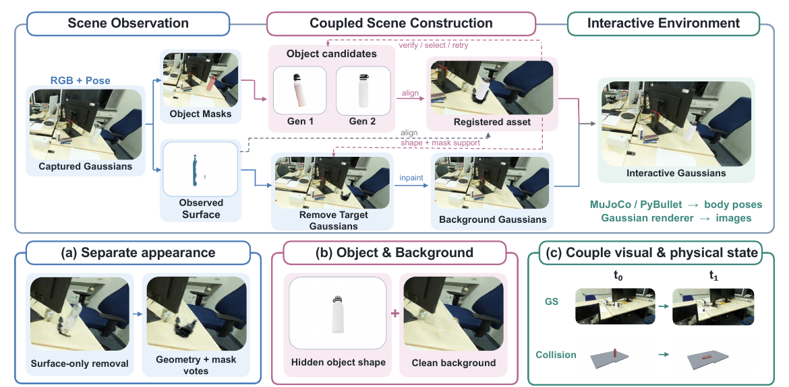
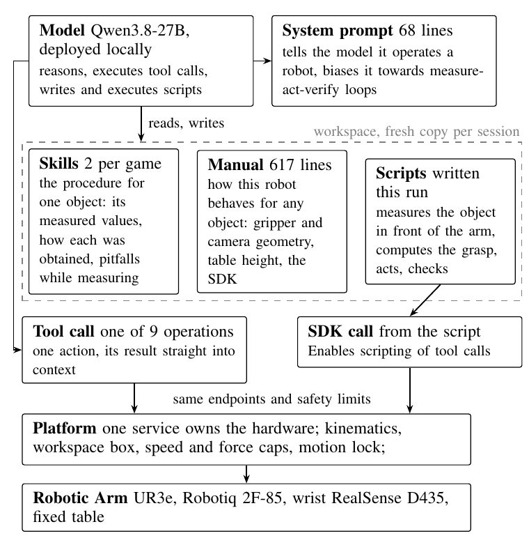
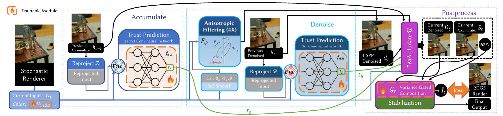

# 2026-09-24 科研日报

## 今日速览

今天最值得细读的是 [ϕ-RIE](#2026-09-24--phirie)：把照片重建的场景变成可交互环境，关键不只是给物体补个碰撞网格，还要把原位置的物体清干净、补出背景，并让外观与物理运动始终对齐。不过，几何指标变好，还没有稳定变成机器人策略收益。

- **主线必读：** [ϕ-RIE](#2026-09-24--phirie) 把“生成物体”和“从原场景删除物体”绑定起来；它提供了很有价值的失败筛选实验，也暴露出资产筛得越严、可执行任务越少的问题。
- **Agent 真机对照：** [本地编程 Agent](#2026-09-24--local-coding-agent) 会看图、测量、写代码、执行和检查。但它站在人工技能文档、相机标定与固定控制服务之上；二次执行变快，不等于模型学会了新策略。
- **图形学选读：** [随机高斯渲染降噪](#2026-09-24--stochastic-denoise) 用两个历史累积通道兼顾清晰与稳定，完整渲染约比强排序基线快 2.1 倍，仍有画质差距。
- **新闻：** [FLUX 3 Action 开放权重](#2026-09-24--news)；Blender Conference 开幕；补充新模型发布后的独立使用反馈，区分个人偏好与客观测试。

## 让重建场景真正经得起移动与接触

### ϕ-RIE · arXiv · 2026-09-22

**一句话判断：** 这篇的价值是把物体补全、原物体清除、背景补洞和物理绑定做成一条可检查的链，而不是仅展示一个看起来能动的重建场景。

**Title：** ϕ-RIE: From Photorealistic Reconstruction to Interactive Environments  
**作者：** Runyi Yang, Deheng Zhang, Xiaoye Wang, Kanzhi Wu, Lei Sun, Ajad Chhatkuli, Kunyu Peng, Luc Van Gool, Danda Pani Paudel。  
**单位：** INSAIT, Sofia University；vivo Mobile Communication；Karlsruhe Institute of Technology。  
**发表时间 / 投稿信息：** arXiv v1 首次提交 2026-09-22，列入 9 月 23 日新稿公告；预印本，未标明已接收会议。  
**入口：** [摘要](https://arxiv.org/abs/2609.26795) · [PDF](https://arxiv.org/pdf/2609.26795) · [全文 HTML](https://arxiv.org/html/2609.26795v1) · [项目页](https://insait-institute.github.io/PhiRIE/) · [作者列出的 GitHub 入口](https://github.com/insait-institute/PhiRIE)。本文以论文全文为依据，未独立运行代码。

**摘要中译（压缩）：** 三维高斯泼溅（3DGS：用有位置、形状、颜色和透明度的高斯元表示场景）能重建照片般的外观，却不会自动产生可以独立移动、接触和碰撞的物体。ϕ-RIE 用共享的物体身份连接资产生成、原场景清除和背景补全，再将物理刚体状态传给外观渲染器，构建可交互环境。论文同时评估几何、物理有效性与仿真策略表现，说明这些指标不能互相替代。

*原论文图 2，来源：[PDF 第 3 页](https://arxiv.org/pdf/2609.26795#page=3)，仅裁去页面正文。左边从标定图像与重建表面确定“哪个物体”；中间上路生成并对齐完整物体，下路删除原物体、补背景；右边用同一组刚体位姿驱动物理和高斯外观。下排强调三种不能省掉的一致性。*

#### 问题、输入与输出

假设把扫描桌面上的瓶子拿走：原始高斯场景通常既没有瓶子背面的完整形状，也没有瓶子挡住的桌面。只把生成的瓶子放进仿真器，会留下原瓶子的“鬼影”；只删看见的表面，又可能漏掉内部高斯。再独立调整可视模型与碰撞体，还会出现“看起来碰到了，物理上却没碰到”。

输入不是一张未标定照片：系统需要已有高斯重建、带相机内外参数的多视角图像，以及同一**真实尺度坐标系**下的观测表面；表面可来自扫描，也可融合高斯渲染的深度。输出是可独立控制的物体资产、清理补全后的背景，以及仿真器到渲染器的状态映射。物体质量、摩擦等物理量使用指定先验，并非从视频中辨识出来。

#### 方法：先确定同一个物体，再同时处理它和它留下的空缺

1. **建立物体身份。** 冻结的 SAM3 分割模型先在各张图里产生物体掩码，也就是哪些像素属于物体。沿相机射线寻找观测表面的首次交点，把二维掩码提升为三维样本；再用体素重合与至少两个视角的支持合并实例。每个物体留下观测点、各视角掩码和包围盒，后续生成与删除都使用这份记录，避免两条支路各认各的物体。
2. **生成候选，并只用已观测部分判断配准。** 单图三维生成器 TRELLIS 与多视角生成器 ReconViaGen 提供完整网格及高斯外观。系统先估尺度、搜索绕竖直轴的朝向，再用迭代最近点配准（ICP：反复匹配邻近表面点并更新变换）将生成资产对齐到局部观测。距离比较设有截断，避免缺失背面或离群点支配优化。候选按数值有效性、观测支持、碰撞几何和静置测试等条件排序，再比较残差。失败时可尝试另外五种“向上轴”；这改变的是对齐假设，不是重新生成更正确的形状。
3. **删除范围由观测与生成资产共同约束。** 原高斯的删除集合同时参考观测表面邻域、完整资产邻域，以及包围盒内多视角掩码的投票。这样比只删可见表面更容易清掉残留，也通过空间限制降低误删背景的风险。生成出来的形状因此不只供仿真使用，还参与决定原场景该删哪里。
4. **补出背景，但不把猜测当测量。** 每个物体选择一个主要视角做图像补洞，减少不同视角独立生成互相矛盾的纹理；在缺口附近拟合支撑平面，初始化沿平面排列的高斯，再用补洞图像监督优化新增高斯，已有背景保持冻结。它适合局部近似平面的支撑面，不能保证恢复原先被遮住的真实结构。
5. **统一物理运动与外观运动。** 网格经凸分解变成多个易于碰撞检测的小块，交给 MuJoCo 等刚体仿真器；仿真器每步输出位姿，再更新相应高斯的中心与方向。可选的图像协调模块处理插入或运动后的外观不一致，但不改变碰撞状态，也不等于完成了物理正确的重光照。

这里一个容易被忽略的公式是：

$$S_i(t)=T_i(t)T_i(0)^{-1}S_i(0).$$

$T_i(t)$ 是第 $i$ 个物理刚体在时刻 $t$ 的位姿，$S_i(0)$ 是初始可视资产的位姿；先消去初始刚体坐标，再施加当前刚体变换，得到可视资产的新位姿 $S_i(t)$。这保留了模型原点与刚体原点的初始偏移，避免把两者简单设成相同坐标后发生错位。尺度在建资产时确定，后续按刚体运动更新。

整条链不是重新训练一个端到端模型：主要使用预训练分割与生成组件，加上几何配准、规则筛选和局部背景优化。它提供可编辑仿真资产，但并未由通用语言 Agent 自动完成整个构建过程。

#### 结果、成本与尚未闭合的证据

**几何改善明确，但筛选代价也明确。** 在 ScanNet++ 室内扫描数据的 50 个场景、1,871 次物体请求中，固定生成器优先级方案保留 1,800 个结果。在相同的 566 个可对照实例上，加入证据筛选及重试后，20 毫米阈值 F1 从 0.336 到 0.383；该指标综合“预测表面有多少落在参考表面附近”和“参考表面被覆盖多少”，越高越好。双向表面距离 Chamfer Distance 从 7.638 降到 5.720 厘米，越低越好。代价是 A6000 上每场景构建时间从 35.68 增至 70.82 分钟，且不含采集和初始高斯训练。严格筛选仅保留 399 个资产，不能把更小、更容易的保留集分数直接当全任务收益。

**策略测试没有证明新增筛选带来稳定提升。** RoboCasa 是厨房操作仿真环境；论文在 48 个配置、每配置 10 次的计划任务上，评估冻结的 OpenPI π₀.₅ 机器人动作策略。原始资产为 385/480 成功，固定候选优先级为 131/480，完整筛选重试方案为 128/480。后者若只算实际执行的 320 次，会得到 40%；若算全部计划任务，则是 26.7%。二者分别回答“能执行时怎样”和“整条流程最终完成多少”，不能只报前者。

尤其要注意：这组策略实验只重建目标物体，背景和目标容器保持原生资产；输入策略的是统一材质的网格渲染图像，不是完整高斯渲染加外观协调的图像。因此，它既不是高斯示教数据训练实验，也不是完整真实场景到真机的迁移验证。新增筛选相对固定优先级的策略差异置信区间跨过零。对于未观测几何、关节物体、可变形物体与真实动力学，仍缺相应证据。

**值得关注：** 对照 MiracleAug 的公开 Real2Sim2Real 路线——从真实观测构建仿真，再让生成数据或策略回到真实环境——这里可借鉴的是“同一个物体记录约束生成、删除和验证”，以及同时报告资产保留率与下游成功率。它前进到了可交互资产和仿真策略评估，尚未证明新增几何精度会改善同步观测—动作示教或真机策略；技术重合本身也不说明相互沿用关系。

## 通用编程 Agent 能否把文字技能变成真机动作？

### Local Coding Agent · arXiv · 2026-09-22

**一句话判断：** 这是一个真实机械臂上的“测量—写程序—执行—验证”实验，最值得看的是人为提供了什么，以及看似安全的接口到底漏掉了什么。

**Title：** Generalizing Manipulation Skills with a Local Coding Agent  
**作者：** Raman Talwar, Elias Nijs, Andreas Verleysen, Francis wyffels；前两位共同第一作者。  
**单位：** IDLab-AIRO, Ghent University – imec, Belgium。  
**发表时间 / 投稿信息：** arXiv v1 首次提交 2026-09-22，9 月 23 日公告；预印本，未标明已接收会议。  
**入口：** [摘要](https://arxiv.org/abs/2609.26499) · [PDF](https://arxiv.org/pdf/2609.26499) · [项目与补充材料](https://rtalwar2.github.io/agentic-coding-for-robot-manipulation/) · [视频](https://youtu.be/09Z0gJm21E4)。论文指向项目页中的会话、技能和实验记录；未独立复现，也未确认单独的代码发布仓。

**摘要中译（压缩）：** 传统语言驱动机器人通常只能调用固定动作或已训练策略，换任务需要重新编程或采数据。作者让本地开放权重视觉语言模型——能同时理解图像与文字的模型——通过编程 Agent 控制机械臂，在固定基础服务之上编写、运行和调试代码，测试其从一个物体的文字技能推广到新颜色、大小、形状与任务的能力。再次执行时保留会话和脚本，以检验经验复用能否节省工作。

*原论文图 2，来源：[PDF 第 3 页](https://arxiv.org/pdf/2609.26499#page=3)。模型读取技能和手册，可以直接调用工具，也可以先写脚本再调用同一接口；两条路径都必须经过固定硬件服务。图中的人工文档和平台控制层是方法输入，不是可以省略的包装。*

#### 方法：让模型改程序，不让模型接管底层控制

**先看系统边界。** 主模型是 Qwen3.8-27B，一个约 270 亿参数的视觉语言模型，运行在名为 pi 的编程 Agent 框架中；这个 pi 不是上文的 π₀.₅ 机器人策略。硬件为 UR3e 机械臂、Robotiq 2F-85 夹爪及腕部 RealSense D435 彩色—深度相机。相机与机械臂已经做过手眼标定，因此像素深度可换算成机器人基座坐标；这项前提并非 Agent 自己从零解决。

系统分为固定硬件服务、固定 Agent 设置、每次试验独立的可写工作区。固定设置含 68 行系统提示、617 行手册，以及三类游戏各两份人工技能：一份抓取、一份放置。每份技能针对一个示例物体，写明步骤、测量值、如何测量、常见陷阱与检查条件。所谓一次示例推广，是**从这一整份人工整理的程序性说明出发**，不是只看一次无标注视频。

1. **读任务，再把可变条件变成测量。** Agent 收到文字目标和实时图像，读取对应技能，区别哪些数值仅适用于示例物体。遇到新杯子或新积木，它可以写视觉脚本测颜色区域、尺寸、目标孔位置，而不应盲用旧夹爪宽度或旧坐标。基础视觉包含经典颜色分割，并没有另外训练一个任务专用感知网络。
2. **把测量转成短程序。** 九类工具覆盖拍照、读状态、移动末端或关节、夹爪、像素三维定位、物体定位、下降至接触和运动设置。脚本接口与直接工具调用访问同一服务。Agent 因而能组合新测量、坐标计算与抓放步骤，而不局限于从固定“抓杯子”技能菜单里选一个动作。
3. **执行后用可观测信号检查。** 相机图像、夹爪闭合宽度与停滞状态、抬升结果、接触力等被送回上下文；若抓取失败，Agent 可以改测量或程序再试。快速接触反馈由服务中的阻塞控制过程完成，不是让语言模型逐个生成控制周期的动作。
4. **把可复用产物留在会话与文件里。** 第二轮保留已有会话、测量经验和脚本，但重新摆放物体。这是运行时经验复用，不更新模型权重，也没有另做行为克隆——即用观测与专家动作配对训练策略——或强化学习。

这种设计解决的是固定高层技能难以适配新物体的问题：模型可以补写测量与控制逻辑；固定服务则负责运动学、速度与力上限、末端工作范围及运动锁。不过，限制末端坐标并不等于检查整条机械臂的碰撞，安全性质不能从接口名字推出来。

#### 结果、资源与失败模式

九个任务涵盖套杯、形状插入和套环，每任务五次。首轮 **30/45 次无需操作员干预完成**；不是全部任务均成功。任务差异很大：杯子类 20/25，棱柱插入仅 1/5。全体首轮使用 15.8 小时机器人时间、318 万输出 token（模型输出的文本单位）、2,043 次工具调用和 1,034 条运动命令；单次耗时 3.4–67.5 分钟。

“本地”也不等于普通轻薄本：实验用单张 **96GB 显存 RTX PRO 6000**，以 FP8 精度存储模型与上下文缓存。免训练减少了数据收集和微调环节，却没有消除昂贵推理、人工技能编写和硬件准备成本。

第二轮不是重新随机抽取全部 45 次：作者选择每任务最快和最慢的成功记录，某任务只有一个成功记录，最终共 17 次。保留会话后有 16/17 无干预成功，时间约降为原来的 0.48，工具调用从 734 降至 354，输出 token 约为原来的 0.34。这支持“成功经验可以复用”，不能外推为对任意失败任务都有效的长期学习能力。

失败也很具体：模型可能反复尝试错误孔位；相机看不到整条机械臂时，末端仍在允许范围内，转腕却可能让其他连杆撞到桌子。论文记录了保护停机和一次急停。因此，加入全臂几何碰撞检查是合理后续方向，但不是本文已完成的功能。

**值得关注：** 与公开 MiracleAug 流程相比，这篇提供的是通用 Agent 真机执行的另一端：测量依据、程序修改、失败反馈都可以留下明确记录。它没有自动建仿真场景、生成成批同步示教或训练迁移策略。可复用的是把“动作为什么这么选、执行后怎么判断”落到可检查产物上，而不是将文字推理本身当作动作有效性保证。

## 图形学基础：把不排序省下的时间留住

### Stochastic GS Denoising · arXiv · 2026-09-22

**一句话判断：** 神经网络不直接负责重画整张图，而是判断历史像素还能信多少；清晰与稳定由两个累积通道分工完成。

**Title：** Ultra-fast Neural Inference for Stochastic Gaussian Splatting Denoising  
**作者：** Chenxiao Hu, Hao Zhang, Yanchen Zhang, Meng Gai, Guoping Wang, Sheng Li。  
**单位：** 北京大学计算机学院。  
**发表时间 / 投稿信息：** arXiv v1 首次提交 2026-09-22，9 月 23 日公告；预印本，未标明已接收会议。  
**入口：** [摘要](https://arxiv.org/abs/2609.25604) · [PDF](https://arxiv.org/pdf/2609.25604) · [全文 HTML](https://arxiv.org/html/2609.25604v1)。未核实到独立项目主页或稳定公开代码仓；演示与补充材料以论文入口为准。

**摘要中译（压缩）：** 随机高斯渲染用随机可见性和深度测试替代排序、透明度混合，因此速度快，却产生像素噪声。论文提出双路时间累积、可学习的历史可信度、固定形式的方向性空间滤波，以及按不确定性混合的后处理，在随机二维高斯表面渲染上实现快速、较稳定的自由视点浏览。降噪开销低于省掉排序和混合的时间，但与确定性渲染仍有画质差距。

*原论文图 2，来源：[PDF 第 4 页](https://arxiv.org/pdf/2609.25604#page=4)。左路直接积累原始样本，保留细节；中路先空间滤波，减少刚显露区域的噪声；右路按统计不确定性混合。橙色标记是训练模块，不意味着整幅图都由大网络生成。*

#### 为什么普通时间平均不够？

常规高斯渲染要从前到后排列贡献，并按透明度混合。随机方法让片元以对应透明度概率保留，再只取深度最近者；多次采样的期望可对应透明度混合，但每像素每帧只有一个样本时非常吵。移动相机后，历史像素需要按几何重新投影到当前图像；随机深度本身也抖动，普通时间抗锯齿容易误判历史失效，频繁丢掉积累，或者保留错误历史造成拖影。

论文用 **2DGS** 验证：每个高斯是一张有方向的局部面片，以射线与面片相交得到逐像素深度，使不同视角的重投影更一致。它不是已验证适配所有三维高斯或路径追踪器的通用降噪插件。

#### 方法、训练与部署

1. **维护两份历史。** 一路直接累积未滤波的随机颜色，长时间后细节更清楚；另一路先做空间滤波，再时间累积，刚显露的区域能很快平滑下来，但长期依赖它容易变糊。
2. **学习何时保留历史。** 很小的卷积网络根据重投影产生的运动、深度和颜色一致性等线索，预测逐像素可信度。若历史有效，就继续加样本；若不可信，就折减旧样本的权重，而不是只能完全保留或完全清空。
3. **用便宜的空间滤波代替大网络。** 高斯携带的场景特征投影到屏幕后决定椭圆滤波范围，在四级多分辨率图像中采样。滤波有方向和尺度，适应局部表面，但公式结构固定；学习的是控制量，不是为每个像素执行庞大的图像生成网络。
4. **让噪声决定两路的比例。** 原始通道估计亮度方差和均值的不确定性：历史少或噪声大时偏向已降噪通道，稳定积累后偏向清晰的原始通道。最后用邻域限制与时间稳定步骤压掉剩余抖动。

历史更新可以用论文式（2）理解：

$$d=n t+1,\qquad X=\frac{n t X_{\mathrm{prev}}+x}{d},\qquad n\leftarrow\min(d,n_{\max}).$$

$x$ 是本帧颜色，$X_{\mathrm{prev}}$ 是重投影后的历史均值，$n$ 是有效历史样本数，$t\in[0,1]$ 是预测可信度。$t=0$ 时完全从当前帧重来，$t=1$ 时是正常累计平均，中间值让旧样本逐渐失去权重。原始通道最多保留 128 的历史权重，降噪通道为 24，使后者响应变化更快。随机采样器的无偏性质并不能自动推到这套学习滤波的最终输出上。

训练先准备场景的二维高斯表示，再冻结几何与颜色，优化历史可信度、场景滤波特征和混合参数。监督来自确定性 2DGS 渲染；主损失组合像素绝对误差、结构相似性损失与感知特征距离，另有累积支路和可信度约束。训练相机序列逐渐加长，但历史状态停止梯度传播，不反传整条长序列。部署时保留小网络、场景特征和两路历史；所谓跨场景零样本版本复用可信度网络、改用固定空间核，并不意味着新场景无需先构建高斯资产。

#### 结果与使用边界

在七条导航轨迹上，完整流程平均 **3.75 毫秒/帧**，强硬件排序 2DGS 基线为 **7.99 毫秒/帧**，约 2.1 倍加速；不能只与较慢官方实现的 17.96 毫秒相比就宣称对所有实现都快近五倍。测试使用 RTX 3090、约 1,600 像素图像宽度，场景规模可达约 300 万高斯。

相对确定性 2DGS 参考图像，导航峰值信噪比（PSNR：从像素误差计算，越高越接近参考）从普通随机时间抗锯齿的 21.48 dB 提升至 29.80 dB；这说明降噪恢复了很多质量，不代表已经等同真实照片，也不消除相对排序渲染的画质差距。降噪训练约一小时，另有前置高斯训练与渲染器转换成本。

**值得关注：** 对持续相机轨迹渲染，方法把计算预算集中到“历史还能用吗”，很值得借鉴。对场景、材质、物体位置每次都随机改变的数据增强任务，历史复用条件可能频繁失效；本文没有证明同样加速可以直接搬到独立样本的批量示教生成，更没有验证由此得到的图像能提升机器人策略。

## 圈内新闻与社区反应

### FLUX 3 Action：9 月 23 日开放动作模型权重，基础模型不等于完整机器人策略

**已核实的发布内容：** Black Forest Labs 的[官方模型集合](https://huggingface.co/collections/black-forest-labs/flux-3-action)列出了基础权重、SO-101 机械臂策略和 DROID 策略；[基础模型卡](https://huggingface.co/black-forest-labs/flux-3-action-base)将其描述为 70 亿参数的世界—动作模型：输入相机帧、机器人状态和文字指令，联合去噪预测下一段动作与视频帧。这里“世界”指未来视觉观测预测，不是输出可编辑、可接触的物理场景。基础权重是适配组件，新机器人仍需相应动作输出头；开放权重也不能直接等同无限制开源许可。模型卡明确将速度、力、工作空间约束留给应用层。

**跨日边界：** FLUX 3 的视频与动作方向早在 [7 月 23 日官方介绍](https://bfl.ai/blog/flux-3)中出现；本次新意是可下载的动作模型、具体机器人策略及 [9 月 23 日首次导入的训练与推理代码](https://github.com/black-forest-labs/flux-action/commit/e2dd1d8dbc5977b54315d61f7548c63c043d6d4f)，不是今天才第一次提出视频—动作联合建模。此处不转述尚未独立核验的榜单领先幅度。

**怎样用、证据到哪一步：** [官方控制说明](https://docs.bfl.ai/flux_3/flux3_action_overview)给出的流程是“观测 → 预测一段动作 → 执行其中若干步 → 重新观测”，而不是一次生成整段视频后照着播放。DROID（Franka 机械臂配置）每次预测 32 步，SO-101 为 42 步；当前接口返回动作，未来视频的可用方式另有说明，不能假定接口直接吐出完整同步视频数据集。官方 SO-101 抓放示例使用约 200 条示教，展示视频为四倍速且去掉计划间停顿；无人机示例是在 Isaac Sim 仿真器中运行，不是真机飞行。底座通用性不等于无需任务示教或机器人适配。

**社区反应：** 9 月 23 日 UTC 的 [r/StableDiffusion 原帖](https://www.reddit.com/r/StableDiffusion/comments/1wodsr1/flux_3_action_7b_action_world_model/)中，retroblade 认可基础权重也被放出，并期待更多基础模型；Enshitification 提议尝试游戏引擎里的虚拟机器人。这是期待与实现设想，不是已运行的反馈；帖内玩笑也不能当机器人实测。目前暂未找到可核实的独立部署成功率或迁移复现。

**编辑判断：** 对主线最重要的问题是它能否提供有效、同步的观测—动作序列，以及新硬件适配和安全控制需要多少额外工作；生成连贯视频本身并不回答这些问题。

### Blender Conference 2026 开幕：先跟实际工作流，不把大会当版本公告

[官方日程入口](https://conference.blender.org/)确认大会于 **9 月 23–25 日**在阿姆斯特丹 Felix Meritis 举行，面向 Blender 创作者、开发者与贡献者。这是本日新发生的社区活动，不等于所有演讲演示都已进入稳定版，也不重复昨天的原生高斯功能报道。

作为可追踪的原始社区材料，Gustaf Waldemarson 在 [9 月 15 日个人预告](https://gustafwaldemarson.com/posts/bcon26-creating-and-working-with-large-scenes/)介绍了自己关于大型静态场景的报告，延续光线追踪框架 PBRT 的场景格式解析、导入导出工作；这属于讲者预告，不是会后使用评价。暂未找到可核实的独立会后反馈。**编辑判断：** 大场景导入、程序化处理与交互性能值得继续跟进，但在录像内容和实现状态核验前，不据此宣布新的场景构建能力。

### 新模型续报：补上使用者的选择分歧，而不是再排一次官方榜单

昨天已报道的 [GPT-6 Sol / Luna](https://openai.com/index/introducing-gpt-6-sol-and-luna/)与 [Claude Opus 5.5](https://www.anthropic.com/claude-opus-5-5)是面向文字、编程及工具使用等任务的通用模型。本次补充的是 **Claire Vo 于 9 月 22 日发布的独立盲测**，不是 9 月 23 日另一轮模型发布：[原始节目与分项时间戳](https://www.lennysnewsletter.com/p/opus-55-vs-gpt-6-sol-which-model)。

她在邮件、产品需求文档、前后端、长程 Agent、矢量插画与视频编辑等任务上隐藏模型身份评分：个人更喜欢 Astra 的一些输出，认为 Opus 5.5 在长任务和企业前端上突出，同时认可 Sol 的清晰写作与价格。她也展示了自动模型裁判与自己的排序不一致，以及三维小游戏结果仍不理想。这里是**一位使用者及其任务集的反馈**，不是三个模型的普遍能力结论。

**编辑判断：** 新增信息不是“谁全面赢”，而是任务、审美和评分方法会改变选择。给 Agent 选模型时，除最终输出外，还应在相同接口和预算下核对执行过程、错误恢复与总成本；厂商宣称的降本幅度不自动适用于自己的工作流。

## 覆盖说明

本期发布日为 **2026-09-24**，内容覆盖 **2026-09-23**。三篇论文均为 9 月 22 日首次提交、9 月 23 日公告的新稿，标题保留首次提交日；已阅读其方法与关键实验，配图均为原论文流程图，并附中文解释。以上论文实验为作者报告，本文未独立复现。

新闻检查覆盖语言模型、Agent、图形学和具身智能，精选三项；新模型使用反馈明确补录 9 月 22 日原帖，不将其改写为当日新发布。结合 arXiv、Ke-Sen、官方公告、模型卡与可回溯的原始讨论核对近期重复项；部分项目页、会议页面和社交来源访问不完整，因此社区反馈并非全量。未找到可靠实测的地方已注明，不据此判断没有进展。本文不包含私人笔记、未公开实验或个人信息。

**编写：** Neon
