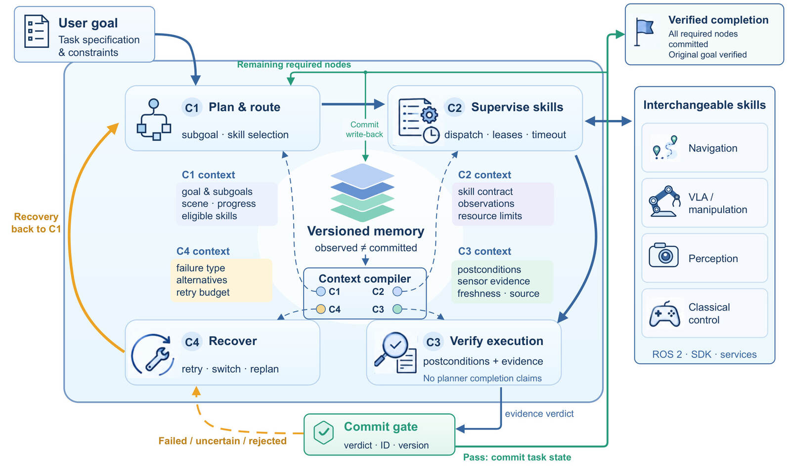
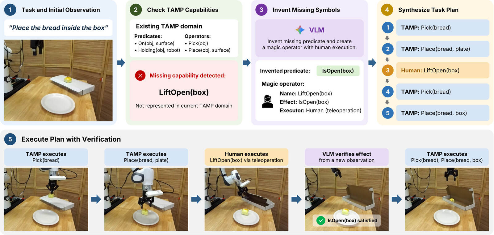
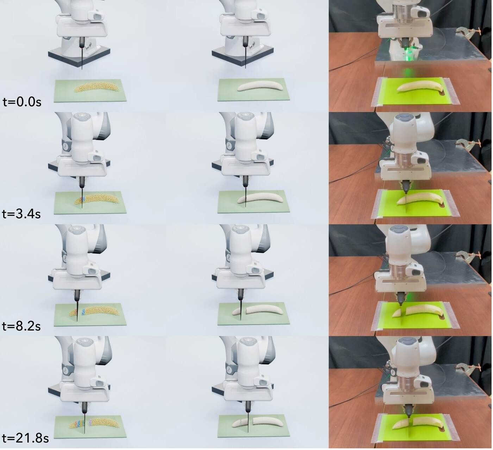

# 2026-09-25 科研日报

## 今日速览

今天最值得细读的是 [TANDEM](#2026-09-25--tandem)：它没有让人从头遥操作整段长任务，而是先让任务—运动规划完成已有技能，只在规划器缺能力的那一段请人示教。这样同一份人工时间能收集更多完整轨迹；但 100 条成功示教里，规划执行仍是主要失败源，说明“少请人”并不等于自动部分已经可靠。

- **Agent 可靠性必读：** [RegenHarness](#2026-09-25--regenharness) 把“模型声称完成”和“控制器允许提交完成”拆开，并让失败只能通过带回归测试的版本更新改变 Harness；这是过程监督的实用系统设计，但目前主要是部署案例，不是大规模受控基准。
- **主线必读：** [TANDEM](#2026-09-25--tandem) 用规划器拼接廉价自动片段与少量人工片段，再把完整轨迹用于微调机器人动作策略；它优化的是示教采集效率，还没有自动生成新的物理场景。
- **图形学基础：** [BladeMaster](#2026-09-25--blademaster) 给材料粒子持久保存切面侧别，刀离开后切口也不会被数值方法重新粘回去；代表性实验在 RTX 5090 上快于实时，但计时不含表面重建与渲染。
- **圈内动态：** Meta 的购物 Agent Muse 被 Amazon 阻断，讨论焦点从“会不会操作网页”转向身份声明、授权、凭据边界与平台商业规则。

## Agent 的完成声明必须先过证据门

### RegenHarness · arXiv · 2026-09-23

**一句话判断：** 它把机器人 Agent 的自我改进限制在可版本化、可回滚的 Harness 配置中，并用与任务绑定的证据门阻止模型把“看起来结束”误报成“已验证完成”。

**Title：** RegenHarness: A Robot Agent Harness with Evidence-Gated Recursive Self-Improvement  
**作者：** Kailin Wang, Haoxiang Jie, Yaoyuan Yan, Zhiyou Heng, Zhaosong Li。  
**单位：** Country Garden Services Group AI Lab；华中科技大学 School of Mechanical Science and Engineering；Omni AI。  
**发表时间 / 投稿信息：** arXiv v1 首次提交 2026-09-23；仅见预印本，未标明会议录用。论文在 2026-09-24 的 arXiv 新稿列表出现。  
**链接：** [arXiv 摘要](https://arxiv.org/abs/2609.27612) · [HTML 全文](https://arxiv.org/html/2609.27612v1)

**摘要中译：** 长时机器人任务的风险不只来自规划失败，还来自误报完成、过时观测、重复执行和恢复过程污染上下文。作者提出一个机器人 Agent Harness：它用任务契约、版本化记忆、独立验证上下文和证据门管理执行；再把任务记录变成候选 Harness 更新，只有通过回归测试和安全约束才升级版本。

**方法与原理。** 这里的 *Harness* 不是机器人策略本身，而是包在大模型、技能和控制器外面的运行时：它决定给模型看什么、何时调用技能、什么证据足以改变系统状态，以及失败后怎样恢复。

1. 系统先把自然语言目标编译为任务契约 (T=(g,G,C_g,S,R))：(g) 是总目标，(G) 是有依赖关系的子目标图，(C_g) 是原始完成条件，(S) 是安全与资源约束，(R) 是恢复预算。把完成条件写在执行前，可以避免规划器在失败后偷偷降低标准。
2. 记忆分成观测事实 (O_k) 与已提交事实 (C_k)。技能不能直接把“已完成”写进后者，只能返回证据包 (Z_k) 和一项候选状态更新；证据还绑定任务版本、对象身份和时间，旧照片不能证明当前对象已经处理。
3. 规划、技能监督、验证和恢复使用四个隔离上下文。验证器不会继承规划器的成功叙述，只读取契约和证据包；证据缺失、冲突或过期就拒绝提交。每次重试消耗预设预算，含糊时默认停止，而不是无限循环。
4. 一次任务结束后，系统从任务记录提出新的 Harness 配置，例如改变上下文选择、提示模板、路由或恢复规则；模型权重不在线更新。候选版本必须跑回归集合，覆盖正常、过时证据、重复调度、中断和资源冲突等情形。

版本更新可以写成

\[
H_{j+1}=\begin{cases}\widetilde H_j,&A(\widetilde H_j,H_j,\mathcal R_j)=1\\H_j,&\text{否则。}\end{cases}
\]

其中 (H_j) 是当前 Harness，\(\widetilde H_j\) 是根据第 (j) 轮记录生成的候选配置，\(\mathcal R_j\) 是回归集，(A) 是准入检查：安全与证据语义不能减弱、旧任务不能退化、预先声明的指标要改善且更新获得授权。即使更新器提出“少检查一次更快”，也无权改掉完成提交门。

*原论文图 1（[来源](https://arxiv.org/html/2609.27612v1#S3.F1)）。上半部分是单次任务：计划与技能只产生候选结果，验证器用证据决定能否提交；下半部分是跨任务改进：记录生成候选 Harness，回归准入后才替换旧版本。两条环路被刻意隔开。*

**结果与局限。** 论文展示了真实四足机器人在仓库中完成语音接单、导航、全景检查、视觉分析、递送消息、返航和口头汇报的链条，证据包括音频、图像、轨迹和回执；另一个闭环路线案例说明“到了终点附近”不等于完成巡检。价值在于把可审计机制落到真实系统，但论文没有给出覆盖多任务的大规模对照表或 Harness 模块消融；“递归自我改进”目前是配置更新与回归准入，不是模型自主重训，也不能据案例证明长期性能单调上升。

**值得关注。** 这与失败回流主线的关键交点是：失败先成为结构化、可验证的任务记录，再决定能否改流程。它不生成场景、示教或策略，因此不能替代 MiracleAug 一类 Real2Sim2Real 数据闭环；可复用的是“生成候选—独立验证—版本提交”的边界，尤其适合防止场景修复或动作重生成被 Agent 自己误判为有效。

## 只在人不可替代的阶段采示教

### TANDEM · arXiv · 2026-09-23

**一句话判断：** TANDEM 把长任务拆成规划器能完成的片段与必须人来完成的缺口，以较少遥操作时间收集完整训练轨迹；它提升了数据效率，但自动段错误仍会污染整条示教。

**Title：** TANDEM: Task and Motion Planning with As-Needed Demonstrations for Efficient Vision-Language-Action Model Fine-tuning  
**作者：** Samrat Sahoo, Liang Ji, Tom Silver, Yixuan Huang。  
**单位：** Stanford University；Princeton University。  
**发表时间 / 投稿信息：** arXiv v1 首次提交 2026-09-23；论文注明 under review，未标明已录用 venue。2026-09-24 进入 arXiv 新稿列表。  
**链接：** [arXiv 摘要](https://arxiv.org/abs/2609.28314) · [HTML 全文](https://arxiv.org/html/2609.28314v1) · [项目页](https://prpl-group.com/tandem/)

**摘要中译：** 视觉—语言—动作模型（VLA：从相机图像与语言指令直接预测机器人动作的策略）通常需要昂贵的全程人工示教。TANDEM 用任务—运动规划（TAMP：同时决定做哪些离散步骤以及机械臂怎样移动）完成已知操作，只在规划域缺少行为时请求人遥操作。混合轨迹经验证后成为完整示教，用于微调一个部署时独立运行的 VLA。

**方法与原理。** 输入是一条语言指令 \(\ell\)、初始 RGB 图像 \(o_0\)、已有规划域 \(M_0=\langle\Psi_0,\Omega_0\rangle\) 和目标 VLA 预训练中的示例轨迹。\(\Psi_0\) 是“物体在盘中”这类谓词，\(\Omega_0\) 是带前置条件与效果的 pick/place 等操作。输出不是一条拼接脚本，而是一批完整观测—动作轨迹，最终用来微调 \(\pi_{0.5\text{-DROID}}\)——本文选用的机器人动作策略。

1. 视觉语言模型（VLM：同时读图和文字的模型）先判断现有规划域是否缺能力。比如“把面包放进盒子”需要先开盒，而 \(\Omega_0\) 没有开盖动作，VLM 就新增谓词 `IsOpen(box)` 和由人执行的 `LiftOpen` 操作，并写清其前置条件与效果。
2. 扩展域 \(M_H=\langle\Psi_0\cup\Psi_\Delta,\Omega_0\cup\Omega_\Delta\rangle\) 产生分阶段计划 \(\phi_k=(\gamma_k,e_k)\)：\(\gamma_k\) 是阶段子目标，\(e_k\) 指定由机器人规划器还是人来执行。于是规划器可以先把面包移到盘中，人只开盒，规划器再把面包放进去。
3. 人工阶段结束后重新拍图，VLM 谓词分类器 (g_\psi(o,b)\in\{0,1\}) 检查对象 (b) 是否达到目标状态。失败的人类片段不会写入成功示教。自动阶段使用 DATAFARM，并参考目标 VLA 的预训练轨迹来减少规划动作与模型原有动作分布的差异。
4. 成功片段按顺序保存为完整轨迹 \(\tau=((\tau_1,\phi_1),\ldots)\)，再监督微调策略：用每一步图像、语言和机器人状态预测对应动作。部署时只保留微调后的 VLA，以 15 Hz 闭环运行；TAMP、VLM 判断和人都不再出现。

采集目标是

\[
\max_D J(\pi_D)\quad\text{s.t.}\quad C(D)=\sum_{\tau\in D}c(\tau)\le B,
\]

即在人工时间预算 (B) 内选数据集 (D)，让用它训练后的策略成功率 (J) 尽量高；(c(\tau)) 只计一条轨迹需要的人类操作成本。这解释了方法为何把简单移动交给规划器：省下的人时可以换成更多完整长任务样本。

*原论文图 2（[来源](https://arxiv.org/html/2609.28314v1#S3.F2)）。左侧发现规划缺口并造出“人工操作符”，中间按阶段交替采集，右侧才用完整轨迹微调 VLA；部署时图中的规划器和人类通道都被移除。*

**结果与局限。** 五个真实长任务共尝试 130 次，得到 100 条成功示教，采集成功率 76.9%；原始 TAMP 因每项任务都含未知阶段而为 0%。失败中 93.3% 归因于 TAMP 执行，只有 6.7% 归因于谓词或操作符生成。以“盖住面包卷”任务为例，相同人工时间下得到的示教数约为全程遥操作的 2.9 倍。每任务 20 条示教、每任务 20 次测试时，\(\pi_{0.5\text{-DROID}}\) 从微调前 0% 提升到平均 60% 成功率；HITL-TAMP 基线为 17%，平均任务进度为 77.6% 对 55.8%。这些是单一机械臂、单一 VLA 和五项任务的作者实验；单图谓词验证可能漏掉遮挡状态，方法也不会判断人是否真的能完成新操作。

**值得关注。** TANDEM 与 MiracleAug 都追求“用较少真机人时得到更多有效训练轨迹”，但路径不同：前者不重建或编辑场景，而是在真实世界用符号规划复用已知技能，只补录能力缺口。可借鉴点是把人工预算作为显式优化约束、在拼接前检查阶段效果；尚缺的是跨场景增强、自动修复失败自动段、仿真策略结果和独立真机复现。

## 让切口在刀离开后仍然存在

### BladeMaster · arXiv · 2026-09-23

**一句话判断：** 它不预先规定切割面，而是在刀扫过材料时在线生成并持久保存断裂侧别，从而兼顾任意切割路径、切面接触和 GPU 实时性。

**Title：** BladeMaster: Real-Time Robotic Cutting Simulation with Online-Generated Persistent Discontinuities  
**作者：** Zhanyu Yang, Yunuo Chen, Yanjia Huang, Joseph Masterjohn, Yin Yang, Chenfanfu Jiang。  
**单位：** Purdue University；University of California, Los Angeles；Envora；Toyota Research Institute；University of Utah。  
**发表时间 / 投稿信息：** arXiv v1 首次提交 2026-09-23；仅见预印本，未标明会议录用。2026-09-24 进入 arXiv 新稿列表。  
**链接：** [arXiv 摘要](https://arxiv.org/abs/2609.27342) · [HTML 全文](https://arxiv.org/html/2609.27342v1)

**摘要中译：** 机器人切割仿真既要在工具移动时在线改变拓扑，又要在工具离开后保留切口。BladeMaster 在 GPU 总拉格朗日物质点法中，为粒子生成持久断裂编码；它还处理切面之间和刀具—材料之间的双向接触，并只在受影响区域重建表面。

**方法与原理。** 物质点法（MPM）把软材料存成携带质量、速度和形变的粒子，每一步临时把量传到网格上求力，再传回粒子。BladeMaster 使用总拉格朗日版本（TLMPM）：计算网格固定在初始参考构型，适合复用邻接关系；难点是普通网格会让刀两侧粒子再次共享质量和动量，相当于把切口“粘回去”。

1. 每个粒子除常规力学状态外，还保存切割进度 (D_p\in[0,1]) 和持久侧别编码 (c_p)。刀在一个时间步扫出的带状区域决定新切面；粒子按位于切面哪一侧获得标签，而未被切到的材料仍可正常耦合。
2. 网格计算按侧别拆成逻辑副本。只有兼容侧别的粒子共享质量与动量，因此相反切面不会跨缝传力；编码留在粒子上，刀离开后仍保持断开。实现只压缩当前出现的拓扑状态，而不分配理论上的全部组合。
3. 断开不意味着永不接触。切面之间另做材料—材料接触，使两块材料重新碰到时可以挤压和滑动但不会重新连接；刀具—材料的冲量同时反馈给刚体求解器，因此机械臂能感到反力与力矩。
4. 力学步结束后，只在拓扑变化的局部网格用 dual contouring（从隐式表面跨格信息生成多边形）更新新切面，避免每帧重建整件物体。

*原论文图 1（[来源](https://arxiv.org/html/2609.27342v1#S1.F1)）是结果序列而非 pipeline；论文没有一张覆盖全部模块的总流程图。上排仿真、下排真实实验用于检查切开、刀具接触和两部分分离的时间演化，不应把视觉相似当成力曲线已经精确验证。*

**结果与局限。** 在 RTX 5090 上，论文代表性任务的墙钟时间 / 仿真时间为 0.30–0.62，粒子数约 3,584–8,960，因而力学计算快于实时；该计时明确不含表面重建和渲染。香蕉实验给出仿真—真实的定性序列对照，但没有由此建立严格的材料参数或切割力误差界。方法也不保证绝对无穿透，不含应力驱动的自然断裂；连续增加切口会增加活跃拓扑状态和成本。

**值得关注。** 对 Real2Sim2Real 而言，它补的是“动作是否在物理上有效”而非外观重建：切、撕等拓扑改变任务若仍用刚体碰撞或会愈合的软体近似，合成动作标签会系统性错误。下一步真正关键的是用真实力/轨迹标定材料、比较仿真训练策略的真机切割成功率，而不只是画面相似和仿真实时性。

## 圈内新闻与社区反应

### Muse 被 Amazon 阻断：Agent 的能力边界首先是授权边界

Meta 在 2026-09-08 发布个人 Agent [Muse](https://about.fb.com/news/2026/09/introducing-muse-personal-ai-agent/)，宣称可代用户购物、预订和处理网页任务。9 月 21 日起，用户在 Muse 中访问 Amazon 时看到未授权 Agent 违反使用条款的提示；[The Verge 的 9 月 21 日报道](https://www.theverge.com/tech/998078/amazon-blocks-meta-muse-ai-agent-shopping)转述 Amazon 的理由包括 Agent 未清楚标识自身、凭据与账户数据风险，以及未获平台授权。这里能核实的是访问被阻断及双方公开说法；不能据此断言 Muse 实际泄露了凭据。

[Hacker News 的原始讨论串（9 月 21 日）](https://news.ycombinator.com/item?id=49789982)出现两类意见：一类认为身份透明和用户授权是必要安全边界；另一类认为阻断也保护了 Amazon 的广告与推荐商业模式。这些是个别社区观点，不是安全结论或行业共识。**编辑判断：** 对可执行 Agent，网页可达性、服务方授权和凭据隔离已经是与模型推理同等重要的系统能力；基准里“浏览成功”不能自动推出真实产品可部署。

### 两篇机器人工作同时把“证据”放到数据入口

9 月 24 日新出现的 [TANDEM 项目页](https://prpl-group.com/tandem/)公开了论文、视频与代码入口，RegenHarness 则公开了完整预印本。前者在阶段效果验证后才接纳示教，后者在独立验证后才提交任务状态；二者都没有用模型自己的成功叙述替代外部证据。暂未找到日期明确、可核实的独立复现或实际使用反馈，因此这里只记录作者发布，不把项目演示当作社区验证。

## 覆盖说明

- **日报日期：** 2026-09-25；主要覆盖 2026-09-24 的 arXiv 新稿、项目更新与圈内动态。三篇论文均首次提交于 9 月 23 日、在 9 月 24 日新稿列表出现，日期已分别标明。
- 已检查 LLM、Agent、图形学与具身智能四个方向；对 9 月 24 日前已报道且无实质新增证据的发布不重复收录。新闻只保留两项高信号更新，未找到可靠反应处已明确说明。
- 三篇均阅读 HTML 全文的方法与关键实验；图 1/2 均来自原论文。BladeMaster 无覆盖全流程的单张 pipeline 图，因此使用原论文定性结果图并明确其证据边界。
- 对标仓 Real2Sim_GPT6_ASTRA 自上次检查后未见实质提交。notes 的新增内容涉及私人研究与状态记录，仅用于兴趣校准，没有搬运到公开日报；blog 未见新的公开正文更新。academic 访问本次不可用，不据此判断“无更新”。
- 所有数值均为作者报告，未作独立复现；预印本状态不等于已录用。

**编写：** Neon
