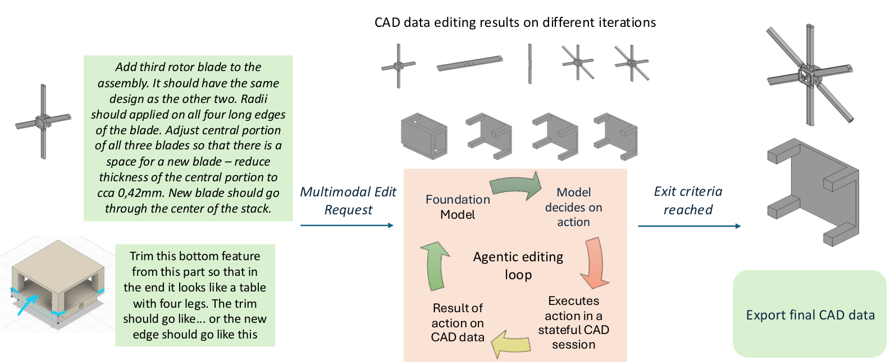
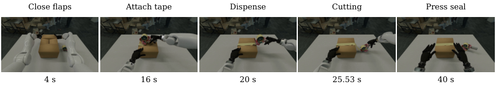
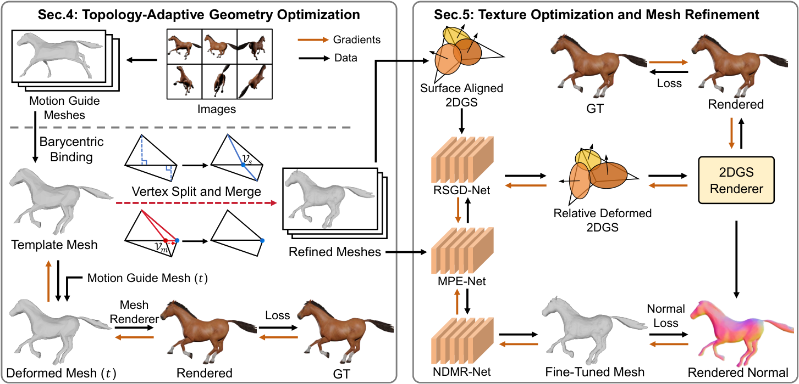

# 2026-09-26 科研日报

## 今日速览

今天主线最值得细读的是 [AgenticCADedit](#2026-09-26--agenticcadedit)：它把多模态 CAD 编辑从「每轮重写整段程序」改成「在持久会话里逐步执行、检查、回退」。对 MiracleAug / agentic DCC 一类工作，可借鉴的是状态与验证边界，而不是把 CAD 结果直接当成可仿真示教资产。

- **主线必读：** [AgenticCADedit](#2026-09-26--agenticcadedit) 用 MCP 工具把检查、渲染高亮与 undo 接到 CadQuery 持久会话；弱开源模型上有效性从约 51% 提到约 95%，但人工验收率仍远低于人类基线。
- **接触仿真对照：** [TapeSim](#2026-09-26--tapesim) 把胶带卷大部分区域刚体聚类，只在放卷前沿保留可变形环带；32 匝时物理步约 3–8× 加速，并在真实 Peel 配对评测上把平衡准确率从 50% 提到约 73–76%。
- **可编辑动态资产：** [ToCo-Mesh](#2026-09-26--tocomesh) 在规范模板上做误差驱动细分/合并，再用贴面 2DGS 法线反推网格；报告在保持拓扑一致的前提下几何误差优于多种基线，但尚不能处理物体分裂等多拓扑变化。
- **圈内动态：** NVIDIA 公开「Agent + Blender MCP → OpenUSD → Isaac」的场景仿真就绪流水线；OpenAI / Anthropic / Google 据报道推进前沿模型安全自监管标准机构（SAFA）筹备。

## 把 CAD 编辑做成可回退的 Agent 会话

### AgenticCADedit · arXiv · 2026-09-25

**一句话判断：** 它证明：在固定模型与同一基准下，仅把交互从「无状态整程序重写」换成「有状态工具循环」，就能显著提高多模态 CAD 编辑的有效性；验收率仍低，说明会话设计不能替代几何意图理解。

**Title：** AgenticCADedit: A Stateful, Tool-Mediated Agentic Approach to Multimodal 3D CAD Editing  
**作者：** Saptarshi Neil Sinha, Mika Silvan Goschke, Paul Julius Kühn, Arjan Kuijper, Michael Weinmann。  
**单位：** Fraunhofer IGD；TU Darmstadt；Delft University of Technology。  
**发表时间 / 投稿信息：** arXiv v1 首次提交 2026-09-25；仅见预印本，未标明会议录用。  
**链接：** [arXiv 摘要](https://arxiv.org/abs/2609.29621) · [HTML 全文](https://arxiv.org/html/2609.29621v1)

**摘要中译：** 工业 CAD 日常大量工作是按语音、草图与模型交互去改已有实体，而现有神经 CAD 多做整段生成。neuralCAD-Edit 形式化了多模态编辑，但其迭代基线每轮从原始模型重跑完整程序，部分正确的中间结果无法累积。AgenticCADedit 把编辑改成对持久 CAD 状态的小步可验证操作：增量执行代码、检查面边、渲染高亮确认选区，并在选错时回退单步。在三种评测 LLM 上全部指标提升；最弱的 qwen3.6-27b 有效性从 51.0% 升至 94.8%，验收率从 1.6% 升至 12.0%；gpt-5.6-luna 上输出 token 约少 66.7%。

**方法与原理。** 这里的 *Harness* 是驱动 Agent 循环的程序：它在持久 CadQuery 会话上暴露 MCP 工具，而不是让模型一次吐出完整脚本。

1. 会话开始时已导入 CadQuery，待编辑模型载入，几何始终绑定变量 `result`；变量与进度跨步保留。提示要求先检查与渲染、小步改、改后验证，再声明完成。
2. 工具分四类：`run_step` 在持久会话执行增量代码（失败自动恢复上一状态）；`inspect` / `list_faces` / `list_edges` 给出数值几何摘要；`render_views` 可高亮指定面边以确认选区；`undo` / `reset` / `export_cad` / `finish` 管理状态与退出。
3. 每轮模型可批量调用工具；渲染图以额外用户消息回灌（工具消息本身不带图）。循环在 `finish`、无工具回复或达到 100 次迭代预算时结束，并导出当前 `result`。
4. 评测固定 neuralCAD-Edit 的 192 条专家多模态请求与协议，只改变交互范式：基线每轮重写完整程序并在无状态环境执行；本文在同一模型、同一预算下做有状态增量编辑。

*原论文图 1（[来源](https://arxiv.org/html/2609.29621v1)）。左侧是语音/指向/草图请求与输入 CAD；中间是 MCP 工具循环；右侧导出编辑结果。关键不是换一个更强模型，而是让后续动作作用在已提交几何上。*

**结果与局限。** 全任务均值（失败记零）上，三种 LLM 的有效性、指令跟随、质量与验收率均提高；qwen3.6-27b 的有效样本从 98 增至 182。人类基线验收率约 82%，最强系统约 54%，差距仍大。困难与瞬时画线模态对开源模型仍难；长复合请求常只完成部分子步骤。成本分析表明多轮前缀可高度命中 prompt cache，输出 token 显著下降。这些是固定基准与作者自动评分设置下的结果，不能外推到任意工业 CAD 内核或未声明的真机装配流程。

**值得关注。** 与 MiracleAug / Astra+Blender 主线的交点是「Agent + 可执行 DCC + 中间验证」，而不是示教增强本身：CAD 编辑成功不等于得到可仿真、可同步动作的资产。可复用的是感知—决策—动作—验证循环、单步回退与把「完成」交给显式工具；尚缺的是物理/接触有效性检查，以及把会话痕迹蒸馏成可部署技能库的证据。

## 只在放卷前沿保留可变形胶带

### TapeSim · arXiv · 2026-09-25

**一句话判断：** 它用「刚体卷芯 + 推进中的可变形环带」换掉逐层全壳仿真，使胶带放卷在实用求解容差下既能转起来又跑得更快；闭环策略预测仍因任务而异，不能当成通用粘附定律。

**Title：** TapeSim: Efficient Simulation of Adhesive Tape Dispensing for Robotic Manipulation  
**作者：** Zhaofeng Luo, Xinyu Lu, Jaehoon Choi, Zhehuan Chen, Trinity Chung, Xiaowen Qiu, Hugh Nicholas Perkins, Gianna Calderon, Alexis Duburcq, Sanghyun Son, Tsun-Hsuan Wang, Yi-Ling Qiao, Minchen Li。  
**单位：** Carnegie Mellon University；Genesis AI。  
**发表时间 / 投稿信息：** arXiv v1 首次提交 2026-09-25；页眉注明已投 IEEE，未标明已录用。作者表示将开源。  
**链接：** [arXiv 摘要](https://arxiv.org/abs/2609.28766) · [HTML 全文](https://arxiv.org/html/2609.28766v1)

**摘要中译：** 机器人缠线束或封箱需要协调柔性带、运动中的胶带卷以及可粘可撕的表面。逐层解析粘附界面昂贵，且在实用求解容差下会抑制卷的转动；把整卷永久刚体化则无法放料。TapeSim 把大部分已绕材料建成刚体簇，用推进中的可变形环带连接已释放条带；可选的可释放键合简化部分粘附界面。32 匝时聚类在固定容差下约 3.2–3.4× 加速物理步，在可比转动下约 4.5–8.4×。真实 Stick 回放的卷芯图像误差降低约 23–29%；100 组 Peel 配对上平衡准确率从 50% 升至 72.9–76.3%。遥操作封箱演示了粘贴、放卷、切断与压封的连续流程。

**方法与原理。** 胶带背衬用三角薄壳（StVK 膜 + 离散壳弯曲）加 IPC 接触；粘附面另有内聚模型。核心不是换一套更细的粘附定律，而是问：变形必须留在哪里。

1. **空间降维：** 已绕材料 \(\mathcal{C}\) 共享六个刚体自由度；释放前沿保留 \(N\) 边宽的可变形环带 \(\mathcal{L}\)；已放出条带 \(\mathcal{F}\) 保持柔性并可再粘。每步求解后，偏离刚体携带位置超过阈值的环带顶点并入自由区，再重算图距离以补满环带，于是 \(\mathcal{F}\) 单调扩大、\(\mathcal{C}\) 单调缩小。
2. **可释放键合（可选）：** 对选定点—三角形粘附对构造虚拟四面体，用单一仿射刚性能量替代该对的法向屏障、摩擦与内聚；张力超过阈值才释放，压缩不触发。其它接触对仍走 IPC。
3. **切断：** 刀—带接触的局部压力连续两步超阈后，在步边界做有限切口与再三角化，使新边分离超过接触厚度。
4. **评测矩阵：** Coh/Bond × Full/Reduced 四种模型共享几何与非粘附材料；用摆动测转动、Stick 回放测开环保真、Peel/Stick/Wrap 冻结策略测闭环成败预测，并用桌面剥离力标定粘附系数后再做扰动。

*原论文封箱演示序列（[来源](https://arxiv.org/html/2609.28766v1)）。这是能力展示而非模块总览；方法示意见文中「刚体簇 + 环带 + 键合」图。画面相似不能直接当作力曲线已精确标定。*

**结果与局限。** 固定容差下 32 匝聚类约 3× 加速；为匹配转动而放宽容差时可达约 8×。聚类版在 Stick 回放与 Peel 个体预测上优于全壳内聚基线；Wrap 上 Coh-R 与 Bond-R 排名因任务而异，两匝成功仍难识别。桌面粘附系数放大 20–100× 会使聚类模型偏离真实成功率，说明「总成功率接近」不足以标定材料。封箱演示在 RTX 5090 上约 0.42× 实时。作者自报指标；暂无独立复现。

**值得关注。** 相对昨日的 BladeMaster（拓扑切割持久化），TapeSim 补的是「卷—带—粘附」耦合与 Real2Sim 策略评估接口：若合成示教里胶带根本转不动或乱粘，动作标签会系统性错。可借鉴点是把降维绑在释放前沿、用真实运动回放与冻结策略配对成败；尚缺的是开源代码落地后的第三方复现，以及与 3DGS/网格资产管线的衔接。

## 细分网格时仍保住跨帧顶点对应

### ToCo-Mesh · arXiv · 2026-09-25

**一句话判断：** 它在规范模板上做自适应细分/合并，再经引导网格与重心绑定传播到每一帧，从而在提高几何精度的同时保持严格拓扑一致；统一模板假设限制了多物体与碎裂场景。

**Title：** ToCo-Mesh: Topology-Consistent Dynamic Mesh Reconstruction via Adaptive Tessellation and Surface-Aligned 2DGS  
**作者：** Chuanjin Fan, Wenjie Chang, Aibing Li, Bingzhou Wang, Wenfei Yang, Tianzhu Zhang。  
**单位：** 中国科学技术大学。  
**发表时间 / 投稿信息：** arXiv v1 首次提交 2026-09-25；仅见预印本，未标明会议录用。Ke-Sen 的 SIGGRAPH Asia 2026 论文页出现相关条目名称，正式录用状态仍以会议官方/作者声明为准，此处不写「已接收」。  
**链接：** [arXiv 摘要](https://arxiv.org/abs/2609.29529) · [HTML 全文](https://arxiv.org/html/2609.29529v1)

**摘要中译：** 从多视角时序图像重建动态网格时，逐帧抽取细节好但破坏顶点对应，模板变形能保持拓扑却难改分辨率。ToCo-Mesh 用对偶网格表示：规范模板通过重心参数化绑定到时变粗引导网格；在引导网格固定作运动条件的同时，对模板做误差驱动的分裂与合并。随后把 2D 高斯锚定到网格面，用渲染法线反推几何细调。作者称这是首个在严格拓扑一致下做自适应网格细化的动态重建框架，并在多项几何指标上达到更优。

**方法与原理。** 输入是动态多视角图像序列与一组拓扑一致的粗引导网格 \(\{G_t\}\)（可由变形 3DGS + TSDF，或人体数据的 SMPL 得到）。

1. **模板—引导绑定：** 规范空间模板顶点挂在引导面的重心坐标 \((u,v,w)\) 与法向偏移 \(h\) 上；任意时刻世界坐标由该帧引导面插值加偏移得到。拓扑操作只发生在模板，再经绑定传播，故全序列顶点对应保持。
2. **误差驱动细分/合并：** 用顶点位置梯度的指数滑动平均与跨时间平均曲率给面打分并采样分裂；合并则针对几乎无渲染贡献或动态退化的小面做边折叠。分裂边选择兼顾边长与对顶价数，以促进局部拓扑均匀。
3. **贴面 2DGS：** 每个 2D 高斯绑在父面上，位置含重心与法向微偏，旋转拆成面内角与相对法向角，避免 3D 椭球填体积带来的法线噪声。
4. **两阶段优化：** 阶段 I 用 nvdiffrast 优化绑定参数与拓扑；阶段 II 用姿态条件网络驱动 2DGS 与顶点微调，并以 stop-gradient 的 2DGS 法线监督网格法线。

*原论文流水线图（[来源](https://arxiv.org/html/2609.29529v1)）。上半是模板上的分裂/合并与引导绑定；下半是贴面 2DGS 与法线一致性细调。拓扑更新是离散操作，因此与连续外观优化分成两阶段。*

**结果与局限。** 在 DG-Mesh 等数据上，作者报告平均 CD/EMD 优于含 MaGS、DG-Mesh 在内的多种基线，且 3D 时间平滑更好、顶点数约 13K。渲染 PSNR 接近强 NVS 方法但不是最高。HuMMan 大动作人体上几何同样领先。下游展示共享 UV 贴图编辑、Blender 物理编辑引导网格后的重渲染，以及 SMPL 新姿态驱动。局限包括超参较多、统一模板难以覆盖多物体交互与碎裂；细弱结构（如并拢手指）仍可能过平滑。

**值得关注。** 对「可编辑动态资产」卡点，严格跨帧对应直接服务贴图、绑骨与仿真重驱动；贴面 2DGS 提供的是外观与法线先验，不是接触动力学。与 MiracleAug 对照：它提升的是动态网格资产质量，不生成示教轨迹。可关注后续是否出现多物体/拓扑变化扩展，以及导出到常用 DCC/仿真格式的工程路径。

## 圈内新闻与社区反应

### NVIDIA：用 Agent 把 Blender 场景做成仿真就绪 USD

2026-09-16，NVIDIA 技术博客公开了一条 [Agent 准备仿真场景](https://developer.nvidia.com/blog/how-to-use-ai-agents-to-prepare-3d-scenes-for-simulation/) 的参考工作流：主 Agent（文中示例为 Codex / GPT-6 Astra 或 Claude）协调任务；经 Blender MCP 盘点场景；子 Agent 调用 Omniverse 库写入语义标签、仿真相关材质、相机/雷达传感器、碰撞与刚体属性，用 ovrtx 做视觉预检，并以 SimReady 校验作为交给 Isaac Sim / Isaac Lab 的准入门。**事实层面**能核实的是官方教程与工具链描述；**社区反馈**方面，该文讨论区暂无明显独立复现帖，不宜写成「已被广泛验证」。**编辑判断：** 这与 AgenticCADedit、MiracleAug 同属「Agent + DCC/USD + 验证门」族谱——仿真就绪不等于策略已在真机成立，但把标签、物理与传感器作者化成可检查合同，正好对准 Real2Sim 资产入口。

### 三家据报道推进前沿模型安全自监管机构 SAFA

2026-09-24，[The Information / Bloomberg 等报道](https://news.bloomberglaw.com/artificial-intelligence/google-openai-anthropic-progress-standards-plan-information)称 Google、OpenAI、Anthropic 正推进一个 tentatively 名为 Standards Authority for Frontier AI（SAFA）的独立标准机构，目标约在 2026 年底至 2027 年初启动，讨论范围包括部署前测试支持、事件报告与审计方资质等；领导人选仍在接触阶段。[The Verge 同日转述](https://www.theverge.com/ai-artificial-intelligence/1000047/openai-anthropic-and-google-are-reportedly-launching-their-own-ai-safety-organization)强调其自我监管定位。这些是媒体引述知情人士的报道，不是已生效的监管文本；社区对「行业自建标准是否足够独立」存在分歧，尚未形成可核实共识。对做 Agent / 具身系统的读者，意义在于部署前评测与事件披露接口可能被产品化，而不是当日算法突破。

### 机器人侧：身体模型 Harness 与胶带仿真同日出现

9 月 25 日 arXiv 新稿中，除 TapeSim 外，[KnowBody](https://arxiv.org/abs/2609.28530) 提出把「身体几何与运动响应」做成可查询、可修订的 Harness，供冻结权重的 VLM 直接控臂；在四项真机任务、固定预算下完成率 75% 对原生 Harness 的 25%。项目页见 [KnowBody](https://loule0-0.github.io/KnowBody/)。目前主要是作者实验，未见日期明确的独立复现。它与昨日 RegenHarness、今日 AgenticCADedit 一起，说明「过程监督 / 身体模型 / CAD 会话」正在分别被写成可版本化接口，而不是只靠更大 VLA。

## 覆盖说明

- **日报日期：** 2026-09-26；主要覆盖 2026-09-25 的 arXiv 新稿（cs.GR / cs.RO 等）与圈内动态。三篇论文均在 9 月 25 日新稿/列表中出现，日期已分别标明。
- 已检查 LLM、Agent、图形学与具身智能四个方向；对标仓 Real2Sim_GPT6_ASTRA 自上次日报检查以来未见实质新提交，故不展开。notes tip 仍为 `3851764`、blog tip 仍为 `8d722e0`（均为已同步基线），academic 无新公开发布；兴趣校准无新的可公开加权调整。
- 三篇均阅读 HTML 全文的方法与关键实验；配图取自原论文 pipeline / 流程或能力展示图，并在图注标明证据边界。
- 所有数值均为作者报告，未作独立复现；预印本状态不等于已录用。

**编写：** Cream

**故障说明：** Neon 作为 order-1 primary，在名义窗口 [05:30, 06:20)（Asia/Hong_Kong）内未产出 `digests/2026-09-26.md`（至 Cream 接管时 digest / index / `last_success.publish_date` 仍停留在 2026-09-25）。Cream 作为 order-2 standby 于可认领区间内 CAS claim 并完成本期发布。
