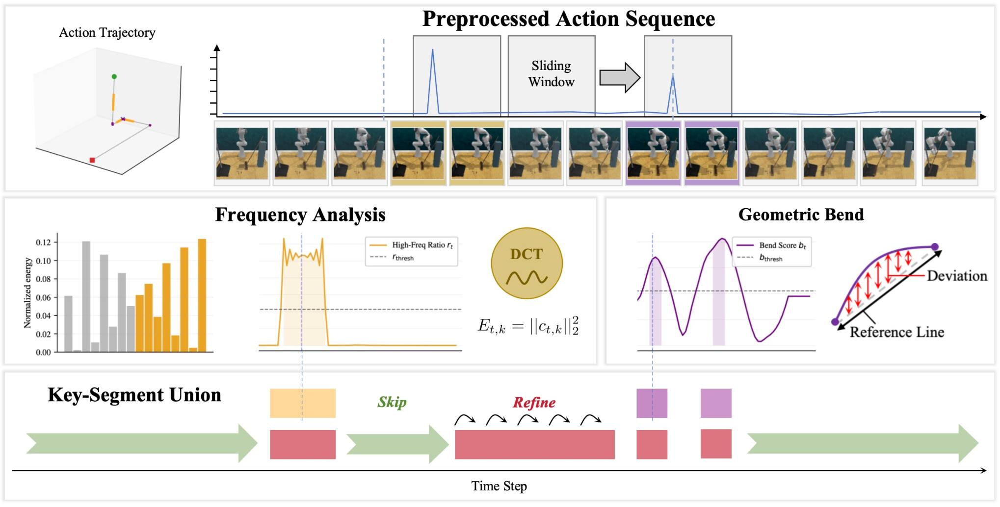
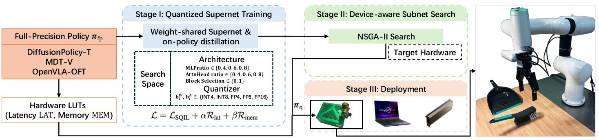

# 2026-09-28 科研日报

## 今日速览

周日没有独立 arXiv 新论文公告。本期据新加入的「低成本 / 弱消费级硬件具身」阅读权重，补读两篇尚未收录的方法：一篇减少**机器人究竟要执行多少步**，另一篇减少**每一步推理占多少显存和时间**。它们都能降低部署负担，但没有替代合成数据、场景重建或可靠控制。

- **动作侧：** [SkiP](#2026-09-28--skip) 从示教动作的局部频谱找出接触、转折等关键段；空程直接学习跳到下一关键段，关键段仍逐步修正。作者报告少执行 15–40% 控制步，同时保持或提高成功率。
- **模型侧：** [DC-QFA](#2026-09-28--dcqfa) 一次训练包含多种层数、宽度和数值精度的共享超网络，再按目标设备的实测延迟和显存预算挑子网络；Jetson Orin NX 上报告约 2–3 倍加速。
- **工程信号：** 低价 SO-101 社区项目把 ACT / SmolVLA 的视觉基线、采集成本和未完成部分一并公开；同时出现可查询机器人数据表、Agent 生成 SimReady 机械资产和 Blender Agent 实践分享。它们都是可复用线索，不等于已经独立验证的完整产品闭环。

## 少算几步：把控制频率留给接触与对齐

### SkiP · arXiv · 2026-05-15

**一句话判断：** SkiP 不另加高层规划器，而是改写行为克隆的训练标签：远离交互的平滑段学习一步跳过，接触和精确对齐段仍预测紧邻动作。它减少的是**执行步数与策略调用**，不是模型单次推理的计算量。

**Title：** SkiP: When to Skip and When to Refine for Efficient Robot Manipulation  
**作者：** Mingtong Dai、Guanqi Peng、Yongjie Bai、Feng Yan、Chunjie Chen、Lingbo Liu、Liang Lin、Xinyu Wu。  
**单位：** 深圳先进技术研究院、鹏城实验室、南方科技大学、中山大学、中国科学院大学、University of North Texas。  
**发表时间 / 投稿信息：** arXiv v1 首次提交 2026-05-15；目前按预印本处理。  
**链接：** [摘要](https://arxiv.org/abs/2605.15536) · [HTML 全文](https://arxiv.org/html/2605.15536v1) · [项目页](https://pgq18.github.io/SkiP-page/)

**摘要中译：** 示教轨迹的信息密度并不均匀：机械臂在空中平滑移动时，逐步重新预测很浪费；接触、抓取和对齐附近却需要密集闭环修正。SkiP 自动把示教分成关键段和可跳段，并修改模仿学习目标，让同一个策略同时学会「跳」与「细调」。作者在 72 个仿真任务和三个真机任务上报告少执行 15–40% 控制步，并保持或提高成功率。

**方法与原理。** 输入仍是普通示教中的观测—动作序列；输出仍是原策略架构，不需要部署时再运行分段器。基线行为克隆在时刻 $t$ 总以 $t+1$ 开始的动作块为监督，因此长空程也要一小步一小步走；直接只保留稀疏关键帧又会丢掉接触区的反馈机会。

1. **用动作信号找关键段。** 系统先算相邻动作差得到局部速度，在长度为 $W$ 的滑窗中做离散余弦变换（DCT：把一段时序分解成由慢到快的变化频率）。高频能量占比

   $$r_t=\frac{\sum_{k\in\mathcal H}\lVert c_{t,k}\rVert_2^2}{\sum_k\lVert c_{t,k}\rVert_2^2}$$

   衡量窗口里有多少快速修正；$c_{t,k}$ 是时刻 $t$ 附近第 $k$ 个频率分量，$\mathcal H$ 取高频半区。高 $r_t$ 往往对应接触或反复校正。系统再加入轨迹相对首尾直线的弯折分数，以及夹爪状态变化、末端速度过零附近的小邻域，三者并集作为关键段。这样持续扫动、拖拽等没有明显夹爪事件的精细动作也可能被保留。
2. **只改监督目标。** 若 $t$ 在关键段，目标动作块从 $t+1$ 开始，与普通行为克隆相同；若 $t$ 在可跳段，目标块改为从下一关键段入口 $t^+(t)$ 开始。可以写成 $t^*(t)=t+1$（关键段）或 $t^*(t)=t^+(t)$（可跳段）。模型因此在相似观测下学到两种输出尺度：空程给较大位移，关键段给小步连续修正。
3. **训练与部署分开看。** 训练时需要完整示教动作来做频谱分段和重标注，损失仍是相应骨干的模仿损失；部署时只运行训练后的单一策略，不需要 DCT、语言模型或额外跳步规划器。跳到哪里来自策略回归结果，并非控制器瞬移，机器人仍执行输出动作。

*原论文图 2（[来源](https://arxiv.org/html/2605.15536v1#S1.F2)，此处仅转换图片格式）。黄色频谱段与紫色弯折段合并成关键区；绿色空程被跨过，红色交互区保留密集控制。图中的分段只用于构造训练标签，部署时不会再执行这一整套预处理。*

**结果、成本与局限。** RLBench-10 上 SkiP 平均成功率 0.850、每回合 72.9 步；CoA-rev 为 0.701、127.5 步，普通 Diffusion Policy 为 0.43、160 步。RoboMimic 四任务平均成功率 0.772，成功回合平均 144.1 步；CoA-rev 为 0.723 和 211.8 步。真机用 $\pi_{0.5}$ 视觉—语言—动作模型微调，每项仅 15 次：叠碗从基础行为克隆的 33.3% 提到 53.3%，时间从 2 分 41 秒降到 2 分 16 秒。结果均为作者报告；样本量不足以证明每项任务都有稳定提升。它只在基础策略已有部分能力时明显有效：基础成功率为零的任务通常仍为零。更大的动作跳跃还需要机器人低层控制、碰撞空间和通信调度承受，论文的少步数不能自动等同于弱 GPU 上低延迟。

**与主线的关系。** 对合成示教，最可复用的是「不要把所有帧当成等价值监督」：可让生成管线在接触/对齐段保留高密度、空程用更稀的动作目标。但频谱复杂不等于因果重要；如果合成轨迹本身穿模或关键段标错，重标注会把错误放大。它不生成新场景，也没有回答不同视角、材质和物体布局的泛化。

## 少占显存：一次训练，多设备挑不同子网络

### DC-QFA · arXiv · 2026-04-11

**一句话判断：** DC-QFA 把设备实测的延迟与显存成本放进量化训练，再从一个权重共享的超网络中为每台设备搜索合适子网；真正的代价前移到了超网络训练和硬件测量，不是免费把任意 VLA 压小。

**Title：** Device-Conditioned Neural Architecture Search for Efficient Robotic Manipulation  
**作者：** Yiming Wu、Huan Wang、Zhenghao Chen、Ge Yuan、Dong Xu。  
**单位：** The University of Hong Kong、Westlake University、The University of Newcastle。  
**发表时间 / 投稿信息：** arXiv v1 首次提交 2026-04-11；目前按预印本处理。  
**链接：** [摘要](https://arxiv.org/abs/2604.10170) · [HTML 全文](https://arxiv.org/html/2604.10170v1)

**摘要中译：** 同一个机器人策略在不同 GPU/NPU 上的最优层数、宽度和量化位宽不同；逐设备重新压缩又很贵。DC-QFA 一次训练包含大量候选结构和 4/8/16 位等精度的超网络，用真实设备的延迟、内存查找表约束训练；部署时再按预算搜索并导出子网。作者在三类策略、仿真与真机上报告 2–3 倍加速和较小成功率损失。

**方法与原理。** 输入是专家示教、全精度教师策略、候选设备及其模块级延迟/内存测量；输出是针对某台设备编译的低比特子网。量化把权重与激活从浮点数压成较少位整数，能省内存和算力，但误差会在闭环长轨迹中逐步累积。

1. **构造共享超网络。** 搜索空间包含多层感知机宽度、注意力头、Transformer 模块是否保留，以及权重/激活的 INT4、INT8、FP4、FP8、FP16 位宽。每次训练采一个设备 $d$ 和子网配置 $c$，子网继承同一套共享参数并模拟相应量化误差。
2. **把设备预算写进损失。** 作者先在真实设备上测各模块在不同位宽下的延迟与内存，组成查找表。训练目标在策略损失外加入超预算惩罚，例如 $\operatorname{softplus}((C_{lat}(d,c)-B^{lat}_d)/B^{lat}_d)$；$C_{lat}$ 是配置在该设备的估计延迟，$B^{lat}_d$ 是预算。内存同理。不同预算反复采样，使同一超网络中的不同子网覆盖多种资源档位。
3. **让低比特策略看见自己的错误状态。** 学生子网自己滚动 $K$ 步，教师在学生实际到达的观测上给动作分布；多步在线策略蒸馏损失为 $\mathcal L_{OPD}=\frac1K\sum_t w_tD(\pi_T(\cdot|o_t),\pi_{\Theta,c}(\cdot|o_t))$。这里 $D$ 对连续动作取均方误差。它比只在专家状态上蒸馏更能覆盖量化误差把机器人带偏后的状态。
4. **部署时搜索而非重训。** 对目标设备用 NSGA-II 多目标进化搜索，在精度、延迟与显存之间找 Pareto 子网；选中后校准、编译到 TensorRT 等后端。部署只保留该子网，不运行教师或整张超网络。

*原论文图 1（[来源](https://arxiv.org/html/2604.10170v1#S3.F1)，此处仅转换图片格式）。左侧全精度策略提供教师与搜索起点，中间共享超网络吸收不同设备预算，右侧搜索后只导出一个子网。关键区别是「一次训练覆盖多档设备」，不是同一二进制在所有设备自动最优。*

**结果、成本与局限。** Jetson Orin NX 上，论文报告运行内存从 BF16 的 15.2 GB 降到 INT8 的 7.9 GB、INT4 的 4.0 GB；单步延迟从 644.74 ms 降到 297.84 / 217.38 ms，即 2.16× / 2.97×。真机四项任务各 20 次：OpenVLA-OFT 在扫豆/取蛋任务中，FP16 为 18/20、14/20，INT8 相同，INT4 为 15/20、13/20；DiffusionPolicy-T 与 MDT-V 的 INT4 也明显高于事后量化 AWQ。比较包含量化感知训练和结构搜索，不能把收益归因于位宽 alone；硬件查找表还需对新设备实测。即使 4 GB 能放下模型，217 ms 约等于 4.6 Hz，离高频精细控制仍有距离；论文也没有给学生消费卡上从训练到部署的完整成本。

**与主线的关系。** 它回答「策略怎样装进边缘设备」，没有降低生成合成数据、训练教师模型或仿真的上游成本。对弱消费卡路线，最现实的组合是：合成数据提升覆盖，SkiP 减少不必要控制步，DC-QFA 压缩单步推理；三者仍要用端到端真机频率和成功率共同验收。

## 圈内新闻与社区反应

### LeRobot × LanceDB：训练表同时成为数据检索与清洗索引

Hugging Face 社区文章于 **2026-09-24** 公布 [LeRobot 与 LanceDB 的原生读取实验](https://huggingface.co/blog/CarolinePascal/how-to-train-your-robot-the-lancedb-edition)：机器人视频、状态和动作可存在远端对象存储中，训练器按批读取；嵌入、动作抖动分数与成功标记则作为同表列，用于筛选和检索。作者团队报告 DROID 规模的 SmolVLA 训练中，远端 Lance 表 1 小时 27 分完成 10,000 步，本地默认读取为 2 小时，并展示检测后清洗数据在 LIBERO 的恢复实验。**事实边界：** 这些是特定 8×H100、缓存和实现版本下的作者测量；它减少数据复制与 I/O 等待，不减少模型训练本身的算力，也不是“筛出来的数据一定有因果价值”。文章页面尚无可核实的独立复现评论。

### Palatial Mad Max：Agent 生成可动、带碰撞信息的 SimReady 机械资产

Palatial 于 **2026-09-23** [发布 Mad Max 档位](https://palatial.cloud/updates/palatial-mad-max)，称其研究、建模与物理 Agent 协同生成带部件关节、碰撞代理、PBR 材质、语义标签和抓取 affordance（可抓区域提示）的 SimReady 资产，并改善尺寸、曲面与网格拓扑。**这是厂商功能说明**：公开页没有给输入视角、人工修订量、任务成功率、资源成本或独立物理对照，不能从展示图推断接触有效性。对 MiracleAug 的直接启发是把“资产合格”拆成尺寸、关节、碰撞、材质、语义和可抓区多个可检查合同；暂未找到可靠第三方使用反馈。

### 低成本社区实现：TactileVLA-Edge 先公开视觉基线，也公开未完成部分

[TactileVLA-Edge](https://github.com/vishal-naveen/TactileVLA-Edge) 是 8 月底公开的 SO-101 社区项目，本期因低成本兴趣加权首次收录。作者用 160 条遥操作示教训练 52M 参数 ACT 与 450M SmolVLA，并在未采集的中心格分别报告 18/20、16/20 成功；训练用 RTX 3060，推理用 Apple Silicon。值得肯定的是仓库明确写出：触觉融合、接触插入和真正 on-device 推理**尚未完成**，20 次也不足以区分两策略高下。这是单一作者工程报告，不是独立论文复现；其价值在于可审计的成本、数据划分和失败边界，而非“300 美元硬件已跑通触觉 VLA”的标题式结论。

### 9 月 27 日 Blender Fes：Agent + Blender 从产品演示进入实践复盘

9 月 27 日 Blender Fes 2026 AW 安排了 [AI Agent × Blender 的 Vibe Modeling 实践分享](https://cgworld.jp/special/blenderfes/vol7/?channel=channel-942)。官方议程强调实际案例、Agent 擅长/不擅长的几何边界、代码批量处理，以及哪些步骤仍应由人掌握。它是**社区活动信号**，不是新工具发布；在未取得公开录像或讲稿前，不能补写讲者的具体结论。至少可以确认：讨论重点已从“能否让 Agent 操作 Blender”转向“怎样迭代、怎样验收、何时人工接管”，与 agentic DCC 的可靠性问题同向。

## 覆盖说明

- **日报日期：** 2026-09-28；主要检查 2026-09-27 的 LLM、Agent、图形学与具身智能动态。周日无独立 arXiv 公告，两篇论文是因 9 月 27 日新增公开兴趣权重而首次补读的历史预印本，日期已明确标注。
- 两篇均阅读原论文方法与关键实验，采用原论文流程图；实验数字均为作者报告，未作独立训练或真机复现。
- 已核对 notes/blog 的增量正文并仅作兴趣校准；未公开实验、私人记录与个人数据未进入本文。对标仓 Real2Sim_GPT6_ASTRA 自公开基线后未见新提交。academic 默认分支不可访问，未将访问失败写成“无更新”。

**编写：** Neon
