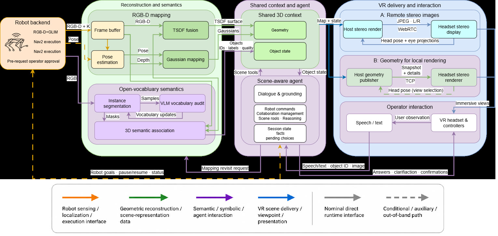
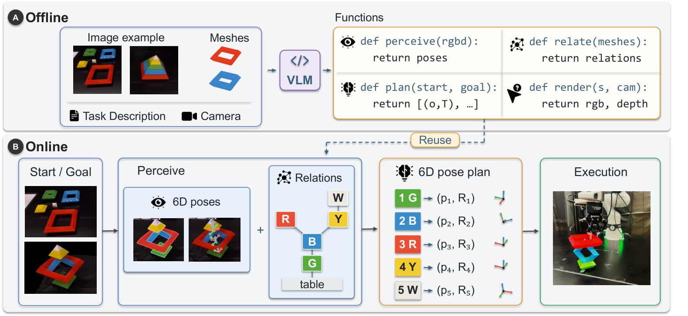
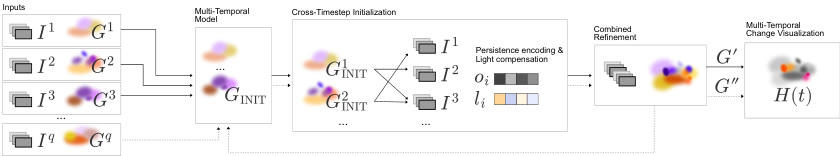
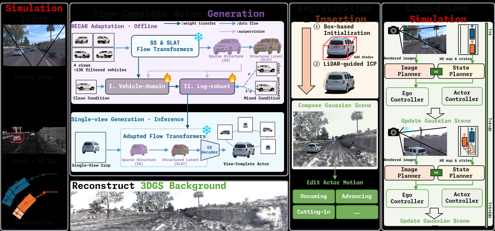

# 2026-09-29 科研日报

## 今日速览

周一 arXiv 新公告里，三条线索同时撞上主线：把**高斯地图**做成 agent/操作员共用的语义状态；让 VLM **先约定共享表示再写可执行程序**；以及把多时段高斯融成可高亮变化的单模型。另有一条把驾驶日志里的车补成视角完备演员，提醒闭环仿真里「渲染缺口」会冒充成规划失败。

- **必读 · Agent × 高斯地图：** [CognitiveReality](#2026-09-29--cognitivereality) 在线 Gaussian–SDF 建图，导出带覆盖度与渲染质量的 Scene Model；本地 Qwen3-VL-8B 只通过类型化工具读写该模型，并在 VR 里与四足真机闭环。它回答的是「地图状态合同」，不是自动生成示教数据。
- **必读 · 表示引导的程序合成：** [RIVET](#2026-09-29--rivet) 固定「物体 6D 位姿 + 关系图」接口，再让 VLM 依次生成感知、渲染、关系推断与规划程序；离线写一次，在线对新起终点复用。对照 MiracleAug：重点在感知—规划接口一致性，而非 Blender 资产重建。
- **图形学 · 多时段融合：** [ChronoFuseGS](#2026-09-29--chronofusegs)（Pacific Graphics 2026）把多个分时训练的 3DGS 融成带 per-splat 持久编码的单模型，并做子物体级变化高亮。
- **仿真提醒：** [RECAST](#2026-09-29--recast) 从单张日志图生成视角完备车体高斯，插入 Street Gaussians 场景做规划器闭环；同规划器下无碰撞率从原生演员 22.2% 升到 63.0%——说明渲染缺陷会扭曲闭环结论。
- **社区：** Blender 5.3 alpha 原生 3DGS 导入/渲染的官方说明继续细化；能进 DCC 仍不等于可绑骨、可导出仿真资产。

## Agent 与共享高斯状态：先约定地图合同

### CognitiveReality · arXiv · 2026-09-25

**一句话判断：** CognitiveReality 把在线高斯地图升级成带持久物体 ID、覆盖度与渲染质量的 Scene Model，再让本地 VLM 只通过校验过的类型化工具读写它；真机实验证明的是「指点—确认—导航/再观测」闭环，不是端到端自主策略。

**Title：** CognitiveReality: Robot-Agnostic Semantic Gaussian Mapping with an LLM Agent for Immersive Collaborative VR Teleoperation  
**作者：** Timofei Kozlov、Dmitrii Maliukov、Andrey Marchenko、Dmitrii Plotnikov、Miguel Altamirano Cabrera、Dzmitry Tsetserukou。  
**单位：** Skolkovo Institute of Science and Technology（Intelligent Space Robotics Laboratory）；NLP Research Center, Moscow。  
**发表时间 / 投稿信息：** arXiv v1 首次挂出日期按公告日记为 2026-09-25（HTML 标注 25 Sep 2026）；投稿信息未标明。  
**链接：** [摘要](https://arxiv.org/abs/2609.31418) · [HTML 全文](https://arxiv.org/html/2609.31418v1) · [PDF](https://arxiv.org/pdf/2609.31418)

**摘要中译：** 逼真的三维画面能告诉遥操作员机器人在哪，却说不清场景里有什么物体、每个物体观测是否够好，以及怎样把指点与语音变成可执行动作。CognitiveReality 把机器人 RGB-D 流建成可被 VR 操作员与工具型语言模型共享的语义索引高斯–TSDF 地图：重建侧提供可切换定位源的在线建图与中断恢复；语义侧把实例身份写进高斯基元并导出 Scene Model；交互侧用类型化工具把语音/射线解析成盘点、检索、高亮、质量报告、导航目标与再观测任务，并经确认门后再下发。

**方法与原理。** 输入是机器人或手持 RGB-D（可附 IMU/LiDAR 位姿），以及操作员在 VR 中的语音与控制器射线；输出是持续更新的高斯–SDF 地图、约每 2 秒导出的 Scene Model JSON，以及经确认的机器人目标。它不把整段自然语言直接当控制指令，而是把「理解」与「可执行调用」拆开。

1. **机器人无关的在线 Gaussian–SDF 建图。** 沿 GPS-SLAM 思路：深度先融进有符号距离场（SDF：用到表面的有符号距离表示几何，更新便宜、对噪声稳），再在融合曲面上初始化与优化 3D 高斯以提供写实渲染。位姿可来自机器人 SLAM，也可切换到机载 ORB-SLAM3；陀螺门控丢掉模糊帧，深度融合按传感器噪声加权。定位中断时用影子视觉跟踪与关键帧 PnP 桥接，作者报告 5–40 秒中断位姿误差约 1–8 cm。
2. **在线实例语义与 Scene Model。** 开放词表分割约 2 Hz 与建图并行；实例 ID 写在高斯基元上并随地图增长保持。Scene Model 列出物体类别、ID、质心/包围盒、覆盖度与每物体渲染质量，供 agent 与操作员共用同一指称。
3. **类型化工具 + 双层路由。** 工具覆盖盘点、语义搜索、描述、高亮、质量报告、记忆、导航目标与再观测。确定性预路由处理明确请求；其余交给本地 Qwen3-VL-8B，输出受 schema 约束，再经场景校验与操作员确认。确认前不会把目标送进导航栈。
4. **沉浸式接口。** 主机约 90 Hz 立体流，或头显本地维护有界高斯场景；叠加路线、轨迹、高亮与质量图层。重建与 agent 推理在外置 GPU 工作站，四足端跑定位与 Nav2。

*原论文图 2（[来源](https://arxiv.org/html/2609.31418v1)，此处仅转换图片格式）。共同的三维场景表示把传感、语义物体状态、agent 推理、操作员交互与机器人控制连在一起；语言不直接驱动电机。*

**结果、成本与局限。** 相对 GPS-SLAM，作者报告机械臂数据上约 +2–8 dB；四足 D455 上陀螺门控把 PSNR 从 18.09 提到 20.70 dB，预算校准后到 22.73 dB。1471 条受控指令上，相对纯规则路由，工具精确匹配 48.33%→81.24%，完整调用正确率 42.96%→72.88%。真机：30 次导航中 26 次到标记目标（3 次因漂浮噪声高斯导致地面点偏移，1 次导航栈崩溃）；20 次再观测全部执行，覆盖帧 PSNR 升 2–5 dB。重建侧用 RTX 5090 级桌面机，机器人侧 Jetson Orin NX——这是工业边缘档，不是学生消费卡上的完整闭环。代码与数据声明录用后公开。

**与主线的关系。** 对 MiracleAug / agentic Real2Sim，可借鉴的是「共享、可版本化、带质量字段的物体状态」和「工具调用必须过校验/确认」。它不生成同步示教，也不把高斯直接变成可仿真碰撞体；Scene Model 仍是遥操作与巡检合同，不是策略训练集。

## 表示先于代码：VLM 写可复用操作程序

### RIVET · arXiv · 2026-09-25

**一句话判断：** RIVET 不让 VLM 在线逐步规划，而是先固定「位姿 + 关系图」场景表示，离线生成可复用的感知与规划程序，再在新起终点上执行；失败可归因到表示或模块，而不是藏在对话里。

**Title：** Representation-Guided Generation and Integration of Executable Programs for Robot Manipulation  
**作者：** Ruixiao Yang、Mingxin Yu、Chuchu Fan。  
**单位：** Massachusetts Institute of Technology（Aeronautics and Astronautics）。  
**发表时间 / 投稿信息：** arXiv v1 首次挂出按公告日记为 2026-09-25；投稿信息未标明。  
**链接：** [摘要](https://arxiv.org/abs/2609.31337) · [HTML 全文](https://arxiv.org/html/2609.31337v1) · [PDF](https://arxiv.org/pdf/2609.31337)

**摘要中译：** 搭一套操作流水线需要感知、规划与控制通过精心设计的表示对接。用 VLM 写代码可以自动化拼装，但各模块若各自假设几何与任务信息，就会对不上。RIVET（Representation-guided Integration of VLM-generated Executable Task programs）围绕共享的物体中心表示组织代码生成：每物体 6D 位姿保留度量信息，关系图暴露任务结构；在此引导下，VLM 生成相互配合的感知、渲染、关系推断与规划程序。作者在叠方块、七巧板重排与三维装配上评估，并展示仿真到真机。

**方法与原理。** 任务实例含起始观测 \(I_s\)、目标观测 \(I_g\)、自然语言规格 \(\tau\)、物体网格集合 \(\mathcal{M}\) 与相机标定 \(C\)。域内 \(\tau,\mathcal{M},C\) 固定，\(I_s,I_g\) 变化。目标是得到可执行动作序列，把起始配置变到目标配置。

1. **共享场景表示（人手固定接口）。** 每个物体有实例 ID、规范网格索引与工作空间位姿 \(T_i\)；关系图 \(\mathcal{R}\) 存支撑等任务相关关系。位姿负责「放到哪」，关系负责「先动谁」。接口约定固定，避免各生成模块偷换坐标系或物体身份。
2. **离线：按表示生成四类程序。** VLM 依次生成 `perceive`（视觉工具 + 代码恢复位姿）、`render`（把表示画回图像便于检查）、`relate`（推断任务关系）、`plan`（定义动作前置/转移并搜索带具体放置目标的动作序列）。生成时用参考起终点评估任务与工具适用性。
3. **在线：程序固定，只换观测。** 新起终点先映射到同一表示，再跑规划与机器人接地。VLM 不再每步重新「想计划」，降低在线推理成本，也便于对照中间状态排错。
4. **为何有效（作者解释）。** 基线或隐式规划、或分头写互不兼容的模块；共享表示迫使感知输出规划能消费的字段。作者报告在仿真主对比中比若干在线规划/写程序基线更稳，并讨论剩余失败模式。

*原论文 pipeline 图（[来源](https://arxiv.org/html/2609.31337v1)，此处仅转换图片格式）。左侧离线生成感知与规划代码；右侧在线只替换起终点观测。关键不是「VLM 更聪明」，而是接口先于实现。*

**结果、成本与局限。** 评估跨叠方块、七巧板与三维装配，并含真机演示与相机视点鲁棒性实验；具体成功率以论文表格为准（作者报告）。前提包括已知物体网格与相机标定——对开放世界杂乱桌面并不免费。生成质量仍依赖 VLM；表示本身由人设计，不是从数据里学出的通用 DSL。

**与主线的关系。** 与 agentic 示教增强对照：RIVET 的可迁移经验是「先钉死几何—关系合同，再让模型填算法」；MiracleAug 侧若自动写 Blender/仿真脚本，同样需要防止各工具各说各话。它不解决 Real2Sim 资产生成，也不替代失败驱动造数。

## 多时段高斯：持久部分互借，变化按 splat 高亮

### ChronoFuseGS · Pacific Graphics 2026 · 2026-09-25

**一句话判断：** ChronoFuseGS 把多个分时、部分重叠的 3DGS 融成带每高斯持久编码的单模型，用跨时段图像监督 refinement，并提供子物体级变化高亮；适合工地/展陈一类「大半不变、局部改动」的场景，不是操作轨迹的 4D 示教表示。

**Title：** ChronoFuseGS: Multi-Temporal Gaussian Fusion with Per-Splat Persistence and Change Visualization  
**作者：** Tobias Batik、Diana Marin、Peter Kán、Hannes Kaufmann。  
**单位：** TU Wien。  
**发表时间 / 投稿信息：** 已接收 Pacific Graphics 2026；arXiv v1 公告日记为 2026-09-25。  
**链接：** [摘要](https://arxiv.org/abs/2609.31339) · [HTML 全文](https://arxiv.org/html/2609.31339v1) · [PDF](https://arxiv.org/pdf/2609.31339)

**摘要中译：** 场景局部在不同采集批次间发生变化时，常规重建难以兼顾。ChronoFuseGS 将多个分别训练、地理覆盖部分重叠的高斯模型并入一个联合模型：允许一时段的高斯帮助其他时段重建持久结构，并支持增量加入新时段。每个高斯基元编码它在哪些时段可见；可视化按用户选择的时间集合高亮变化部分，粒度在 splat 级而非整物体。

**方法与原理。** 输入是若干已训练模型 \(G^1,G^2,\ldots\) 及其图像集；输出是联合模型 \(G'\)，可按时段做新视角合成与变化高亮。

1. **合并与坐标对齐。** 无精密外参时，用 SfM 把新时段图像配准到已有模型，再变换高斯。
2. **每高斯持久与光照补偿。** 为高斯 \(g_i\) 存透明度操纵向量 \(o_i\)（长度=时段数）：\(o_i^p\approx 1\) 表示在 \(t_p\) 可见，\(\approx 0\) 则不可见；另用 \(l_i\) 补偿光照差异。
3. **跨时段初始化与联合 refinement。** 来自 \(G^k\) 的高斯对其他时段图像渲染比较，回传梯度，同时更新几何与持久参数——变化编码进入重建，而不是事后贴标签。
4. **变化可视化。** 用户选择时段子集；变化区域用高亮色，持久区域保留原色。交互渲染在 Unreal 5.6 Niagara 中实现。

*原论文图 1（[来源](https://arxiv.org/html/2609.31339v1)，此处仅转换图片格式）。实线为初次合并，虚线为增量并入新时段；右侧支持任意时间选择的新视角与变化高亮。*

**结果、成本与局限。** 五组数据上，作者报告联合 refinement 后 PSNR/SSIM/LPIPS 相对各时段独立模型全面更好；Autumn 上联合优化相对冻结 \(o_i\) 或 \(\alpha_i\) 的消融更优。训练与 1920×1080 渲染测于 RTX 4090。用户研究表明可视化有助于区分持久/变化区域。限制：依赖分时段预训练模型；动态连续运动或快速形变不是设定；可视化用户实验基于预渲染 2D，不等于野外部署。

**与主线的关系。** 对「已知运动学 × 同轨迹新视角重放」阅读兴趣：ChronoFuseGS 处理的是离散采集批次的结构变化，不是机器人关节驱动的四维重放。可借鉴的是 per-primitive 持久开关与跨时段互借；不要把它读成操作示教的 4DGS 方案。

## 闭环仿真：视角缺口会冒充成规划失败

### RECAST · arXiv · 2026-09-25

**一句话判断：** RECAST 从单张日志分割图生成视角完备车体高斯并注册进重建场景，使自车/他车偏离记录轨迹时仍能渲染未见侧面；同规划器下无碰撞率大幅上升，说明闭环评测必须先分清「规划差」与「演员渲染差」。

**Title：** RECAST: From Log Replay to Closed-Loop Driving Simulation with View-Complete Actors  
**作者：** Zijun Zhao、Liewen Liao、Kang Shen、Songan Zhang、Ming Yang。  
**单位：** 上海交通大学（全球创新学院；自动化与智能感知学院 / 系统控制与信息处理教育部重点实验室）。  
**发表时间 / 投稿信息：** arXiv v1 公告日记为 2026-09-25；投稿信息未标明。  
**链接：** [摘要](https://arxiv.org/abs/2609.31374) · [HTML 全文](https://arxiv.org/html/2609.31374v1) · [PDF](https://arxiv.org/pdf/2609.31374)

**摘要中译：** 闭环驾驶仿真要求自车与周围演员偏离记录轨迹后，渲染观测仍可靠。现有数据驱动仿真器常从稀疏观测重建动态演员，未见视角易出现伪影。RECAST 从单张分割观测生成视角完备演员，注册后支持可控运动与规划器在环；并给出约 2 万辆真车、60 万张去背 RGBA 的 RECAR 数据与两阶段适配。

**方法与原理。** Street Gaussians 重建背景并分离目标车；RECAR 上对 TRELLIS 做车辆域与日志鲁棒两阶段适配，由单张 RGBA 生成完备高斯演员；用日志 3D 框与 LiDAR 点注册后插入场景；仿真中自车执行规划轨迹，演员状态由控制器更新，图像条件规划器吃当前渲染。

*原论文 pipeline 图（[来源](https://arxiv.org/html/2609.31374v1)，此处仅转换图片格式）。多视角伪目标支撑域适配；生成演员经框与 LiDAR 注册后进入 render–plan–update 环。*

**结果、成本与局限。** 九个 Waymo 场景、54 次确定性 rollout：Street Gaussians 背景下，图像条件规划器 GTRS-Dense 的无碰撞率（NC）在原生演员为 22.2%，RECAST 演员为 63.0%（成对差 40.7 个百分点）；DAC/TTC 等亦报告。这是固定规划器换演员的对照，证明渲染可改变闭环结局，不是宣称「生成车已物理正确」。目前聚焦车辆，行人等仍列未来工作。

**与主线的关系。** 对 Real2Sim 评测：若增强后的示教/场景在新视角穿帮，策略失败可能被误判。RECAST 的启示是「视角完备演员」与「同规划器换表示」的对照实验设计；域是驾驶而非桌面操作。

## 圈内新闻与社区反应

### Blender 5.3 alpha：原生 3DGS 作为 PointCloud 类型继续落地

Blender 开发者文档与 5.3 发行说明继续明确：**3D Gaussian Splats** 成为 PointCloud 的 `Type` 选项，PLY（自动检测）/ SPZ（至 v4）导入，Workbench / EEVEE / Cycles 默认可渲染（默认 emissive）；Geometry Nodes 增加 `Set Point Cloud Type`、`Import SPZ`，Import PLY 输出改名为 Geometry。完整版计划约 **2026-11-10**，当前仍为 alpha。[官方 Rendering notes](https://developer.blender.org/docs/release_notes/5.3/rendering/) 仍列出性能不佳、sRGB 训练假设与线性渲染偏差、Apply Transform 未正确处理 scale/rotation/SH、**尚无导出**等限制。社区报道（如 digitalproduction、80.lv、Radiance Fields）多在复述同一官方边界。**观点：** 对 MiracleAug / agentic Blender，「少一层插件」在推进，但「能导入渲染」≠「可编辑绑骨 / 可导出仿真资产」；写稿时仍以官方 notes 为准。

### 闭环评测口径：先分清渲染演员与规划器

RECAST 今日论文本身也是社区方法信号：在固定 GTRS-Dense 规划器下，只换演员表示就能让无碰撞率跳动数十个百分点。可核对的事实是作者表格中的成对对照；把它读成「生成资产已解决 sim-to-real」过线。对具身日报更有用的是评测纪律——增强数据或重建场景做闭环时，应单独报告视角外推与渲染失效案例。

### 对标仓与兴趣校准

[`hku-sail/Real2Sim_GPT6_ASTRA`](https://github.com/hku-sail/Real2Sim_GPT6_ASTRA) 自上次公开基线以来未见新提交（最近公开提交仍约 2026-09-10）。notes tip 仍为 `094bc0e`，blog tip 仍为 `8d722e0`（SA 2026 笔记草稿未发布，未引用正文）；公开兴趣权重无相对昨日仓内记录的新增条目。

## 覆盖说明

- **日报日期：** 2026-09-29；**内容覆盖日：** 2026-09-28（周一 arXiv 新公告及同窗图形学 / 具身相关条目）。
- 四篇均阅读 HTML 全文方法与关键实验；配图为原论文 pipeline/架构图（格式转换）。实验数字均为作者报告，未作独立训练或真机复现。
- 已核对 notes/blog 增量仅作兴趣校准；未公开实验与私人记录未入文。对标仓无新提交。academic 默认分支近期无新公开发布信号。

**编写：** Cream

**故障说明：** 本日由 Cream 于约 06:18–06:45 HKT 故障转移接管发布。Neon primary 窗口 [05:30,06:20) 未产出 `digests/2026-09-29.md`；Neon 曾于 05:32:01 HKT 认领（claim_id `fd9dad55-…`），租约于 06:02:01 HKT 过期且无成功发布。依据：主分支缺当日 digest / index 条目，且 `last_success.publish_date` 仍为 2026-09-28；Cream 在 claimable 窗内 CAS 认领后完成本篇。
