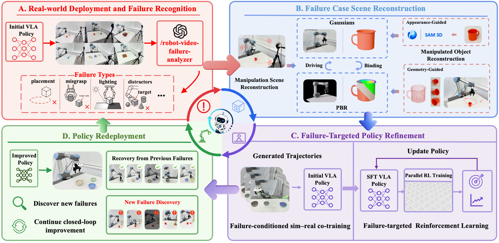
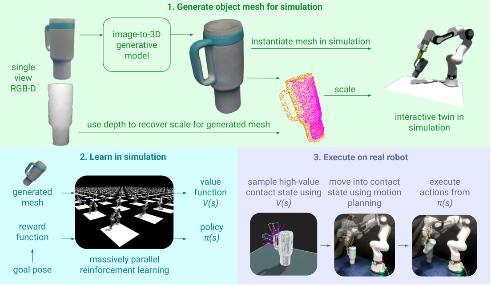
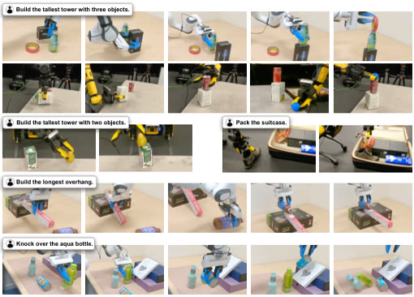
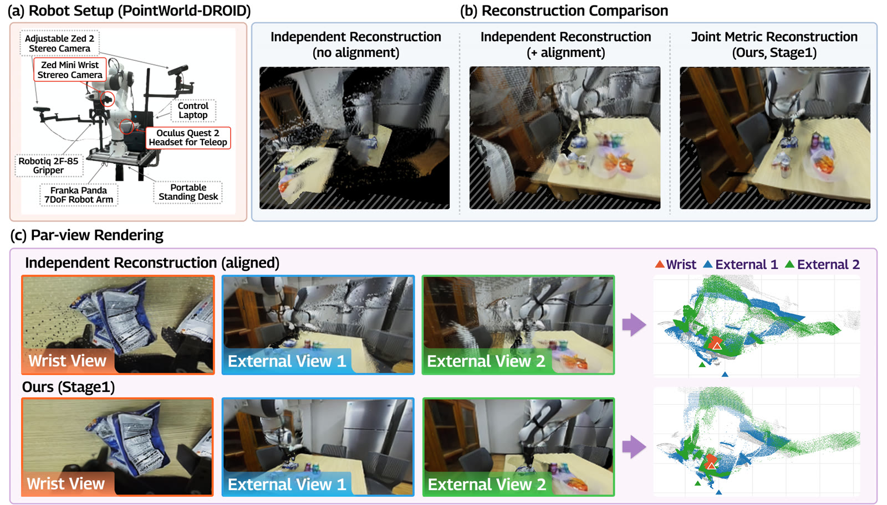

# 2026-09-30 科研日报

## 今日速览

昨天到今天的 arXiv 公告里，Real2Sim 主线突然挤进三条可对照的路：**失败驱动的闭环造数**、**生成式资产上的分钟级零示教 RL**，以及**测试时用大规模并行仿真做空间推理**。另有一条把世界模型 rollout 抬成统一度量 4D 高斯场，正好撞上「同轨迹 / 多相机动态场景如何可查询」的阅读兴趣。

- **必读 · 失败驱动闭环：** [F4R](#2026-09-30--f4r) 把真机失败诊断 → 桌面交互重建 → 失败条件 sim–real 共训 + 定向 RL → 再部署串成环；OOD 失败分布成功率约 90%，对照预算匹配的 Targeted BC / RLinf-Co。它回答的是 MiracleAug 下一问——「缺什么补什么」——而不是泛化示教增强本身。
- **必读 · 分钟级 Generative Real2Sim：** [ZeroBot](#2026-09-30--zerobot)（IEEE RA-L 2026）在「零示教、零预训练策略、零已知物体模型」下，用单视角图像生成完整物体网格，再在仿真里并行 RL；作者报告平均约 119 秒训练、真机约 87% 成功。对照主线：它用生成先验换示教，不走可编辑高斯资产。
- **测试时空间推理：** [Simify](#2026-09-30--simify)（Comments 标注 IROS 2026）从单张 RGB-D 生成可仿真资产，用奖励函数驱动上千条并行 rollout 做进化搜索，几秒级收敛后再上真机摆放；训练免费、推理换算力。
- **4D 高斯抬升：** [RoGSW4RLD](#2026-09-30--rogsw4rld) 把多相机同步的世界模型未来视频抬成统一、可按时间查询的度量 4D 高斯场，并显式用机器人运动学约束；相对分相机重建再合并，新视角 PSNR +2.15 dB、深度 AbsRel 约降 47%。
- **社区：** Blender 5.3 alpha 原生 3DGS 导入/渲染说明仍在迭代；能进 DCC ≠ 可绑骨、可导出仿真资产。对标仓 ASTRA 自上次公开 tip 无新 commit。

## 失败驱动：把真机翻车变成可仿真补课包

### F4R · arXiv · 2026-09-28

**一句话判断：** F4R（Failure for Rising）把部署失败自动诊断为可交互的桌面重建案例，再在失败条件随机化下做 sim–real 共训与定向 RL，形成「识别—重建—精炼—再部署」闭环；它验证的是失败驱动的持续自改进，不是从零生成大规模示教库。

**Title：** F4R: Failure-Driven Recognition, Reconstruction, Refinement, and Redeployment for Continual Robot Self-Improvement  
**作者：** Zhuoyuan Yu、Jiacheng Wang、Tianle Liu、Yihua Ren、Peng Yu、Chen Bai、Ziheng Zhang、Yufei Jia、Jindou Jia、Yuhang Zhang、Xinrui Zhang、Shang Yujing、Yuxiang Chen、Chuhao Zhou、Tiancai Wang、Jianfei Yang。  
**单位：** Nanyang Technological University；西安交通大学；Dexmal。  
**发表时间 / 投稿信息：** arXiv v1 首次挂出按公告日记为 2026-09-28；投稿信息未标明。  
**链接：** [摘要](https://arxiv.org/abs/2609.35575) · [HTML 全文](https://arxiv.org/html/2609.35575v1) · [PDF](https://arxiv.org/pdf/2609.35575)

**摘要中译：** 现有视觉—语言—动作（VLA：把图像/语言映射为机器人动作的策略）模型在真机上的表现，常受限于专家示教覆盖面不足、以及对物理交互理解不够。常见补救是再采失败工况的真机示教，但昂贵、低效、有时不安全且难扩展。本文提出 F4R：一个失败驱动的 real-to-sim-to-real 闭环学习框架，把真机失败转化为有针对性的策略改进。框架先用 agent 从 rollout 中自动识别并诊断失败；再把每次失败重建为保留任务相关空间与物理条件的可交互、物体中心桌面环境；随后在失败条件的仿真—真机联合训练与定向强化学习中精炼策略，并再部署形成持续自改进。

**方法与原理。** 输入是部署 rollout（多视角视频/状态）与既有策略；输出是更新后的策略与可复用的失败案例资产。关键不是「再训一遍」，而是把失败变成可仿真的补课包。

1. **失败识别与诊断。** Agent 从时间证据与双视角故事板中定位最早因果失败，输出原因类别、失败子任务与置信度，并导出后续随机化焦点；在公开 ViFailback 诊断基准与自建轨迹集上审计可靠性。
2. **失败案例重建。** 分别重建操作场景与被操作物体，得到可交互的物体中心桌面环境，尽量保留导致失败的空间布局与接触相关条件，供仿真里复现同类难点。
3. **失败条件精炼（两阶段）。** Stage I：失败感知的域随机化 + 纠正轨迹，做 sim–real 共训，把主要失败模式先对齐；Stage II：在失败分布上做定向 RL（分布式 learner–rollout），继续抬 OOD 成功率。
4. **闭环再部署。** 更新策略回到真机；多轮循环可复用已重建资产，并吸收新观察到的失败。

*原论文 pipeline 图（[来源](https://arxiv.org/html/2609.35575v1)，此处仅转换图片格式）。四段首字母即 F4R：Recognition → Reconstruction → Refinement → Redeployment。*

**结果、成本与局限。** 在代表性任务上，作者报告 F4R 在原始分布与失败（OOD）分布上分别约 93.75% / 90.0% 成功，相对预算匹配的 Targeted BC（约 71.25% OOD）与 RLinf-Co（约 77.5% OOD）更高；消融显示共训把平均成功率从约 46.25% 抬到约 83.75%，再加定向 RL 到约 90%。多轮闭环上，Stack Bowls 等任务成功率可随轮次爬升（文中示例从 30% 逐步到 95% 量级）。重建与诊断仍依赖视觉重建质量与 VLM 诊断；大规模 RL 侧算力与集群配置偏工业训练档，不是学生低端机可直接复刻的完整环。

**与主线的关系。** 与 MiracleAug / 失败驱动造数高度同构：可借鉴「诊断字段 → 随机化/造数焦点 → 再训再测」的合同。差别在于 F4R 强调**部署失败后的补课闭环**与物体中心桌面重建，而不是从示教视频批量生成可编辑 Blender/3DGS 资产；也未把高斯可编辑性当作一等公民。

## 分钟级零示教：生成网格进仿真再 RL

### ZeroBot · IEEE RA-L 2026 · 2026-09-27

**一句话判断：** ZeroBot 在零人类示教、零策略预训练、零已知物体模型的设定下，用图像到 3D 的生成模型得到完整物体网格，再在仿真里大规模并行 RL；接触动作空间利用生成几何与价值函数偏置采样，把「从零学会一个操作」压缩到分钟级墙钟时间。

**Title：** ZeroBot: Learning from Scratch in Minutes with Generative Real2Sim  
**作者：** Ivan Kapelyukh、Xiaohan Zhang、Stephen James、Laura Herlant、Edward Johns。  
**单位：** Imperial College London（Robot Learning Lab / Dyson Robotics Lab / SWIRL）；Robotics and AI Institute。  
**发表时间 / 投稿信息：** IEEE Robotics and Automation Letters 2026（HTML 脚注：Received 19 Aug 2025；Accepted 7 Jan 2026；DOI 10.1109/LRA.2026.3662595）；arXiv v1 挂出按公告日记为 2026-09-27。项目页：https://zerobot-rl.github.io  
**链接：** [摘要](https://arxiv.org/abs/2609.34010) · [HTML 全文](https://arxiv.org/html/2609.34010v1) · [PDF](https://arxiv.org/pdf/2609.34010) · [项目页](https://zerobot-rl.github.io)

**摘要中译：** ZeroBot 是一个 real2sim 框架，面向极苛刻设定：零人类示教、零策略预训练、零已知物体模型，并在数分钟内从零学会操作任务。给定物体的单视角图像与目标位姿，框架用图像到 3D 生成模型得到完整物体网格，再在仿真中做大规模并行强化学习。为加速训练，作者引入利用生成几何与学得价值函数、偏向采样「机器人—物体接触」状态的动作空间。真机任务涵盖抓取、推、关节物体交互与多阶段操作；作者报告约 87% 成功率、平均训练时间约 119 秒，说明把图像到 3D 模型嵌进 real2sim 的价值。

**方法与原理。** 输入是单视角物体图像与目标物体位姿；输出是可在真机执行的操作策略。不依赖专家轨迹，也不假设 CAD 库里已有该物体。

1. **生成式建仿真。** 图像到 3D 模型补全被遮挡几何，得到可用于接触与碰撞的完整网格，并放入并行仿真。
2. **接触偏置的动作空间。** 常规随机探索很难碰到有效接触；作者用生成几何与价值函数引导，提高「会发生接触」的状态采样比例，从而缩短墙钟时间。
3. **仿真训练后真机执行。** 在抓取/推/关节/多阶段等任务上评估 Real2Sim2Real；并讨论扩展到关节物体。

*原论文 pipeline 图（[来源](https://arxiv.org/html/2609.34010v1)，此处仅转换图片格式）。单图 → 网格 → 并行 RL → 真机；关键加速来自接触偏置采样，而不是更多人工示教。*

**结果、成本与局限。** 作者报告真机总成功率约 87%、平均训练约 119 秒（墙钟）；训练速度对比与关节物体扩展见文中图表。局限包括：生成网格误差会直接传导到接触；目标位姿仍需给定；并行仿真与 RL 需要可观 GPU 集群能力——这是「分钟级」成立的前提，不宜读成笔记本电脑上的同等数字。

**与主线的关系。** 对照 MiracleAug：ZeroBot 用**生成式物体模型 + RL**替代示教增强；不做场景级可编辑 3DGS，也不做失败诊断合同。可借鉴的是「几何先验如何压缩探索」，以及零示教设定下 Real2Sim 仍依赖目标位姿与仿真保真度。

## 测试时推理：并行仿真进化搜索摆放

### Simify · arXiv · 2026-09-27

**一句话判断：** Simify 把空间推理从「再训一个大模型」换成测试时的大规模并行物理仿真：单张 RGB-D 生成可仿真资产后，用任务奖励做进化搜索，通常数秒收敛，再把摆放方案送到真机；训练免费，贵在推理算力与网格质量。

**Title：** Test-Time Spatial Reasoning for Robot Manipulation Using Generative Real-to-Sim  
**作者：** Ivan Kapelyukh、Yafei Hu、Ran Gong、Brandon May、Tushar Kusnur、Laura Herlant、Karl Schmeckpeper、Edward Johns、Xiaohan Zhang。  
**单位：** Robotics and AI Institute；Imperial College London。  
**发表时间 / 投稿信息：** arXiv v1 首次挂出按公告日记为 2026-09-27；arXiv Comments 标注 IROS 2026（未见额外独立录用函全文，按 Comments 记会议关联，不作另行核验后的接收断言）。  
**链接：** [摘要](https://arxiv.org/abs/2609.33982) · [HTML 全文](https://arxiv.org/html/2609.33982v1) · [PDF](https://arxiv.org/pdf/2609.33982)

**摘要中译：** 空间推理是通用机器人智能的基础，尤其支撑涉及多物体交互的长程任务。本文提出 Simify：无需训练、在测试时通过大规模并行物理仿真做显式空间推理的框架。从场景的单张 RGB-D 出发，结合 3D 生成模型与视觉—语言模型重建可仿真资产；再给定由奖励函数描述的任务（例如搭最高的塔），在仿真中启动上千条并行 rollout，并用进化搜索优化物体摆放，通常数秒内收敛。作者在真机上对未见物体的复杂重排做端到端定量评估，表明相对若干面向空间推理的基础模型基线，充分利用推理期并行仿真更有效，并强调完整、准确的几何对 sim-to-real 的重要性。

**方法与原理。** 输入是单张 RGB-D、任务奖励 \(r\)；输出是可在真机执行的物体重排动作方案。不依赖成功摆放的训练数据集，也不假设已知物体 CAD。

1. **Real-to-sim 资产。** 用 3D 生成与 VLM 把观测变成仿真就绪的物体/场景资产。
2. **仿真内进化搜索。** 并行采样候选摆放，按奖励保留精英（文中示例保留 top 5%），其余动态重采样，直至收敛或达预算。
3. **真机执行。** 把仿真得到的目标构型经运动规划落到机械臂；消融讨论网格质量与搜索设计对成功率的影响。

*原论文 teaser（[来源](https://arxiv.org/html/2609.33982v1)，此处仅转换图片格式）。左：观测与任务；中：并行仿真搜索；右：真机执行。方法重心在测试时搜索，不在新训一个 VLA。*

**结果、成本与局限。** 作者报告在仿真空间推理与真机零样本重排上优于若干基础模型空间推理基线，并展示多阶段任务；具体百分比以论文表格为准。局限：网格残缺或底面接触几何不准会直接伤害可迁移性；奖励函数需人手设计；上千并行环境同样不是消费级低端机设定。

**与主线的关系。** 与 agentic 示教增强对照：Simify 是**测试时算力换数据**——不造训练集，而是当场在数字孪生里搜。MiracleAug 若已有可仿真场景，同样可把「失败案例」丢进并行搜索做补救；但它不解决可编辑动态高斯资产，也不替代示教级动作同步。

## 世界模型视频 → 可查询的度量 4D 高斯

### RoGSW4RLD · arXiv · 2026-09-28

**一句话判断：** RoGSW4RLD 不另学一套几何动力学，而是把现有视频世界模型的多相机同步 rollout，前馈抬成统一、可按时间查询的度量 4D 高斯场，并在第一阶段就融合跨视角证据与机器人运动学；用来回答「预测的未来视频能否变成可新视角查询的共享场景」。

**Title：** RoGSW4RLD: Feed-Forward 4D Gaussian Lifting for Robot World Model Rollouts  
**作者：** Jin Hyun Kim、Min Young Kim、Soohwan Song、Daekyum Kim。  
**单位：** Korea University（School of Mechanical Engineering；School of Smart Mobility）；Dongguk University（College of AI Convergence）。  
**发表时间 / 投稿信息：** arXiv v1 首次挂出按公告日记为 2026-09-28；投稿信息未标明。  
**链接：** [摘要](https://arxiv.org/abs/2609.35311) · [HTML 全文](https://arxiv.org/html/2609.35311v1) · [PDF](https://arxiv.org/pdf/2609.35311)

**摘要中译：** 动作条件视频世界模型能从多相机预测机器人交互的未来，但输出仍是彼此分离的视频集合，而不是可跨视角、跨时间查询的共享度量场景。把各相机流独立重建再合并，难以保证跨视角一致，在机载运动相机与固定外置视角并存时尤其致命。本文提出 RoGSW4RLD：前馈框架，把同步多相机 rollout 抬成统一、可按时间查询的度量 4D 高斯场。它不学单独的几何转移模型，而是直接重建现有世界模型生成的视觉未来。核心是两阶段：Stage 1 融合跨视角证据与机器人特有的关节几何/运动学，形成度量 4D 场；Stage 2 在严格保持初始时间位移的前提下细化几何与外观。在 256 条 DROID 留出片段上，相对分相机重建再标定合并，新视角 PSNR 提升 2.15 dB，深度 AbsRel 降低约 47%，机器人位移误差降低约 61%；增益也可延伸到动作条件的 Cosmos 3 rollout。

**方法与原理。** 输入是同步多相机视频（可为世界模型生成的未来）；输出是共享的时间可查询 4D 高斯场景，支持任意查询时刻的新视角渲染与度量深度。

1. **为何不能「各相机各建再拼」。** 机载与外置相机运动模式不同，独立重建缺少共同度量与时间对齐，新视角与机器人运动误差会被放大。
2. **Stage 1：联合形成度量 4D 场。** 跨视角证据融合，并注入机器人关节几何与运动学约束，得到可度量的时间场与初始时间位移。
3. **Stage 2：保时位移的细化。** 优化外观与几何细节，但锁定 Stage 1 的时间位移，避免把运动一致性优化「洗掉」。

*原论文方法示意图（[来源](https://arxiv.org/html/2609.35311v1)，此处仅转换图片格式）。相对 MoVieS 分相机重建再合并，联合抬升改善度量深度、机器人运动与新视角质量。*

**结果、成本与局限。** 在 DROID 留出集上相对分相机基线：新视角 PSNR +2.15 dB，AbsRel 自约 0.373 降至约 0.197，机器人位移误差约降 61%；并展示迁移到 Cosmos 3 预测视频。局限：依赖世界模型视频质量；运动学/关节几何假设需与机器人型号匹配；这是「把预测视频空间化」，不是策略学习或真机闭环控制本身。

**与主线的关系。** 对照「已知运动学 × 同轨迹新视角重放」阅读兴趣：本文显式把运动学写进 4D 抬升，服务的是世界模型未来的**可查询空间化**，而不是示教资产编辑后重规划。对 MiracleAug / PTIR，可借鉴「多相机 + 运动学约束如何钉死度量一致」；它不生成同步示教，也不导出可仿真碰撞网格。

## 圈内动态

- **Blender 5.3 · 原生 3DGS：** 开发者文档仍以 alpha 说明为主（PointCloud 类型、`3D Gaussian Splats`、PLY/SPZ 导入、Workbench/EEVEE/Cycles）；官方已知限制包括性能、颜色空间偏差、变换/SH 与**尚无导出**。与 agentic Blender 管线相关，但「能渲染」仍不等于「可绑骨 / 可仿真导出」。参见 [Blender 5.3 Rendering notes](https://developer.blender.org/docs/release_notes/5.3/rendering/)。
- **Ke-Sen：** SIGGRAPH 2026 会议页入口仍在维护；本日未见需单独升格的新图形学录用清单条目。
- **对标仓 ASTRA：** [hku-sail/Real2Sim_GPT6_ASTRA](https://github.com/hku-sail/Real2Sim_GPT6_ASTRA) 公开 tip 仍为 `a1624d6`（2026-09-10），自上次日报无新 commit。
- **中文科技媒体：** 本日未摘到与 PTIR / MiracleAug 卡点直接重合、且可核验一手来源的高信号新稿；避免转载综述站二手汇编。

## 覆盖说明

- **发布日：** 2026-09-30（HKT）
- **内容覆盖日：** 2026-09-29（并收入 2026-09-27–28 公告中与主线强相关、且未见收录的 Real2Sim / 4DGS 条目）
- **兴趣校准：** blog tip 仍 `8d722e0`（SA 2026 论文笔记草稿未发布，未引草稿正文）；academic tip 仍 `f19a697`；notes 无新可公开兴趣信号写入；低成本具身 × 合成数据、已知运动学 × 同轨迹重放加权保持。无 meta 兴趣文件变更。
- **编写：** Cream

**故障说明：** Neon primary 认领窗 [05:30,06:20) HKT 未产生 `digests/2026-09-30.md`（至 Cream 接管时 index / `last_success.publish_date` 仍停在 2026-09-29）；Cream standby 于 early-skew 可认领起点后 CAS 接管并发布本期。
