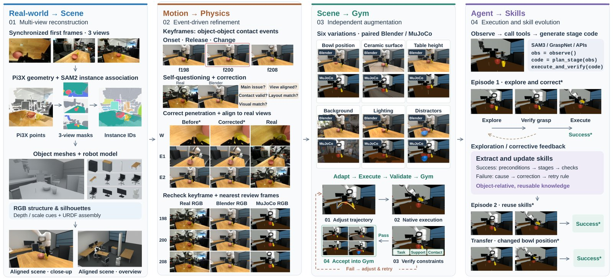
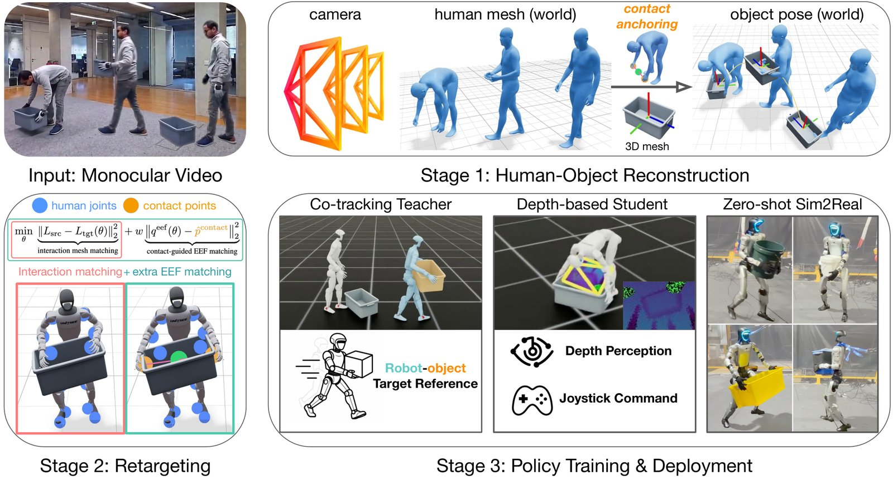
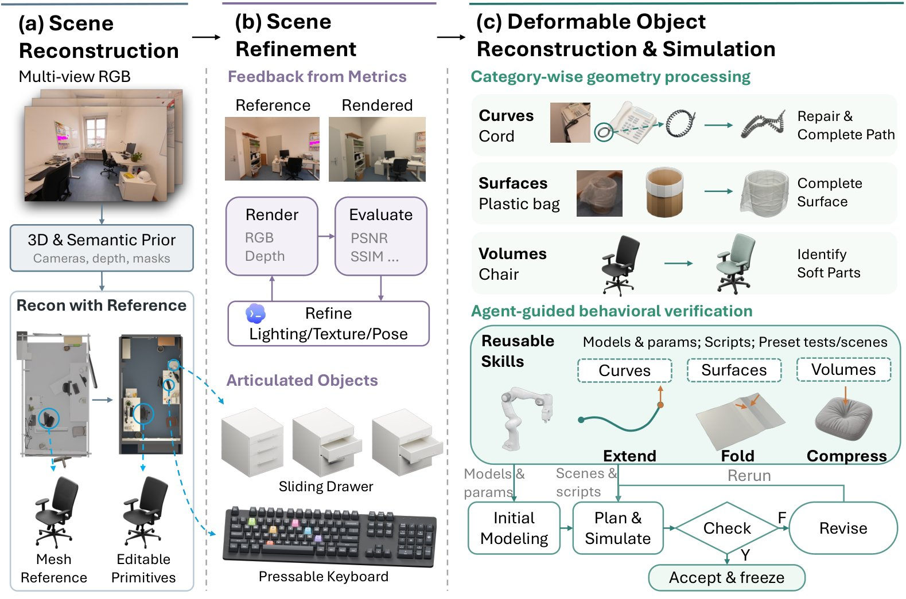
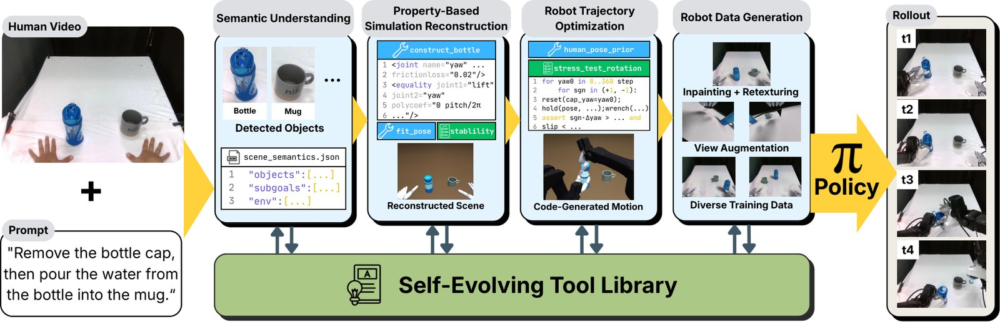

# 2026-10-01 科研日报

## 今日速览

覆盖日公告里，agentic Real2Sim 一下子摆出四条可对照的路：**物理校验过的 Blender/MuJoCo gym + 技能库**、**反事实视频放大人形 loco-manipulation**、**可变形体分维重建进仿真**，以及**自演化工具库的 Human2Sim2Robot**。其中 Real2Gym 直接拿 GPT-6 Astra Direct Mode 当基线，是 MiracleAug 同族对照里信号最强的一篇。

- **必读 · 对标 Astra 的 gym 闭环：** [Real2Gym](#2026-10-01--real2gym) 把人/机器人示教建成可编辑 Blender + MuJoCo gym，用原生物理校验动作，再让 agent 写操作阶段代码、蒸馏可复用技能并回灌真机；相对 GPT-6 Astra Direct Mode，作者报告仿真成功率约 +16.7%、策略执行 token 约少 74.9%，Franka 四任务真机成功率约 +33.3%。
- **必读 · 反事实视频造数：** [PRISM](#2026-10-01--prism)（CoRL 2026）用 V2V 把少量真实搬运视频扩成数百条反事实人—物交互，再经接触锚定 Real2Sim 与重定向，训出统一深度策略，零微调部署到真机人形做抓—搬—放。
- **可变形 sim-ready：** [CoDimRecon](#2026-10-01--codimrecon) 用 agent 按曲线/曲面/体三类维度重建可编辑场景（含关节与可变形），补「只会刚体」的缺口。
- **灵巧手工具库：** [DexAgent](#2026-10-01--dexagent) 从单段 egocentric 人视频出发，按物体属性选/造工具，走语义理解→仿真重建→轨迹优化→造数四段，服务 Human2Sim2Robot。
- **社区：** 量子位报道 Stanford HomeBody 用大模型技能调度接管宇树 G1（分层 API，非端到端 VLA）；Blender 5.3 alpha 原生 3DGS 说明仍在；对标仓 ASTRA tip 仍 `a1624d6`。

## 视频 → 可物理校验的 gym → 技能回灌真机

### Real2Gym · arXiv · 2026-09-29

**一句话判断：** Real2Gym 把「示教视频 → 视觉对齐且可物理执行的 Blender/MuJoCo gym → agent 试错蒸馏技能 → 共享接口上真机」串成闭环，并显式用原生物理与动作可行性检查压住 GPT-6 Astra 直出场景里常见的尺度/相机/接触失真；它是本期与 MiracleAug / Astra 对标最直接的一篇。

**Title：** Real2Gym: Building Gyms from Videos, Bringing Skills to Robots  
**作者：** Kerui Ren、Yingxiang Xu、Kaiwen Song、Linning Xu、Bo Dai、Mulin Yu、Tao Lu。  
**单位：** 上海人工智能实验室；上海交通大学；浙江大学；中国科学技术大学；The Chinese University of Hong Kong；The University of Hong Kong。  
**发表时间 / 投稿信息：** arXiv v1 首次挂出按公告日记为 2026-09-29；投稿信息未标明。项目页：https://real2gym.github.io/  
**链接：** [摘要](https://arxiv.org/abs/2609.37089) · [HTML 全文](https://arxiv.org/html/2609.37089v1) · [PDF](https://arxiv.org/pdf/2609.37089) · [项目页](https://real2gym.github.io/)

**摘要中译：** 真实世界视频富含操作示范，但要变成可复用机器人技能，需要视觉对齐的环境、可执行的物理交互，以及从经验中学习的机制。本文提出 Real2Gym：一个 agentic Real2Sim2Real 框架，把人与机器人示教变成可交互仿真 gym，并把仿真中获得的技能带到真机。Real2Sim 模块重建可编辑场景，对齐物体与相机，用原生物理执行校验示教或重定向动作，并在动作可行性检查下生成任务条件化变体。在这些环境中，agent 为操作阶段生成可执行代码，观察结果，把成功与失败蒸馏成可复用的任务程序、相对物体运动与恢复策略。通过共享感知—控制接口，这些技能指导后续仿真与真机执行，并按当前观测适配运动、不更新底层模型权重。

**方法与原理。** 输入是人/机器人示教视频与机器人 URDF；输出是可交互 gym 集合与可复用技能库 \(\mathcal{K}\)，并可经同一接口上真机。

1. **场景重建与对齐。** 用单目几何（如 MoGe-3）或多视角几何初始化；SAM2 等分割操作物与支撑面；补全遮挡网格；导入 URDF 并对齐底座、初姿与相机；用重投影与支撑/运动学约束迭代 refinement。
2. **动作重建与物理校验。** 按接触/抓取/支撑等拓扑变化取关键帧；人示教则重定向到手—物关系；在视觉五维自检后，把场景实例化进 MuJoCo，逐步校准接近、闭合、保持与释放，端到端执行验证，再把原生物理轨迹导回 Blender 做 Real/Blender/MuJoCo 帧对齐对照。
3. **任务条件增强。** 对几何、位姿、支撑高度、材质、干扰物、背景与光照做隔离扰动；每条候选必须通过原生物理与跨渲染一致性，失败回修。
4. **子任务级闭环与技能蒸馏。** Agent 按操作阶段生成 Python（分割/抓取提议/位姿变换/控制 API），执行后抽取适用条件、程序、效果检查、相对物体运动规则与恢复策略；部署时用当前观测实例化规则，**不更新** \(\theta\)。

*原论文方法总览（[来源](https://arxiv.org/html/2609.37089v1)，此处仅转换图片格式）。左：物理校验的 gym 构建；右：阶段级代码执行与技能回灌。对照读「尺度/相机对齐失败会怎样破坏接触」。*

**结果、成本与局限。** 在 12 个 DROID + 12 个 EgoDex 场景上，作者报告相对 GPT-6 Astra Medium：视点对齐与仿真成功分显著更高；带技能的 agent 平均成功率约 87.5%，策略执行 token 约少 74.9%。Franka 四任务上总体优于 Direct Mode，并展示「货架放盘」零样本失败 → 人视频重建 gym → 仿真进化技能 → 真机 100% 的自进化例。局限：多相机错位会造成叠影；阶段级代码在极窄间隙任务上仍缺细粒度反应；真机目前以平行夹爪 Franka 为主。大规模 Astra/仿真调用属于工业训练档，不是学生低端机可直接复刻的完整环。

**与主线的关系。** 与 MiracleAug 高度同构：可编辑 Blender 场景、示教对齐、失败/反馈进技能库、再部署。差别在于 Real2Gym 强调 **MuJoCo 原生物理校验 + 动作可行性门控**，并把 GPT-6 Astra 直出重建当作明确基线；表示侧以网格/刚体仿真为主，不把可编辑 3DGS 当作一等公民。可借鉴合同：事件中心校正 → 物理执行门槛 → 阶段代码 + 技能库，而非只追求画面像。

## 反事实视频：用 V2V 放大人形搬运示教

### PRISM · CoRL 2026 · 2026-09-29

**一句话判断：** PRISM 用视频到视频生成把少数真实搬运片段扩成大量反事实人—物交互，再用接触锚定的重建与重定向把「不完美视频」拧成可仿真的人形—物体轨迹，训出统一深度策略并零微调上真机；它回答的是「交互视频不够多样时，生成模型能否当离线数据放大器」。

**Title：** Counterfactual Video Generation Enables Scalable Humanoid Loco-Manipulation  
**作者：** Zihan Wang、Zhen Wu、Pieter Abbeel、Rocky Duan、Jitendra Malik、Carmelo Sferrazza、C. Karen Liu、Guanya Shi、Angjoo Kanazawa。  
**单位：** Amazon FAR；UC Berkeley；Carnegie Mellon University；Stanford University。  
**发表时间 / 投稿信息：** CoRL 2026（arXiv Comments：published at CoRL 2026）；arXiv v1 挂出按公告日记为 2026-09-29。项目页：https://prism-real2sim2real.github.io/  
**链接：** [摘要](https://arxiv.org/abs/2609.38172) · [HTML 全文](https://arxiv.org/html/2609.38172v1) · [PDF](https://arxiv.org/pdf/2609.38172) · [项目页](https://prism-real2sim2real.github.io/)

**摘要中译：** 用视觉模仿教人形做 loco-manipulation（如搬运多样物体）是通向通才机器人的可行路径，但收集清晰全身、少遮挡的高质量交互视频很难规模化。本文提出 PRISM：一个 real-to-sim-to-real 框架，把少量真实视频放大成大规模多样训练集。PRISM 先经视频到视频（V2V）生成从少量范例视频得到数百条多样的「反事实」人—物交互视频；再经接触锚定的 Real2Sim 管线重建人与物体运动，并把不完美视频数据重定向为物理上合理的轨迹。反事实视频带来的类内变异，使单一策略能泛化到各类别内未见实例。作者在真机上零真实微调部署：仅用机载深度观测，人形即可抓取、搬运并放下包括箱、桶、筐、球在内的新实例、新尺寸与新初始构型。

**方法与原理。** 输入是少量真实搬运视频；输出是可部署的深度条件全身策略（摇杆命令 + 机载深度）。

1. **反事实 V2V。** 以真实片段为条件，用类别级提示替换被操作物（箱/筐/桶/球等），保留背景、光照与粗任务结构；人行为随物体 affordance 自适应。四条种子视频可扩到约 256 条生成视频。
2. **接触锚定 Real2Sim。** 在 CRISP 类人—场景重建上扩展动态物体；用接触相位把物体锚定到掌相对位姿，互相校正人/物轨迹；重定向时以物体坐标系接触锚为可靠接口，而不是盲信整段重建。
3. **特权教师 → 深度学生。** 先训共跟踪教师（含接触奖励），再经 DAgger+RL 蒸馏到仅深度+摇杆的学生，零样本 sim-to-real。

*原论文方法示意图（[来源](https://arxiv.org/html/2609.38172v1)，此处仅转换图片格式）。关键不是「生成更像」，而是接触约束如何把生成噪声拧成可仿真轨迹。*

**结果、成本与局限。** 作者报告相对 OMOMO 训练策略，PRISM 数据在跨域与 OOD 类别上迁移更好；真机多物体类别成功率见文中表格（箱类试验可达 100% 量级，部分 OOD 约 60%）。消融显示接触锚定位姿、接触重定向与接触奖励逐步抬升下游成功率。局限：单目重建与重定向仍是瓶颈；生成物体过大时 IK/碰撞失败会丢轨迹；动态物按刚体建模，关节/可变形物体仍难；训练用多 GPU 并行仿真，不是消费级低端机设定。

**与主线的关系。** 对照 MiracleAug：PRISM 的杠杆是 **生成式反事实交互视频 + 接触合同**，不是 Blender 可编辑高斯资产或示教动作同步增强。可借鉴「用接触把脏重建变成可训轨迹」；它服务人形 loco-manipulation，不直接导出桌面操作的 MuJoCo gym。

## 可变形体：按曲线 / 曲面 / 体做 sim-ready

### CoDimRecon · arXiv · 2026-09-28

**一句话判断：** CoDimRecon 用 agent 从多视角 RGB 重建含刚体、关节与可变形物的可仿真场景，并按曲线/曲面/体选择几何与本构表示；它补的是「Real2Sim 默认刚体」时最常被省略的那一类资产。

**Title：** CoDimRecon: Agentic Reconstruction of Sim-Ready 3D Scenes with Deformable Curves, Surfaces, and Volumes  
**作者：** Shuzhao Xie、Lelin Wang、Guying Lin、Zhi Wang、Minchen Li。  
**单位：** 清华大学深圳国际研究生院；Carnegie Mellon University；Genesis AI。  
**发表时间 / 投稿信息：** arXiv v1 首次挂出按公告日记为 2026-09-28；投稿信息未标明。项目页：https://shuzhaoxie.github.io/CoDimRecon/  
**链接：** [摘要](https://arxiv.org/abs/2609.36024) · [HTML 全文](https://arxiv.org/html/2609.36024v1) · [PDF](https://arxiv.org/pdf/2609.36024) · [项目页](https://shuzhaoxie.github.io/CoDimRecon/)

**摘要中译：** 从真实观测重建可仿真 3D 场景能服务机器人、游戏与沉浸式应用，但现有方法大多假设刚体。可变形体仍是缺口：其仿真就绪几何依赖维度（曲线、曲面或体），行为也可能超出简单弹性。本文提出 CoDimRecon：一个 agentic 框架，从多视角 RGB 重建含刚体、关节与可变形物体的可编辑场景。场景级几何先验锚定尺度与布局，物体级生成网格引导 agent 得到细致且紧凑的几何；关节刚体被分解为可动部件并显式建关节。对可变形体，按类别会话把曲线建成带半径的中心线、曲面建成带厚度的流形壳、体建成相应体积表示，并选择合适的本构模型。

**方法与原理。** 输入是多视角 RGB；输出是可编辑、可进物理仿真的场景资产（含关节与可变形）。

1. **场景级先验 + 物体级网格。** 先钉尺度与布局，再用生成网格引导细节。
2. **关节分解。** 可动部件 + 显式关节，服务抽屉等机构。
3. **可变形分维会话。** 曲线 / 曲面 / 体走不同重建与材料选择，而不是统一「弹性体网格」糊弄过去。

*原论文总览图（[来源](https://arxiv.org/html/2609.36024v1)，此处仅转换图片格式）。注意电话线（曲线）、塑料袋（曲面）、坐垫（体）与滑动抽屉被分开建模。*

**结果、成本与局限。** 文中展示办公等场景的重建与仿真交互；定量细节以论文表格为准。局限：依赖多视角与 agent 会话质量；可变形本构选择仍非全自动物理辨识；算力与工具链偏研究/集群侧。

**与主线的关系。** 对照 Real2Gym / MiracleAug：CoDimRecon 补的是 **资产类别覆盖**（可变形 + 关节），不是策略学习或示教同步。若主线要「厨房里的袋子/线缆/软垫」，这篇给出表示合同；它不解决动作可行性校验或真机闭环。

## 灵巧操作：自演化工具库的 Human2Sim2Robot

### DexAgent · arXiv · 2026-09-28

**一句话判断：** DexAgent 把「一段 egocentric 人视频 + 任务提示」变成可物理落地的机器人轨迹造数管线，并在各阶段按物体属性从工具库选型或造新工具、用属性校验器守门；重点是关节/可变形等难物体上，固定流水线不够用时的 agentic 适配。

**Title：** DexAgent: An Agentic Human2Sim2Robot Framework for Dexterous Manipulation with Self-Evolving Tool Library  
**作者：** Youhui Wang、Yunzhu Li、Li Fei-Fei、Jiajun Wu、Huang Huang。  
**单位：** Stanford University；Columbia University。  
**发表时间 / 投稿信息：** arXiv v1 首次挂出按公告日记为 2026-09-28；投稿信息未标明。项目页：https://dexagent123.github.io/  
**链接：** [摘要](https://arxiv.org/abs/2609.35318) · [HTML 全文](https://arxiv.org/html/2609.35318v1) · [PDF](https://arxiv.org/pdf/2609.35318) · [项目页](https://dexagent123.github.io/)

**摘要中译：** 人类视频是灵巧操作示范的可扩展来源，但现有 Human2Sim2Robot 管线多依赖预定义流程，难适应多样物体属性与交互，尤其是关节与可变形物体。本文提出 DexAgent：一个 agentic Human2Sim2Robot 框架，把单段 egocentric 人视频与任务提示转化为有物理依据的机器人轨迹，供策略训练。流程分四段：人视频语义理解、基于属性的仿真重建、机器人轨迹优化、机器人数据生成。各阶段按任务与物体属性从工具库选择合适技能，必要时开发新技能；属性相关校验器评估阶段输出并触发修正或工具扩展。

**方法与原理。** 输入是单段 egocentric 视频 + 任务提示；输出是可用于策略训练的仿真/机器人轨迹数据。

1. **四段流水线。** 语义理解 → 属性条件重建 → 轨迹优化 → 造数。
2. **自演化工具库。** 缺工具时扩展，而不是硬套固定模块序列。
3. **校验器守门。** 物理/几何与任务校验驱动重试或换工具。

*原论文方法图（[来源](https://arxiv.org/html/2609.35318v1)，此处仅转换图片格式）。工具库覆盖场景理解、物体重建、运动分析与操作技能，并由校验器闭环。*

**结果、成本与局限。** 作者在开瓶、剪裁、入屉、多杯抓取等任务上展示 rollout；具体成功率以论文为准。局限：依赖仿真保真与工具覆盖；灵巧手与复杂可变形仍难；agent 会话与仿真成本偏高。

**与主线的关系。** 与 Real2Gym 同属 agentic Real2Sim 族，但 DexAgent 更偏 **灵巧手 + 工具库演化**，Real2Gym 更偏 **gym 构建与技能回灌平行夹爪真机**。对 MiracleAug：可借鉴「属性校验器 → 缺则造工具」的合同，而不是只堆固定 Blender 脚本。

## 圈内动态

- **HomeBody · 大模型技能调度人形：** 量子位（2026-09-30）报道 Stanford 等团队的 HomeBody：让 GPT 类模型把导航/抓取/放置/开抽屉等写成可调用技能，接管宇树 G1 做厨房长程任务；强调分层 API（语义调度 ≠ 端到端 VLA 关节输出）。一手细节与指标以项目/论文披露为准，媒体转述不作独立复现证据。参见 [量子位报道](https://www.qbitai.com/2026/09/499493.html)。
- **Blender 5.3 · 原生 3DGS：** 开发者文档仍以 alpha 说明为主（PointCloud / `3D Gaussian Splats`、PLY/SPZ、Workbench/EEVEE/Cycles）；已知限制含性能、颜色空间、变换/SH 与**尚无导出**。能进 DCC ≠ 可绑骨、可导出仿真资产。参见 [Blender 5.3 Rendering notes](https://developer.blender.org/docs/release_notes/5.3/rendering/)。
- **对标仓 ASTRA：** [hku-sail/Real2Sim_GPT6_ASTRA](https://github.com/hku-sail/Real2Sim_GPT6_ASTRA) 公开 tip 仍为 `a1624d6`（2026-09-10），自上次日报无新 commit。
- **Ke-Sen / 中文科技媒体：** 本日未另摘需升格的 SIGGRAPH 录用清单新条目；除 HomeBody 外未再摘与主线强相关且可核验一手来源的二手汇编。

## 覆盖说明

- **发布日：** 2026-10-01（HKT）
- **内容覆盖日：** 2026-09-30（并收入 2026-09-28–29 公告中与主线强相关、且未见收录的 agentic Real2Sim / 人形搬运条目）
- **兴趣校准：** blog tip 仍 `8d722e0`（SA 2026 论文笔记草稿未发布，未引草稿正文）；academic tip 仍 `f19a697`；notes tip 见 `f5a747a`（合成数据相关笔记，按 privacy 未写入公开 interest）；低成本具身 × 合成数据、已知运动学 × 同轨迹重放加权保持。无 meta 兴趣文件变更。
- **编写：** Cream

**故障说明：** Neon primary 认领窗 [05:30,06:20) HKT 未产生 `digests/2026-10-01.md`（至 Cream 接管时 index / `last_success.publish_date` 仍停在 2026-09-30，`claim` 为空）；Cream standby 于 early-skew 可认领起点后 CAS 接管并发布本期。
