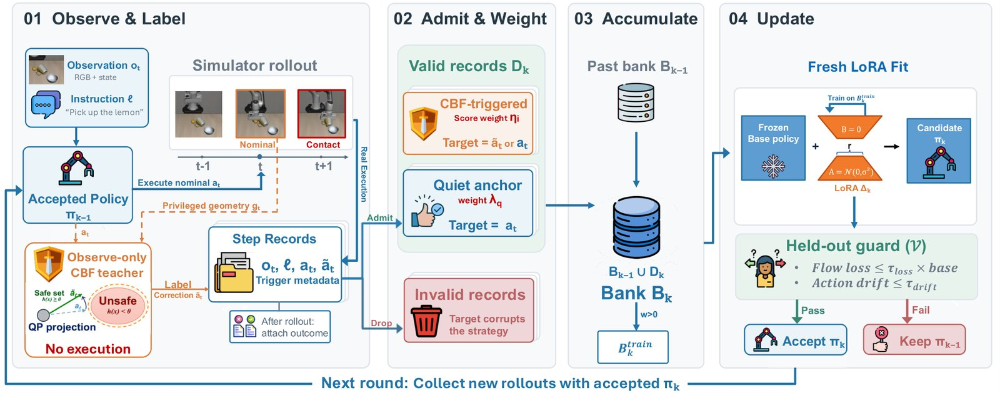
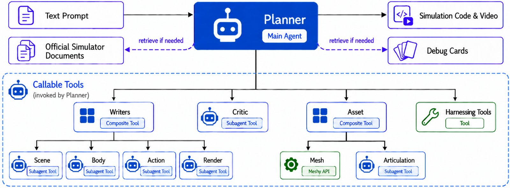
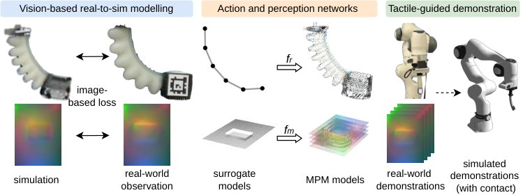
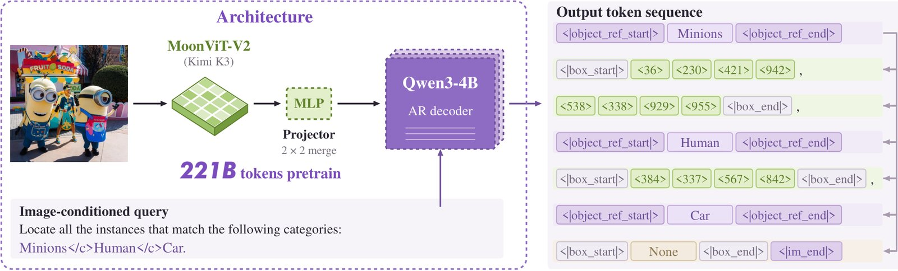

# 2026-10-02 科研日报

## 今日速览

覆盖日公告里，agentic 仿真与具身感知又并排出四条可对照的线：**失败运行时反馈进策略自演化**、**文本直出可执行物理仿真（并对标 GPT-6 Astra）**、**软体气动手指 × 触觉的 MPM–3DGS 统一仿真**，以及**把视觉原语 grounding 做成 4B 感知底座再接到 VLA**。其中 FailBank 把「运行时纠错只改当前动作、不改策略」的缺口讲得很清楚，是本期与 MiracleAug / 失败驱动造数最同构的一篇。

- **必读 · 失败银行自演化：** [FailBank](#2026-10-02--failbank) 用 observe-only CBF 教师在策略自己的 rollout 上记反事实纠正，再经准入加权与守卫式 LoRA 把运行时反馈写进策略；相对基线在两个 flow-matching 骨干上抬升成功率约 6.9–8.5 个百分点，并压低策略诱导的接触代价。
- **必读 · 文本 → 可编辑物理仿真：** [Text2Sim](#2026-10-02--text2sim) 在 Genesis 上用 Planner / Writers / Critic + 从 SIGGRAPH 演示蒸馏的 Debug Cards，把纯文本请求变成可执行、可改的刚体/可变形/布料案例；作者报告物理与视觉分均高于四条强基线，并额外对照 GPT-6 Astra。
- **软触觉 Real2Sim：** [PneuTac](#2026-10-02--pneutac) 用 MPM 管动力学、3DGS 管外观，把气动软指与视觉触觉凝胶放进同一仿真，再以少量真机示教引导仿真补数；三任务上 Sim+Real 明显优于同量真机-only。
- **感知底座再接动作：** [GroundingPI](#2026-10-02--groundingpi) 以点/框视觉原语训 4B grounding 模型，34 项基准平均约 73.7%（作者报告高于更大的 GPT-6 Astra）；接到 RoboTwin / RoboCasa 时在固定 Action DiT 下提升 OOD 与示教数据效率。
- **社区：** 量子位续报分层技能调度（HomeBody / RPent）与「一教就会」类 GLOW 叙事；Blender 5.3 原生 3DGS 说明仍在；对标仓 ASTRA tip 仍 `a1624d6`。

## 运行时反馈：把护盾纠错写进策略

### FailBank · arXiv · 2026-09-30

**一句话判断：** FailBank 指出「运行时护盾能改动作、却改不了策略」会造成持续的 policy–shield 错配甚至护盾崩溃；它把 CBF 纠正当作观察型教师，筛出有效失败记录进 failure bank，再以守卫式 LoRA 做持久更新——部署时不再需要护盾或特权几何。这是本期与「失败驱动补数 / 弱点回环」最直接的对照。

**Title：** Learning from Runtime Feedback through Failure-Bank Self-Evolution for Vision-Language-Action Models  
**作者：** Mingyue Cui、Zheyuan Liu、Yihan Zhu、Zheyuan Zhang、Meng Jiang。  
**单位：** University of Notre Dame。  
**发表时间 / 投稿信息：** arXiv v1 首次挂出按公告日记为 2026-09-30；投稿信息未标明。代码仓库见作者页注明的 FailBank 开源入口。  
**链接：** [摘要](https://arxiv.org/abs/2609.39820) · [HTML 全文](https://arxiv.org/html/2609.39820v1) · [PDF](https://arxiv.org/pdf/2609.39820)

**摘要中译：** VLA 在复杂环境中需要兼顾任务成功与非预期接触。运行时护盾可纠正单步动作，却不更新底层策略，重复分歧会形成持续的策略—护盾错配并阻塞任务进展。本文提出 FailBank：四阶段自演化框架，把运行时反馈转化为持久策略改进。采集阶段固定 CBF 安全模块作观察型教师，产出反事实纠正而仍由策略控制执行；结果感知准入把有用提议变成纠正目标，并把未被纠正的成功动作留作安静锚点，再用于守卫式 LoRA 更新。在 VLA-Arena 两档难度与两个 VLA 骨干上，相对基线策略，FailBank 分别提升任务成功率约 8.5 与 6.9 个百分点，并降低策略诱导累计代价约 35.6% 与 23.8%；相对运行时护盾，成功率提升约 25.4 与 9.5 个百分点，代价大致可比。

**方法与原理。** 输入是 RGB + 本体感觉上的 flow-matching VLA；采集时可访问仿真特权几何，部署时不再需要。

1. **Observe and Label。** 策略出名义动作，CBF 教师并行给反事实建议但不改执行，保证失败分布仍属该策略。
2. **Admit and Weight。** 按结果与触发时机筛记录：纠正记录用教师目标，成功未触发动作用作 quiet anchors；权重反映后续安全/进展/恢复信号。
3. **Accumulate。** 跨轮累积 failure bank，校验折与训练折分离。
4. **Update。** 每轮从同一 base 拟合新 LoRA；仅当 held-out flow loss 比与首动作漂移低于阈值时才接受——不用基准 SR/CC 做模型选择。

*原论文方法总览（[来源](https://arxiv.org/html/2609.39820v1)，此处仅转换图片格式）。关键合同是「护盾只教、不抢方向盘」，以及准入与守卫如何防止把护盾诱导失败写进策略。*

**结果、成本与局限。** 主表覆盖 $\pi_{0.5}$ / $\pi_{0}$ 与 Level 1–2 静态障碍套件；联合成功—代价象限中 FailBank 落点多于 AEGIS。消融显示 shield-in-loop 采集会污染失败来源，quiet anchors 有助于压代价。局限：当前面向连续 flow-matching；动态障碍需时序预测；采集教师用特权几何（部署无需）。算力与多轮 rollout 属研究/集群档，不是学生低端机可整环复刻的设定。

**与主线的关系。** 对照 MiracleAug / 失败驱动造数：FailBank 的杠杆是 **把运行时安全反馈变成策略监督**，不是 Blender 可编辑资产或示教同步增强。可借鉴合同：observe-only 教师 → 结果感知银行 → 守卫式小更新；它回答「护盾一直在救火却救不完」时，数据侧该沉淀什么。

## 文本成仿真：Planner + Debug Cards 写可执行物理

### Text2Sim · arXiv · 2026-09-29

**一句话判断：** Text2Sim 把「写一段能跑、能改、物理事件对得上的仿真」拆成 Planner / 四类 Writer / 独立 Critic，并用从 SIGGRAPH 演示蒸馏的 Debug Cards 做角色相关修复；它服务的是可编辑物理程序与资产，而不是直接训机器人策略——但和 agentic Real2Sim / 造场景主线高度同构，且文中显式对照了 GPT-6 Astra。

**Title：** Text2Sim: Agentic Physics-Based Simulation Generation with Distilled Expertise  
**作者：** Xiaoyu Xiong、Tsun-Hsuan Wang、Yi-Ling Qiao、Tao Du、Minchen Li。  
**单位：** 清华大学；Carnegie Mellon University；Genesis AI；Shanghai Qi Zhi Institute。  
**发表时间 / 投稿信息：** arXiv v1 首次挂出按公告日记为 2026-09-29；投稿信息未标明。作者称将开源代码、Debug Card 库与生成案例数据集。  
**链接：** [摘要](https://arxiv.org/abs/2609.36593) · [HTML 全文](https://arxiv.org/html/2609.36593v1) · [PDF](https://arxiv.org/pdf/2609.36593)

**摘要中译：** 构造多样物理仿真仍耗人力：资产、布局、物参、运动、控制与渲染需联合设计调试。本文提出 Text2Sim：面向仿真的 agentic 管线，把纯文本请求变成可执行、可编辑的动态案例。基于 Genesis，它采用 Planner + 专门 Writers + 资产生成工具 + 独立 Critic 的层级结构；从图形学演示蒸馏的紧凑技能（Debug Cards）为执行修复提供角色相关物理引导。在 42 个留出提示（刚体、关节、可变形、布料）上，自动物理/视觉评分与盲测用户偏好均高于四条强基线；管线还可支撑数据集构造与多模态输入扩展。

**方法与原理。** 输入是文本（可扩展草图/给定资产）；输出是可执行程序 + 资产 + 执行证据（轨迹/接触/视频）。

1. **模块所有权。** Scene / Body / Action / Render 四分写，Critic 只读审「跑得通 ≠ 事件对」。
2. **Debug Cards。** 从 SIGGRAPH/SA 演示迭代蒸馏症状→检查→修复；Planner 按角色与证据检索，避免整库塞进上下文。
3. **执行闭环。** 集成检查 → 跑仿真 → Critic 诊断 → 定点改写，直至通过或预算耗尽。
4. **对标前沿。** 另文对照 GPT-6 Astra：作者报告 Text2Sim 在物理/视觉总分仍领先，说明专用 agentic 结构 + 仿真技能库相对通用前沿模型仍有增益。

*原论文管线图（[来源](https://arxiv.org/html/2609.36593v1)，此处仅转换图片格式）。读时区分「程序可运行」与「Critic 认可的物理事件」。*

**结果、成本与局限。** 42 例上物理分约 95.3、视觉分约 70.2，高于 GPT-5.6-Sol / Qwen / Claude / Code2Worlds；用户总体偏好亦领先。资源消耗与基线同量级（作者表：千万级 token、约小时级含 GPU 仿真）。局限：物理范围受底层求解器约束；规模上去时代价上升快；机器人策略闭环不是本文主评。

**与主线的关系。** 相对 Real2Gym / MiracleAug：Text2Sim 更偏 **从语言作者可仿真世界**，不强调示教视频对齐或真机技能回灌。可借鉴「独立 Critic + 角色 Debug Cards」；若主线要批造可变形/布料测试场景，这篇给作者合同。文中对 GPT-6 Astra 的对照可与 Astra+Blender 叙事交叉阅读，勿把分数差写成产品胜负。

## 软体 × 触觉：MPM–3DGS 统一仿真再补示教

### PneuTac · arXiv · 2026-09-29

**一句话判断：** PneuTac 用 MPM 统一建模气动软指与触觉凝胶动力学，用 3DGS 绑定外观与触觉成像，再以代理网络加速、用少量真机轨迹+触觉引导仿真扩示教；它补的是「软执行器 + 视觉触觉」很少被放进同一可训仿真里的缺口，并直接服务接触丰富的柔顺操作。

**Title：** PneuTac: Tactile Manipulation with Soft Pneumatic Robots via Unified MPM-Gaussian Splatting Simulation  
**作者：** Shaohong Zhong、Marco Pontin、Joe Watson、Perla Maiolino、Ingmar Posner。  
**单位：** Oxford Robotics Institute, University of Oxford。  
**发表时间 / 投稿信息：** arXiv v1 首次挂出按公告日记为 2026-09-29；投稿信息未标明。  
**链接：** [摘要](https://arxiv.org/abs/2609.38418) · [HTML 全文](https://arxiv.org/html/2609.38418v1) · [PDF](https://arxiv.org/pdf/2609.38418)

**摘要中译：** 软机器人与触觉传感器适合精细接触操作，但二者联立的高效仿真长期缺失，现有工具多分开建模且标定成本高。本文提出 PneuTac：统一框架，用 MPM 建模软机器人与可变形触觉膜动力学，用 3DGS 渲染；经简单视觉 Real2Sim 标定后，再训动作/感知代理网络以加速仿真。框架驱动触觉引导管线在仿真中采集示教。在定制气动软指+触觉尖端及跨设备评估上，作者表明 PneuTac 能准确建模带触觉的软机器人；用仿真增强示教训练的策略，在三项真实接触丰富柔顺任务上优于仅用同量真机数据训练的基线。

**方法与原理。** 输入是 CAD + 少量压力—图像与单张压痕图；输出是可并行的代理仿真与可迁移策略。

1. **MPM–3DGS 耦合。** 粒子承载 Neo-Hookean 动力学；高斯均值随粒子运动，用一张分割图训颜色/不透明度。
2. **视觉标定。** 软指用多压力平衡姿态做图像损失+轮廓 IoU（CMA-ES）；动态触觉再用单张压痕拟合坡度/深度光度模型。
3. **代理加速。** 残差力矩网络把骨架逼近全 MPM；UNet 把探针压痕映射到 MPM 表面场，触觉渲染加速约三个数量级（作者报告）。
4. **触觉引导造数。** 以真机轨迹与接触面积为引导，CEM-MPC 在域随机化下扩示教，再 BC + 真机微调。

*原论文方法图（[来源](https://arxiv.org/html/2609.38418v1)，此处仅转换图片格式）。注意「全保真 MPM-3DGS 只用于标定，学习用的是代理」。*

**结果、成本与局限。** 尖端跟踪误差约指长 4%；触觉渲染 RMSE/PSNR/NCC 优于 Taxim/Tacchi/DOT-Sim（同训练预算）。开关拨动 / 开蛋盒 / 抽扑克上 Sim+Real 成功率显著高于 Real-only 与朴素增强；无触觉或 PPO 各有短板。局限：卡片间接触等仍偏弱；标定与 GPU MPM 非低端本可轻松整环；平台偏研究软指+Digit 类传感器。

**与主线的关系。** 对照 MiracleAug：PneuTac 的杠杆是 **柔顺执行器 + 触觉的统一 Real2Sim 与示教放大**，不是桌面刚体 Blender gym。可借鉴「高保真标定 / 代理部署」分层；对低成本具身兴趣：代理网络降低在线仿真成本，但标定与软硬件仍非学生机默认栈。

## 感知先于动作：视觉原语 grounding 底座

### GroundingPI · arXiv · 2026-09-30

**一句话判断：** GroundingPI 把点/框等视觉原语做成共享词表上的结构化生成，用多阶段预训练 + SFT + GRPO 推高稠密/细小目标 grounding，再在固定 Action DiT 下接到驾驶与操作；它主张「先学准 where，再让稀缺动作数据学 how」，并与 GPT-6 Astra 的感知分数做了显式对照。

**Title：** GroundingPI: A Grounding Foundation Model towards Physical Intelligence with Visual Primitives  
**作者：** Qize Yu、Lianrui Fan、Boyu Chen、Jiaqi Liang、Xini Ding、Yue Chen、Zetian Song、Yuran Wang 等（完整作者表见 arXiv）。  
**单位：** XPeng Inc.；北京大学；The University of Hong Kong；University of California, Berkeley；Princeton University；National University of Singapore；清华大学；HKUST (GZ) 等。  
**发表时间 / 投稿信息：** arXiv v1 首次挂出按公告日记为 2026-09-30；投稿信息未标明。项目页：https://groundingpi.github.io/  
**链接：** [摘要](https://arxiv.org/abs/2609.39601) · [HTML 全文](https://arxiv.org/html/2609.39601v1) · [PDF](https://arxiv.org/pdf/2609.39601) · [项目页](https://groundingpi.github.io/) · [代码](https://github.com/groundingpi/GroundingPI)

**摘要中译：** 精确 grounding 决定目标是谁、在哪里，且需快到支撑闭环控制；而 VLA / WAM 常继承通用 VLM 感知，在杂乱与细小目标上仍弱。本文提出 GroundingPI：约 4B 的 grounding 基础模型，以量化坐标点/框写入共享词表。训练含多模态与空间预训练、SFT 与 GRPO，监督来自公开数据与专用数据引擎。在 34 项、11 类能力上相对 44 个基线取得约 73.68% 平均分，作者报告高于更大的 GPT-6 Astra（约 71.54%）。作为下游视觉骨干，它提升操作与驾驶：RoboTwin 2.0 四类 OOD 上相对最强骨干相对提升最高约 24.8%；RoboCasa-GR1 上用 50% 示教可超过用 75% 示教的对比骨干。

**方法与原理。** 输入是图像 + 语言查询；输出是标签绑定的点/框（及 OCR/GUI 等协议）。

1. **视觉原语接口。** MoonViT-V2 + Qwen3-4B；坐标原子词元 `<0>`–`<999>`。
2. **数据引擎。** 多教师字段级融合与任务校验，迭代统一专家。
3. **SFT → GRPO。** 先学协议与坐标，再用集合覆盖 / 严格 F1 等奖励做组相对优化。
4. **接到动作。** 驾驶走轨迹词元；操作走 $\pi$ 风格 Action DiT 层间注入，固定动作专家与数据预算只换感知底座。

*原论文架构图（[来源](https://arxiv.org/html/2609.39601v1)，此处仅转换图片格式）。对照读「稠密框 grounding」如何变成可注入 Action DiT 的中间特征。*

**结果、成本与局限。** Dense200 等稠密场景相对通用 4B VLM 拉开明显；GUI/空间指向亦强，但部分 OCR/航拍细目标仍有对手领先。操作迁移在场景扰动与实体泛化上全面靠前；数据效率曲线支持「感知先训」。局限：真机闭环与双系统延迟未作为部署结论；预训练规模与数据配比属工业档；机构声明中强调研究用途与数据隔离口径。

**与主线的关系。** 对照 VLA 过程监督 / MiracleAug：GroundingPI 补的是 **感知底座**，不是示教增强或仿真 gym。可借鉴「稠密 grounding + 固定动作头」的对照实验设计；与低成本兴趣交叉时，4B 比前沿 Astra 更贴近可部署感知侧，但完整预训练仍非学生机可复现。

## 圈内动态

- **分层技能调度继续占头条：** 量子位（2026-09）报道 Stanford 等 HomeBody 让大模型直接调度导航/抓取/开抽屉等技能接管宇树 G1（非端到端 VLA 关节输出）；同月亦有清华等联合开源的 RPent 框架叙事（通用模型规划 + VLA/程序技能工具化 + 记忆沉淀）。一手指标以项目/论文为准，媒体转述不作独立复现证据。参见 [HomeBody 报道](https://www.qbitai.com/2026/09/499493.html)、[RPent 报道](https://www.qbitai.com/2026/09/493218.html)。
- **「一教就会」与物理评测：** 诺因 GLOW 技术报告强调一次人类演示的跨场景复用叙事；美梦空间等发布 Physical-WAM / RoboTwin-Phys 类物理漂移评测说法。均属圈内信号，需回链原始报告再当方法结论。参见 [GLOW 报道](https://www.qbitai.com/2026/09/496816.html)、[物理评测报道](https://www.qbitai.com/2026/09/498478.html)。
- **Blender 5.3 · 原生 3DGS：** 开发者文档仍以 alpha 说明为主（PointCloud / `3D Gaussian Splats`、PLY/SPZ、Workbench/EEVEE/Cycles）；已知限制含性能、颜色空间、变换/SH 与**尚无导出**。能进 DCC ≠ 可绑骨、可导出仿真资产。参见 [Blender 5.3 Rendering notes](https://developer.blender.org/docs/release_notes/5.3/rendering/)。
- **对标仓 ASTRA：** [hku-sail/Real2Sim_GPT6_ASTRA](https://github.com/hku-sail/Real2Sim_GPT6_ASTRA) 公开 tip 仍为 `a1624d6`（2026-09-10），自上次日报无新 commit。
- **Text2Sim ↔ Astra：** 学术侧 Text2Sim 一文在相同 42 提示上报告相对 GPT-6 Astra 的物理/视觉分优势，适合与 agentic 仿真作者栈交叉阅读，勿外推为通用机器人评测胜负。

## 覆盖说明

- **发布日：** 2026-10-02（HKT）
- **内容覆盖日：** 2026-10-01（并收入 2026-09-29–30 公告中与主线强相关、且未见收录的 FailBank / Text2Sim / PneuTac / GroundingPI）
- **兴趣校准：** blog tip 仍 `8d722e0`（SA 2026 论文笔记草稿未发布，未引草稿正文）；academic tip 仍 `f19a697`；ASTRA tip 仍 `a1624d6`；低成本具身 × 合成数据、已知运动学 × 同轨迹重放、Blender 原生 3DGS 加权保持。公开 interest-notes 无新增量（与既有公开 tip 对齐），无 meta 兴趣文件变更。
- **编写：** Cream

**故障说明：** Neon primary 认领窗 [05:30,06:20) HKT 未产生 `digests/2026-10-02.md`（至 Cream 接管时 index / `last_success.publish_date` 仍停在 2026-10-01，`claim` 为空）；Cream standby 于 early-skew 可认领起点后约 06:19 HKT CAS 接管并发布本期。
