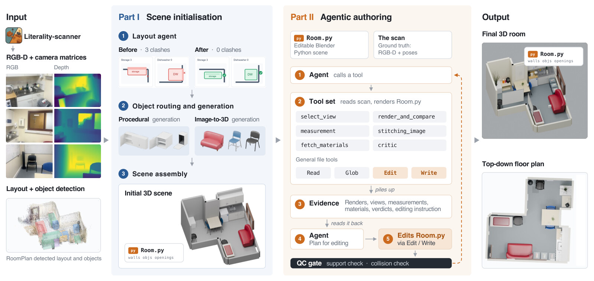
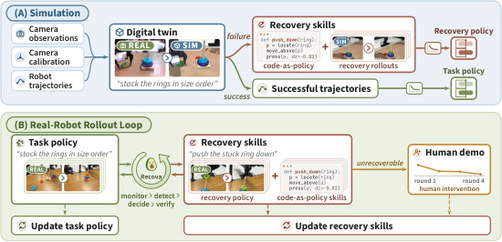

# 2026-10-03 科研日报

## 今日速览

今天最值得连读的是两种不同的 Real2Sim2Real 闭环。**LiteReality-Agent**把消费级 RGB-D 房间扫描变成可执行、可编辑、带碰撞与关节的场景程序，回答“Agent 怎样把视觉证据约束进 DCC/仿真资产”；**Recova**则从数字孪生里发现失败与恢复动作，再把真机成功、人工接管和已验证恢复分别回灌任务策略与恢复策略，回答“失败后怎样继续学”。前者尚未训练机器人策略，后者给出了四台真机并行采集和闭环成功率，证据层级不能混写。

- **必读 · 可交互场景重建：** [LiteReality-Agent](#2026-10-03--litereality-agent) 以 `Room.py` 作为持久场景状态，用“观察—编辑—验证”循环把扫描、单物体生成、布局修复、碰撞/支撑检查和 MuJoCo 导出串起来；相对直接让通用 Agent 建房间，它的关键不是模型更大，而是证据工具与质量门更明确。
- **必读 · 失败恢复闭环：** [Recova](#2026-10-03--recova) 将“完成原任务”与“把现场恢复到可继续状态”拆成两套策略和两份数据账本；真机上，任务策略经 DAgger 从 23.8% 升至 77.5%，部署时加入恢复后升至 87.5%（均为作者在四任务、每配置每任务 20 次上的报告）。
- **圈内：** Google 的 Gemini 4 Argon 仍是分阶段、非全面可用的预告；Hacker News 的原帖里既有对既有 Gemini Agent 工作流的正面实测，也有对 harness、可用性与榜单可审计性的质疑。图形学社区则在试验 OpenDLSS-NR 的 Vulkan 重实现；“参考输出逐层一致”是作者声明，不等于 NVIDIA 官方开源或所有游戏可直接接入。

## Agentic Real2Sim：把房间写成可验证程序

### LiteReality-Agent · arXiv · 2026-10-01

**一句话判断：** 这篇真正推进的是“可编辑、可仿真资产”的工程合同：不是让 Agent 看几张图后一次性猜场景，而是把扫描证据、几何关系、渲染对照与碰撞检查都接到同一个可重建的场景程序上；但它验证的是房间级重建与仿真兼容性，还没有给出策略训练或真机任务收益。

**Title：** LiteReality-Agent: An Agentic System for Interactable 3D Indoor Scene Reconstruction  
**作者：** Zhening Huang、Yueyan Li、Johnathan Chiu、Xiaoyang Lyu、Matt Zhou、Yuxin Yao、Joan Lasenby、Shangzhe Wu。  
**单位：** University of Cambridge；Imperial College London；Independent Researcher。  
**发表时间 / 投稿信息：** arXiv v1 于 2026-10-01 提交；未标明会议录用。代码与采集应用已公开。  
**链接：** [摘要](https://arxiv.org/abs/2610.01863) · [HTML 全文](https://arxiv.org/html/2610.01863v1) · [项目页](https://litereality.github.io/agent/) · [代码](https://github.com/litereality/LiteReality-Agent)

**摘要中译：** 工作把室内重建改写成编程任务：编码 Agent 读取消费级 RGB-D（彩色加深度）扫描与检测结果，反复编辑可执行的 `Room.py`，生成真实感、有关节且可进入物理仿真的房间数字孪生。作者设计专用取证、测量、渲染比较、布局优化和质量控制工具，并报告其几何、视觉与仿真兼容性优于直接使用 Astra、Fable 等通用编码 Agent 的基线。

**方法与原理。** 输入不是单图，而是扫描应用给出的 RGB-D 多视图、房间壳体、物体框和检测结果；输出是静态/关节资产、材质、质量/摩擦等物理元数据、凸碰撞体，以及可重复执行和编辑的 `Room.py`。流程分两段：

1. **初始化布局。** 系统把墙、地面、家具和物体组织成场景图，显式记录“支撑于”“靠墙”“属于同一功能组”和“可能相交”等关系。确定性规则先修小幅越界、悬空和错误重叠，视觉推理只处理尺寸合并等歧义；提议只有在几何一致性改善、且相对扫描的累计改动不越界时才接受。
2. **逐物体重建。** 选取能看清物体的扫描视图，先生成干净参考图。结构化或有关节的物体走程序生成：Agent 写 `object.py`，分出运动部件并定义关节；复杂但基本静态的物体走 TRELLIS.2 图生三维。网格要经过断片、背景粘连和畸形检查，不合格可在有限预算内重试。
3. **组装可执行场景。** 修正后的框决定缩放与放置，场景壳体、物体实例、材质和附加几何统一写入 `Room.py`。物体程序保留，可追溯“哪一项修改产生了当前资产”，也避免每轮编辑重新猜完整场景。
4. **观察—编辑—验证。** Authoring Agent 从全景、物体和局部三级证据中选图，渲染当前场景，与真实视图对齐比较，再修改程序。每轮同时跑碰撞、支撑和求解器检查；视觉像不像与物理能不能站住是两道不同的门。通过后导出到 MuJoCo。

*原论文 Figure 2（[来源](https://arxiv.org/html/2610.01863v1)）：上半部从 RGB-D 扫描、布局修复和单物体重建得到初始房间；下半部由 Agent 在 `Room.py` 上循环取证、编辑、渲染比较和验收。关键是所有修改落到同一份可执行程序，而不是只留下最终网格。*

**为什么这样设计。** 最简单的“把所有图片交给通用 Agent”缺少尺度锚、跨视图证据和回归检查，局部修好也可能让家具穿墙或失去支撑。这里用扫描给度量约束、用程序保存状态、用几何门限制漂移，因此把开放式生成变成有界优化。它与 MiracleAug 的公开流程重合在 Agent + DCC/仿真资产编排，可直接借鉴“持久 scene program + 独立质量门”；差异是本文面向整屋静态/关节资产，没有同步机器人动作、示教增强或策略评估。

**结果、成本与局限。** 作者在多间真实室内场景上比较确定性 LiteReality、直接运行的 Astra/Fable 编码 Agent与本系统，报告本方法在视觉指标、深度一致性、家具穿插/近地接触和人/Agent 感知评分上总体最好。论文也明确：物理属性多由类别、尺寸、几何和材质先验估计，缺少真实质量/摩擦的系统标定；布局“自洽”不保证与真实世界完全一致。RGB-D 扫描、检测、图像生成和多轮 Agent 调用都是额外先验与成本，不能称为纯 RGB、零人工 Real2Sim。

## 失败恢复：任务策略与恢复策略各学各的

### Recova · arXiv · 2026-10-01

**一句话判断：** Recova 不把恢复当成“同一个策略再试一次”，而是显式训练一个接收恢复指令的策略，并让 Agent 决定何时调用、是否恢复成功、何时请人接管；它给出了从数字孪生发现技能到四台真机并行补数据的完整链条，是今天最接近“执行失败反过来改数据与能力”的工作。

**Title：** Recova: Agent-Guided Failure Recovery for Autonomous Robotic Manipulation  
**作者：** Isabella Liu、An-Chieh Cheng、Johan Bjorck、Zhiding Yu、Hongxu Yin、Jan Kautz、Linxi Fan、Yuke Zhu、Sifei Liu。  
**单位：** University of California, San Diego；University of Texas at Austin；NVIDIA。  
**发表时间 / 投稿信息：** arXiv v1 于 2026-10-01 提交；未标明会议录用。  
**链接：** [摘要](https://arxiv.org/abs/2610.01178) · [HTML 全文](https://arxiv.org/html/2610.01178v1) · [PDF](https://arxiv.org/pdf/2610.01178)

**摘要中译：** 操作失败会把现场留在原任务策略没见过、无法继续的状态。Recova 在重建数字孪生里让 Agent 诊断失败、试写恢复程序，并分别收集任务与恢复成功轨迹；部署时监控进度，调用学习式或程序式恢复，验证现场重新可用后继续原任务。没有合适恢复时请人演示，再把这段经验纳入下一轮学习。

**方法与原理。** 任务策略 $\pi_\theta(a_t\mid o_t,g)$ 接收观测 $o_t$ 和任务指令 $g$，目标是完成任务；恢复策略 $\rho_\phi(a_t\mid o_t,z)$ 接收同类观测与更具体的恢复指令 $z$，目标只是把现场变回可继续状态。分开训练避免“把环套回杆上”和“把卡住的环压下去”在同一标签空间里互相干扰。

1. **数字孪生里发现失败。** Agent 根据相机、标定和机器人轨迹重建工作站，在仿真中执行任务；成功轨迹进入任务集。失败时先命名恢复指令，再同时尝试代码式恢复程序和动作轨迹，后者进入恢复集。
2. **真机监控与路由。** 视觉语言监控器先把任务说明转成可检查的完成条件；执行中以更高频率比较近期帧与初始场景。若只是原地卡住且现场完整，请人补一条任务示范；若场景被扰乱，优先调用已有恢复策略或程序；两次连续干预后改为完整人工演示，避免死循环。
3. **恢复后再验收。** 监控器判断现场是否“可继续”，不要求物体精确回到初始姿态。验证通过才回 home pose 并重启任务策略；验证失败则请人恢复。
4. **分账做 DAgger。** 数据集聚合（DAgger）指用策略实际访问到的状态再收专家/成功标签。第 $k$ 轮把无接管成功 $\mathcal S_k$ 与人工任务演示 $\mathcal E_k$ 加到任务集，把人工恢复 $\mathcal R_k$ 与通过恢复验收的自主恢复 $\mathcal A_k$ 加到恢复集：

$$
\mathcal D_{\text{task}}^{k+1}=\mathcal D_{\text{task}}^k\cup\mathcal S_k\cup\mathcal E_k,
\qquad
\mathcal D_{\text{rec}}^{k+1}=\mathcal D_{\text{rec}}^k\cup\mathcal R_k\cup\mathcal A_k.
$$

失败片段保留用于分析，但不直接监督动作；两套策略分别用各自的标准监督目标微调。这样“谁负责完成、谁负责恢复、哪些轨迹能进训练集”都有明确合同。

*原论文 Figure 2（[来源](https://arxiv.org/html/2610.01178v1)）：左侧数字孪生同时产出任务轨迹、恢复轨迹与代码技能；右侧真机 Agent 在监控、检测、决策、验证之间路由，人工接管只在没有可靠恢复时进入。*

**结果、成本与局限。** 仿真上，作者报告 LIBERO-Pro 六设置平均 78.8%，MolmoSpaces 四类平均 64.9%，分别高于其最强平均基线 7.1 和 26.9 个百分点。真机用四个双臂 YAM 工作站、每台四相机、30 Hz 控制；任务与恢复策略均从 $\pi_{0.5}$ 微调，Gemini 3.8 Flash 只做监控。四任务每种配置各 20 次：基础策略 23.8%，DAgger 后 77.5%，加入恢复技能后 87.5%。这些是作者实验，不是独立复现；额外成本包括数字孪生、四工作站并行采集、人工接管和 VLM 监控。恢复验收若误判，会把错误自主恢复放进数据；不同硬件、单臂和低成本设备能否复现仍未验证。

**与主线的关系。** 相对 MiracleAug，Recova 不以大规模外观/轨迹增强为主，而是把“失败类型—恢复指令—合格轨迹—再训练”做成真机闭环。可复用之处是任务/恢复分账、恢复后的独立验收、只收成功与人工示范；缺口是场景生成和动作同步增强没有展开，计算与硬件也不属于学生低端配置。

## 圈内新闻与社区反应

- **Gemini 4 Argon · 9 月 30 日发布说明，10 月 2 日社区持续讨论。** Google 将其描述为面向长程编码、知识工作与防御性网络安全的前沿模型，宣布 100 万输出 token 上限与分阶段开放；当前只向 Fairwind 计划中的可信网络防御者推出，尚不是开发者和普通用户全面可用的 GA 版本，性能数字也主要来自 Google 与合作方自报（[官方公告](https://blog.google/innovation-and-ai/models-and-research/gemini-models/gemini-4-argon/)）。[Hacker News 原帖](https://news.ycombinator.com/item?id=49913571) 中，有用户给出既有 Gemini 3.8/Antigravity 在驱动调试和长链代码任务上的正面经验；另一批评论集中质疑暂时不可试用、harness 权限/循环限制，以及公开榜单是否提供完整模型版本与评测矩阵。它们是个体经验和审计诉求，不构成对 Argon 本身的独立复现或社区共识。
- **OpenDLSS-NR · 9 月下旬开源，10 月 2 日进入图形社区头条。** [项目仓库](https://github.com/maanHimself/OpenDLSS-NR) 声称以 Vulkan 重实现 NVIDIA DLSS 5 的神经渲染网络，并在参考构建的 75 个网络块边界做到逐位一致；Hacker News 与 Radeon/Intel 社区的讨论重点是跨厂商运行与工程可审计性，也有人指出真实游戏接入仍依赖运动矢量、深度等正确输入。这里能核实的是开源代码、构建说明与作者测试；它不是 NVIDIA 官方发布，逐层数值一致也不自动证明跨游戏画质、时序稳定性或授权边界。
- **当日论文反应：** 截至本期写作，LiteReality-Agent 与 Recova 的公开项目/论文刚上线，尚未找到可回溯、带实际复现或使用细节的独立社区反馈；因此不把作者演示、点赞或转发写成“社区认可”。

## 覆盖说明

- **发布日：** 2026-10-03（HKT）
- **内容覆盖日：** 2026-10-02；论文按 10 月 2 日 arXiv 公告批次筛选，原始提交时间均为 10 月 1 日 UTC。
- **检索范围：** 已检查 LLM、Agent、图形学与具身智能；重点全文阅读 LiteReality-Agent 与 Recova，并核对其方法图和关键实验。对标仓 Real2Sim_GPT6_ASTRA tip 仍为 `a1624d6`，无实质更新，故正文不重复报道。
- **兴趣校准：** notes 已读至 `f5a747a`，blog 仍为 `8d722e0`，academic 仍为 `f19a697`；仅据此加强“资源受限具身、执行失败诊断、可编辑仿真资产”的公开文献筛选，未引用私人笔记、未公开实验或草稿判断。
- **编写：** Neon
