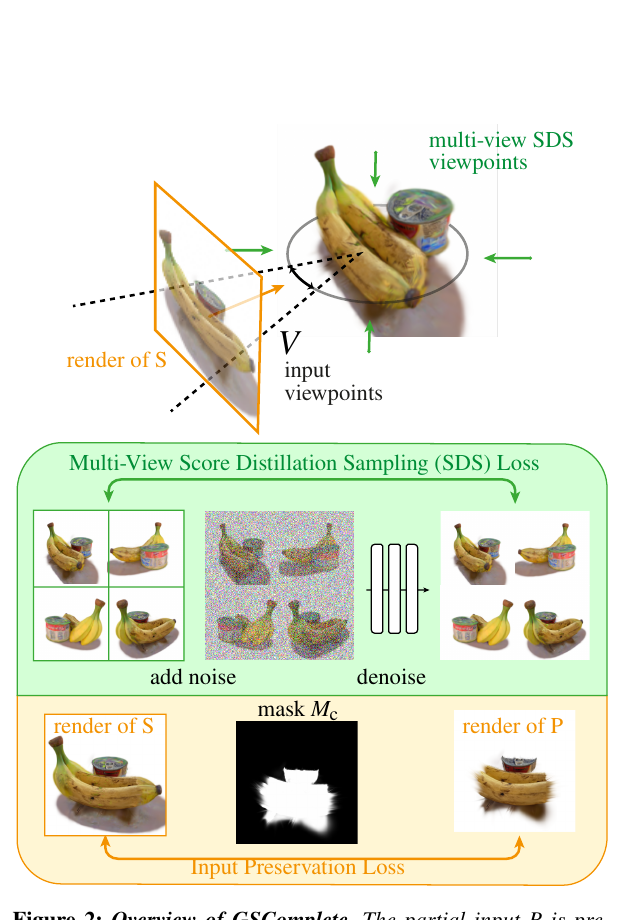
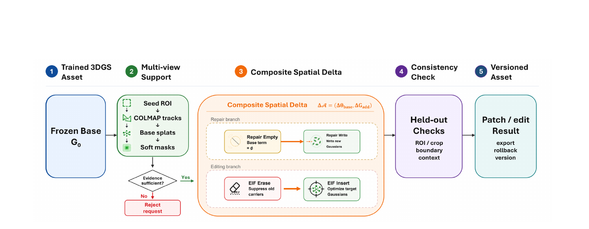

# 2026-10-04 科研日报

## 今日速览

10 月 3 日是周六，没有独立 arXiv 公告批次；本期不硬凑“当天新稿”，而是沿着最新兴趣校准补读两篇尚未收录的 3D 高斯泼溅（3DGS）资产修复工作。二者恰好回答两个不同问题：[GSComplete](#2026-10-04--gscomplete) 为残缺物体生成缺失部分，同时约束新增高斯别遮住原资产；[FocusGS](#2026-10-04--focusgs) 则冻结已经可用的大场景，只给坏掉的小区域增加可卸载、可回滚的局部增量层。

- **生成补全：** GSComplete 用二维扩散模型提供“完整物体应长什么样”的先验，再用输入保持损失规定“从这些视角看，已有部分必须仍然可见”。它解决外观补全，不保证新生成部分满足尺寸、关节或接触约束。
- **确定性维修：** FocusGS 把维修写成“冻结底座 + 局部新增高斯”，把换字/换标识写成“先擦除旧内容载体，再插入新高斯”；这比整场续训更便宜，也比开放式文字编辑更容易验收。
- **与主线的缺口：** 两篇都把“不要破坏已有资产”做成了显式合同，但验收仍是图像、边缘与文字识别指标。若用于机器人资产，还缺关节限位、碰撞/接触和抓取或装配公差；不能把视觉修好直接等同于仿真可用。
- **圈内：** OpenAI Dots 的早期用户报告同时出现了主动发现航班延误的价值和日历连接器恢复成本；图形社区则开源了 iPhone 端采集、校姿、Metal 训练与 SOG/COLMAP 导出的完整 3DGS 扫描器。

## 残缺物体补全：先生成，再保证原资产没有被盖住

### GSComplete · arXiv · 2026-09-08

**一句话判断：** GSComplete 的关键不是“用扩散模型补背面”，而是把已有高斯保持为冻结子集，并用可见性约束阻止新高斯从输入视角遮住它们；这补上了普通二维生成转三维时容易重画原资产的问题，但输出仍是外观合理的高斯集合，不是具有物理约束的部件。

**Title：** GSComplete: Gaussian Splat Completion with 2D Diffusion Priors  
**作者：** Elias Brugger、Philipp Erler、Stefan Ohrhallinger、Paul Guerrero。  
**单位：** TU Wien；Adobe Research。  
**发表时间 / 投稿信息：** arXiv v1 于 2026-09-08 提交；未标明会议录用，代码与数据声明为“录用后公开”。  
**链接：** [摘要](https://arxiv.org/abs/2609.08449) · [PDF](https://arxiv.org/pdf/2609.08449)

**摘要中译：** 输入是一个因扫描遮挡、照片覆盖不足或人工只建了部分区域而残缺的 3DGS 物体。作者希望只生成缺失部分，已有高斯的位置、颜色和外观保持不变。方法不训练专门的三维生成模型，而借用二维多视图扩散先验，通过分数蒸馏采样优化新增高斯，并加入输入保持损失。新测试集包含多视图重建、单图深度、LiDAR 扫描和网格转高斯四类残缺物体。

**方法与原理。** 输入包含残缺高斯集合 \(P\)、描述完整物体的文字 \(y\)，以及一组必须保护原外观的视角 \(V\)；输出为完整集合 \(O\)，且 \(P\subset O\)。流程如下：

1. **冻结已有高斯，只初始化新高斯。** 在 \(P\) 的包围盒附近均匀放入 5,000 个新高斯，训练时不更新 \(P\)。仅冻结参数还不够：二维扩散先验可能让新高斯挡在旧高斯前面，数值上“旧高斯还在”，画面里却已经看不见。
2. **多视图分数蒸馏负责补全。** 分数蒸馏采样（SDS）把当前高斯从四个相隔 90° 的方位渲染出来、加噪，再交给 MVDream 去噪；渲染与去噪目标的差异反向更新新增高斯。早期噪声较大，先补整体形状；后期降低噪声，集中修细节。
3. **输入保持损失负责“不许遮住”。** 对保护视角 \(c\in V\)，先渲染残缺输入得到可见掩码 \(M_c\)，再比较完整对象与原输入在该掩码内的颜色：

\[
\mathcal L_p=\mathbb E_{c\sim V}\left\|M_c\odot\bigl(r(O,c)-r(P,c)\bigr)\right\|_2^2.
\]

这里 \(r(\cdot,c)\) 是从视角 \(c\) 渲染，\(M_c\) 只选原高斯可见的像素，\(\odot\) 表示逐像素相乘。它不要求所有视角都露出原表面——背面补全本来就可能遮挡正面几何——而是由 \(V\) 明确哪些观察方向必须保持。
4. **先暖启动，再交替优化。** 前 50 步暂时不使用掩码，让新高斯移到输入视角背后或降低不透明度；随后交替计算多视图 SDS 与 \(\mathcal L_{\mathrm{MVSDS}}+2\mathcal L_p\)，共 6,000 步。前 1,500 步按梯度增密，新增高斯最终约 10–20 万个。

*原论文 Figure 2（[来源](https://arxiv.org/pdf/2609.08449)）：绿色分支让扩散模型从多视图推动“像一个完整物体”，黄色分支只在原输入可见的掩码里比较新旧渲染，阻止新增高斯覆盖已知部分。生成与保护不是先后处理，而是在同一轮优化里拉扯平衡。*

**结果、成本与局限。** SplatComplete 测试集共 39 个物体。相对 MVDream、Trellis 单/多视图、InstantMesh 和 TripoSG，GSComplete 的深度均方误差为 0.0084、颜色均方误差为 0.0248、LPIPS 为 0.0370，均为表中最低；CLIP 语义相似度 77.944，也略高于对照。指标含义是前三项越低越能保持输入，CLIP 越高只说明语义相近，不代表尺寸或物理正确。单张 RTX 3090 每个物体约 35 分钟；输出分辨率受 MVDream 限制为 256²，稀疏输入会导致形状含糊，且可见色缝与过饱和。保护视角和部分包围盒仍需人工选择。

**与主线的关系。** 它适合做“扫描缺口如何不破坏已有 3DGS”的视觉基线，可借鉴显式保护视角与冻结旧资产；但新增部分由文字和二维扩散先验决定，没有 CAD/URDF、关节、接触或动作证据，也没有策略训练和真机验证。与 MiracleAug 的交集停在资产补全，不应外推成可执行 Real2Sim。

## 局部资产维护：冻结整场，只给坏区域加增量

### FocusGS · arXiv · 2026-07-30

**一句话判断：** FocusGS 把“整场平均指标很好、一个小招牌却仍糊掉”归因于局部梯度被全图平均稀释；它为修复区单独增加高斯基函数，并把确定性编辑拆成擦除旧载体与插入新内容，因此更像可版本化的资产补丁，而不是重新训练整个场景。

**Title：** FocusGS: Spatial Delta Layers for Local Repair and Deterministic Editing of Trained 3D Gaussian Assets  
**作者：** Yiqun Pan、Yukun Shi。  
**单位：** 北京化工大学信息科学与技术学院。  
**发表时间 / 投稿信息：** arXiv v1 于 2026-07-30 提交；未标明会议录用，未找到公开代码。  
**链接：** [摘要](https://arxiv.org/abs/2607.28834) · [PDF](https://arxiv.org/pdf/2607.28834)

**摘要中译：** 已训练的 3DGS 正从一次性重建结果变成要交付、检查和维护的资产。现有全局训练或开放式文字编辑很难精确修复一个小区域。FocusGS 把维护表示成空间增量：修复只增加局部高斯；指定文字或图案更新则先去掉承载旧内容的高斯，再插入目标高斯。全局底座保持冻结，补丁可独立保存、卸载和回滚。

**方法与原理。** 输入是训练好的底座 \(G_0\)，以及多视图支持包 \(\mathcal T=\{(v,M_v,Y_v)\}\)：相机视角 \(v\)、传播到该视角的软掩码 \(M_v\)、真实观察或用户确认的目标图块 \(Y_v\)。输出是底座加局部增量的版本化资产。

1. **先判断证据是否足够。** 从一个种子区域出发，用 COLMAP 特征轨迹与底座高斯投影向其他视角传播掩码；若相机未注册或找不到可靠多视图支持，直接拒绝请求。近似平面的书脊和招牌可用单应变换传播目标图块。
2. **修复分支只“加”。** 冻结 \(G_0\)，在目标附近新建 \(\Delta G_{\mathrm{rep}}\)，优化其位置、尺度、旋转、不透明度和颜色。目标区用像素与结构相似度损失拟合，保护损失约束区域外不变，尺度/不透明度正则避免补丁膨胀。最终 \(G_{\mathrm{rep}}=G_0\oplus\Delta G_{\mathrm{rep}}\)。
3. **确定性编辑先“擦”再“写”。** 旧文字不是平面纹理，而是参与深度排序与 alpha 合成的一组高斯；直接叠新字会在侧视角残留混字。擦除—插入分解（EIF）先按投影足迹、可见度和保护比例筛出旧内容载体并抑制或替换它们，再冻结清理后的底座，训练新内容高斯 \(\Delta G_{\mathrm{ins}}\)。
4. **留出视角验收。** 训练没看过的视角检查目标区、边界环与上下文；编辑还检查边缘 F1、目标变化相关性和 OCR 是否完整识别指定文字。补丁与原始 checkpoint 分开保存，失败可回滚。

为什么小区域需要专门分账？标准全图损失把每个像素平均；若参数只影响小区域 \(M_v\)，其梯度贡献会被 \(|M_v|/|\Omega_v|\) 缩小，其中 \(\Omega_v\) 是整幅图。FocusGS 冻结无关区域，把容量、梯度与优化器状态集中给 \(M_v\)，直接绕开这种“空间梯度饥饿”。

*原论文 Figure 2（[来源](https://arxiv.org/pdf/2607.28834)）：底座冻结后，先建立多视图证据；证据不足就拒绝。维修分支只写入新高斯，编辑分支先擦旧载体再写新内容；最后用留出视角检查并导出可回滚版本。*

**结果、成本与局限。** 在 19 个通过证据门的维修请求、93 个评估视角上，目标区 PSNR 平均提高 7.913 dB，93/93 视角均改善；整场续训反而下降 1.430 dB，局部解冻只提高 2.351 dB。PSNR 衡量重建像素误差，越高越好。83 次指定编辑的目标区平均提高 11.05 dB；五个公开案例中，FocusGS 完整识别 5/5 个指定文字，GaussianEditor 与 DGE 为 0/5。RTX 5070 上 800 万高斯底座的平均墙钟时间 6.31 分钟，增量峰值显存约 4.13 GB。局限也很明确：模糊、稀视角或错误相机无法凭新增参数恢复真实细节；强反射、透明、多层深度、非刚性和严重遮挡会产生漂浮或残影；生成目标必须人工确认。

**与主线的关系。** “冻结底座 + 可回滚局部增量 + 证据不足即拒绝”非常适合作为 Agent 修资产的执行合同；但它的目标主要是文字、标识和局部纹理，尚未覆盖关节部件、接触面或抓取/装配公差。若扩展到机器人场景，关键不是再加一个生成器，而是把运动学、碰撞与任务验收接进支持包和留出检查。

## 圈内新闻与社区反应

- **OpenAI Dots：从发布说明转向第一批实际使用反馈。** 9 月 29 日的 [DevDay 汇总](https://community.openai.com/t/devday-2026-announcements-and-developer-resources/1402006)把 Dots 描述为拥有连接应用与云端计算机、可长期保留项目上下文的持久 Agent；这是厂商产品说明，不代表所有地区或计划已经开放。到 10 月 1–3 日，[原始用户讨论](https://community.openai.com/t/who-s-using-dots-are-they-connecting-the-dots-for-you/1402360)出现了可核查的早期个体报告：一位用户称 Dot 在接入邮箱后主动发现航班连续延误并建议改签；另一位用户肯定它能发现日历冲突和价格变化，但记录了日历 API 报错、错误添加会议链接以及恢复过程仍需较多人类注意力。另有用户批评交互界面缺少复制、重试和编辑输入等基本操作。这些案例说明“长期主动性”已经产生实际价值，也把连接器错误诊断、权限边界与失败恢复变成核心体验；它们仍是少数早期用户经验，不构成普遍可靠性结论。
- **ARKit 3DGS Scanner：手机端完成采集到训练，但证据仍是作者自测。** Kuo Feng-Yuan 于 9 月 29 日在 [r/GaussianSplatting 原帖](https://www.reddit.com/r/GaussianSplatting/comments/1wt3h9v/i_built_an_opensource_iphone_3dgs_scanner_with/)公开项目；[仓库](https://github.com/KuoFengYuan/arkit-3dgs-scanner)把 ARKit 采集、可选 LiDAR 融合、姿态修正、点云复查、Swift/Metal 端侧训练、SOG 模型与 COLMAP 数据导出串成一条本地管线。仓库还明确训练需要 A14 及以上设备，当前许可为 PolyForm Noncommercial；速度与 PSNR 数字来自作者自己的 F21171 扫描，不是跨设备独立基准。原帖反应以认可和另一位 iPhone/360 相机扫描器作者提出对照交流为主，尚未出现公开复现报告。对主线的价值是便宜、可审计的 RGB-D/相机轨迹入口，不等于已产出可编辑碰撞体或仿真资产。
- **本期论文社区反应：** GSComplete 与 FocusGS 均未找到带代码复现、真实资产使用或机器人下游验证的可靠独立反馈；因此本期只采用论文实验，不把索引站转述、点赞或转发当作社区认可。

## 覆盖说明

- **发布日：** 2026-10-04（HKT）
- **内容覆盖日：** 2026-10-03；周六无独立 arXiv 公告批次，因此按最新兴趣校准补读尚未收录的 GSComplete 与 FocusGS，并将其明确标为背景阅读。
- **检索范围：** 已检查 LLM、Agent、图形学与具身智能；论文均阅读全文的方法、关键实验与限制，并采用原论文 Figure 2。对标仓 Real2Sim_GPT6_ASTRA tip 仍为 `a1624d6`，无实质更新，故不重复报道。
- **兴趣校准：** notes 已读至 `207a3b2`，并核对 `CURRENT.md`、`WORKING_CONVENTIONS.md` 与该次变更正文；blog 仍为 `8d722e0`，academic 仍为 `f19a697`。只据公开规则加强“受约束的 3DGS 局部修复”筛选，未公开笔记正文、私人实验、草稿判断或个人信息。
- **编写：** Neon
