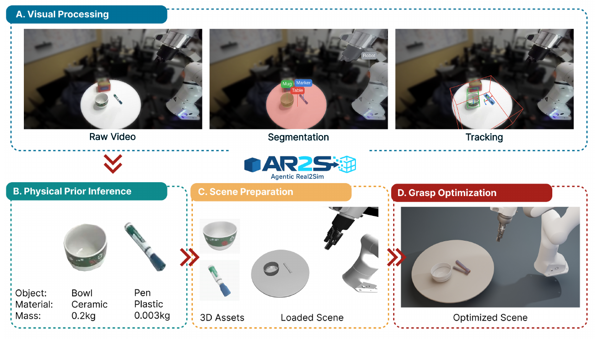
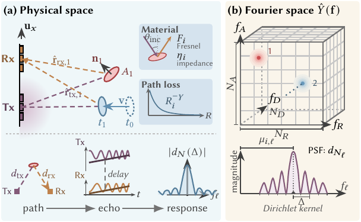
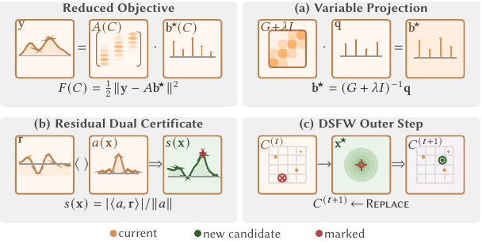

# 2026-10-05 科研日报

## 今日速览

把真实示教搬进仿真，最难的部分往往发生在重建完成以后：物体尺寸、机器人坐标系和接触稍有偏差，原来的抓取轨迹就会穿过物体。今天优先读 [Agentic Real2Sim](#2026-10-05--agentic-real2sim)，看视觉语言 Agent 怎样协调专门工具、检查中间结果，再通过仿真修正可执行场景。它的 500 段示教转换成功率为 48.4%，也提醒我们：自动化流程已经可研究，批量可靠性仍有很大缺口。

- **必读：** Agentic Real2Sim 需要同步图像与深度、相机标定和机器人轨迹，输出可编辑网格、物理场景与重新模拟的示教。真机实验支持“仿真评估能反映任务难易”，尚不足以证明这些合成示教改善了真机策略。
- **图形基础：** [Dirichlet Splatting](#2026-10-05--dirichlet-splatting) 面向雷达、太赫兹等保留波相位的传感器。它先换成符合测量物理的泼溅核，再用全局残差信号跳出局部极小值；只换表示、继续用普通局部优化仍可能失败。
- **圈内：** 照片生成 Blender 场景的公开评测引出了“整体形状还是细节应占更高权重”的分歧；一位编程 Agent 用户报告合规的防御性代码审查被整体阻断；RoboParty 宣布人形机器人 RP1 后续将开放仿真、控制和训练工具，当前证据仍是路线图。

10 月 4 日为周日，没有独立 arXiv 公告批次。本期补读一篇主线背景工作和相邻公告批次的一篇图形论文，均为首次收录；不把旧稿写成当天发布。

## 从真实示教到可执行孪生：Agent 负责组织与验收

### Agentic Real2Sim · arXiv · 2026-07-21

**一句话判断：** 这篇值得读的是“工具输出必须经过检查、场景必须经过执行”的完整流程，以及它把重放、增强和策略评估接到同一种示教格式；需要注意，抓取修复可以改变初始物体位置，成功执行并不自动证明恢复了真实物理参数。

**Title：** Agentic Real2Sim: Physics-based World Modeling with Vision-Language Agents  
**作者：** Guanxiong Chen、Qianjun Xia、Jiawei Peng、Heng Zhang、Pengyu Jing、Bole Ma 等，完整名单见论文。  
**单位：** University of British Columbia、Johns Hopkins University、NHR@FAU / Friedrich-Alexander-Universität Erlangen-Nürnberg、Columbia University、UCLA、National University of Singapore、University of Cambridge、Style3D。  
**发表时间 / 投稿信息：** arXiv 首次提交 2026-07-21；本期读 v4，修订于 2026-09-16。页面注明会后更新，但没有明确会议名称，故不据此写成某会议录用。  
**链接：** [摘要](https://arxiv.org/abs/2607.19190) · [本期 PDF v4](https://arxiv.org/pdf/2607.19190v4) · [项目与视频](https://agentic-real2sim.github.io/) · [代码](https://github.com/agentic-real2sim/agentic_real2sim)

**摘要中译：** 从真实机器人观测建立物理世界模型，通常需要把视觉重建、物理先验、坐标标定和仿真调试连接起来。作者用视觉语言模型驱动的多个 Agent 协调这些专门工具，把真实示教转成可运行的仿真孪生，并用于数据增强与机器人策略评估。系统在 500 段 DROID 示教上进行批量转换，也展示了其他机器人、可变形物体与人形运动的扩展。这里的“世界模型”是可执行场景及其仿真过程，不是仅预测下一帧的视频生成模型。

**问题、输入与输出。** DROID 是真实机器人操作示教数据集，记录摄像机观测和机器人动作。本文读取这类同步 RGB-D 数据：RGB 是彩色图像，D 是深度；还需要相机标定、机器人关节与夹爪轨迹，以及可选任务描述。机器人本体模型也是额外先验。输出包括物体网格、尺度与姿态轨迹、物理配置、机器人和相机对齐后的 MuJoCo 场景，以及可重新生成的观测—动作示教。MuJoCo 是负责刚体运动和接触计算的物理仿真器。

视觉语言模型（VLM）能同时理解文字和图像，在这里负责选工具、选关键帧、解释失败和决定有限次数的重试。它不直接从语言生成可信碰撞几何，也没有为本流程重新训练模型权重。

**方法与原理。** 四个 Agent 按中间产物交接，而不是把所有工作交给一条大提示词。

1. **先恢复可检查的视觉资产。** 视觉处理 Agent 选摄像机与关键帧，识别任务相关物体及支撑关系。SAM3 是这里按文字提示分割物体的模型；掩码检查器发现漏分、合并物体等问题时，会重新选帧或重试。SAM3D 再从图像与掩码恢复物体网格；FoundationStereo 用双目图像估计深度，帮助确定尺度；FoundationPose 跟踪物体的六自由度姿态，即三维位置与三维旋转。跟踪异常会触发重新初始化。最终把网格、尺度、物体姿态、机器人轨迹、相机和任务信息放入统一的示教目录，供后续步骤消费。
2. **把视觉猜测变成显式物理先验。** 物理先验 Agent 根据物体身份与材料线索给出质量、接触等配置建议。这样把“瓷碗还是塑料杯”与仿真参数关联起来，避免默认参数无差别套用；但视觉推断不是测量。论文没有对刚性物体进行逐物体的系统辨识——即根据已知受力与运动反求真实参数——也没有独立验证所猜质量、摩擦等量。
3. **对齐机器人、桌面和场景。** 场景准备模块依据标定变换统一坐标系，用机器人图像掩码优化本体基座位置，并在选定参考下校正地面方向和偏移，再装入 MuJoCo。这样，视频里的末端轨迹才有机会在仿真中走到正确物体旁边。纹理网格负责可交互前景；静态背景先补掉被物体遮住的区域，再表示为三维高斯泼溅（3DGS：用带颜色的小椭球快速合成新视角）。渲染时根据深度把仿真前景与背景合成，得到外部与腕部相机的观测。
4. **执行后再修抓取。** 系统扫描候选物体位置与抓取配置，或让 Agent 结合渲染关键帧和执行摘要提出修正，保留通过抓取检查的配置。举一个帮助理解的例子：重建杯子偏了几厘米，原轨迹闭合夹爪时抓空，修正物体初始位置可能恢复抬起动作。它修复了“这条轨迹能执行”，却也改变了原始场景条件；因此要把可执行性与忠实恢复分别验收。

*原论文 Figure 1（[来源：v4](https://arxiv.org/pdf/2607.19190v4)）：上方先从原视频得到分割与追踪；下方把物体身份转为物理配置，组装机器人场景，再通过抓取执行调整场景。图中的材料和质量属于推断先验，不是已经完成的物理测量。*

**增强数据怎样保持动作有效？** 改物体位置时，系统通过逆运动学重新求末端轨迹对应的关节动作；逆运动学就是从“夹爪应到哪里”反求机器人关节应转多少。其他增强包括重采样已验证抓取、替换背景和扰动相机。每个变体都重新模拟和渲染，再导出同步图像、机器人状态和动作，区别于只改图片却保留旧动作标签。执行检查仍受模型几何、接触配置与成功判据限制，不能保证所有增强都忠实于真实环境。

**策略训练与使用。** 论文描述用增强示教微调 π₀.₅；它是预训练机器人动作策略，不是负责建场景的 Agent。策略运行时只接收外部和腕部图像、关节与夹爪状态、任务文字，预测一段绝对关节位置指令；仿真以 15 Hz 执行这段动作后再查询策略。它在动作段之间根据新观测修正，段内则按已预测指令执行，部署输入不包含恢复出的物体真值姿态。论文展示了这条下游接口，但没有给出足以量化“合成增强带来多少真机提升”的对照结果。

**结果、成本与局限。** Gemma 4 31B 是本实验使用的开放视觉语言模型后端。500 段输入中，242 段成功（48.4%）、28 段部分成功（5.6%）、230 段失败（46.0%），不能只在成功产物里计算成功率。判定先筛选最多五个候选执行，再由三个模型分别评价目标物体、最终位置、动作和夹爪是否正确；任一评审对其最佳候选评分达到 8/10 即可通过，另有人类核验。这个判据较宽松，仍应继续检查碰撞、接触和动作标签；论文也没有单独移除检查器的消融，不能把整体成绩归因于某一个 Agent 设计。

在相同 100 段示教上，不同模型后端成功数接近：Gemma 48、Qwen 45、GPT-5.4 43、Claude Haiku 37；作者报告模型调用成本有较大差异，但那不包含完整视觉工具、GPU 和调试成本。公开部署还需 Linux、NVIDIA GPU、多个视觉模型环境与约 80 GB 磁盘空间，不能把“开放模型后端”直接理解成普通轻量笔记本即可复现。

真机证据包含 AIRBOT Play 遥操作示教转换，以及**另一项独立评估**：π₀ 只用真实示教微调，同一策略在六个抓取放置任务的真机与孪生中运行，两侧任务成功率的 Pearson 相关系数为 0.920。这个系数衡量任务难易趋势是否一致，越接近 1 越一致；它不保证绝对成功率准确，也不是不同策略优劣排序的验证，更不是合成数据训练后的真机收益。可变形与人形扩展主要提供定性展示。

**值得关注。** 与 MiracleAug 的公开主线重合在可编辑资产、同步观测—动作增强和仿真执行检查。可借鉴的是统一示教目录、工具级检查器与抓取验收；缺口是深度和标定依赖、接触参数缺乏辨识、失败率仍高，以及合成示教的真机收益没有定量闭环。主题相近不构成相互借鉴或复制的证据。

## 波动传感器的逆渲染：先保留相位，再处理难优化的旁瓣

### Dirichlet Splatting · SIGGRAPH Asia 2026 / ACM TOG · 2026-09-30

**一句话判断：** 高斯核适合近似图像中的平滑足迹，但相干传感器会记录振荡旁瓣与相位；本文同时改表示和求解器，说明“物理上正确的核”与“能够找到正确位置的优化过程”必须一起设计。

**Title：** Dirichlet Splatting: Differentiable Rendering for Wave-Based Inverse Problems  
**作者：** Xingyu Chen、Wuqiong Zhao、Xinyu Zhang、Tzu-Mao Li。  
**单位：** University of California, San Diego。  
**发表时间 / 投稿信息：** arXiv v1 于 2026-09-30 提交，进入相邻的 10 月 2 日公告批次；项目注明 ACM Transactions on Graphics / SIGGRAPH Asia 2026，论文排版为 TOG 45(6)，Article 199，December 2026。  
**链接：** [摘要](https://arxiv.org/abs/2610.00618) · [PDF v1](https://arxiv.org/pdf/2610.00618v1) · [交互项目页](https://dirichlet.xingyuchen.me/) · [DOI](https://doi.org/10.1145/3842559)。项目代码入口当前标为 Coming soon。

**摘要中译：** 对雷达、太赫兹等波动传感器做逆渲染，需要从测得回波恢复场景。这类传感器的有限采样响应是复数、带振荡的 Dirichlet 核，而不是高斯。作者以小平面片表示反射表面，用传播物理决定其复振幅，把这些核相干叠加，并设计适应非凸损失的求解器。在合成实验和真实太赫兹扫描中，方法比高斯表示更准确地拟合回波并恢复反射结构。

**问题与前提。** 相干测量同时保留波的强弱和相位，因此两个强反射也可能因相位相反而抵消。输入是经过标定、已知发射与采样配置的复数回波频谱；输出是有位置、朝向、面积、材料响应及可选速度的小平面片，称为 surfel。本文采用波从发射端经表面反射一次到接收端的模型，没有学习一个通用网络；每个新场景都需要优化。

**正向模型怎样从场景生成测量？** 先按传感器几何把平面片的位置与速度映射到距离、速度引起的频移和方向等连续频谱坐标；再在每个轴上放置有限采样窗口对应的 Dirichlet 足迹。矩形窗口的核心核为：

\[
\kappa_N(\Delta)=\exp\!\left[-j\pi\frac{N-1}{N}\Delta\right]\frac{\sin(\pi\Delta)}{\sin(\pi\Delta/N)}.
\]

这里 \(N\) 是该轴变换前的采样长度，\(\Delta\) 是测量格点与反射中心的偏移，\(j\) 是虚数单位。正弦比值产生主峰和振荡旁瓣，指数项保留相位；实际使用 \(\kappa_N/N\) 归一化峰值。离散傅里叶变换（DFT）把有限段回波变成频谱，正是这种有限窗口产生了足迹，不能把旁瓣一律当噪声抹掉。

每个平面片的贡献还乘上面积、朝向导致的衰减、材料在入射角下的反射响应，以及传播距离导致的衰减。最后先相加所有**复振幅**，需要强度时再取模平方；普通图像泼溅那种按遮挡顺序混合颜色的规则不适用。帮助理解：两个大小相同、相位相反的回波相加可能为零，直接相加亮度则会错误地得到两倍强度。

*原论文 Figure 2（[来源](https://arxiv.org/pdf/2610.00618v1)）：左侧从发射、反射路径与材料计算回波，右侧把位置映射为频谱中心，并放置带旁瓣的 Dirichlet 核。箭头展示的是测量物理，不是把 RGB 图像高斯直接换一个形状。*

**逆问题为什么不能只做梯度下降？** 旁瓣会产生许多局部极小值；中心错了时，优化还可能把振幅缩小来降低损失，从而隐藏错误位置。Dirichlet Splatting 的滑动 Frank–Wolfe 求解器（DSFW，在这里用于重新分配有限数量的反射片）按以下顺序处理：

1. 固定当前几何，把复振幅写成带正则的线性最小二乘问题并直接求解。这个“变量投影”步骤先消去容易求的振幅，只留下位置等难变量，避免位置优化与振幅缩小相互掩盖。
2. 计算残差，即真实回波减去当前预测；在较粗的全局候选网格上，计算假设新反射片的频谱足迹与残差的相关性。相关峰回答“哪里的新反射最能解释尚未解释的信号”，可以跨过当前中心附近的旁瓣陷阱。
3. 用高相关候选替换最不重要的现有反射片，保持数量预算不变。重要性同时考虑振幅和该片能否被其他片代替，因此不会简单删除所有弱反射，也避免无止境加点拟合噪声。
4. 再做局部最小二乘细化，并配合论文的粗到细与耦合修正步骤；完整目标确实降低才接受相应修正。全局搬移负责找对区域，局部细化负责找准位置，二者互补，但没有一般收敛保证。

*原论文 Figure 3（[来源](https://arxiv.org/pdf/2610.00618v1)）：上方先在固定几何下求最优振幅；左下把未解释的回波转为候选位置评分；右下保持反射片数量不变，把弱贡献位置替换为新的高分位置。*

**结果、成本与局限。** 在三个理想反射体的合成波形上，三个 Dirichlet 原语能达到数值精度，而 96 个高斯仍有建模误差。这首先验证测量表示，不是现实场景重建成功率。在五反射体、十个随机初始化的消融中，Dirichlet + DSFW 的中心恢复成功率为 100%，高斯 + 同类全局求解为 10%，两种表示配 AdamW（常用的自适应梯度优化器）均为 0%；成功要求中心误差小于 0.1 个频谱格点。这个小型受控实验支持“核与求解器都重要”，不能外推成真机百分之百成功。

七个合成原始信号逆成像目标上，恢复占据图的归一化均方误差平均为 0.136，同求解器的高斯对照为 0.294；它衡量恢复图与真值的平方差相对真值能量，越低越好。该组拟合平均约 16.4 秒，计时不包含真实扫描采集。全局相关搜索单步比普通梯度步骤昂贵，收益来自较少步骤到达更好的解。

真实证据来自 120 GHz 太赫兹扫描的金属字母与金属化兔模型。字母没有逐像素真值，不能按合成占据图方式证明几何准确；兔模型使用 4,991 个**固定格点**原语拟合，不能当作随机初始化自由中心求解的验证。其他限制包括多次反射产生的虚像、相机式不透明遮挡没有完整建模，以及对相位和采样几何标定的依赖。

**值得关注。** 这是图形学与波动感知交界的基础工作：传感器测到什么，就应保留什么物理结构，再设计相应优化器。它不是 RGB 3DGS 渲染的直接替代，也没有示教生成、机器人策略训练或真机迁移结果；可复用的思想是把“正确表示”与“失败后怎样重分配表示容量”一起验收。

## 圈内新闻与社区反应

### 照片生成 Blender 场景：新增评分拆分，仍需区分外观与可执行资产

**事件与更新。** Kaloyan Chernev 于 10 月 1 日发布[照片重建 Blender 的原始评测](https://kaloyan.blog/ai-models-rebuild-a-photo-in-blender)，10 月 2 日增加模型并拆开外观与结构评分。模型看照片、写 Blender 脚本、检查渲染，再交付可编辑场景；测试覆盖三张照片，每个模型每题仅一次尝试。作者报告 GPT-6 Astra 总分领先，GPT-6.1 Sol 接近；不同接入方式和提示词并非完全等同，不能直接归因于模型本身。

**实际分歧。** 10 月 2 日 [r/OpenAI 原帖](https://www.reddit.com/r/OpenAI/comments/1wvqfqe/phototoblender_benchmark_gpt6_astra_won_every/)中，Alex__007 更认可 Sol 的结果；另有评论指出整体形状偏差，随后讨论是应奖励形状还是局部细节。编辑判断：这类评测开始检查可编辑结构，值得跟踪，但单个新视角与外观评分还不能验证隐蔽几何、真实尺寸或碰撞；少数意见也不能代表社区共识。

### 编程 Agent 的防御性审查被阻断：需要看到允许部分能否继续执行

10 月 4 日，albertoa3030 在 OpenAI 社区发布[原始使用报告](https://community.openai.com/t/gpt-6-1-sol-work-agent-blocks-defensive-appsec-pr-review-as-restricted-cybersecurity-content/1403191)：GPT-6.1 Sol Work Agent 在其自有代码库的只读应用安全审查中，将整项任务判为受限。用户原本要验证一处数据库授权修复，允许正常数据修改，同时防止未经授权的表结构变化；AppSec 指应用安全，PR 指待合入的代码改动。

作者认可任务涉及安全敏感内容，但希望 Agent 能继续处理允许的审查部分。暂未看到官方诊断或独立复现；这是单一用户案例，不足以认定普遍策略变化。编辑判断：对开发工作流来说，识别边界之后能否保留有效子任务，与识别边界本身一样影响可用性。

### RoboParty RP1：开放仿真与训练栈的计划，不等于已经全部交付

RP1 于 9 月 28 日在 IROS 展示；RoboParty 于 10 月 3 日发布[原始公告](https://www.prnewswire.com/news-releases/roboparty-unveils-rp1-a-high-performance-full-stack-open-source-humanoid-robot-at-iros-302897662.html)，10 月 4 日出现[后续报道](https://www.humanoidsdaily.com/news/roboparty-rp1-humanoid-iros-open-source)。本次值得记录的是厂商承诺逐步开放运动控制、仿真环境、开发接口和训练工具，并在第四季度继续发布软硬件。公告称现场抗扰动动作由 PartyOS 与无监督强化学习框架支持；内部奖励、训练数据和完整实现没有在公告中披露，不能据宣传补写机制。

已有的 [ROBOTO ORIGIN 仓库](https://github.com/Roboparty/roboto_origin)对应较早的 RPO 项目，不是 RP1 全栈已发布的证据。暂未找到可核实的 RP1 独立复现或长期使用反馈；厂商描述的参观热度不计作社区验证。编辑判断：若后续真正交付可修改仿真、训练配置与控制代码，会降低机器人实验门槛；当前仍应按开放路线图跟踪。

**论文社区反馈。** 本期两篇尚未找到可靠的独立复现或实际下游使用报告；采用作者论文实验，不把转发或索引站摘要当作技术认可。

## 覆盖说明

- **发布日：** 2026-10-05（HKT）。
- **内容覆盖日：** 2026-10-04。周日无独立 arXiv 公告，Agentic Real2Sim 为主线背景补读，Dirichlet Splatting 来自相邻公告批次；两篇均首次收录。
- **阅读与检索：** 阅读两篇原文方法、关键实验及局限，采用原论文 Figure 1、Figure 2 与 Figure 3；检查 LLM、Agent、图形学、具身智能四领域。跨日新闻保留原始日期与实质更新，反馈只归于原帖作者，未核实传闻不收录。
- **兴趣校准：** notes 与 blog 均核对最新提交及既有阅读检查点，没有新增提交；academic 同步核验。私人笔记仅用于选题校准，不公开其中的研究设想、实验或正文。

**编写：** Neon
