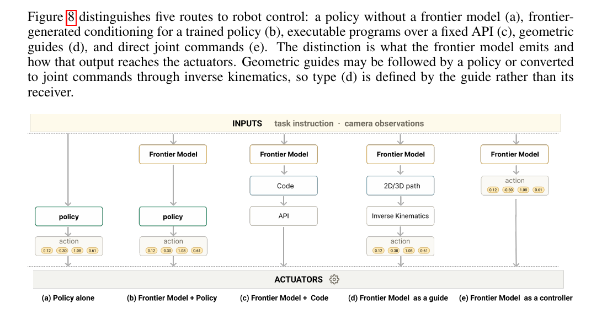
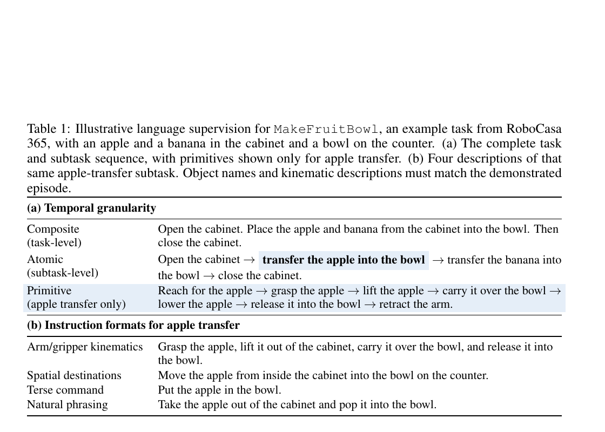
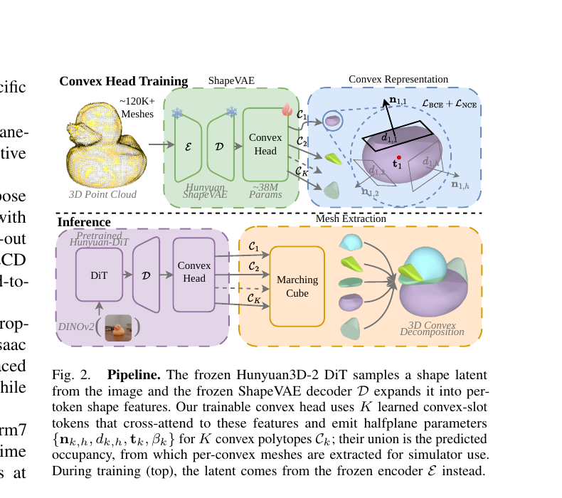

# 2026-10-06 科研日报

## 今日速览

今天两篇都直接补在 MiracleAug 公开主线的不同接口上。**必读是 [Bridging Frontier Reasoning and Robot Execution](#2026-10-06--bridge-robot-execution)**：它没有让慢而强的前沿模型持续吐关节角，而是先让它补采示教、再把实时动作交给本地策略，并通过三层时间粒度与多种说法扩宽策略的“语言接口”。关键证据是混合数据能替代一半人工示教而不降低总成功数、前沿模型加本地策略优于单独策略；关键缺口是没有训练“仅 20 条人工示教”的对照，不能算出自动示教的净增益。

[I2CD](#2026-10-06--i2cd) 则解决更靠前的一块：直接从单张物体图像读出仿真器能消费的凸碰撞几何，绕过“先生成百万面视觉网格、再修复和凸分解”的脆弱链条。它在同一场景与规划器下把 20 物体的几何准备时间从 328 秒降到 11 秒，真机成功 85/100 对 90/100；但它仍需要外部分割和深度注册姿态，也没有估计质量、摩擦或运动学，因此是 Real2Sim 的碰撞资产部件，不是完整可执行孪生。

## 前沿推理怎样落到低延迟机器人执行

### Frontier Reasoning ↔ Robot Execution · arXiv · 2026-10-02

**一句话判断：** 这篇把“前沿模型造数据”和“前沿模型调本地策略”连成一条可运行链，更重要的是识别出新的瓶颈：动作交给本地策略后，策略能否理解不同粒度、不同措辞的指令，决定高层推理能不能真的落地。

**Title：** Bridging Frontier Reasoning and Robot Execution: From Autonomous Demonstration Generation to Dense Language Supervision  
**作者：** Bosung Kim、Alexander Trevithick、Ruiyi Wang、Prithviraj Ammanabrolu  
**单位：** University of California, San Diego；NVIDIA  
**发表时间 / 投稿信息：** arXiv v1 于 2026-10-02 提交，进入 2026-10-05 公告批次；未标明会议录用。  
**链接：** [摘要](https://arxiv.org/abs/2610.03615) · [PDF v1](https://arxiv.org/pdf/2610.03615v1)

**摘要中译。** 前沿模型能凭少量示例控制机器人，却因推理与接口延迟难以承担实时闭环。作者提出两座桥：其一，让前沿模型在真机上自主补采成功轨迹，与人工示教一起训练低延迟本地策略；其二，对同一示教按动作原语、子任务和完整任务三层标注，并用多种描述方式训练策略理解语言。最后在需要拼词规划和搬运字母块的任务中，由前沿模型决定目标与修正，本地策略执行动作。

**问题、输入与输出。** 第一座桥的输入是五条成功的人类真机示教、三路相机画面、任务文字和目标条件；输出是新的同步观测—关节动作轨迹。机器人是低成本 SO-101 机械臂。第二座桥读取已有轨迹及其任务标签，输出的是微调后的 π₀.₅——这里它是接收图像、机器人状态和语言并预测关节目标的视觉—语言—动作策略（VLA），不是高层规划器。部署时前沿模型只发语言指令，π₀.₅ 每次预测十个绝对关节目标；训练期的仿真真值或完整未来轨迹不会作为部署输入。

*原论文 Figure 8（[来源：v1，第 13 页](https://arxiv.org/pdf/2610.03615v1#page=13)）：从左到右依次是策略独立执行、前沿模型用语言调策略、生成可执行代码、给几何路径、直接输出关节动作。本文采用第二种：慢模型负责“做什么、是否要纠正”，快策略负责把语言变成连续动作。它不是把前沿模型蒸馏成一个新网络。*

**第一座桥：先让前沿模型生成可学习的轨迹。**

1. 作者先给 Fable 5 和 GPT-6 Astra 各五条人类成功示教，让模型直接看相机反馈并控制 SO-101。四项任务从抓放、叠杯，到叠布和合盖；每个模型每项十次、每次最多一小时，开始后不再人工介入。成功示教本身不足以教会精密接触：例如 Astra 合盖只有 2/10。
2. 失败往往不是任务理解错，而是夹爪偏了几毫米。作者补入“纠正片段”：短示教专门展示抓偏或插入不准时怎样根据新画面微调。它们不是文字建议，而是可供上下文模仿的真实调整轨迹。加入后 Astra 合盖升至 5/10、叠杯 10/10；这支持“纠正动作示例有用”，但每条件仅十次，且仍没有把失败类型逐项隔离。
3. 数据采集时保留原来的五条人类示教，并把新成功轨迹中有用的片段放进可复用池。随着成功样例累积，模型可复用先前策略；作者观察到若干任务后续成功回合耗时下降约 40%–60%。注意图表排除了失败尝试，因此只能说明**成功回合**变快，不能代表整套数据收集的总成本以同样比例下降，也不能证明下降完全由样例累积造成。
4. 每项任务最终取 20 条人工成功轨迹和 20 条 Astra 成功轨迹训练 π₀.₅。部署时 Astra 根据相机和目标发高层指令，本地策略执行十步动作段；下一次观察可触发新指令和纠正。这个 harness（高层模型、进度控制和本地执行的编排层）把高延迟推理放在动作段之间，而非每个控制步。

**第二座桥：把同一条轨迹教成多层语言。** 单条“把苹果放进碗里”很难同时教会策略理解完整任务、子目标和微小纠偏。作者让同一轨迹获得三种时间分辨率：完整任务（把水果放碗里再关柜门）、原子子任务（转移苹果）、动作原语（伸手、抓取、抬起、搬运、下降、释放、收回）。每个片段又有四种说法：关节/夹爪运动、空间终点、简短命令和自然口语。RoboCasa 365 是带厨房长程操作任务的仿真基准；它已有任务与子任务标签，作者再根据夹爪开合、末端运动和事件边界生成原语标签，共得到 4,100 回合中的 27,113 个片段。BEHAVIOR-1K 是家庭活动仿真基准，本文使用其已有原语片段。

*原论文 Table 1（[来源：v1，第 6 页](https://arxiv.org/pdf/2610.03615v1#page=6)）：上半部把完整水果碗任务逐层展开到“抓—抬—搬—放”；下半部对同一个苹果转移片段改写四种说法。关键不是生成更多轨迹，而是在同一观测—动作片段上增加互相一致的语言监督。*

训练时所有策略从同一预训练检查点开始、各训练 120,000 步。测试有两种指令来源：oracle instructor 用仿真状态决定何时切换正确子目标，属于部署时通常拿不到的特权参考；Fable 5 只看初始相机与完整目标，一次性列出子目标，运行中由本地 Qwen3.6-27B 视觉语言模型根据相机判断当前步骤是否完成。所有策略共享同一计划和进度监视器，使比较主要落在语言监督方式上。

**结果、成本与局限。** 在 RoboCasa 365，三层粒度加多说法的组合在 oracle / Fable 5 指导下成功率为 0.517 / 0.485；仅子任务语言为 0.406 / 0.381。在 BEHAVIOR-1K，由于完整成功几乎为零，论文报告目标谓词完成比例（完成了多少可验证子条件，越高越好）：组合方案为 0.174 / 0.143，仅子任务为 0.143 / 0.084。换 Opus 5、Gemini-3.1-Pro、Fable 5 三个规划器并重写指令时，组合方案六种条件成功率 0.454–0.492，均高于仅子任务方案的最好值 0.392；这说明策略对被测试的措辞变化更稳，不等于能理解任意语言。

真机四任务中，harness 总成功 52/80（65%），本地策略独立执行为 41/80（51.25%）。混合 20 条人工 + 20 条自动轨迹与 40 条人工轨迹都得到 41/80；这表明自动轨迹能在当前设置下替代一半人工轨迹，却**没有**“仅 20 条人工轨迹”对照，不能算出自动轨迹相对同等人工预算的净收益，作者也明确未做统计等价检验。耗时只对成功试验取平均，并排除硬件修复时间。策略推理又通过远端运行，实测控制频率在不同阶段并不总达到名义 30 Hz，所以“低延迟”是相对前沿模型直接控制，而非完整系统已经实时。

**值得关注。** 与 MiracleAug 的公开管线重合在“Agent 生成同步示教—本地策略训练—失败后纠正”，新增可借鉴点是把纠正轨迹也作为上下文样例，以及把策略语言通道当成独立可测接口。它没有生成可编辑场景、配置物理或做 sim-to-real；真机数据生成发生在真实工作台，因此与 Real2Sim2Real 的场景侧互补。下一步最关键的验证是固定人类示教数、分别加入自动轨迹和纠正片段，并统计全部失败成本与跨场景真机泛化。

## 单图直接生成仿真可用的碰撞几何

### I2CD · arXiv · 2026-10-02

**一句话判断：** 不再把视觉网格硬修成碰撞网格，而是从预训练三维生成器的内部形状特征直接读出凸部件；这使“仿真可用”成为输出表示的结构保证，而不是后处理碰运气。

**Title：** I2CD: Direct Image-to-Convex Decomposition for Simulation-Ready Collision Geometry  
**作者：** Qian Wang、Liam Merz Hoffmeister、Brian Scassellati、Daniel Rakita  
**单位：** Yale University, Department of Computer Science  
**发表时间 / 投稿信息：** arXiv v1 于 2026-10-02 提交，进入 2026-10-05 公告批次；未标明会议录用。  
**链接：** [摘要](https://arxiv.org/abs/2610.03453) · [PDF v1](https://arxiv.org/pdf/2610.03453v1)；代码、模型和基准仅声明将发布，本期未见公开入口。

**摘要中译。** 图像到三维模型通常输出面数巨大、拓扑破损的视觉网格，而运动规划器和物理引擎需要少量凸碰撞体。传统流程要修网格、减面、再近似凸分解。I2CD 冻结 Hunyuan3D-2 的图像条件三维生成骨干，只训练一个轻量头，从单张 RGB 图像直接预测若干凸多面体；输出无需修复即可进入 MuJoCo、PyBullet、Genesis 与 Isaac Sim。

**问题、输入、输出与额外先验。** 输入是一张已裁出前景的 RGB 物体图；输出默认由最多 (K=12) 个凸多面体组成的碰撞资产。单个凸体可让 GJK/EPA 一类碰撞算法稳定计算距离与穿透，多个凸体的并集可近似凹物体。单图本身没有给真实尺度与世界姿态；真机实验另用 SAM3 分割物体，并用 RGB-D 相机的深度把预测几何注册到桌面坐标。模型没有预测纹理、质量、摩擦、关节或运动，因此不能从“一张图”推成完整仿真场景。

*原论文 Figure 2（[来源：v1，第 2 页](https://arxiv.org/pdf/2610.03453v1#page=2)）：训练时从约 12 万个网格编码出形状潜变量，只更新绿色的凸几何头；推理时紫色的 Hunyuan3D-2 根据图片采样潜变量，冻结解码器展开形状特征，凸几何头输出 (K) 组平面参数，最后分别网格化。训练与部署的潜变量来源不同，是论文测到 3.2 个 IoU 点差距的来源。*

**方法与原理。**

1. **保留生成器的形状知识，丢掉不合用的网格出口。** Hunyuan3D-2-mini 的扩散 Transformer（DiT）根据图像采样紧凑形状潜变量，冻结的 ShapeVAE 解码器把它展开成 512 个形状特征。作者不读取原来的符号距离场网格，而是让 12 个可学习的“凸槽位”通过交叉注意力查询这些特征；每个槽位负责一个可能的凸部件。只有约 3,800 万参数的头被训练，骨干不更新。
2. **用半空间交集保证每个部件必为凸。** 每个槽位输出平移 (t_k)，以及 (H=12) 个平面的法向 (n_{k,h}) 和偏移 (d_{k,h})。点 (x) 对平面的有符号量为

\[
s_{k,h}(x)=n_{k,h}^{\top}(x-t_k)+d_{k,h}.
\]

当所有 (s_{k,h}(x)\le 0) 时，点在第 (k) 个多面体里；多个半空间的交集按定义是凸集。十二个多面体取并集得到整体形状。训练用平滑近似把“在内/在外”变成可微概率，导出时再在固定立方体内分别取网格；因此凸性来自参数化，不依赖后处理修好拓扑。
3. **同时学习整体占据与合理分件。** 121,056 个艺术家创建的 MolmoSpaces 网格提供真值。每个形状预采样体内/体外查询点，但只有约 6% 落在物体内；若直接平均二元交叉熵，模型只预测空空间也会得到很低损失。作者给占据点更高权重，使内外两类对梯度贡献接近。单看整体占据仍可能让许多扁薄凸片堆在同一处，于是再加凸对比损失：若两表面点之间的线段一直在物体内，就鼓励它们由同一凸槽位解释；线段穿出物体的点对则不应共享槽位。这把“凸集内两点连线仍在集合内”的几何性质变成分件监督。
4. **训练与推理分开看。** 训练时不运行昂贵 DiT，而是用冻结编码器把网格潜变量缓存好，约九个 GPU 小时训练至所用检查点。推理才从图片走背景去除、十步 DiT、ShapeVAE、凸头和逐部件网格化；论文工作站为 RTX 5000 Ada，端到端约 0.51 秒，其中凸头本身约 0.4 毫秒。这个计时不能直接外推到普通笔记本。

**结果怎样读。** 在 227 个未见物体上，体积交并比（IoU：预测与真值体积的交集除以并集，越高越好）为 65.7%，最佳“先重建再凸分解”对照为 62.8%；端到端快 6–37 倍。OmniObject3D 的开放扫描不得不用凸包作参考，会奖励膨胀且掩盖凹陷误差；该子集 I2CD 与最佳对照 63.1 对 62.9，差异不显著。100 个封闭 GSO 物体可用真实网格评估，I2CD 为 68.9，对照不超过 63.8。它的表面 F-score 又比 SAM3D+CoACD 低 3.6 点，说明体积合得上不代表接触表面最精细。

跨引擎实验把 127 个物体从 0.1 米高度落下：I2CD 交付的几何在四个引擎中有至少 98.4% 被原样保留；原始生成网格虽能“加载”，MuJoCo、PyBullet 和 PhysX 默认会把动态非凸网格换成单一凸包，约 60% 物体因此得到错误碰撞形状。这个实验检验的是引擎有没有改资产和落地稳定性，不是恢复真实物理参数。

真机用一帧 RGB-D 观察 20 个物体：SAM3 做分割，深度给姿态，几何进入同一个 MuJoCo 场景；RRT-Connect 规划“接近—抓取—撤离—放置”，20 个目标各跑五个规划随机种子，共 100 次。I2CD 准备全场景 11 秒、成功 85/100；SAM3D+CoACD 为 328 秒、90/100。五次差异统计上不显著，而且实质只有 20 个物体配置；失败主要来自姿态注册，以及 I2CD 局部表面不够精细。实验是准静态抓放，不覆盖推、滚、插接等持续接触任务。

**值得关注。** 对 MiracleAug，I2CD 最可复用的是“直接预测下游真正消费的碰撞表示”，可减少网格修复和凸分解成为批量 Real2Sim 的隐性瓶颈。它与昨日 Agentic Real2Sim 的资产检查链互补：前者给快速对象级碰撞几何，后者还负责尺度、姿态、机器人、背景与执行检查。缺口包括遮挡下的对象级重建、场景支撑关系、细薄结构、凹腔、接触面精度，以及质量和摩擦辨识；代码尚未公开，现阶段只有作者实验可核实。

## 圈内新闻与社区反应

### Beam 先发布能力声明，开放权重仍要等实际交付

**发生了什么。** Reflection AI 于 10 月 5 日[公布 Beam](https://reflection.ai/blog/introducing-beam)，称它是总参数 501B、每个 token 激活 23B 的稀疏专家混合模型，面向编码、推理和 Agent 工作；官方称预训练 23.8 万亿 token，并用 10,500 张 NVIDIA GB300 进行四周强化学习、产生一亿余次 rollout。这里的“开放权重”表示模型参数将可下载，不等于训练数据和完整训练过程开放。更关键的是：截至公告时模型仍在最终红队与评测，权重、技术报告、模型卡和开发工具计划在 10 月稍后以 Apache 2.0 发布；当前只是有限早期访问。

**证据边界与反应。** 官方表格称 Beam 在编码与 Agent 基准上接近或部分超过 GLM-5.2，但多处竞品数据为未报告，完整评测设置和安全结果也要等技术报告。10 月 5 日的社区帖子主要复述参数与官方成绩，尚无可下载权重，因此暂未找到可核实的独立运行、显存需求或复现反馈。编辑判断：这是一项重要的开放模型预告，但今天不能把厂商自报分数写成已被社区验证的能力；真正的更新点应是权重和复现脚本交付时再检查。

### LDraw Nova：Agent 能交付可编辑零件程序，但尚未通过实物结构验收

**发生了什么。** Carlos Antelo 于 10 月 2 日公开 [LDraw Nova](https://github.com/anteloc/ldraw-nova)，10 月 4–5 日持续出现使用讨论。它让通用 Agent 先检索真实乐高零件与示例，再写 Python 程序生成 LDraw 装配文件，反复无头渲染、看图并调整位置；交付物含源文件、浏览器/VR 预览和可在 Blender 编辑的 glTF，而非只出一张图。工具还提供碰撞与间隙检测，体现“用可执行中间语言约束几何 Agent”的路线。

**社区如何反应。** 10 月 4 日 [Hacker News 原讨论](https://news.ycombinator.com/item?id=49938134)中，管理员 dang 追问是否有更多视觉样例、以及是否真的搭成实物；作者补充结果库，并明确说尚未尝试实体搭建，较大模型需要数千零件，只考虑先 3D 打印小模型。这个问答把展示效果与物理可建造性分开了。编辑判断：它是 Agent + CAD/Blender 工作流的有趣公开实现，但碰撞/间隙检查不等于重力、承重、连接强度和装配顺序均有效；目前证据是可编辑 CAD 与渲染迭代，不是可制造系统。

**论文社区反馈。** 两篇论文刚进入 10 月 5 日公告批次，本期未找到可靠的独立复现、开源实现或下游使用报告；不把论文转发和摘要站当作社区认可。

## 覆盖说明

- **发布日：** 2026-10-06（HKT）。
- **内容覆盖日：** 2026-10-05；两篇论文首次提交于 10 月 2 日、进入 10 月 5 日 arXiv 公告批次。
- **阅读与检索：** 阅读两篇 PDF 的方法、训练、关键实验与局限；采用原论文 Figure 8、Table 1 与 Figure 2。检查 LLM、Agent、图形学和具身智能四领域；当天高信号、可由原始来源核验的独立新闻较少，因此精选两条，不以跨日旧闻凑数。
- **兴趣校准：** notes 与 blog 均核对最新提交及既有阅读检查点，没有新增提交；academic 与 Real2Sim 对标仓同步核验。私人笔记仅用于选题，不公开研究设想、实验或正文。

**编写：** Neon
