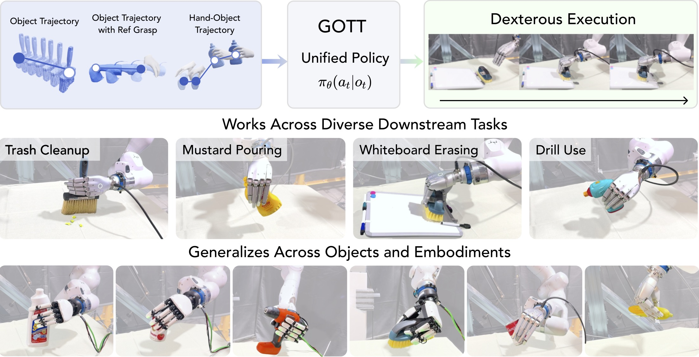
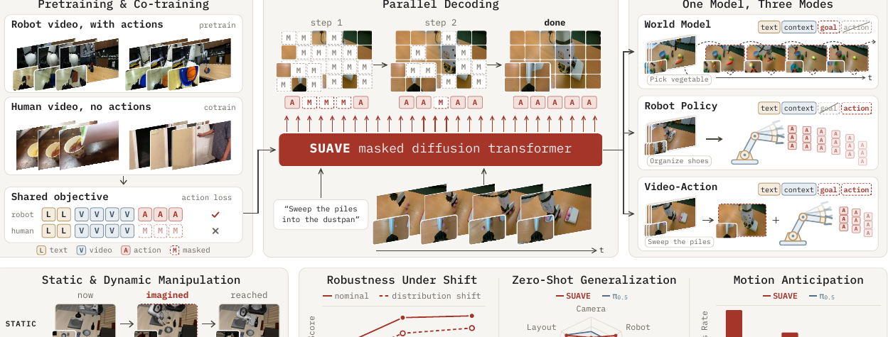

# 2026-10-07 科研日报

## 今日速览

今天两篇都在回答同一个接口问题：高层视频、语言或物体轨迹已经说明了“物体该怎样动”，怎样把它可靠地变成闭环机器人动作？**必读是 [GOTT](#2026-10-07--gott)**：它把多指操作拆成“接近—建立接触—搬运”，只训练中间那段可跨手型复用的接触原语；人类视频、生成视频或规划器都只需交付物体轨迹与近似接近方式。499 条未见人手示教在 MuJoCo 中由纯运动学回放的 12.6% 提到 69.7%，但这仍是仿真中的示教执行，不是真机跨视频迁移。

[SUAVE](#2026-10-07--suave) 把语言、两路视频和动作全部离散成一种序列，用“遮住哪一块”让同一模型切换为世界模型、策略或联合视频—动作模型。它允许没有动作标签的人类视频进入同一个训练目标；不过真实机器人上，人视频共训相对“只用机器人视频预训练”的增益在当前样本量下并不显著，不能写成已经证明互联网视频直接教会动作。

## 物体轨迹怎样跨手型落到稳定接触

### GOTT · arXiv · 2026-10-02

**一句话判断：** GOTT 不要求上游给出精确可执行的整手轨迹，而是把“功能接触选哪里”和“局部怎样闭环抓稳”解耦；这给人类/生成视频到多指机器人之间增加了一个可复用、可验收的物理接口。

**Title：** GOTT: Object-centric Dexterous Manipulation with a Reusable Cross-Embodiment Primitive  
**作者：** Yulin Liu、Lai Wei、Yen-Jen Wang、Akash Sharma、Pieter Abbeel、Henrik I. Christensen、Haozhi Qi  
**单位：** Amazon Frontier AI & Robotics；UC San Diego；University of Chicago；UC Berkeley  
**发表时间 / 投稿信息：** arXiv v1 于 2026-10-02 提交，进入 2026-10-06 公告批次；未标明会议录用。  
**链接：** [摘要](https://arxiv.org/abs/2610.03861) · [HTML 全文](https://arxiv.org/html/2610.03861v1) · [PDF v1](https://arxiv.org/pdf/2610.03861v1) · [项目页](https://dex-gott.github.io/)

**问题、输入与输出。** 物体中心轨迹用一串六自由度位姿 \(\tau_o=\{T_{O,t}\}_{t=0}^{T}\) 表示“物体在每个时刻应到哪里、朝哪里”；它不绑定某种机器人，但也没有告诉多指手应从哪边接近、接触何处。GOTT 再接收 reach specification（接近规格）\(\rho=(\xi_{\mathrm{app}},g_{\mathrm{init}})\)：一条无碰撞接近轨迹和末端近似手形。输出是腕部与手指的闭环动作，最终让物体沿 \(\tau_o\) 运动。默认还需要物体网格、SAM2 分割和 FoundationPose 六维位姿跟踪；单段 RGB 视频本身并不足以直接运行整套真机系统。

*原论文 Figure 1（[来源：v1，第 1 页](https://arxiv.org/pdf/2610.03861v1#page=1)）：左侧三种高层输入都可归一为物体轨迹加接近规格，中间统一策略负责建立接触，右侧在垃圾清扫、倒芥末、擦白板和电钻等任务及不同手型上复用。图中的 “unified” 指同一接触策略跨三种训练手共享，不代表上游感知、IK 或轨迹跟踪也被统一。*

**方法与信息流。**

1. **Reach：先保证可到达和功能位置。** 若上游只给物体网格、任务文字与轨迹，视觉语言模型从四个渲染视角指出应抓部位，例如电钻应抓手柄而不是钻夹头；二维关键点反投影并多视角投票形成表面区域。BODex 再在该区域采十个近似手形。对每个候选，系统先规划碰撞自由的接近路径，再假设手—物变换固定、把整个未来物体轨迹滚一遍并逐帧解逆运动学（IK：从末端目标反求关节角）。关节越界、碰撞或中途无解的候选被淘汰，剩余候选中选累计关节运动最小者：

\[
g^*=\arg\min_{g_i\in\mathcal G_{\rm valid}}\sum_{t=1}^{T}\|q^{\rm arm}_{i,t}-q^{\rm arm}_{i,t-1}\|_2.
\]

这里 \(q^{\rm arm}_{i,t}\) 是候选 \(i\) 在第 \(t\) 帧的手臂关节解；这个目标不是“抓得最稳”，而是在已通过全程可行性检查的候选里少绕关节。人类示教若提供接近段或初始手形，可以替换相应规划步骤。
2. **Acquire：把近似手形修成稳定接触。** 共享策略只看局部手—物几何与本体感觉历史：每个手部连杆到最近物体点的位移、连杆位置、关节位置和上一步目标，后两类叠五个时间步。动作是六维腕部增量加各手指关节增量。奖励
   \(r=w_dr_{\rm dist}+w_cr_{\rm contact}+w_lr_{\rm lift}+w_or_{\rm obj}\)，分别鼓励靠近物体、拇指与其他手指形成相对接触、抓住后抬起和物体稳定。训练随机化物体尺度、质量、摩擦、驱动刚度/阻尼，并在持物后施加随机力矩；这是仿真强化学习，不是从真机示教直接训练。
3. **跨手型共享：用规范槽位而非外形编码。** 三种手被映射到固定的 21 个连杆关键点和 26 个关节槽位；缺失位置用近邻/零填充，并用二值 mask 告诉网络哪些槽有效。策略输出规范动作，再屏蔽不存在的关节并映射回原机器人。另一个用仿真接触真值训练的网络从本体感觉历史预测五指接触概率；拇指和至少另一指连续若干步超过阈值后，系统才宣布接触完成。
4. **Move：观测误差闭环跟轨迹。** 接触后先短距离抬起，再根据期望物体位姿、估计的手—物变换和当前 FoundationPose 误差算末端目标。作者近似认为握住后手—物变换固定，因此它适合搬运、倾倒和工具轨迹，不覆盖需要物体在手内重新滚动的旋拧。

**结果、成本与边界。** 接触策略在 Isaac Lab 用 4,096 个并行环境训练 2,000 个 epoch，只见 16 个 YCB 物体；在固定质量 100 g、摩擦系数 1.5 的 9,588 个 DexGraspNet 物体上，三手统一策略平均抬起成功率 78.7%，BODex / DRO 开环对照为 38.7% / 40.5%。对三种删减手指连杆的未见 Allegro 变体，三手联合训练策略零样本为 72.1%，接近逐变体专训的 72.2%；只在原 Allegro 上训练则 17.2%，说明迁移来自多形态训练，不只是 padding 技巧。

真机接触测试在 Franka-Sharpa、Franka-XHand、Tianji-XHand 上各 50 次，抬起成功 90%、90%、96%。四个完整任务每项十次，GOTT 平均抓取/任务成功 87.5%/80.0%，两个开环基线均为 57.5%/35.0%。但样本小且整套系统使用 iPhone 扫描网格、外部分割与位姿跟踪。499 条 DexYCB 人手示教的物理执行中，运动学回放在 MuJoCo 为 12.6%，GOTT 为 69.7%；SPIDER 为 76.0%但每条示教都做测试时优化。GOTT 的强点是无需逐示教再优化，不能据此声称已从任意互联网视频零样本迁移到真机。

**与 MiracleAug 主线的关系。** 重合点是把高层视频/轨迹变成有效动作，并用仿真随机化提高接触容错；推进之处是给“同步示教”补了一个跨手型的执行后端，使近似人手轨迹不必承担全部接触精度。它没有建可编辑场景，也没有用执行失败反向更新上游视频、资产或轨迹。最值得复用的接口是“物体轨迹 + 近似接近规格 + 接触验收”；最缺的验证是真实视频输入、遮挡下位姿漂移、摩擦/质量变化和失败后的在线重规划。

## 一个离散扩散模型同时想象与行动

### SUAVE · arXiv · 2026-10-02

**一句话判断：** SUAVE 用统一离散词表和遮盖目标，把“预测一秒后的画面”与“输出这一秒动作”变成同一个去遮盖问题；这让无动作视频能参与视觉动力学学习，但真实机器人证据只证明机器人视频预训练整体很有用，尚未单独证明人视频带来显著增益。

**Title：** SUAVE: Unified Video-Action Models via Masked Diffusion  
**作者：** Rhythm Syed、Jean Mercat、Sedrick Keh、Kushal Arora、Paarth Shah、Aykut Onol、Mengchao Zhang、Tony Dear  
**单位：** Toyota Research Institute  
**发表时间 / 投稿信息：** arXiv v1 于 2026-10-02 提交，进入 2026-10-06 公告批次；预印本。  
**链接：** [摘要](https://arxiv.org/abs/2610.04009) · [HTML 全文](https://arxiv.org/html/2610.04009v1) · [PDF v1](https://arxiv.org/pdf/2610.04009v1)

**输入、输出与模型身份。** 输入是语言指令、最近八个时刻的前视与腕部相机画面；输出是一秒后的两张子目标图和覆盖一秒的五步动作。骨干 MMaDA-8B 是基于 LLaDA 的 32 层掩码扩散 Transformer；MAGViT-v2 把每张 256×256 图像压成 16×16、共 256 个离散视觉 token。每个动作维度按训练集 1%–99% 分位缩放到 [-1,1]，再量化为 256 档。语言、视觉与动作词表互不重叠，但共用嵌入表和输出头，没有单独的动作 head。

*原论文 Figure 1（[来源：v1，第 1 页](https://arxiv.org/pdf/2610.04009v1#page=1)）：左边把带动作的机器人视频和无动作的人视频放进同一目标；中间同时补全被遮的未来视觉 token 与动作 token；右边通过遮住目标图、动作或两者，在同一权重上选择世界模型、机器人策略或联合模式。训练时的“共享目标”不等于人视频获得了伪动作标签。*

**方法与原理。**

1. 序列按“文字 → 八帧双视角上下文 → 一秒后双视角目标图 → 动作段”排列。块内双向注意力让同一帧的视觉 token 互看；块间因果注意力只看过去，因此动作能看已经生成的目标图，未来信息不会泄漏回上下文。
2. 训练分别采样视觉和动作遮盖率 \(r_v,r_a\)，把目标图的 512 个 token 与 \(K\times D\) 个动作 token 独立遮住。只在有真值且被遮的位置集合 \(\mathcal P\) 上做交叉熵：

\[
\mathcal L=-\mathbb E\left[\frac{1}{|\mathcal P|}\sum_{i\in\mathcal P}\log p_\theta(x_0^i\mid\tilde x)\right].
\]

\(x_0^i\) 是干净 token，\(\tilde x\) 是部分遮盖序列。因为两种遮盖率独立，模型训练时会见到“只补画面、只补动作、两者都补”三类条件。
3. 对没有动作标签的人类视频，动作位置仍放 mask，但不加入 \(\mathcal P\)，所以没有动作损失；视频只监督未来画面预测。它能教视觉变化与物体运动先验，不能直接监督机器人关节动作。
4. 部署用四轮并行去遮盖生成两张子目标图与五步动作。闭环控制实际丢弃生成图，下一轮仍读取真实相机；前缀 KV 缓存让已知文字和历史帧不必重复计算。在 RTX 5090 上每段 1,030 ms，xArm7 实测约 2.5 动作/秒。这个速度需要旗舰 GPU，不能外推到低成本设备。

**实验怎样读。** 真实 xArm7 的摘蔬菜、摆鞋、扫碎屑各采 100 条示教，每个条件测试 24 个初始配置。只在目标示教上训练的 Scratch 总任务分在常规/分布偏移下为 0.31/0.15；先用 DROID 机器人视频预训练为 0.67/0.49，机器人视频与 Something-Something v2 人视频一比一共训为 0.69/0.55。Pretrain 与 Cotrain 在所有列都共享统计字母，说明人视频的额外提升在该样本量下不可区分；能肯定的是预训练方案整体明显优于从头训练。

LIBERO 静态操作平均成功率，SUAVE-Scratch 92.9%，低于专用强基线 π₀.₅ 的 97.4%；LIBERO-Plus 零样本扰动下 Cotrain 为 71.3%，仍低于 π₀.₅ 的 84.7%。动态 DOMINO 则反转：三个难度成功率 18.7/12.3/8.2%，均为表中最高，但绝对成功率仍低。作为世界模型，它的感知相似度 LPIPS 接近专用 Cosmos，却在视频分布距离 FVD 上明显更差；“一模多用”带来便利，不代表每项都胜过专门模型。作者还只测单一七自由度机械臂、固定长度序列和离散动作，不含多手型或真机 sim-to-real。

**与 MiracleAug 主线的关系。** SUAVE 可作为“同步观测—动作示教”的训练端：仿真和真机轨迹可共同监督动作，无动作视频只补视觉动力学。它没有生成可编辑场景、配置物理或检查碰撞有效性；生成子目标也未作为显式计划执行，因为闭环时图像被丢弃。可复用点是用独立遮盖率统一多种数据完整度；下一步应固定机器人视频量，扩大并分层人视频来源，并检验它是否改善接触、遮挡和跨物理参数，而不只提高聚合任务分。

## 圈内新闻与社区反应

### Mistral Large 4 先开 API 预览，开放权重要等月底

**已核实事实。** Mistral 于 10 月 6 日发布 [Mistral Large 4 公共预览](https://mistral.ai/news/mistral-large-4/)，当前可经 API 使用；官方文档列为约 1.05T 总参数、52B 激活参数、1.6B 视觉编码器和 1M 上下文的混合专家多模态模型。博客正文另写 1T/49B，两个官方页面口径不一致，说明仍在预览快速迭代。权重、更多架构和后训练细节承诺月底发布，今天还不能把它称为已交付的开放权重模型。

**厂商主张与判断。** 官方报告 Agent、编码、网络安全和视觉 grounding 成绩，并披露用 3,800 张 Grace Blackwell GPU 从头训练、当前约 3,000 GPU 的强化学习运行每日产生约 330 亿 token；这些是厂商自报，部分垂直评测由第三方执行，但权重与完整复现设置尚未发布。值得注意的工程信号是把代码沙箱、搜索、API、单元测试和奖励模型包装成可组合强化学习环境，面向长轨迹 rollout，而不是某个未公开“内部 Agent 算法”。截至本期截稿，未找到有日期、可复核的独立实测或使用反馈；转发与参数讨论不算验证，待权重交付后再看显存、吞吐和工具调用稳定性。

### Bubble Agent 2 与 Bubble MCP：产品能改应用，但未披露内部方法

**已核实事实。** Bubble 于 10 月 6 日[发布 Agent 2 与 Bubble MCP](https://bubble.io/blog/agent-2/)。Agent 2 面向 Bubble 的网页和移动应用编辑，官方宣称速度、准确性和可用性改进；MCP 处于 beta，让 Codex 等外部 Agent 连接 Bubble 的应用构建工具。它是产品能力更新，不是公开的训练方法或新模型论文，不能从“更准”反推出使用了何种规划、记忆或验证机制。

**社区证据。** 公告刚发布，可靠的原始使用帖、失败案例或跨项目复现尚不足；因此本期不编造“社区普遍好评/批评”。值得后续验证的是 MCP 暴露的对象粒度、破坏性操作确认、回滚和跨轮状态，而不是演示页面是否看起来完整。

**论文社区反馈。** GOTT 与 SUAVE 刚进入 10 月 6 日公告批次，本期未找到可靠的独立复现、下游使用或有证据的争议；论文转发和摘要站不计为社区共识。

## 覆盖说明

- **发布日：** 2026-10-07（HKT）。
- **内容覆盖日：** 2026-10-06；两篇论文首次提交于 10 月 2 日、进入 10 月 6 日 arXiv 公告批次。
- **阅读与检索：** 阅读两篇 PDF/HTML 的方法、训练、关键实验、消融与局限；采用原论文 Figure 1。检查 LLM、Agent、图形学和具身智能四领域；当天高信号且能由一手来源核验的独立新闻较少，因此精选两条，不以旧闻凑数。
- **兴趣校准：** notes、blog 与 academic 均核对最新提交及既有检查点，没有新增提交；Real2Sim 对标仓未获得新的可核验更新。私人笔记仅用于选题，不公开研究设想、实验或正文。

**编写：** Neon
