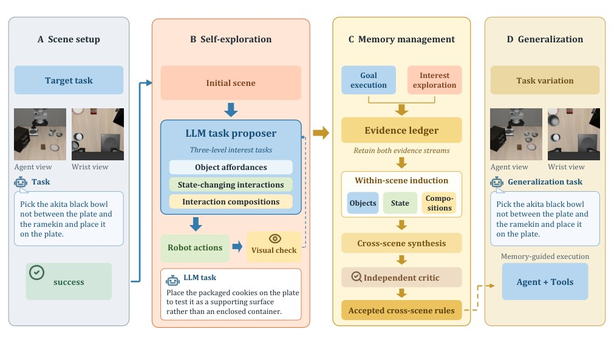
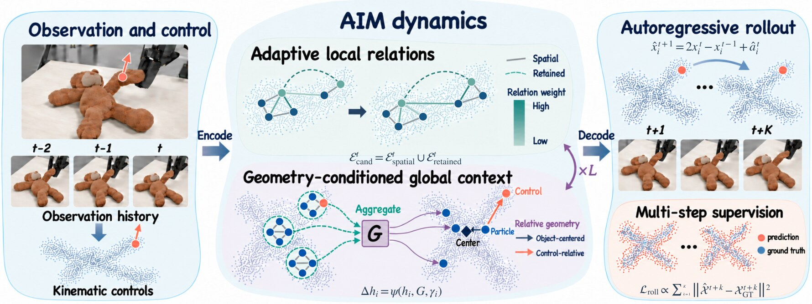
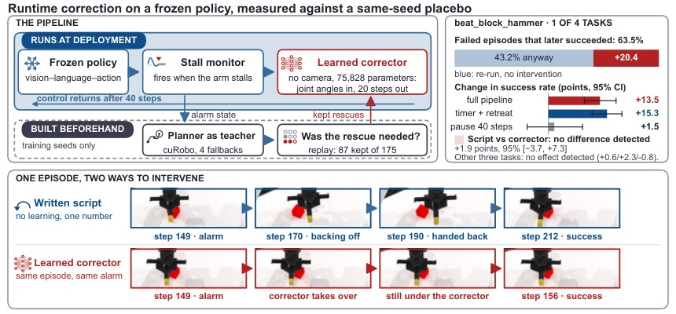

# 2026-10-08 科研日报

## 今日速览

10 月 7 日的具身智能新稿里，最值得连起来读的不是又一条“端到端更强”，而是三种更可检验的闭环：**主动决定该补什么经验**、**把真实软体交互拟合成可迁移的预测模型**、以及**先证明恢复动作超过策略自己的随机重试**。

- **必读 · 主动造经验，而不只反复练原任务：** [ProactiveVLA](#2026-10-08--proactivevla) 在给定任务成功后，用剩余交互预算依次探索物体可供性、状态改变和交互组合；完整轨迹先归档，再跨场景归纳，候选规则还要由独立审查器回看动作与视觉证据。它与 MiracleAug 的交叉点是“由系统决定下一批最有信息量的数据”，但这里仍只有仿真交互记忆，没有生成新场景或真机验证。
- **必读 · 软体 Real-to-Sim：** [AIM](#2026-10-08--aim) 不再把“当前距离近”当作粒子间唯一关系，而是让历史运动决定哪些连接应保留，再用物体级全局状态协调远距离形变。输入是重建的粒子轨迹与控制点运动，输出是后续软体形状；它验证的是记录轨迹上的预测与跨对象/动作迁移，不是闭环策略收益。
- **方法论必读 · 恢复是否真的有效：** [Learned Corrector](#2026-10-08--corrector) 给冻结的 \(\pi_{0.5}\) 加停滞监测和小型关节空间恢复器，却发现四个任务中只有一个显著受益；同一任务里，固定时刻触发的简单退回与学习恢复器没有检测到差异。更关键的是，同种子重跑已能让 43.2% 的原失败样本成功——不设安慰剂会把策略随机性误写成恢复功劳。
- **圈内动态：** OpenAI 把 GPT-6 与可在回答中生成交互组件的 Intelligent UI 推向 ChatGPT；Anthropic 发布低价小模型 Claude Haiku 5.5。两项均有首日使用反馈，但目前多是体验与价格讨论，不能当成独立能力复现。

## 主动补经验：从任务细化走向场景知识采集

### ProactiveVLA · arXiv · 2026-10-07

**一句话判断：** ProactiveVLA 的关键不是再训练 VLA，而是让高层 Agent 在部署前有限的交互预算里主动提出“值得试”的小目标，把成功、失败和恢复过程压成有证据链的规则，再用这些规则指导冻结策略；它把“缺什么经验”从人工指定推进到 Agent 主动采集。

**Title：** ProactiveVLA: Augmenting Embodied Memory through Proactive Environment Exploration  
**作者：** Shizuo Tian、Haodong Luo、Yutong Li、Yuebing Song、Yunxin Liu、Yuanchun Li。  
**单位：** 清华大学；同济大学。  
**发表时间 / 投稿信息：** arXiv v1 提交于 2026-10-04，进入 2026-10-07 新稿公告；未标明会议投稿。  
**链接：** [摘要](https://arxiv.org/abs/2610.06999) · [HTML 全文](https://arxiv.org/html/2610.06999v1) · [PDF](https://arxiv.org/pdf/2610.06999)

**摘要中译：** 冻结的视觉—语言—动作模型（VLA，即从图像与语言指令直接产生机器人动作的策略）可被高层 Agent 当作一个可调用的操作原语，但在新环境中，反复练同一目标只会把经验集中在一条熟悉路线。ProactiveVLA 先完成环境给定的任务，再把剩余交互次数用于自主探索物体用途、状态改变和交互组合；系统用视觉检查器验证结果，并把任务经验与探索经验合并为部署时可调用的全局记忆。

**问题、输入与输出。** 输入是一处新场景、一个初始任务，以及每个适应实例最多 \(B\) 次 Agent 交互的预算。高层 Agent 能调用移动、调整姿态、夹爪控制和冻结 VLA 等机器人原语。输出不是新策略权重，而是一份冻结的全局记忆 \(\mathcal{M}_{\mathrm{global}}\)：其中只保留经证据审查通过的物体用途、动作效果、前置条件和组合规则。评测时 VLA 与记忆都不再更新。

**方法与信息流。** 

1. **先取得任务相关锚点。** Agent 先用 \(b_{\mathrm{init}}\) 次交互尝试给定任务 \(g_0\)，记录动作、视觉结果、成功、失败与恢复。这样自主探索不会完全脱离当前场景与可用控制器。
2. **按三层目标花掉剩余预算 \(B-b_{\mathrm{init}}\)。** 第一层测物体可供性，也就是“这个物体允许什么动作”，例如抓碗或开抽屉；第二层测能改变场景状态的操作，例如把碗稳定放进已打开的抽屉；第三层只把已经验证的原子操作组合成长任务。三层顺序让组合规则建立在可观察的小证据上，而不是自由聊天式地乱试。
3. **独立视觉核验并继续探索。** 每个自拟目标完成后，另一个视觉检查器只根据目标描述和结果图像判断成功、失败或证据不足；普通失败不重置场景，Agent 从当前状态换策略继续。完整记录不丢弃，因此恢复动作和不确定结果也能进入后续审查。
4. **归档、原子化、跨场景归纳。** 全轨迹先进入证据档案 \(\mathcal{E}\)，再切成带来源指针的经验单元；场景内分别归纳物体、动作和组合知识，随后跨场景合成候选规则。独立 critic 再回看候选规则是否真的被动作记录与视觉评估支持，只有通过者进入 \(\mathcal{M}_{\mathrm{global}}\)。
5. **部署时把记忆当条件，不改低层策略。** Agent 把当前观测、任务指令与全局记忆放在同一上下文中，选择并细化机器人原语；冻结 VLA 负责接触丰富的低层动作，解析、重定位和解析式移动可由其他工具完成。

*原论文图 1（[来源](https://arxiv.org/html/2610.06999v1)，此处仅转换图片格式）。左侧把剩余交互预算分配给三层可验证探索；右侧先保留完整证据，再做场景内归纳、跨场景合成和独立复核。图中“frozen”很重要：收益来自经验选择与组织，不是微调 VLA。*

**结果、成本与局限。** LIBERO-Pro 是对任务目标、物体绑定和位置作受控改变的仿真操作基准；八个设置的平均成功率由 Harness VLA 的 72.1% 升到 76.4%，Goal-T（目标重定向）为 75%→88%。当评测最多只准调用一次 VLA 原语时，Goal-T 完成率为 48%，基线为 19%。RoboCasa365 Composite-Seen 的 16 个多步厨房任务上，平均为 41.3% 对 30.0%，但 ProactiveVLA 每任务只有 5 次 rollout，样本量应谨慎解读。去掉三层目标结构后，Goal-S 成功率从 71% 降到 42%，比去掉初始任务或记忆整理的退化更大，支持“探索内容比单纯多交互更重要”的解释。全部实验仍在仿真中；视觉检查器可能误判，且尚未证明记忆能承受真机感知、动力学与执行噪声。

**与 MiracleAug 的关系。** 两者都想把昂贵交互预算用在最值得补的部分。ProactiveVLA 提供了一个可复用的“采什么”合同：原子可供性 → 状态改变 → 组合任务 → 独立证据审查；MiracleAug 更偏“怎样生成带同步动作的数据与可编辑场景”。可借鉴的是让增强目标必须落到可观察状态变化和证据链，而不是直接相信 Agent 的语言总结。尚缺的验证是：探索发现的薄弱条件能否转成物理有效的场景/轨迹增强，并在真机闭环里带来策略收益。

## 可变形 Real-to-Sim：局部关系随形变更新，全局状态协调远端响应

### AIM · arXiv · 2026-10-07

**一句话判断：** AIM 把软体数字孪生中的两个常见误差源拆开处理：局部上，粒子拉开后仍可能保持材料关系；全局上，一处拉扯会改变整块布或软物体。它用历史自适应边和物体级全局 token 同时建模两者，换取更稳的长时预测。

**Title：** AIM: Adaptive Interaction Modeling Networks for Real-to-Sim Soft-Body Simulation  
**作者：** Tiancheng Yang、Dingshuo Chen、Tianle Chen、Zhaocheng Liu、Qiang Liu。  
**单位：** 中国科学院自动化研究所模式识别国家重点实验室（NLPR）与多模态人工智能系统全国重点实验室（MAIS）；中国科学院大学；独立研究者。  
**发表时间 / 投稿信息：** arXiv v1 提交于 2026-10-05，进入 2026-10-07 新稿公告；未标明会议投稿。  
**链接：** [摘要](https://arxiv.org/abs/2610.07116) · [HTML 全文](https://arxiv.org/html/2610.07116v1) · [PDF](https://arxiv.org/pdf/2610.07116)

**摘要中译：** 可变形物体操作不仅要预测整体位移，还要预测局部形状如何随接触扩散。只按当前空间距离连图会漏掉被拉开的材料联系，也会把临时靠近的点误当作强相互作用；纯局部消息传递又难协调物体远端。AIM 从运动历史和几何自适应推断粒子关系，并用几何条件化的全局通信同步物体级响应；统一控制点接口表示人手或机器人夹持，模型用自身预测状态做多步自回归训练。

**问题、输入与输出。** 输入是连续数帧重建得到的物体粒子位置、粒子属性，以及手/夹爪等运动学控制点的规定轨迹；“运动学”在这里表示控制点位置由记录或机器人命令直接给定，网络只预测物体怎样响应。输出是每个物体粒子下一帧的位置，反复迭代便形成整段软体运动。外观高斯用于渲染评估，不是 AIM 动力学网络本身的训练输出。

**方法与原理。** 

1. **候选连接同时看现在与过去。** 当前半径邻居形成 \(\mathcal{E}^{\mathrm{spatial}}_t\)，上一步高置信连接形成 \(\mathcal{E}^{\mathrm{retained}}_{t-1}\)，两者并集为

   \[
   \mathcal{E}^{\mathrm{cand}}_t=\mathcal{E}^{\mathrm{spatial}}_t\cup\mathcal{E}^{\mathrm{retained}}_{t-1}.
   \]

   这样布料被拉开时，原来有用的联系不会仅因距离超过半径立刻消失；但旧连接仍要按当前状态重新打分，不是永久绑定。
2. **用历史描述符判定哪些边真正传消息。** 每个粒子描述符包含相对物体平均运动的近期位移、邻域距离/度数，以及最近控制点的相对位置。网络比较一对粒子在多个可学习特征通道上的相似度，得到关系嵌入 \(\mathbf q_{ij}^t\) 与置信度 \(p_{ij}^t\)；低于阈值的边被置零，高置信边才参与消息传递。控制点—粒子边则按接触半径每步重建，权重固定为 1。
3. **局部消息与物体级全局 token 交替。** 加权边消息先更新附近粒子；全局 token 汇总物体粒子、控制点，以及整体平移和绕物体中心的运动矩。再根据每个粒子相对物体中心和最近控制点的位置，把全局信息有区别地送回粒子。这个“先聚合、再按几何分发”让远端能协调，但不会把同一全局残差无差别加到所有点上。
4. **解码加速度并自回归展开。** 网络预测离散加速度 \(\hat{\mathbf a}_i^t\)，再用

   \[
   \hat{\mathbf x}^{t+1}_i=2\mathbf x_i^t-\mathbf x_i^{t-1}+\hat{\mathbf a}_i^t
   \]

   得到下一帧位置。训练时连续展开 \(K\) 步，下一步吃的是模型自己的预测而非真值回填；损失是各步预测位置与真值的均方误差，梯度贯穿完整 rollout，从而直接惩罚早期小误差在长时序中的放大。

*原论文图 2（[来源](https://arxiv.org/html/2610.07116v1)，此处仅转换图片格式）。上方“adaptive particle relations”决定哪些局部粒子仍应通信；下方“geometry-conditioned global communication”把整物体状态按粒子—控制点几何重新分发；右侧加速度积分产生下一帧，再送回历史窗口。*

**结果、成本与局限。** PhysTwin 提供真实多视角人—物交互与重建外观，PGND 覆盖布、绳、毛绒、盒、纸袋和面包六类机器人交互。PhysTwin 未来预测中，AIM 相对 PhysTwin 的对应点跟踪误差降低 20%；37 步无真值回填的 PGND rollout 在第 30 步平均位移误差约低 23%。跨动作、跨物体和 PGND→PhysTwin 的机器人到人类操作迁移均保持冻结动力学模型。网络约 317 万参数、三帧历史、10 层消息传递；作者报告的训练从头开始，PhysTwin 单场景设置为 2 万次更新。边关系没有物理参数或守恒定律监督，模型也不保证任意长时间稳定；它依赖重建粒子状态和控制点跟踪，遮挡或轨迹误差会直接进入动力学。没有撕裂等拓扑变化，也没有闭环机器人策略实验。

**与 MiracleAug 的关系。** AIM 补的是“视觉资产之后，物体怎样动”这一层：若数据增强涉及布料、软包装或食物，简单刚体重放不够。它的控制点接口可把不同人手/夹爪操作统一成外部驱动，但输入仍要求可靠的粒子重建和控制轨迹；没有从视频自动恢复材料、接触或碰撞几何。与公开 MiracleAug 流程的重合在 Real-to-Sim 与轨迹同步，新增价值是可变形动力学；缺口是真机闭环、物理守恒与陌生材料验证。

## 恢复评测：别把随机重跑写成“被救回来”

### Learned Corrector · arXiv · 2026-10-07

**一句话判断：** 这篇最有价值的不是恢复网络，而是评测纪律：同一初始种子、同一触发与交还规则下，比较学习恢复、脚本退回和纯基线重跑；结果显示复杂恢复器只在一个任务有效，而且没有证据胜过简单退回。

**Title：** Does a Learned Corrector Beat a Simple Retreat? Evidence from a Frozen VLA  
**作者：** Chenchao Sheng、Zhuang Jiang、Liuhaichen Yang、Ningwei Bai、Zezhi Tang。  
**单位：** University College London。  
**发表时间 / 投稿信息：** arXiv v1 提交于 2026-10-02，进入 2026-10-07 新稿公告；未标明会议投稿。  
**链接：** [摘要](https://arxiv.org/abs/2610.06921) · [HTML 全文](https://arxiv.org/html/2610.06921v1) · [PDF](https://arxiv.org/pdf/2610.06921)

**摘要中译：** 冻结 VLA 的动作采样本身具有随机性：同一场景重新跑一次，原先失败的 episode 可能自然成功。因此，“失败后介入并成功”不等于介入有效。本文在四个 RoboTwin 2.0 双臂任务上，为每个测试种子成对运行有/无恢复，并加一条同种子基线重跑作安慰剂；再在完全相同的触发和 40 步交还规则下，对比学习恢复器与脚本退回。

**方法与原理。** 

1. **触发。** 每个任务先从训练成功轨迹的完成步数第 75 百分位数 \(p_{75}\) 得到阈值 \(T=\max(100,\lfloor1.2p_{75}\rfloor)\)。复杂监测器在 \(T\) 后检测窗口内速度是否塌缩；简单基线只在固定时刻 \(T\) 触发。
2. **训练期特权教师。** 停滞时，教师能读取部署期拿不到的仿真真值，并用 cuRobo 依次尝试当前状态重规划、短退回后重规划、回到双臂 home 后重规划，以及任务特定扶正动作。教师只用于收集恢复轨迹，不直接部署。
3. **反事实准入。** 对同一个报警状态，分别重放两个“不救援、继续基线”的分支和一个救援分支，各三次。只有当两个无救援分支各至多成功一次、而救援分支至少成功一次时，才把该恢复样本收入训练集。175 条候选中保留 87 条；被拒的都是基线能自行恢复的情况。
4. **蒸馏与简单对照。** 75,828 参数的多层感知机只读 14 个关节角，输出接下来 20 步双臂关节角；均方误差监督来自准入后的教师轨迹。触发后它接管两个 20 步 chunk，再把控制权交回冻结 \(\pi_{0.5}\)。脚本退回与它使用同一交还规则，只把关节线性插值回 120 步前的构型，不学习也不规划。
5. **安慰剂校正。** 记基线成功率为 \(b\)，恢复把原失败救成成功的比例为 \(\rho\)，把原成功弄失败的比例为 \(\beta\)，则净收益恒为

   \[
   \Delta=\rho(1-b)-\beta b.
   \]

   同种子基线重跑得到 \(\rho_0,\beta_0\)，其净收益按定义为零。用 \(\rho-\rho_0\) 和 \(\beta-\beta_0\) 才能区分恢复动作与策略随机“自愈”。

*原论文图 1（[来源](https://arxiv.org/html/2610.06921v1)，此处仅转换图片格式）。左边区分训练期特权模块与部署期可见模块；右边先扣除基线重跑的 placebo，再比较学习恢复器和脚本退回。底部同一次报警后的两条轨迹说明“如何退”不同，但评测必须共享触发与交还条件。*

**结果、成本与局限。** 四任务共 3,888 个成对 episode。`beat_block_hammer` 上学习恢复使成功率净增 13.5 个百分点，95% 区间为 \([9.4,17.7]\)；其原失败中 63.5% 在介入后成功，但单纯重跑也有 43.2% 成功，所以安慰剂校正后的“额外救回”是 20.4 个百分点。其余三个任务均未检测到净增益。`beat_block_hammer` 上监测器+脚本退回、定时器+脚本退回分别净增 14.9 和 15.3 个百分点，与完整学习管线没有检测到差异；预注册的等价判据又没有在所有比较口径下稳定满足，因此正确表述是“未检测到学习器更好”，不是“已证明完全等价”。实验只有 RoboTwin 仿真、一个冻结策略和四个任务；复杂恢复器仍可能在视觉条件、真机扰动或更开放失败上有价值，但本稿没有证据支持外推。

**与主线的关系。** 对失败驱动造数，这是一个很硬的最低对照：每条“救援数据”先问若不干预会不会自行恢复；上线前还要把学习恢复器与同触发、同持续时间的退回/重试脚本比较。对 MiracleAug，生成更多失败—恢复轨迹不自动等于有用：若简单退回已覆盖增益，Agent 应优先把预算投向简单动作救不了的失败模式。

## 圈内新闻与社区反应

### GPT-6 进入 ChatGPT，并生成原生交互界面 · 2026-10-07

**已核实事实：** OpenAI 发布 [GPT-6 and Intelligent UI for everyone](https://openai.com/index/gpt-6-for-everyone/)。Intelligent UI 让 ChatGPT 在回答中组合文本、图片、按钮、表单、图表和小工具；官方说明它基于原生可流式组件库和编译器，界面可随模型生成逐步出现。Plus / Pro / Business / Enterprise 当日开始在 Chat 标签页推送，Free / Go 次日开始；Work 与 Codex 的底层模型不随此次更新。官方公开的是产品行为与训练目标，没有披露可复现的界面规划网络、奖励数据或编译器实现。

**社区与实测：** [WIRED 当日短测](https://www.wired.com/story/openai-chatgpt-intelligent-ui-is-more-show-than-tell)认为可交互解剖图、住房计算器和座位图有实用性，同时提醒生成式界面会把更多设计判断交给模型。[r/ChatGPT 当日发布帖](https://www.reddit.com/r/ChatGPT/comments/1x05fj7/gpt6_and_intelligent_ui_now_rolling_out_in/)里，有用户贴出自动生成的账单价格变化仪表盘并称其观感流畅，也有人报告首日仍未收到推送、担心图表过度出现或旧模型被替换。这些是少量首日体验，不能概括为用户共识。

**编辑判断：** 对 Agent 工作流，变化不只是“回答更好看”，而是最终产物可以是可操作界面；但界面正确性仍取决于底层数据、计算与交互状态是否可验证，视觉完成度不能替代测试。

### Claude Haiku 5.5：把小模型推向高频子 Agent · 2026-10-07

**已核实事实：** Anthropic 发布 [Claude Haiku 5.5](https://www.anthropic.com/claude-haiku-5-5)，定位高吞吐、成本敏感的总结、压缩、查询、分类、浏览器操作和子 Agent。官方标价在提示不超过 100k token 时为每百万输入/输出 token 0.10 / 0.50 美元，超过后为 0.50 / 2.50 美元；并称平均单任务成本较 Haiku 4.5 低约 75%。官方报告 OSWorld 2.1 离线子集 72.4%、Terminal-Bench 4.0 为 39.2%，但这些仍是厂商评测；模型可在 Anthropic、AWS、Google Cloud 与 Azure 使用。

**社区反应：** [Hacker News 当日讨论](https://news.ycombinator.com/item?id=49996437)的分歧集中在 100k token 分档：有人认为短摘要、检索辅助和明确子任务足以留在低价档，也有人指出长上下文 Agent 很快越过门槛，实际价格会高于首页图表给人的第一印象；另有评论提醒新 tokenizer 会改变“同一文本有多少 token”。这是一组开发者观点，不是独立基准。

**编辑判断：** Haiku 5.5 更像把“强模型规划、便宜模型做窄子任务”的层级 Agent 变得经济，而不是替代大模型处理完整长程编码；使用前应按真实上下文长度、缓存命中与每任务总 token 计价。

### 图形学与具身社区补充

10 月 7 日已检查图形学、具身智能、LLM 与 Agent 四个领域。图形学/具身侧的高信号主要集中在本期论文新稿；截至写作时未找到 ProactiveVLA、AIM 或 Learned Corrector 的独立复现与可靠社区使用反馈，因此不把作者演示、摘要转发或点赞量写成“社区认可”。Blender 5.3 原生 3DGS 与 ASTRA 对标仓也未出现相对近期日报的实质公开更新，故不重复占篇幅。

## 覆盖说明

- **日报日期：** 2026-10-08；**内容覆盖日：** 2026-10-07（arXiv 周三新公告与当日产品/社区动态）。
- 三篇论文均阅读 HTML 全文的方法、关键实验与局限；配图均为论文原始方法总览图，并附图号、来源与中文解释。实验数字均为作者报告，未作独立训练、仿真或真机复现。
- 已核对 notes、blog、academic 与 ASTRA 的最新公开提交状态；相对上一成功检查没有新的相关正文增量。兴趣校准只使用可公开方向，未公开笔记、个人实验与提案未写入本期或公开 meta。
- 新闻事实以官方公告为主；社区段落只引用 2026-10-07 的原始讨论或当日实测，并明确其证据级别。

**编写：** Neon
