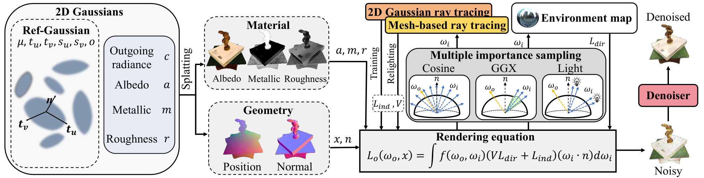
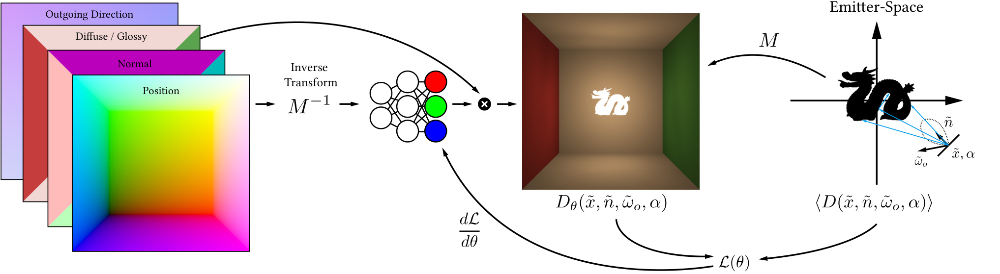

# 2026-10-09 科研日报

## 今日速览

今天把重点放回**从真实照片分离几何、材质和光照，得到能换光、能编辑的资产**。没有找到适合展开的 10 月 8 日高斯逆渲染新稿，因此不凑“主线日更”：补读一篇已有工作的方法边界，再接一篇近期光照加速论文。

- **必读 · 换光之前，先问缓存里存的是什么：** [IRGS++](#2026-10-09--irgs-plus-plus) 用可微二维高斯光线追踪，在训练光照下查询可见性与间接辐射；换光后，这份辐射不能照搬，系统改查表面材质并用新环境光近似着色。金属建模、反射场景初始化、采样与网格查询各解决不同问题，不能把最终帧率统称为“逆向优化提速”。
- **选读 · 连接收表面的积分一起预计算：** [Neural Emission Fields](#2026-10-09--nef) 把复杂光源照到某个位置、法线和材质上的直接光照，提前学成可查询的神经场。一次查询取代运行时积分，但光源内部配置与接收材质模型受到约束，外部遮挡仍要另算；这是一种可移动的光源资产，不是照片逆向重建方法。
- **圈内动态：** Google 宣布跨应用、可持续执行的 Gemini 企业 Agent；RizomUV 2027 加入无界面批处理和跨平台脚本连接；RobotX 发布 Xmind 计算与控制单元。发布说明、社区的首日疑问和实际使用证据分别写清。

两篇连读的价值是：**“省掉光路计算”可能来自减少采样、替换查询表示，或把积分预先学进模型。三者的适用条件、误差和梯度代价不同。**

## 高斯逆渲染：训练辐射与换光查询要分开

### IRGS++ · arXiv · 2026-07-24

**一句话判断：** 值得深读的是它如何把反射场景初始化、表面高斯追踪和有限采样连接起来；真实场景的可信资产质量、独立反向耗时与复杂室内边界仍缺少充分量化。

**Title：** Inter-Reflective Gaussian Splatting for Robust and Efficient Inverse Rendering  
**作者：** Chun Gu、Xiaofei Wei、Zixuan Zeng、Yuxuan Yao、Li Zhang。  
**单位：** 复旦大学；上海创智学院（Shanghai Innovation Institute）。  
**发表时间 / 投稿信息：** arXiv v1 于 2026-07-24 提交；摘要页未标明正式录用信息，PDF 的期刊版式不作为录用证明。  
**链接：** [摘要](https://arxiv.org/abs/2607.22780) · [HTML 全文](https://arxiv.org/html/2607.22780v1) · [PDF](https://arxiv.org/pdf/2607.22780v1)

**为何重提：** [9 月 8 日](#2026-09-08--irgs-pp)仅把它列为新兴趣线索。本次按真实场景逆渲染方向补读方法、训练与重光照差异及关键实验，不把旧论文当成今天的新发布。

**摘要中译：** 可信的逆向渲染需要用可见性和间接光解释表面之间的互相反射，但为光栅化设计的高斯表示不天然支持这些次级光线查询。IRGS++ 在朝向表面的二维高斯上进行可微光线追踪，优化时实时查询遮挡和间接辐射，并计算渲染方程。系统进一步加入金属材质模型和适合高光表面的初始化；用多重重要性采样——按不同光照与反射结构分配采样方向——降低有限样本的噪声；在换光展示时加入降噪与网格查询。合成基准报告了分解、重光照质量及不同配置下的质量与速度取舍，真实数据展示了合理的换光外观。

**问题、输入与输出。** 普通三维高斯泼溅可以把照片拟合得很好，却可能把高光“画”进颜色、把间接照明“吸收”进反照率。反照率指材质自身的反射颜色；若它混入当前灯光，换灯后就会出错。这里输入是带相机位姿的多视角 RGB 图像，输出为表面几何、反照率、粗糙度、金属度及环境光。它先运行 Ref-Gaussian：一种为反射场景恢复几何与材质初始化的高斯方法。第二阶段继承位置、朝向、不透明度与材质估计，所以“没有额外传感器深度”也不等于“没有几何先验”；本篇没有专门证明初始化在缺失、错误先验的室内拍摄中仍可靠。

**方法与信息流。**

1. **先得到适合追踪的表面，再把属性送到像素。** 每个二维高斯是一张带中心、两条切向轴和尺度的薄椭圆片，挂有出射辐射、反照率、粗糙度和金属度。光栅化先生成像素位置、法线与材质图，再在这些图上计算物理着色，称为延迟着色：昂贵的光照积分放到可见像素层面。这样不用先对每个高斯分别着色再混合，减少几何与材质混合造成的偏差。
2. **次级光线查询遮挡与当前光照下的辐射。** 从可见表面沿入射方向发射光线，与高斯所在平面求交，按前后顺序累计不透明度和辐射。三维高斯的“沿射线最大响应点”不一定落在真实表面上，二维表面求交则让次级查询与表面几何更一致。实现用包住薄片的二十面体代理建立包围体层次结构（BVH：快速排除不可能命中的区域），再用 OptiX 光线追踪系统找候选；排序缓冲区保存实际交点顺序，并非用代理三角形本身代替高斯表面。
3. **把直接环境光与间接光放回同一个积分。** 光线透过所有高斯的比例给出环境可见性；累计的、已经学到的出射辐射作为间接光。材质用微表面反射模型：粗糙度控制微小表面法线的散布，金属度决定漫反射与带颜色的镜面反射怎样分配。然后按材质、照明与法线计算像素颜色，用照片监督。
4. **把样本花在真正贡献亮度的方向上。** 系统同时采用余弦加权的漫反射方向、GGX 镜面方向与环境图亮区方向。GGX 是这里描述高光微表面分布的模型；粗糙度很低时，高光只占很小的角域，均匀采样容易错过。多重重要性采样用三种分布的混合密度统一校正，降低方差，而不是修改反射模型。
5. **密集拟合外观，稀疏监督物理着色。** 每步在固定光线预算内，只选部分像素计算昂贵的物理积分；光栅化的辐射图仍在全图上接受密集监督。损失还约束照明白平衡及随图像边缘变化的材质平滑性。梯度通过高斯响应和辐射累计回到表示与材质、光照优化；本文没有单列完整反向计算的性能测量。第二阶段再优化 10,000 次。

*原论文图 2（[来源](https://arxiv.org/html/2607.22780v1#S3.F2)，仅转换图片格式）。左侧是带辐射和材质的二维表面高斯；中间光栅化出位置、法线和材质；右侧用三类方向采样计算渲染方程。橙色高斯追踪用于可微训练，黄色网格追踪用于优化后的换光加速。最右侧降噪只用于低采样重光照与可视化，不进入训练监督来替代物理传输。*

核心关系可以写为：

$$
L_o(x,\omega_o)\approx\frac{1}{N}\sum_{j=1}^{N}
\frac{f_r(x,\omega_o,\omega_j)\,[V_jL_{\mathrm{env}}(\omega_j)+L_{\mathrm{ind},j}]\,\max(0,n\cdot\omega_j)}{q(\omega_j)}.
$$

这里 $x$、$n$ 是当前表面的位置与法线，$\omega_o$ 指向相机，$\omega_j$ 是采样入射方向；$f_r$ 是材质的双向反射分布函数（BRDF），说明“某方向来的光有多少反射向相机”；$V_j$ 是环境可见性，$L_{\mathrm{env}}$ 为环境光，$L_{\mathrm{ind},j}$ 为沿次级光线查询的间接辐射。$N$ 是样本数，$q$ 是三类分布按样本比例混合后的概率密度，分母校正非均匀抽样。公式计算的是模型表示下的光照积分；其物理一致性还取决于几何、材质与辐射查询是否正确。

**最需要分清的训练与换光差异。** 训练中的间接项来自当前照明下学到的出射辐射，它压缩了已有外观中的间接照明，不能直接当作任意新灯光下的答案。例如把白灯换成红灯，继续查询旧辐射会把原来的白色反射带回来。IRGS++ 因而在重光照时改查次级表面的可见性、反照率、粗糙度、金属度与法线：未命中表面时用新环境光；命中时用该材质和预滤波的新环境图做 split-sum 近似，即把镜面着色积分拆成可预计算的部分来快速求值。它保留了显式的次级表面查询，但不会在每次命中后递归追踪更多反弹。

优化结束后，再以截断符号距离场（TSDF：融合多视角表面距离来提取网格）得到三角网格，把材质烘焙到顶点；换光时一次最近三角形命中与顶点属性插值，代替沿光线累计许多高斯。网格版本的环境可见性是命中 / 未命中的二值量，高斯版本则是连续透射比例，转换仍有误差。**因此网格加速发生在换光查询阶段，训练仍用可微高斯追踪。**

**实验、成本与局限。** 下列数字来自作者实验，不是独立复现。PSNR 是由图像均方误差换算的峰值信噪比，越高越好；它不直接证明材质或几何正确。

- **低高光合成基准 TensoIR：** 四个对象用于分开评测新视角、法线、反照率与换光。相对 IRGS，IRGS++ 的反照率 PSNR 从 33.42 到 33.95 dB，512 样本重光照从 30.63 到 32.12 dB；新视角 PSNR 却从 35.52 降到 35.15 dB。平均法线角误差从 3.998° 到 3.980°，网格转换后为 4.260°。更好的换光图与几何提升不能混为一个结论。
- **高光、金属合成基准 GlossySynthetic：** 八个场景平均重光照 PSNR，IRGS 为 21.37，IRGS++ 512 样本为 25.16，16 样本为 25.08 dB；非高斯方法 NeRO 为 26.63 dB，不能宣称全面超过所有基线。此处 IRGS 也用 Ref-Gaussian 初始化，以减少初始化失败造成的混杂。
- **采样消融有明确针对性：** Teapot 场景中，无多重重要性采样即使用 1,024 个样本，PSNR 仍只有 16.15 dB；16 样本的完整方法为 23.55 dB。这支持“高光方向分配比单纯堆样本重要”，但不是所有场景统一的倍数。
- **效率要拆开看：** 完整流程作者报告 RTX 3090 上约 40 分钟、约 10 GB 显存；高光基准的训练时间表列 IRGS 1 小时、IRGS++ 0.7 小时。重光照帧率为 IRGS 0.5 FPS、IRGS++ 高质量 1.5 FPS、低采样配置 25 FPS。最后的 50 倍包含从 512 到 16 样本、降噪与网格后端的配置变化，不能当成等采样、等误差的独立前向或反向加速；全文未给出匹配质量的端到端时间曲线和前向 / 反向耗时拆分。
- **真实数据仍以定性证据为主：** RefReal、GlossyReal、StanfordORB 提供照片对象的分解与换光展示；针对无界几何，次级光线查询限制在预定义球形区域内。它没有建立“不完整室内外围几何也能稳定还原中心对象材质”的定量保证。薄片和复杂细节还可能在网格提取时丢失。

**值得关注：** 可复用的思想是把密集外观监督与昂贵的稀疏物理监督分工，并把采样、表示与换光近似分别评估。对于真实拍摄资产，应进一步检查不同视角下的几何一致性、材质是否吸收原光照、照明变化后误差及网格导出可用性；本文已有合成分解证据，但不能由真实换光看起来合理就补出这些结论。

**相关链接与版本：** [IRGS 原版项目](https://fudan-zvg.github.io/IRGS/) · [官方仓库](https://github.com/fudan-zvg/IRGS) · [原版论文](https://arxiv.org/abs/2412.15867)。仓库 README 仍以 CVPR 2025 的 IRGS 标题说明实现，也提供 Ref-Gaussian 初始化入口；这里未核实它完整对应 IRGS++ 的全部采样、材质和换光配置，不能把原版代码入口写成已经确认的 ++ 全量复现。

## 光照预积分：把昂贵计算移到离线，也把条件写进资产

### Neural Emission Fields · arXiv · 2026-10-05

**一句话判断：** 它缓存的是接收表面已经积分后的直接光照，因此运行时省得更多，代价是比“光源出射辐射场”更依赖接收材质模型和已训练光源配置。

**Title：** Real-time Rendering of Pre-integrated Neural Emitters  
**作者：** Arno Coomans、Floor Verhoeven、Edoardo A. Dominici、Markus Steinberger。  
**单位：** Graz University of Technology（奥地利）；Huawei Technologies（瑞士、奥地利）。  
**发表时间 / 投稿信息：** arXiv v1 于 2026-10-05 提交，本期作为近期积压补读；未核实正式录用，稿件模板不作为录用依据。  
**链接：** [摘要](https://arxiv.org/abs/2610.06762) · [HTML 全文](https://arxiv.org/html/2610.06762v1) · [PDF](https://arxiv.org/pdf/2610.06762v1)

**摘要中译：** 带遮挡外壳、高面数发光几何、空间变化发光或形变的复杂光源，是实时直接光照的瓶颈。解析方法只适合简单形状；采样方法要用许多样本消除噪声；代理光源即使预存出射辐射，运行时仍需积分。神经发光场（Neural Emission Fields，NEF）把光源周围的直接照明预先学进一个由位置、法线、观察方向和材质参数决定的场。漫反射和高光两个分支让每个着色点只需一次查询，就得到未受场景外部遮挡的直接照明。训练在光源局部坐标系中完成，光源可整体移动并跨场景复用；内部互反射、自遮挡、变化发光与预设形变可以进入训练表示。

**问题、输入与输出。** 假设已有一盏灯的几何、发光分布、外壳以及内部材质，而不是从未知照片猜灯。目标是把它放到不同场景里，快速回答“这里一块朝向某方向的表面会被照成什么颜色”。传统辐射代理只回答“从灯的这个位置、这个方向射出多少光”，接收表面还得遍历方向并乘上自身 BRDF。NEF 把这最后一步也学掉，输出是指定接收反射模型下的直接光照。它不恢复未知物体几何、材质或环境光，也不等价于通用全局光照缓存。

**方法与信息流。**

1. **用光源局部坐标固定学习问题。** 把接收点位置、法线与观察方向通过光源变换的逆变换映射回灯的坐标系。因此灯整体平移、旋转时，查询仍落到同一个场。方法支持整体刚性变换及均匀缩放；非均匀缩放和剪切不在支持范围内。光源周围训练区域是按其尺度定义的包围盒，区域外采用边界查询加距离平方衰减的启发式，不是任意距离都保证准确的完整求解。
2. **分别表示漫反射和高光接收响应。** 漫反射分支输入位置和法线；高光分支再接收反射方向与 GGX 粗糙度。位置及反射方向使用多分辨率哈希编码：在不同网格尺度查可学习特征，再交给每支四层、每层 128 单元的多层感知机。漫反射 / 镜面颜色系数放到网络外相乘，接收物体纹理因此不用全部重新训练。但改变反射模型不能仅靠替换一个颜色系数解决。
3. **路径追踪生成监督，网络拟合已积分结果。** 在包围盒内采样位置、可见半球内的法线、观察方向与粗糙度，路径追踪计算目标颜色，把灯内部反弹与自遮挡也计入。默认每个目标用 64 个样本；生成这些目标的时间算在训练成本内。网络优化相对平方误差，避免明亮区域支配全部学习，Adam 学习率从 $10^{-3}$ 起并余弦衰减。
4. **运行时从场景缓冲区直接查场。** 几何缓冲区提供可见像素的位置、法线、观察方向与材质参数；转换到光源局部坐标后查询两支网络，再乘接收表面的颜色系数。多个独立光源场分别查询并相加，成本随场的数量增加。预设动态灯可额外输入时间，以八频带傅里叶编码表示动画状态；它不是遇到任意新形变都能自动正确泛化。
5. **把外部遮挡另外接回来。** 光源自身外壳遮挡已学进模型，后来放入场景的桌子、墙或人物没有。硬阴影可另发阴影光线；软阴影使用遮挡与无遮挡估计的比值，再对可见性降噪。这样“低噪声神经照明”与“场景可见性”仍是两项工作。

*原论文方法图：HTML 图 1、PDF 图 2（[HTML 来源](https://arxiv.org/html/2610.06762v1)，仅转换图片格式；两个版本图号不同）。左侧像素的位置、法线、材质与出射方向经 $M^{-1}$ 转入光源坐标；右侧在该坐标系中生成积分监督；网络预测与监督比较后更新权重。部署保留坐标变换与网络查询，训练用的路径追踪不必每帧重做。*

训练损失的核心是：

$$
\mathcal L(\theta)=\mathbb E\left[
\frac{\left(D_\theta-\widehat L_o\right)^2}
{\operatorname{sg}(D_\theta)^2+0.01}
\right].
$$

$D_\theta$ 是神经场对当前接收配置预测的颜色，$\widehat L_o$ 是路径追踪积分目标，$\theta$ 是网络与编码参数；$\operatorname{sg}$ 表示停止梯度，分母用于按亮度重新加权，而不让网络通过改变分母来逃避误差。常数防止暗处除数趋近零。此处反向传播训练的是光照近似器；本文没有给出把它嵌入未知场景逆向优化后，几何、材质、光源参数梯度仍可靠的实验。

**一个帮助理解的例子。** 一盏带镂空灯罩的灯放到新桌面上，NEF 已经学过光如何在灯罩内部反弹，再照到周围不同法线的表面，因此无需每帧重走灯内复杂光路；但后来在桌面上放一本挡光的书，书的阴影仍需场景可见性计算。若拆掉灯罩或让一组灯任意独立移动，原先学到的配置不再成立，不能只更新整体变换就结束。

**实验、成本与局限。**

- **耗时范围明确：** RTX 4090 上，1920×1080 的独立直接照明查询，漫反射约 1.2 ms，高光约 2.5 ms；不包含完整场景所有渲染步骤。每个光源场约占 15 MB / 30 MB，训练从简单灯约 1 分钟到复杂灯约 3 小时，包含监督生成。简单四边形灯的解析方法和线性变换余弦近似（LTC：把标准余弦分布变形来快速积分区域灯）只需约 0.03 / 0.07 ms，NEF 的优势主要针对复杂光源，而非一律取代解析着色。
- **有匹配误差对照，但任务受限：** Cornell Box 室内盒子场景里，把 1,000 个相对位置固定的点光源当作一个组合灯，用 FLIP 比较图像感知差异，数值越低越好。时空重采样直接光照方法 ReSTIR DI 约需 256 样本 / 像素；加降噪后约需 32 样本 / 像素，达到 NEF 的固定误差水平。训练成本没有计入逐帧时间；更多样本时采样方法可超过神经近似的精度，并且支持任意逐灯运动。
- **不要把单场景样本数写成普遍加速倍数：** 镂空球灯的理想辐射代理即使每次查询免费且无噪声，仍需约 734 次采样才能达到一次 NEF 查询的误差。它说明“只缓存辐射仍要积分”的代价，不代表所有灯或所有 GPU 都加速 734 倍。
- **失效与证据缺口：** 极窄开口会让监督路径大多得到零值，训练信号稀疏；非常接近镜面的材质更困难，论文训练粗糙度范围为 $[0.1,1]$。光源组的任意独立运动需要重训，多场查询成本线性增长。没有照片重建、材质准确性或逆向优化收敛评测，也没有独立反向时间与逆向端到端显存报告。

**值得关注：** 这是“预积分可以省到哪一步”的清晰例子。与 IRGS++ 的学习辐射查询相比，它进一步把接收 BRDF 纳入场的条件；收益来自离线摊销，限制也来自这些条件。研究可编辑资产时，需要先决定允许改变什么——整体灯的位置、接收纹理、粗糙度，还是灯的几何与内部材质——再判断缓存能否复用。

**相关链接：** 本次未核实与该版本对应的公开代码或独立复现；全文和实验以作者上述 arXiv 入口为准。

## 连起来看：缓存的条件决定编辑范围

| 工作阶段 | 查询存了什么 | 换光 / 编辑时要做什么 | 主要速度证据 |
| --- | --- | --- | --- |
| IRGS++ 训练 | 当前光照下的高斯出射辐射与连续遮挡 | 光照改变后不能直接沿用辐射项 | 总训练时间；未拆前向与反向 |
| IRGS++ 重光照 | 次级表面材质、法线与可见性 | 新环境图近似着色；可换网格查询 | 不同采样配置的重光照 FPS |
| NEF 部署 | 指定接收模型下，复杂光源的已积分直接照明 | 整体变换可复用；外部遮挡另算，未训练灯内变化需重训 | 独立直接照明毫秒数、有限任务的匹配感知误差 |

**编辑判断：** 这些公开方法已经分别展示了辐射代理、查询后端和预积分的用途，但“照片拟合好”“换光图好看”“未知室内场景得到可信材质资产”是不同证据层级。比较效率时，至少同时列出硬件、误差目标、采样与降噪配置、预计算成本、反向路径及输出资产；缺项就保留缺项。

## 圈内新闻与社区反应

### Google 宣布 Gemini 企业 Agent：跨应用持续工作，首日仍多是接入疑问

**事实与厂商主张（2026-10-08）：** [Google Cloud 公告](https://cloud.google.com/blog/products/ai-machine-learning/welcome-to-gemini-at-work-2026)把 Gemini 定位为统一的工作 Agent：接收目标、调用工具、执行代码，并连接 Workspace 与外部工作系统；官方称任务可在云端持续数小时或数天，能编排子 Agent，支持 Gemini 与 Claude 模型选择。它是企业工作产品层面的发布，不能由此推断底层模型、记忆训练方式或长任务成功率。公告没有提供统一独立评测。

**社区反应（2026-10-08 原帖）：** [Reddit r/GeminiAI 讨论](https://www.reddit.com/r/GeminiAI/comments/1x0vmzz/gemini_at_work_2026_introducing_gemini_agent/)中，Sibbaboda 询问是否面向个人订阅，opmgyhx 对尚待开放的措辞表示不耐烦。这些是可回溯的发布反应，不能写成亲测失败或社区共识；暂未找到可核实的长任务实际使用复现。

**编辑判断：** 对跨应用 Agent，值得跟进的是任务中断后能否正确恢复、身份与权限怎样落地，而非仅看是否拥有更多入口。

### RizomUV 2027：从手工展开推进到可批处理的资产步骤

**事实与厂商主张（2026-10-08）：** [官方发布说明](https://www.rizomuv.com/feature/rizomuv-2027-release-features/)确认 Windows、macOS、Linux 版本当日可用。RizomUV 是把三维表面展开为二维纹理坐标、再排布纹理区域的工具；新版加入 UV 岛并行处理、约束修改后的即时重算、场景层次浏览，以及无需图形界面的批处理模式。Python 成为默认脚本语言，连接层跨平台并支持 Python 3.9–3.13，还可将部分展开约束存进 FBX 资产。

**社区反应：** 已有媒体和论坛转述，但暂未找到可核实的新版独立使用反馈；官方“更快”也未给出统一场景下的对照耗时，不据此填写加速倍数。

**编辑判断：** 对可用资产流水线，重要变化是展开步骤能被记录、重放和批处理；它改善纹理工作流，不能替代几何与材质分解的正确性验证。

### RobotX 发布 Xmind：先看接口与可验证部署，再看“通用大脑”口号

**事实与厂商主张（2026-10-08）：** [公司发布稿](https://www.globenewswire.com/news-release/2026/10/08/3377477/0/en/robotx-ai-launches-its-first-robot-brain-xmind-ahead-of-techcrunch-disrupt-2026.html)介绍 Xmind 为连接传感器、控制系统与 AI 模型的计算和控制单元，宣称覆盖视觉、语音、规划、控制与硬件适配，计划在 10 月 13–15 日的 TechCrunch Disrupt 展示。公告没有公开训练方法、统一任务成功率、控制延迟或跨机器人匹配评测，不能把集成单元直接写成已验证的通用动作策略。

**社区反应：** 暂未找到可核实的独立使用、开源复现或失败报告。

**编辑判断：** 这是部署产品线索；是否支持稳定的传感器同步、动作接口和现场故障诊断，需等待更具体的技术资料与实测。

## 覆盖说明

日报发布日为 **2026-10-09**，内容覆盖 **2026-10-08** 的公开事件；论文部分明确纳入近期积压 NEF 与已有兴趣线索 IRGS++ 的全文补读，未找到足够可靠的当日高斯逆渲染新进展，不将补读包装为新发布。两篇均核对原文方法与关键实验，优先使用原论文流程图；量化结果均属作者报告，未进行独立复现。

新闻检查了大语言模型、Agent、图形学与具身智能四个领域，精选三条；社区可访问材料主要是发布讨论，实际使用反馈不足的项目已明确标注。真实场景资产评估与逆向优化效率继续优先，次要方向不为补齐领域数量重复展开。

**编写：** Neon
