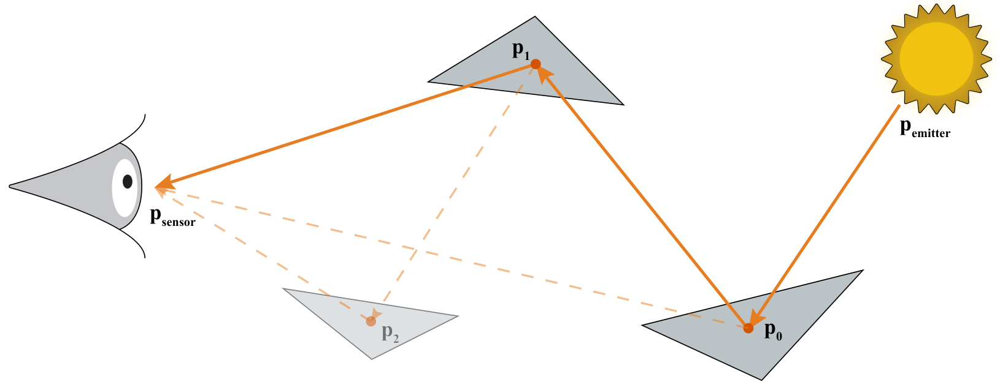
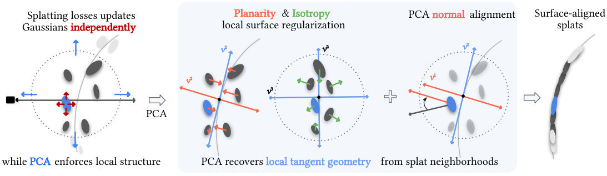
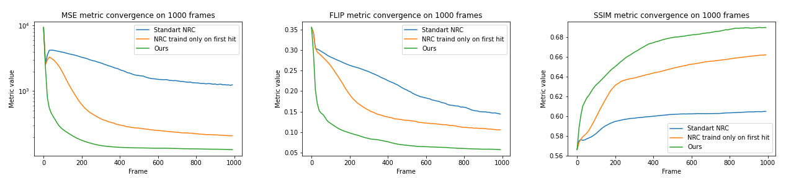

# 2026-10-10 科研日报

## 今日速览

今天的三篇重点刚好补齐高斯逆渲染外围的三种“基础设施”：**反向传播怎样省显存、几何怎样获得不依赖当前视角可见性的梯度、学习到的辐射缓存到底存什么**。它们都不是 PTIR-GS++ 的直接替代，但比继续罗列“又一个重光照高斯”更有用：前两篇能直接约束优化器和几何表示，第三篇把“辐射近似可否复用”拆成可检验的输入、目标与失效条件。

- **必读 · 逆向优化显存：** [ResLRB](#2026-10-10--reslrb) 不保存整条光路的分支计算图，而是在正向时用单槽蓄水池随机保留一个相机连接、反向时重放同一条光路；梯度在期望上无偏，显存不再随路径深度增长。作者在 RTX 5080 上报告 142 MB 峰值显存，朴素自动微分在深度 16 之后耗尽 16 GB。
- **必读 · 弱先验几何：** [PCAsplat](#2026-10-10--pcasplat) 直接在高斯中心的三维近邻上做可微主成分分析（PCA），即便某个高斯当前被遮挡、没有像素贡献，也能收到“回到局部切平面”的几何梯度。它以 PGSR 为底座，在 DTU 上把高斯方法的平均 Chamfer 距离降到 0.519 mm；但仍需要深度步骤处理远处浮点，纹理贫乏区域仍难。
- **主线旁读 · 镜面辐射缓存：** [Prefiltered NRC](#2026-10-10--prefiltered-nrc) 缓存的是“位置 + 反射方向 + 粗糙度”条件下的预滤波入射辐射，而不是物理表面或任意新光照下都成立的能量场；分离出的 BRDF 查表让它更适合镜面材质，也把掠射角误差写成了明确边界。
- **圈内：** Google 把企业工作 Agent 收束到单一入口；ARTEX 在被报道用于银行攻击后停止公开维护；NavGPT-3 以并发线程式运行时连接语言推理与低延迟导航策略。前两项提醒同一件事：Agent 的工具权限、审计和撤销机制已经是产品能力的一部分，不只是外围治理。

## 可微光传输：把分支计算图压成一个随机连接

### ResLRB · SIGGRAPH Asia 2026 Technical Communications · 2026-10-07

**一句话判断：** ResLRB（Reservoir Light Replay Backpropagation，蓄水池式光路重放反传）用“随机保留一个相机连接 + 重新加权 + 伪随机数重放”替代整条光路的分支计算图，换来与路径深度无关的峰值显存；它解决的是可微光线追踪的反向基础设施，不自动解决高斯求交、几何噪声或逆问题病态性。

**Title：** Stochastic Graph Compression for Constant-Memory Differentiable Light Tracing  
**作者：** Linas Beresna、Eugene Fiume  
**单位：** Simon Fraser University  
**发表时间 / 投稿信息：** arXiv v1 提交于 2026-10-07；SIGGRAPH Asia 2026 Technical Communications，DOI 10.1145/3829339.3847837。  
**链接：** [摘要](https://arxiv.org/abs/2610.10847) · [HTML 全文](https://arxiv.org/html/2610.10847v1) · [PDF](https://arxiv.org/pdf/2610.10847) · [DOI](https://doi.org/10.1145/3829339.3847837)

**摘要中译：** 光线追踪从光源出发时，每个散射顶点都可能向相机连一条边并把能量“溅射”进图像，因此朴素反向自动微分需要保存随路径长度和连接数增长的分支计算图。ResLRB 在正向阶段用加权流式蓄水池从一条光路的所有相机连接中选一个代表，反向阶段用同一随机种子重建路径，只对被选连接反传；由概率的倒数重加权后，得到期望无偏、峰值显存只相当于一个散射事件的梯度估计。

**方法与原理。** 输入是一条从光源出发、经过 \(k\) 个散射顶点的光路，以及待优化的材质、光源或几何参数 \(\theta\)；输出是标量图像损失对这些参数的随机梯度估计。

1. **为什么普通路径重放不够。** 相机路径通常只在末端连一次光源，是一条链；光源路径则可在每个顶点 \(x_i\) 连相机并产生像素贡献 \(f_i(C_i,u_i)\)。完整单路径梯度是

   \[
   g(\bar{x};\theta)=\sum_{i=1}^{k}\nabla_\theta f_i(C_i(\theta),u_i),
   \]

   其中 \(C_i\) 是第 \(i\) 个连接带来的通量，\(u_i\) 是它落到的像素位置。分支数随 \(k\) 增长，保存整图正是显存瓶颈。
2. **正向阶段只留一个连接。** 每到一个顶点，算法以连接亮度 \(w_i=\ell(C_i)\) 为权重更新单槽蓄水池：累计 \(W_i=\sum_{j\le i}w_j\)，并以 \(w_i/W_i\) 的概率用当前连接替换槽内连接。最终连接 \(I\) 被选中的概率是 \(w_I/W_k\)；亮度仅影响方差，不改变期望正确性。
3. **用逆概率恢复被丢掉的和。** 被选贡献乘以 \(W_k/w_I\)：

   \[
   \hat S=\frac{W_k}{w_I}f_I(C_I,u_I).
   \]

   对随机选择取期望时，选择概率 \(w_I/W_k\) 与倍率相消，恢复全部 \(k\) 个连接之和；在可交换求导与期望的条件下，梯度同样无偏。代价是一次只看一个连接，方差会比计算全部连接更高。
4. **反向阶段重放而不存路径。** 正向只保存随机种子、被选深度 \(I\) 与 \(W_k\)。反向重新播种并走到 \(I\)，每个顶点只打开一个局部自动微分作用域，算完该散射事件的梯度就释放；因此峰值图显存与路径长度无关。若几何变化会移动像素位置，论文再用路径端点雅可比把位置梯度接回来；完美漫反射处雅可比秩亏，需要正则化。

*原论文 Figure 3（[来源](https://arxiv.org/html/2610.10847v1#S2.F3)）。虚线是每个散射点都可能建立的相机连接，实线是蓄水池保留的唯一连接；倍率 \(W_k/w_I\) 负责在期望上补回其余分支。论文 Figure 4 进一步给出正向蓄水池与反向重放伪代码。*

**结果、成本与局限。** 作者在 Mitsuba 3 / Dr.Jit、RTX 5080 16 GB 上与朴素反向自动微分和分离式路径重放比较。ResLRB 的梯度符号与结构与朴素方法一致，差异来自蒙特卡洛噪声。最大路径深度从 4 到 128 时，峰值显存保持约 142 MB；朴素方法随深度线性增长并在 16 之后耗尽显存。深度 4 时重放多走一遍，单步 93 ms、慢于朴素方法的 63 ms；到深度 8 两者相当，深度 16 时约 132 ms 对 260 ms。需要注意：这些是**梯度一步**的匹配实现计时，不是完整逆渲染收敛时间；单槽蓄水池增加方差，论文也未给 PTIR-GS / 高斯求交端到端集成与相同质量停止条件下的总时长。

**值得关注。** 对 PTIR-GS++，可复用的是“正向贡献选择—逆概率校正—路径重放”的反向内存合同。它并不说明应该用哪一种正向高斯光追，也不保证噪声更小；真正要对照的是相同采样数、相同最终误差下的前向、反向、端到端时间和显存，以及几何附着梯度是否稳定。

## 几何鲁棒性：让不可见高斯也收到表面梯度

### PCAsplat · arXiv · 2026-10-07

**一句话判断：** PCAsplat 把点云中的局部 PCA 变成可微正则，直接约束高斯中心、朝向与薄片尺度；它补上了光栅损失只监督“当前可见且有贡献”高斯的缺口，是比再加一张渲染法线图更直接的弱先验几何信号。

**Title：** PCAsplat: Gaussian Splatting with Local PCA Regularization  
**作者：** Vitor Matias、Filipe Nascimento、Kiyohiro Nakayama、João Paulo Lima、Márcus Lobo、Gordon Wetzstein、Leonidas Guibas、Afonso Paiva、Tiago Novello  
**单位：** Universidade de São Paulo、Stanford University、UFRPE、IMPA  
**发表时间 / 投稿信息：** arXiv v1 提交于 2026-10-07；投稿信息未标明。  
**链接：** [摘要](https://arxiv.org/abs/2610.11011) · [HTML 全文](https://arxiv.org/html/2610.11011v1) · [PDF](https://arxiv.org/pdf/2610.11011)

**摘要中译：** 高斯泼溅通常用光栅图像损失优化；被遮挡或对当前视图贡献很小的高斯几乎没有几何梯度，因而容易漂离真实表面。PCAsplat 在高斯中心的局部近邻上做可微 PCA，用特征值约束近邻厚度与切平面覆盖，并把每个高斯最短轴对齐到 PCA 法线。作者在 DTU、Tanks and Temples 与 NeRF Synthetic 上报告更贴合参考表面的点云、更少浮点，以及可直接服务分割和 Poisson 网格重建的定向点云。

**方法与原理。** 输入是带相机位姿的多视图 RGB，底座实现保留 PGSR 的多视图几何与局部归一化互相关损失；输出仍是一组带中心、协方差、透明度和球谐颜色的高斯，不引入额外有符号距离场。

1. **建立三维局部邻域。** 对每个高斯中心 \(\mu_i\) 找 \(K\) 个最近邻，计算邻域均值与协方差 \(\mathbf C_i\)，再取从小到大的特征值 \(\lambda_i^{(1)}\le\lambda_i^{(2)}\le\lambda_i^{(3)}\)。最小特征向量 \(v_i^{(1)}\) 是局部法线；最小特征值衡量点到局部切平面的厚度。
2. **把“像表面”写进特征谱。** 理想局部表面应满足 \(\lambda^{(1)}\ll\lambda^{(2)}\approx\lambda^{(3)}\)：法向很薄，切平面两个方向覆盖接近。最小特征值的梯度会把邻域中心拉向估计切平面；后两项的差异则抑制只沿一条线排列的退化结构。KNN 索引在一次求导中视作固定，重复特征值处的可微条件也是成立前提。
3. **让高斯自身也变成薄片。** 每个高斯协方差写成旋转矩阵和三个尺度；最小尺度对应的轴被视作高斯法线。损失用 \(1-|\langle v_i^{(1)},n_i^g\rangle|\) 做无符号法线对齐，并惩罚最小尺度，使体积椭球趋于表面薄片。
4. **与图像和 PGSR 联合优化。** 总目标是 RGB 重建损失、PCA 特征谱损失、法线/薄片损失，再加 PGSR 原有的多视图几何与 patch 一致性。PCA 权重从 1 调度到 10；这样可见区域仍由照片约束，不可见或低贡献高斯则通过三维近邻收到梯度。

*原论文 Figure 2（[来源](https://arxiv.org/html/2610.11011v1#S3.F2)）。从高斯中心近邻计算局部 PCA；左支把点云压薄并均匀铺在切平面，右支把高斯最短轴对齐局部法线，最后与光度及 PGSR 多视图损失一起更新。*

**结果、成本与局限。** 在 DTU 上，作者报告高斯中心到参考点云的平均 Chamfer 距离为 0.519 mm，比其最强高斯基线 RaDe-GS 的 0.662 mm 低 22%；训练 22.3 分钟，对照 COLMAP-D 的 26.9 分钟、RaDe-GS 的 18.3 分钟。把同一 PCA 正则无额外调参接到 2DGS、PGSR、MILo，三者 Chamfer 距离均下降。ScanNet++ 上，把所得彩色点云送进同一 Mask3D 分割器，Top-1 mIoU 为 24.35%，对照 VGGT-Ω 为 10.54%，说明浮点清理确实影响下游资产使用。实验运行于 RTX A5500 24 GB，并为批量 \(3\times3\) 特征分解写了 CUDA 核；论文没有报告峰值显存。作者明确承认纹理贫乏区域仍难、远处浮点仍要深度步骤、法线符号需消歧。DTU/Tanks and Temples 的几何证据也不等于材质、光照或重光照正确。

**值得关注。** 它与 PGSR 的关系不是替代，而是“射线/多视图一致性 + 场景空间近邻正则”的互补。对室内不完整采集，关键消融应继续看：KNN 邻域跨越薄结构或相邻表面时会不会错误拉平；没有可靠深度时远场浮点如何处理；几何改善是否能在固定材质/光照模型下转化为更稳的逆向分解，而不只改善点云 Chamfer。

## 主线旁读：缓存的是条件辐射，不是万能环境光

### Prefiltered NRC · arXiv · 2026-10-08

**一句话判断：** 这篇工作把神经辐射缓存（NRC：渲染过程中在线学习场景间接光的轻量网络）改成镜面专用查询：位置、反射方向和粗糙度共同决定预滤波入射辐射；它给“用学习辐射替代部分物理弹射”一个清晰公开参照，同时也说明这种代理依赖当前场景、采样分布与 split-sum 近似。

**Title：** Neural Caching of Prefiltered Radiance for Specular Lighting  
**作者：** Dmitrii Klepikov、Vladimir Frolov  
**单位：** Lomonosov Moscow State University  
**发表时间 / 投稿信息：** arXiv v1 提交于 2026-10-08；arXiv 页面未给出可核验的正式会议录用信息。  
**链接：** [摘要](https://arxiv.org/abs/2610.11702) · [HTML 全文](https://arxiv.org/html/2610.11702v1) · [PDF](https://arxiv.org/pdf/2610.11702)

**摘要中译：** 原始 NRC 用在线训练的小型网络近似场景光照，但镜面反射对视角和粗糙度高度敏感。本文把反射后的观察方向和粗糙度加入查询，网络预测预滤波入射辐射，再与预计算的双向反射分布函数（BRDF）积分查找表组合为出射镜面辐射。作者在 Bunny 与 Specular Sponza 上报告比所测 NRC 变体更快接近 4000 帧路径追踪参考，同时保持实时性能档。

**方法与原理。** 训练与部署都发生在渲染时。第一遍追踪较长的训练光路，从每个表面命中点后续的多次弹射中组装 RGB 目标 \(Y\)；第二遍追踪较短的显示光路并记录查询；第三遍查询网络并与 BRDF 查表相乘。网络输入为

\[
q=(\phi(x),\omega_{\mathrm{refl}},\rho),\qquad
\omega_{\mathrm{refl}}=2(n\cdot\omega_o)n-\omega_o,
\]

其中 \(\phi(x)\) 是位置的哈希网格编码，\(\omega_{\mathrm{refl}}\) 是观察方向关于法线的反射方向，\(\rho\) 是粗糙度。均方误差训练使理想网络学习条件均值 \(\hat L^*(q)=\mathbb E[Y\mid q]\)；因此训练光路怎样采样、目标怎样加权，直接决定缓存实际代表哪一种辐射滤波。权重用指数移动平均稳定在线更新。

方法再用 split-sum（把入射辐射预滤波与 BRDF 积分近似分开）重建镜面出射光。优点是网络不必同时记住完整材质响应；代价是预滤波假设观察方向与过滤表面法线重合，掠射角处存在系统误差。它没有证明物理高斯与学习辐射高斯等价，也没有在改变几何、材质或新光照后验证能量一致性。

*原论文 Figure 1 的一部分（[来源](https://arxiv.org/html/2610.11702v1#S1.F1)）。原文没有独立 pipeline 图，因此保留其原始在线收敛曲线；方法流程按第 3 节三遍渲染顺序在上文展开。FLIP 和 MSE 越低越好，SSIM 越高越好。*

**结果、成本与局限。** 实验用 Falcor、tiny-cuda-nn、RTX 3080 Ti，分辨率 \(1920\times1080\)，参考图累计 4000 帧；主要对比原始 NRC 与只用首个命中训练的 NRC 变体。论文给出 1000 帧图像和逐帧 FLIP / SSIM / MSE 曲线，称收敛和镜面质量更好且无可辨别性能下降，但未给统一表格化 FPS、训练显存、网络规模或动态场景稳定性；因此不能填“加速多少”，也不能外推到高斯逆渲染的端到端优化。

**值得关注。** 它最有价值的不是“缓存更快”口号，而是把缓存目标写成 \((x,\omega_{\mathrm{refl}},\rho)\) 条件下的统计量，并承认采样分布与掠射角近似。若借到逆渲染，应分别验证可见性变化、角覆盖、几何误差、光照变化、能量守恒和缓存梯度；距离本身不是合法性的充分条件。

## 圈内新闻与社区反应

### Google Gemini agent：单入口之外，权限与系统连接才是实质

**事实与厂商主张（事件日期 2026-10-08，本期补录）：** [Google Cloud 官方公告](https://cloud.google.com/blog/products/ai-machine-learning/welcome-to-gemini-at-work-2026)把 Gemini agent 定义为统一企业工作入口：可处理知识工作、内容和代码，调用技能与工具，并连接企业系统。公告描述的是产品能力与集成范围，没有公开足以复现内部规划、模型路由或长期任务可靠性的算法细节，厂商“交付完成结果”的说法不等同于独立成功率。

**社区反应：** 10 月 8 日的 [Reddit 发布讨论](https://www.reddit.com/r/GeminiAI/comments/1x0vmzz/gemini_at_work_2026_introducing_gemini_agent/)主要转述长任务、代码执行和多 Agent 协作等发布要点，尚不足以构成独立使用反馈；暂未找到可核实的企业实测、失败率或跨系统权限事故复盘。

**编辑判断：** 单一对话框不是主要技术增量；真正应追踪的是系统连接器的最小权限、动作审计、可撤销性和错误隔离，以及这些约束下任务是否仍能完成。

### ARTEX 停止公开维护：Agent 滥用从模型风险落到工具链责任

**可核实事实（2026-10-09）：** [Reuters](https://www.reuters.com/world/china/chinese-developer-makes-artex-ai-agent-closed-source-after-korean-bank-hack-2026-10-09/)报道，自动化渗透测试 Agent ARTEX 的开发者在其被安全公司关联到韩国银行攻击后，宣布停止公开版本与维护并转为闭源；Reuters 核查时原 GitHub 页面已下线。攻击归因仍是安全公司的“中等置信度”判断，不能写成司法定论。

**社区反应：** 原仓已不可访问，暂未找到可核实的维护者后续技术说明、独立复现或足够具体的开发者讨论；不把媒体评论概括为开源社区共识。

**编辑判断：** 关闭源码无法撤回已分发能力。对会连接外部大模型并执行安全操作的 Agent，更可验证的方向是目标授权、动作级审计、危险步骤门控和可追责记录，而不是只靠用途声明。

### NavGPT-3：把“慢推理”和“快控制”做成可切换线程

**作者公开（2026-10-09）：** [NavGPT-3](https://arxiv.org/abs/2610.10787)把导航系统组织成类似操作系统的运行时：推理、动作和监控各自维护上下文、工具与权限，调度器在突发事件时中断并切换控制线程；其 8B 动作策略以场景变化分配视觉 token。作者报告完整系统在 R2R-CE 达 81.51 成功率，在 RxR-CE 达 90.43，并把最低反应时间从语言模型每步 3–19 秒降到动作策略的 0.5–1 秒；模型、代码和评测记录仍是“将发布”，数字尚无独立复现。

**社区反应：** 截至本期检索，暂未找到可核实的第三方部署或失败案例。论文的“人类水平”只适用于所报导航基准及比较口径，不能外推为通用机器人能力。

**编辑判断：** 这比把大模型直接塞进低级控制更清晰：长时语义推理与高频动作策略分层，监控线程负责抢占；后续应看权限切换是否可验证、感知延迟如何进入闭环，以及真机长程任务的恢复日志是否公开。

## 覆盖说明

日报发布日为 **2026-10-10**，内容覆盖 **2026-10-09** 的公开公告与事件。三篇论文均核对 arXiv 全文的方法、核心公式与关键实验；PCAsplat 与 ResLRB 使用原论文方法图，Prefiltered NRC 原文无独立 pipeline 图，故保留其原始训练曲线并按正文三遍流程讲解。量化结果均为作者报告，未独立复现。

已检查大语言模型、Agent、图形学与具身智能四个领域，圈内精选三项；能找到的独立使用反馈有限，逐项如实标注。notes、blog、academic 与对标仓自上次成功检查以来均无新 commit；本期未引用私人笔记、未公开实验、草稿判断或个人信息，也未改变任何实验或训练任务。

**编写：** Neon
