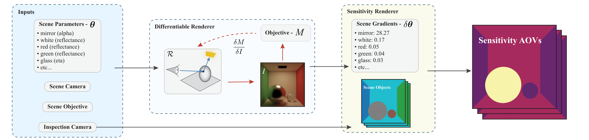
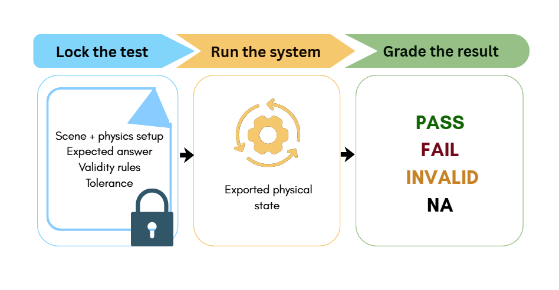

# 2026-10-11 科研日报

## 今日速览

周六 arXiv 不发新公告，本期补录本周公告里两篇此前未收录、但都直接关系到“高斯逆渲染到底在优化什么”的工作。一篇把梯度本身做成可检视的渲染输出，一篇把物理化高斯的评测从“看起来像”推到“内部状态对不对”。两篇都不提出新的重建方法，价值在于给调试和评测提供工具。

- **必读 · 梯度调试：** [Sensitivity AOV](#2026-10-11--sensitivity-aov) 把一次反向模式求导得到的“目标对每个场景参数的导数”存成分层缓冲区，像延迟着色一样从同一份缓冲读出按物体、按参数类型、按纹素的多种视图，还把“定义目标的相机”和“查看结果的相机”分开。对逆渲染来说，这正好回答“这次损失主要在推哪几个材质参数”，比盯着 loss 曲线直观得多。
- **必读 · 物理高斯评测：** [GaussianBench](#2026-10-11--gaussianbench) 用冻结场景、与模拟器无关的打分器和解析/实测参考，分别检验守恒、连续体响应、双材料耦合、高斯协方差随形变的传输与反事实响应。它统一测了 PhysGaussian、OmniPhysGS、PhysDreamer 等六个系统，发现“单材料正确、两材料交界处失败”这类原论文评测没测出的问题。对想把可编辑、可交互高斯资产接进具身仿真的工作，这是一份现成的验收清单。

## 可微渲染：让梯度成为一等渲染产物

### Sensitivity AOV · SIGGRAPH Asia 2026 Technical Communications · 2026-10-07

**一句话判断：** 这不是新的梯度估计器，而是一套“怎样看梯度”的脚手架：一次反传填满按场景参数层级组织的敏感度缓冲，之后各种视图都只读不重算。它对调试逆渲染里“哪个参数在吸收误差”很有用，但不处理可见性不连续带来的几何梯度，也只给一阶局部量。

**Title：** Sensitivity as an Arbitrary Output Variable for Differentiable Rendering  
**作者：** Linas Beresna、Eugene Fiume  
**单位：** Simon Fraser University  
**发表时间 / 投稿信息：** arXiv v1 提交于 2026-10-07；SIGGRAPH Asia 2026 Technical Communications（arXiv Comments 与正文会议信息）。  
**链接：** [摘要](https://arxiv.org/abs/2610.10852) · [HTML 全文](https://arxiv.org/html/2610.10852v1) · [PDF](https://arxiv.org/pdf/2610.10852)

**摘要中译：** 可微渲染器能给出任意标量目标对每个场景参数的导数，但与几十年来已被拆成各种任意输出变量（AOV）、可检视可合成的主图像不同，这些导数还没有面向人的标准表示。作者提出敏感度 AOV：一种携带“目标对影响它的场景参数之敏感度”的渲染输出。一次反向模式求导即可在场景参数层级上填满敏感度缓冲，之后像延迟着色那样从中读出多种视图，而无需重新求导：按物体与参数类型的图像空间敏感度、投影到可自由漫游场景上的视图，以及对空间变化参数经纹理坐标带回表面的逐纹素场。作者把定义目标的固定相机与用于检视的自由相机分开，并把反向模式的归因与其对偶的正向模式对照。目标不是单一算法，而是让导数输出与主图像并列成为一等渲染产物。

*图：原论文 Figure 2，敏感度 AOV 流程。*

**方法概要。**

1. **缓冲是什么。** 对一个标量目标（文中示例为图像平均亮度响应），反向模式一次传播到全部参数，结果按“场景 → 物体 → 参数类型 → 叶子参数”的树存储；层级视图（如按影响力排序的旭日图）直接从树上读，不需要任何图像空间计算。
2. **怎样绑到图像上。** 用每像素一次采样的主可见性通道记录可见物体与 UV，把均匀参数的敏感度画到它可见的像素上；空间变化参数（如纹理反射率）则把逐纹素梯度经 UV 带回表面。由于梯度采样与可见纹素独立，作者先对纹素场做池化以填洞、压萤火虫，这是纹理情形的主要实际开销。
3. **目标相机与检视相机分离。** 目标由固定相机定义，敏感度却可以投到任意视角下查看，因此能看到当前画面里看不见、但通过间接光影响目标的表面，甚至曝光这类根本不出现在画面里的全局参数。
4. **反向与正向的分工。** 反向模式回答“哪些参数对这个目标重要”（归因），正向模式回答“这一个参数会怎样改变整张图”（预测）；后者不能从缓冲拼出，需要逐参数重新计算。

**值得关注 / 阅读指引：** 读第 3 节“From Buffer to Image”的选择、聚合、绑定、编码四步，以及第 7 节局限。对 PTIR-GS 类高斯逆渲染，最直接的借鉴是把“材质、光照、几何参数各自吸收了多少损失”可视化成按高斯或按部件的敏感度图，用来诊断光照与反照率互相串扰。需要注意三点边界：放置视图只读内部梯度，不处理可见性边界，因此几何敏感度不完整；一阶量看不到参数间交互；低采样下敏感度场本身带蒙特卡洛噪声，去噪时还不能改变参数的重要性排序。论文作者与 ResLRB 相同，可与上期一起读：一个解决反传显存，一个解决反传结果怎么看。

## 物理化高斯：评测内部状态，而不只是渲染是否像

### GaussianBench · arXiv · 2026-09-27

**一句话判断：** 把“物理高斯看起来对”拆成可单独判定的物理契约，并区分 PASS、FAIL、NA（不支持该能力）与 INVALID（比较本身不成立）；这比又一张视觉对比图更能说明一个可交互高斯资产能否进仿真。它是单作者的评测工作，阈值与参考的选取值得读者自己复核。

**Title：** GaussianBench: Physics-Fidelity Evaluation for Gaussian Scene Representations  
**作者：** Chukwudalu Dumebi-Kachikwu  
**单位：** STAR Laboratories, University of Maryland  
**发表时间 / 投稿信息：** arXiv v1 提交于 2026-09-27；投稿信息未标明。  
**链接：** [摘要](https://arxiv.org/abs/2610.10554) · [HTML 全文](https://arxiv.org/html/2610.10554v1) · [PDF](https://arxiv.org/pdf/2610.10554)

**摘要中译：** 3D 高斯泼溅已从静态重建走向“物理集成”的表示，希望预测场景在交互下如何变化。这带来评测问题：一段模拟可以看起来合理，内部力学却是错的；与观测运动在视觉上吻合，也不能说明系统对新的力、材料修改、接触或热干预会作出正确响应。作者提出 GaussianBench，用冻结的文件化场景、与模拟器无关的打分器以及解析或实测参考，分别检验守恒、连续体响应、异质材料耦合、高斯协方差传输与渲染、热相变和反事实响应。每个参考都声明有效范围，结果区分 PASS、FAIL、NA、INVALID，把物理失败与能力不支持、比较无效区分开。作者还给出参考实现 GaussianFlesh：持久的三维高斯同时作为渲染基元和连续体物质点，由共享网格的 MPM（物质点法）求解器推进。在统一测试 PhysGaussian、GaussianFluent、OmniPhysGS、PhysDreamer、Physics3D、GASP 六个已发布系统后，发现了原评测遗漏的失败：例如单材料模拟正确、两材料交界处失败，或对一个自己并未真正产生的形变正确更新了高斯。

*图：原论文 Figure 1，GaussianBench 流程。*

**方法概要。**

1. **协议 A/B：力学本身。** 自由落体等场景检查动量与体积守恒；双材料串联杆检查两区域是否产生预测的区域应变与界面牵引力（误差阈值 15%）；干预场景只改重力、温度或材料中的一项，检验系统是在响应输入，而不是重放记住的运动。
2. **协议 C：高斯表示是否随物理正确变形。** 打分器从导出的高斯位置独立拟合形变梯度 \(\mathbf F\)，再按 \(\Sigma'=\mathbf F\Sigma_0\mathbf F^{\mathsf T}\) 计算协方差应有的传输，与系统导出的协方差比较。这样能把“物体没按要求形变”和“形变了但高斯形状没跟着变”分开；另有渲染往返检查（PSNR ≥ 35 dB、SSIM ≥ 0.97）。
3. **协议 M：与实测材料数据对照**，如不规则实拍梁的振动频率（相对误差 < 20%）。
4. **结果概况（作者报告）。** PhysGaussian 小应变响应准确、协方差传输通过，但大剪切的形变实现无效；OmniPhysGS 与 PhysDreamer 均匀连续体与仿射测试通过、双材料耦合失败；GaussianFluent 泊松比与协方差通过，守恒、梁与波动探针失败。

**值得关注 / 阅读指引：** 先看协议 C 的“条件判定”设计：协方差传输的判定以系统自己导出的 \(\mathbf F\) 为准，另由位置拟合检查形变是否真实实现，这个拆分思路可直接用于可编辑、可拆分高斯资产的验收，例如部件被拖动或碰撞后，高斯形状、法线和材质是否仍与几何一致。双材料交界失败的发现，也提示把“部件间接触与约束”单独设测试，而不是只看整体渲染。需要保留的判断：阈值由作者设定，附录有容差敏感性审计，但仍建议在自己的场景上复核；本文未报告独立复现。

## 覆盖说明

日报发布日为 **2026-10-11**，对应内容日 2026-10-10 为周六，arXiv 无新公告；本期从本周 cs.GR 公告中补录两篇此前未收录的论文。两篇均核对了 arXiv HTML 全文的方法与关键结论，配图为原论文图。量化结果均为作者报告，未独立复现。本期圈内动态从简，未收录未经核实的条目。

**故障说明：** 今日主写 Bot 在其窗口内认领后，租约于 06:04 到期仍未发布；按故障转移协议，备用 Bot 于 06:18 HKT 在其认领区间内接管。受接管窗口时长所限，本期篇幅比常规版精简。

**编写：** Cream
